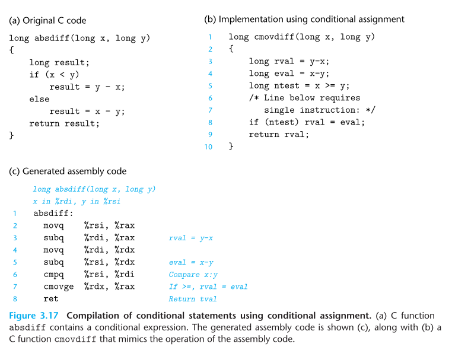
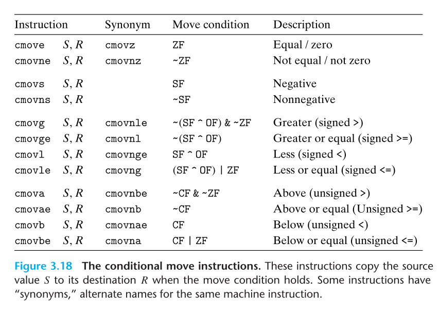

# Machine-Level Representation of Programs
### 3.6.2 Accessing the Condition Codes

- 조건 코드를 직접 수행읽는 대신 사용하는 방법 세 가지 
	1. 조건코드의 조합에 따라 단일 바이트를 0, 1 로 설정한다. 
	2. 프로그램의 다른 부분으로  점프할 수 있다. 
	3. 데이터를 조건부로 전송할 수 있다. 
- 1번의 방법은 set 명령어에서 나타나며, 이때 단 접미사가 다른 연산자와 같이 워드 크기를 나타내는게 아니라는 점이 중요하다(less, below의 l, b를 나타냄, long 또는 byte 아님)

### 3.6.3 Jump Instructions 

- jump 명령어는 기본적인 명령어의 흐름에서 뛰어 넘어 다른 명령어를 수행하고 다시 시작하도록 만드는데, 오브젝트 코드 파일을 생성할 때 어셈블러가 모든 이러한 명령어의 주소값을 결정한다. 
- 명령어들은 간접 점프와 직접 점프가 있는데, 직접 점프의 경우 어셈블리코드에서 점프 목표로 레이블을 지정하고 작성되며, 간접 점프는 메모리 피연산자 형식 중 하나를 사용하여 메모리주소나 레지스터로 점프를 한다. 
- 하나 더 있는 점프 방식은 조건 점프(conditional jump)이다. 조건 점프는 조건에 맞춰 동작하고, 이러한 경우는 직접 점프만이 가능하다.
### 3.6.4 Jump Instruction Encodings
- Chapter 7의 링킹 파트에서 점프 명령어의 목표가 어떻게 인코딩 되는가가 중요하다. 그리고 이러한 내용은 디스어셈블러의 산출물을 이해할 때도 도움이 된다. 
- 어셈블리 코드에서 점프의 대상은 심볼릭 레이블을 사용하여 작성되며, 점프에대한 다양한 인코딩 방식은 있지만 가장 일반적 방법이 PC에 상대적 방식으로 점프를 구현하는 것이다. 
- 즉, 점프 다음 오는 명령어의 주소와 점프 대상 명령어 주소 간의 차이를 인코딩해서 사용하는 것이다. 이러한 오프셋은 1,2, 4바이트로 인코딩 되는 방법이다. 
- 반면에 절대 주소를 활용하는 방법도 있고 이 경우 4바이트로 인코딩 된다. 
- 결론적으로 어셈블러와 링커는 점프 목적지의 적절한 인코딩을 선택해서 구현한다고 보면 된다. 
### 3.6.5 Implementing Condtional Branches with Conditional Control

- C 상에서 조건문을 번역하는 가장 일반적인 방법은 조건, 비조건 점프 구문의 조합을 사용하는 것이다. (대체적 방법으론 3.6.6 에서 배울 것으로 조건부 데이터 이동을 활용해 구현하는 것도 있다.)
- 예시가 위의 3.16 이며, 여기서 한가지 알아두면 좋은 것이 (b)의 goto 문을 사용하는 것은 일반적으로 좋지 않은 프로그래밍 스타일이고, 이는 사용 코드의 가독성과 디버깅의 어려움을 야기하기 때문이다. 
- C언어에서 일반적으로 if-else는 다음 템플릿 형태로 제공해도니다. 
```plain 
t = test-expr;
if (!t)
	goto false;
	then-statement
	goto done;
false:
	else-statement
done
```
### 3.6.6 Implementing Condtional Branches with Condtional Moves
- 조건부 브랜치를 조건부 이동 명령어로 구현하기 
- 전통적인 방법을 활용한 조건문 구현은 심플하고 일반적이나, 현대 프로세서에서 비효율적일 수 있다. 
- 그렇기에 대안으로 나온 전략은 조건부 데이터 이동을 활용하는 방법이다. 
- 이 방식은 양쪽 조건 연산의 결과를 연산하고, 조건에 기반하거나 혹은 그에 반대로 그 결과를 취하는 방식이다. 이는 제한적인 영역에서 사용이 가능하긴 하나, 사용한다고 하면 현대적 프로세서의 성능 특성에 훨씬 부합한다는 점에서 이점이 있다. 

- 위의 3.17을 보면 cmovdiff 함수를 c번에서 어셈블리 코드로 만들며, 여기서는 연산과 데이터 이동이 주로 되어 있으며, 비교 연산을 한 번 하는 것으로 되어 있다. 
- 여기서 조건적 제어 이동 기반을 한 코드의 성능이 왜 뛰어난가를 이해하기 위해선, 반드시 현대적 프로세서 어떤 식으로 동작하는지를 이해할 필요가 있다. 
- 기본적으로 이후 Chapter4, 5 에서 배울 것이겠지만 pipelining 이라는 것을 통해 현대의 프로세서는 기본적으로 높은 성능을 얻게 되었다. 
- 이 접근 방식은 파이프라인닝을 통해 연속적으로 명령어의 단계를 오버랩(overlap)시켜서 연속적으로 진행시킨다. 예를 들어 이전 명령에서 숫자 연산이 수행중이라면, 이때 다른 명령어를 붙여두는 것이다. 
- 그리고 이러한 방법으로 인해 프로세서는 매우 섬세하고 정교하게 `분기 예상 로직(branch prediction logic)`을 갖추고 있고, 이를 통해 분기에서 어떻게 해야 할 지를 정한다. 더불어 현대 프로세서는 대략 90% 전후로 이러한 분기를 맞출 만큼 성능은 좋으나, 문제는 그럼에도 발생하는 잘못된 분기예측 한 번이 상당한 성능적 손실을 야기한다. 
- 이러한 점에서 원본의 a번 코드를 사용한다고 하면 분기에 따라, 값을 넣어야 하고 일단 비교를 해보고 결과를 봐야한다. 하지만 `cmovdiff`의 경우 그렇게 분기를 예측하는 구조가 아니라, 이미 값을 담아두고, 또한 분기 예측이 쉬운 구조로 조건을 구성함으로써 성능적 향상(CPU 의 연산 사이클 감소)을 달성할 수 있는 것이다. 
- 뿐만 아니라 조건에 대한 예상 로직이 안쓰이는 만큼 파이프 라인을 계속해서 명령어로 채울 수 있다는 점도 이점이 있는 것이다. 

> absdiff 에서는 x < y 를 예측하기란 쉽지 않다. 하지만 이에 비해 ntest가 존재하냐 아니냐는 앞전 연산으로 이미 알기 쉬울 수있고, 그만큼 CPU 의 잘못된 예상으로 작업 클럭 사이클을 소비하는 것을 최소화 한다. 



### 3.6.7 Loops
C 언어는 do-while, while, for 등의 반복 구조를 제공한다. 기계어에는 이에 해당하는 명령어가 없으며, 조건 테스트와 점프를 조합하여 반복 효과를 구현한다. Gcc와 다른 컴파일러는 두 가지 기본 반복 패턴을 바탕으로 반복 코드 생성을 한다. 반복문 번역은 do-while부터 시작하여 점차 더 복잡한 구현을 포함하는 방향으로 진행된다.
#### Do-While Loops
do-while 문장의 일반적인 형태는 다음과 같다:
```
do
  body-statement 
while (test-expr);
```
이 반복문의 효과는 body-statement를 반복적으로 실행하고, test-expr을 평가하여 그 결과가 0이 아닌 경우 반복을 계속하는 것이다. body-statement는 최소 한 번 실행된다. 이 일반적인 형태는 조건문과 goto 문을 사용하여 다음과 같이 번역할 수 있다:
```
loop: 
  body-statement 
  t = test-expr; 
  if (t)
    goto loop;
```
즉, 각 반복에서 프로그램은 body-statement를 실행하고 test-expr을 평가한다. 테스트가 성공하면 프로그램은 다시 반복을 시작한다.
#### While Loops
while 문장의 일반적인 형태는 다음과 같다:
```
while (test-expr) 
  body-statement
```
do-while과의 차이점은 test-expr이 평가된 후, body-statement가 처음 실행되기 전에 반복문이 종료될 수 있다는 것이다. while 반복문을 기계어로 번역하는 방법은 여러 가지가 있으며, gcc에서 생성된 코드에서 두 가지 방법이 사용된다. 이 두 가지 방법은 do-while 반복문에서 본 반복 구조와 동일하지만, 초기 테스트를 구현하는 방식에서 차이가 있다.

첫 번째 번역 방법은 반복문의 끝에서 무조건적인 점프를 수행하여 초기 테스트를 수행하는 "중간으로 점프" 방법이다. 이는 다음과 같은 템플릿으로 번역할 수 있다:
```
goto test; 
loop:
  body-statement 
test:
  t = test-expr; 
  if (t)
    goto loop;
```
270p 
### 3.6.8 Switch Statements 

---
## 3.7 Procedures

## 3.8 Array Allocation and Access

## 3.9 Heterogeneous Data Structures 

## 3.10 Combining Control and Data in Machine-Level Programs

## 3.11 Floating-Point Code

## 3.12 Summary 

```toc

```
