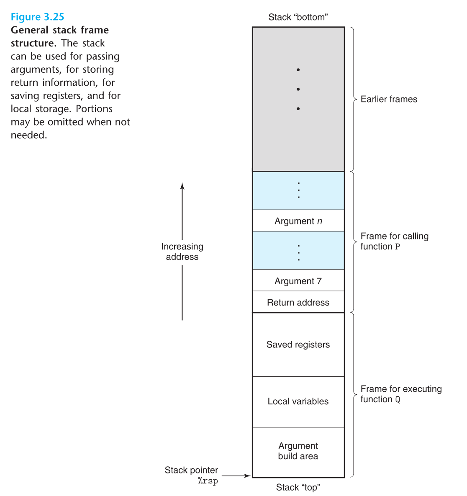
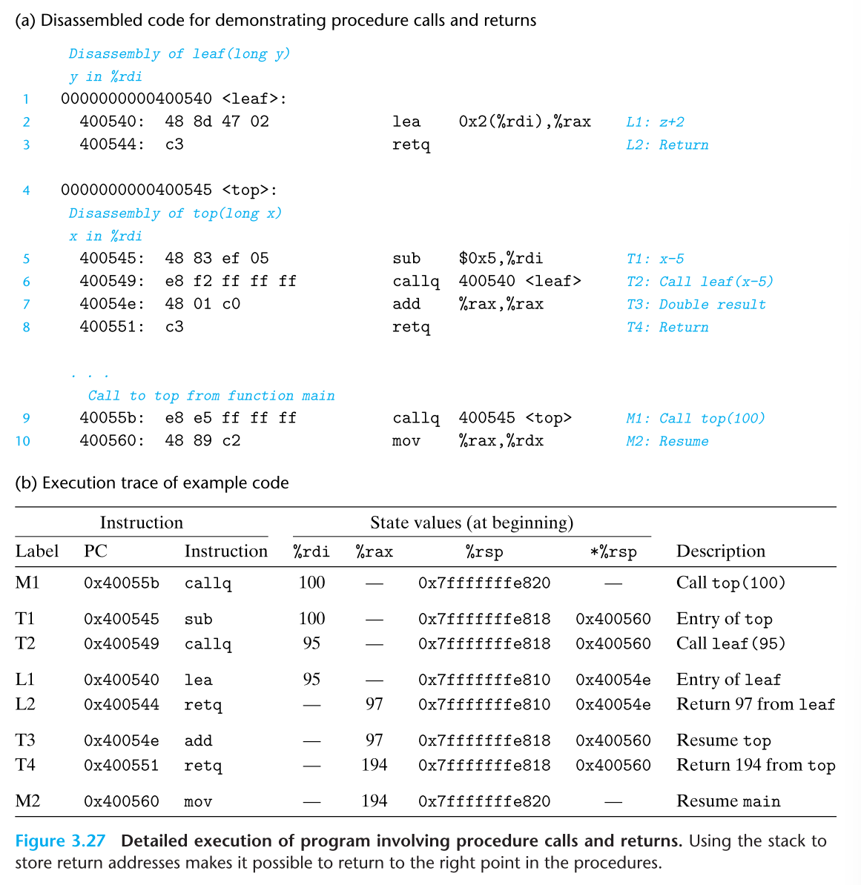

# Machine-Level Representation of Programs
### 3.6.8 Switch Statements 
- 해당 방식은 가독성, 및 점프테이블이라 불리는 구조를 활용하여 효과적인 구현이 가능케 되었다. 
- 스위치문이 어셈블리어로 구현될 때는, 개발자가 지정한 의미의 케이스 값으로 그대로 가진 않고, 오히려 임의의 정수 숫자로 변환된다. 
- 스위치문이 수행되는데 핵심은 결국 점프 테이블을 통해 코드의 위치로 접근하는데 있다. 
- 간단하게 값을 연산함으로써 함수의 끝으로 갈 수 있다. 유사하게 어셈블리 코드 블록은 레지스터 %rdi 의 값을 연산하고, 레이블로 지정된 위치로 점프를 하는 구조를 취한다. 
- 결국 이러한 코드들은 세심하게 학습할 필요가 있으나, 동시에 점프테이블을 활용함으로써 다양한 분기점으로 효과적으로 이동하는 것을 허락한다는 점이다. 
---
## 3.7 Procedures
- 프로시져는 소프트웨어 추상화의 핵심이다. 
- 프로시져는 인자들의 세트와, 옵셔널한 리턴 값의 셋을 사용하여 특정 기능을 구현하기 위한 코드를 감싸는 방법을 제공해준다.
- 예를 들어 프로시져 P가 프로시져 Q를 호출하고, Q는 특정 작업을 수행하고 다시 P로 돌아온다. 이러한 일련의 행동들은 하나 혹은 그 이상의 다양한 메커니즘을 갖고 있다.
	- Passing Control(제어권의 전달) : 프로그램 카운터가 진입 시 Q에 대한 코드의 시작 주소로 설정되어야 하며, 반환 시 Q 호출 다음에 P의 명령어로 설정되어야 한다.
	- Passing data(데이터의 전달) : 하나 혹은 그 이상의 패러미터를 P가 반드시 Q에 전달할 수 있어야 하고, Q는 P에 값을 반환해 줘야 한다. 
	- Allocating and deallocating memory : Q는 호출 시점에 로컬 변수들을 위한 공간을 할당할 필요가 있으며, 그 뒤 반환 시에는 공간을 해제해야 한다. 
- X86-64 프로시져는 기계의 리소스를 어떻게 사용할지에 대한 규율을 가지고 있으며, 특별한 명령의 조합을 포함하고 있다. 
### 3.7.1 The Run-Time Stack
- C 언어의 프로시져 호출 메커니즘의 핵심 기능, 그리고 다른 대부분의 언어들도 마찬가지로, last-in, first-out(후입 선출)의 스텍 데이터 구조체에 의해 제공되는 메모리 관리 규칙을 사용하게 만드는 것이다. 

- 막 실행된 프로시져의 프레임은 항상 스택의 top에 올라가고, 프로시져 P가 프로시져 Q를 호출할 때, 스택 위에 반환 주소를 push 한다. 이는 Q가 일단 반환을 하면, P의 멈춘 지점에서 프로그램이 다시 실행되어야 하기 때문이다. 
- 기본적으로 대부분의 프로시져를 위한 스택 프레임은 프로시져의 실행과 함께 할당된 고정된 사이즈를 갖고 있지만, 일부는 가변사이즈를 가질 수 있고 이는 3.10.5 에서 다룰 예정이다. 
- 또한 Q가 6개 이상의 인자를 요구하는 경우 인자들은 호출하기 이전 스택 프레임의 내부에 P에 의해 저장된다. 
### 3.7.2 Control Transfer 
- 제어권의 전달은 프로그램 카운터의 시작 위치를 옮기는 것, 간단하게 말하면 그러하다. 그러나 Q에서 돌아오는 상황이 되면 프로시져는 반드시 P의 수행으로 돌아올 수 있을 코드 위치로 돌아와야만 한다. 
- 그렇 기에 예를 들어 call 명령어는 주소 위치를 즉시 이동하도록 호출한다. 이에 반해 ret 은 A라는 주소를 PC 레지스터에서 빼게 된다. 

- 예제 코드가 동작하는 내용을 그대로 담고 있다. 이 내용은 실제 프로시져가 호출하거나 반환을 지원할 필요가 있는 스토리지의 관리에 관해 런타임 스택의 역할을 보여주는 좋은 예시이다. 
- C의 이러한 표준 호출/반환의 메커니즘은 후입 선출의 메모리 관리 방식에 적합하게 설계되어 있다. 


```toc

```
