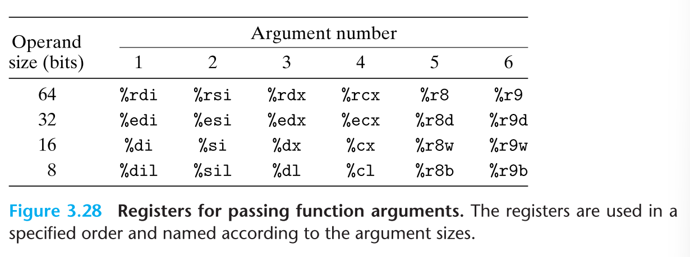

# Machine-Level Representation of Programs
### 3.7.3 Data Transfer 
- 호출 될 때 프로시져가 제어권을 전달함과 더불어, 여기엔 데이터가 인자로써 전달되고 값이 반환된다. 
- x86-64 에서, 여섯개의 정수 인자가 레지스터를 통해 전달될 수 있다. 
- 인자들은 이러한 인자 리스트 안에 순서에 따라 레지스터들에 순서를 가지고 할당 된다. 
	
- 정수 인자가 6개보다 많은 함수의 경우, 다른 인자들을 스택 상에서 전달해준다. 따라서 인자를 받기 전 프로시져는 반드시 스택프레임에 7번째부터 인자를 저장하기에 충분한 스택 프레임을 할당해야 한다. 
- 프로시져 Q는 레지스터를 통해 인자에 접근이 가능하고, 스택으로부터도 가능하다. 만약 Q가 6개의 인자보다 더 많이 인자를 가지는 함수를 호출한다면, 6개 이상의 인자들을 위한 스택프레임 내부의 공간을 할당해야 하고, 이는 인자 빌드 에리어에 지정된다. 
- 이에 대한 기계어로 번역된 코드 proc의 예시만 봐도 최초 6개의 인자 전달은 레지스터가 관여하나, 두개의 인자에 대해선 스택에서부터 전달되는 것을 볼 수 있다. 
### 3.7.4 Local Storage On the Stack
- 로컬 데이터는 메모리 상에 반드시 저장되어야 하고, 아래와 같은 케이스들도 해당한다. 
	- 로컬 데이터가 레지스터에 다 담기에 충분하지 않은 경우
	- 로컬 변수에 대해 `&` 주소 연산자가 적용되어 있고, 이를 위한 주소값을 생성해 내줘야 할때 
	- 일부 변수들은 배열이나 구조체 구조이고, 이는 반드시 배열 혹은 구조체 참조접근이 가능해야 한다. 

### 3.7.5 Local Storage in Registers
- 비록 주어지는 시간 속에선 하나의 프로시져가 활성화될 수 있지만, 우리는 하나의 프로시져가 다른 하나를 호출할 때, 호출자가 후에 사용하기 위해 호출될 대상의 일부 레지스터 값을 덮어씌우지 않다는 사실을 확실하게 만들어줘야 한다. 
- 이러한 이유 때문에 x86-64는 레지스터의 사용에 대한 컨벤션에서 단일한 형태의 기준을 제시하고, 이는 모든 프로시져들에 의한 사용은, 심지어 프로그램 라이브러리 속에서의 사용까지 포함해 레지스터의 사용은 보호받아야 된다는 점이다. 
- 컨벤션에 의해, 레지스터  `%rbx`, `%rbp` 그리고 `%r12` ~ `%r15`는 피호출자 저장용 레지스터(callee-saved register ) 로 지정된다. 
- 레지스터의 값을 넣는 행위는 `saved register` 라는 라벨링을 스택프레임의 특정 부분에 생성하는 효과를 가진다. 그리고 이를 통해 안전하게 호출된 레지스테 저장한 다음 Q를 호출하여 레지스터의 값이 손상되지 않도록 보호한다.
- 스택포인터 `%rsp`  를 제외한 다른 모든 레지스터는 `caller saved register` 로 분류된다. 이부분은 어떤 함수에서든 수정 가능함을 말하게 되고, 이로써 수정 불가능한 프로시져 P의 상태의 저장, 스택 포인터, 수정 가능한 부분에서의 프로시져  Q  호출과 이어서 값의 수정이 가능한 부분으로 구분되어 프로시져가 실행된다고 보면 된다. 
- 이 부분이 살짝 이해가 안 간다. 
### 3.7.6 Recursive Procedures
- 각 프로시저 호출은 스택에 고유한 개인 공간을 가짐. 이로써 각 프로시져들 사이에 서로 간섭이 없고, 스택 규정을 통해 프로시저가 호출될 때 로컬 스토리지를 할당하고 반환하기 전에, 할당을 해제하기 위한 적절한 정책을 제공한다. 

---

```toc

```
