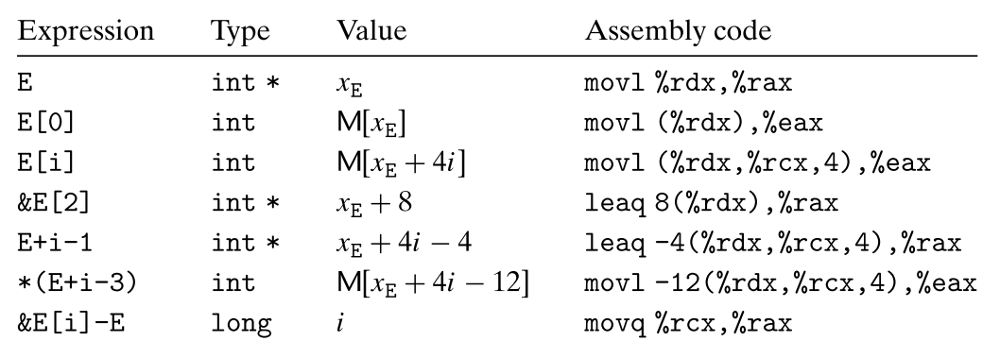
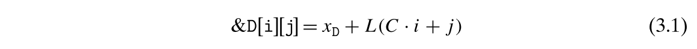
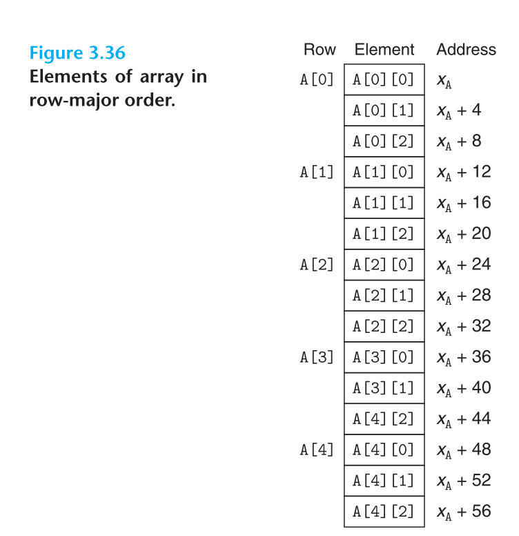

# Machine-Level Representation of Programs
## 3.8 Array Allocation and Access
- C 언어 안에 배열은 더 큰 단위의 데이터 타입의 스칼라 데이터들을 모아주는 하나의 수단이다. C는 특히나 배열을 단순한 구현을 통해 사용하고, 나아가서 매우 직관적으로 기계어로 번역된다. C의 특수한 기능의 하나로, 포인터들을 통해 배열 내의 요소들을 가리키는 게 가능할 뿐만 아니라, 이러한 포인터들의 수학적 연산을 수행 가능하다는 점이다. 이러한 코드들은 기계어로 주소 계산을 통해 변환된다. 
- 최적화 컴파일러는 특히나 배열의 인덱싱을 수행함으로써 주소 연산을 단순화하기를 매우 잘한다. 이러한 특성은 C 코드와 해당 코드를 기계 코드로 번역하는 것 사이의 대응 관계를 해독하는데 다소 어려워 질 수 있다.
### 3.8.1 Basic Principles
- 우리가 익히 아는 배열의 룰
- 기본적인 x86-64 메모리 참조 구조는 배열 접근을 하기 위해 단순하게 디자인되어 있다. 예를 들어 정수 배열에 대해 `E[i]` 값을 구한다고 하면, `%rdx`레지스터를 통해 E의 주소 값을 갖고 있으며, `%rcx` 레지스터에 i 값을 저장하며, 여기서 `movl(%rdx, %rcx, 4), %eax` 명령을 통해 주소 위치에 있는 값을 복사해서 `%eax` 레지스터에 그 값의 결과를 저장한다. 
### 3.8.2 Pointer Arithmetic
- 기본적으로 C는 포인터의 수학적 연산을 허락해주는 구조를 갖고 있으며 다음 식의 형태를 갖춘다. `x_p + L * i`, x_p 는 특정 타입의 포인터 위치를 가리키며, L은 타입의 크기, i 는 인덱싱을 가리킨다. 
- 단항 연산자로 `&`, `*` 를 활용하면 포인터의 생성 및 역참조가 가능하다. 예를 들어 Expr 이란 변수는 특정 객체 변수를 가리키고, `&Expr` 은 객체의 주소값을 제공해주는 포인터를 표현하며, `AExpr`  이라는 값이 특정 포인터를 가리키고 있다면, `*Expr`은 그 주소에 있는 값을 가리킨다. 
- 배열 참조에서 `A[i]` 라는 값이 있다고 하면, 이는 `*(A+i)` 와 동일한 표현이라고 볼 수 있다. 
- 다음 내용들은 배열 E에 대한 추가적인 표현을 보여주고, 어셈블리 코드의 각 구현모습을 보여준다. 여기서 결과는 당연히 `%eax` 에 데이터를 저장하거나 `%rax` 포인터를 저장한다. 

### 3.8.3 Nested Arrays
- 배열 할당과 참조의 일반적인 원칙들은 배열의 배열을 생성하는 것까지도 가능하게 허락해준다. 
- 다차원의 배열의 요소들에 접근하기 위해서, 컴파일러는 요청받은 요소의 오프셋을 계산하는 코드를 생성하고,  그런 뒤 MOV 명령어 중 하나를 사용한다. 이때 베이스 주소값을 배열의 시작점으로 두며, 오프셋으로 인덱스에 기록한다. 


- `A[i][j]` 는 다음 방식으로 `%eax` 레지스터로 그 값을 저장한다. 
```assembly
leaq (%rsi, %rsi, 2), %rax // compute 3i
leaq (%rdi, %rax, 4), %rax // compute X_a + 12i
movl (%rax, %rdx, 4), %eax // read from M[x_a + 12i + 4]
```

### 3.8.4 Fixed-Size Arrays
- C의 컴파일러는 코드 운용에서 다차원의 고정된 크기의 배열을 위한 다수의 최적화를 만들어낼 수 있다.
- 이후 내용은 예시를 통한 설명 정도로 기록할만한 내용 없음 
### 3.8.5 Variable-Size Arrays
- 역사적으로 C는 다차원의 배열이더라도 컴파일 타임에 결정이 나는 것만을 지원했었다. 
- 이후 가변하게 데이터 배열을 만들어야 할 필요가 생기자, 개발자들은 `malloc` , `calloc` 과 같은 함수를 활용하여, 다차원의 배열을 1차원의 줄기반의 인덱싱을 통해 표현해내는 방식을 보여준다. 
- 가변 사이즈의 배열에 대한 어셈블리어의 접근 방식도 딱히 크게 다르지 않다. 
- 가변 사이즈의 배열을 참조하는 것은 고정된 사이즈의 그것을 넘어서 다소 일반화될 필요가 있다. 그런 점에서 곱셈 명령어와 일련의 비트이동, 덧셈이 필요하게 되고, 이런 점에서 특정 프로세서에선 상당한 퍼포먼스의 페널티를 부과하나, 동적 배열의 접근에서 이는 불가피하다. 
- 루프 내에서 가변 사이즈의 배열 

```toc

```
