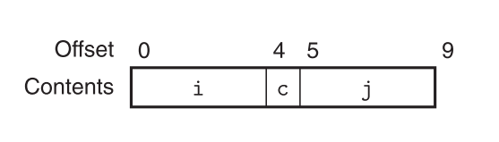
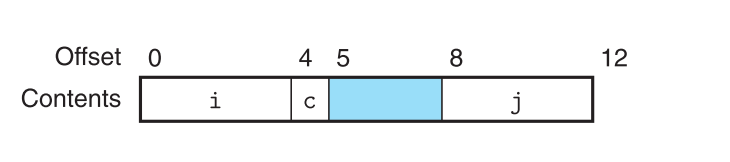

# Machine-Level Representation of Programs

## 3.9 Heterogeneous Data Structures 
- Heterogeneous Data Structures : 이질적인 데이터 구조체들
- C는 객체의 다른 타입들을 조합함으로써 데이터 타입을 생성하는 두 가지 메커니즘을 갖고 있다. 구조체, 유니온이 바로 그것이다. 
### 3.9.1 Structures 
- C의 구조체는 단일한 객체에 다를 수 도 있는 객체들을 묶어 놓은 데이터 타입으로 생성하고, 선언한 것을 말한다. 
- 구현은 기본적으로 배열과 동일하며, 연속적인 공간 속에, 구조체의 데이터들이 나열하여 저장되며, 구조체는 최초의 바이트의 주소값을 포인터로 소지한 형태로 구성된다.
- 이러한 구조체의 각 필드에 접속하기 위해, 컴파일러는 적절하게 구조체의 주소에 접근 가능한 오프셋을 더하는 코드를 생성한다.
- 교재에서 나오는 예시를 통해 알 수 있는 점은, 구조체의 다른 필드에 접근하는 것에 대한 모든 내용은 컴파일 타임에 이미 결정되고, 따라서 기계어에서는 필드에 대한 선언이나, 혹은 이름의 필드 등에 관한 정보는 더 이상 포함하고 있지 않다는 점이다.
### 3.9.2 Unions
- 유니온은 C의 타입체계를 우회하는 방법으로 제공되는 것이다. 다수의 타입에 대하여 참조하는 단일한 객체를 허락해준다.
- 유니온은 여러 데이터 타입을 하나의 메모리 공간에서 공유하면서 사용 가능하도록 만들어주는 역할을 한다. 
- 유니온은 다양한 컨텍스트에서 매우 유용하나, 버그들을 만들어낼 가능성이 있고, 이는 C에서 가지는 타입 체계에 의해 제공되는 안정성을 우회하는 구조를 갖고 있기 때문이다. 
- 예를 들어 노드 트리 구조를 만들 때, 
```c
// 기존 구조
struct node_s {
	struct node_s *left;
	struct node_s *right;
	double data[2];
}

// 개선 구조 
struct node_s {
	struct {
		union node_u *left;
		union node_u *right;
	} internal;
	double data[2];
}
```
- 이러한 구조의 의미는, 우선 메모리 사용량은 동일하게 구성됩니다. 하지만 left, right 가 연속된 메모리 영역에 위치하게 되어, 캐싱 효율성이 향상 될 수 있다.
```c
unsigned long double2bits(double d) {
	union {
		double d; 
		unsigned long u;
		} temp; 
	temp.d = d; 
	return temp.u;
};
```
- 이 사례 역시 유니온 케이스의 독특한 부분을 표현한다. Type Punning 이라고 하여, 특정 데이터 타입의 비트 표현을 다른 타입으로 재해석하는 방식이다.
- 이 방식을 사용하면 포인터 캐스팅을 회피하고, C의 캐스팅 시스템을 우회하여 `double` 의 타입 값의 비트 표현에 직접 접근하여 `unsigned long` 에 담아 내게 된다.
- 이를 통해 부동소수점 수의 비트 표현 검사, 네트워크 프로토콜에서 데이터 직렬화, 저 수준의 시스테 프로그래밍, 부동소수점 연산의 최적화 등에서 비트들에 접근하면서 사용이 가능하다. 
- 단, 이 방법은 상당히 쓰기 까다롭고 표준에서도 '조심해야할 행동'으로 지정해놓아서 다른 대안을 권장하기도 한다. 
- 확실히 문제는, 이러한 방식은 같은 공간을 우회해서 쓰는 구조이므로 엔디안을 비롯해 다양한 위험요소를 내포하고 있다고 볼 수 있다. 
### 3.9.3 Data Alignment
- 기본적으로 컴퓨터는 특정 데이터 타입을 위한 허용되는 주소들에 대해 제한 규정을 갖고 있고, 이러한 구조가 하드웨어의 디자인을 구성하고, 프로세서와 메모리 체계 사이의 인터페이스를 구성하는 하드웨어 설계를 쉽게 만들어준다. 
- 기본적으로 x86-64 시스템 기준 데이터의 배열과 관계 없이 동작은 매우 잘 한다. 하지만 인텔에서는 메모리 시스템의 성능을 향상시키기 위해 데이터가 배열되어 있기를 권장한다. 
- 이러한 배열의 룰은 기본적으로 복수의 동일 타입의 데이터들이 모여서 배치되는 형태가 되어야 함을 전제로 깔고 있고, 이러한 형태가 강제 되기도 하고, 컴파일러는 전역 데이터를 위한 요구되는 배열을 가리키는 기계어 코드 내에서 그렇게 되기를 지시내리기도 한다. 
- 구조체에 대해서 코드를 풀어 낼 때도 컴파일러는 각 구조체의 구성요소가 배열의 요구 사항을 만족시키기 위해 각 데이터 사이에 gap을 추가하는 등으로 최적화를 이루기도 한다.

```c
struct S1 {
	int i;
	char c;
	int j;
};
```





- 위의 예시만 보더라도, 원래의 구조라면 9 바이트의 형태로 되어야 하겠지만, 탐색 시 각 주소 탐색의 효과적인 구조화를 위해 3바이트의 gap을 추가, 4바이트마다 이동 가능한 구조로 실제로 메모리는 동작하는 것을 보여준다. 
## 3.10 Combining Control and Data in Machine-Level Programs

### 3.10.1 Understanding Pointers 

## 3.11 Floating-Point Code

## 3.12 Summary 

```toc

```
