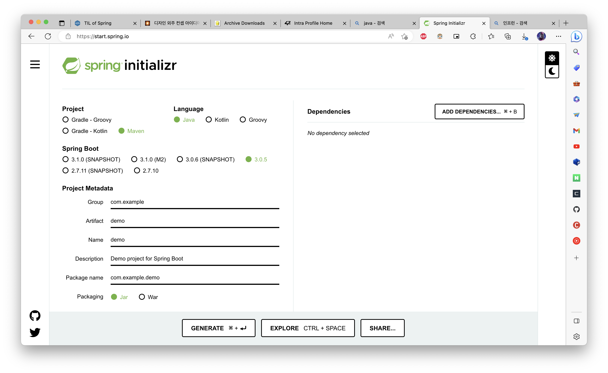
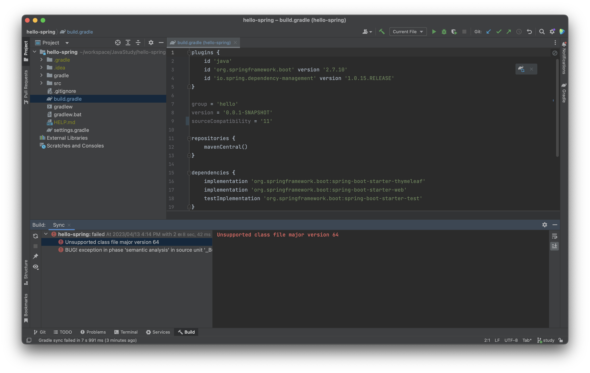
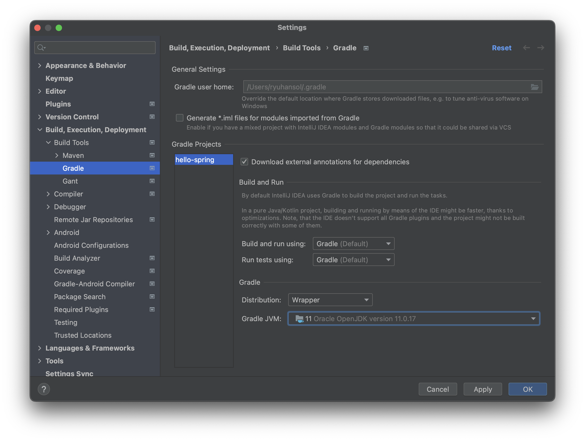
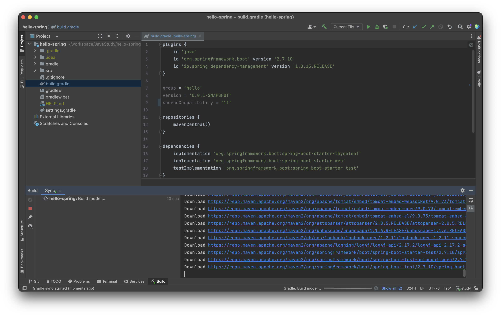
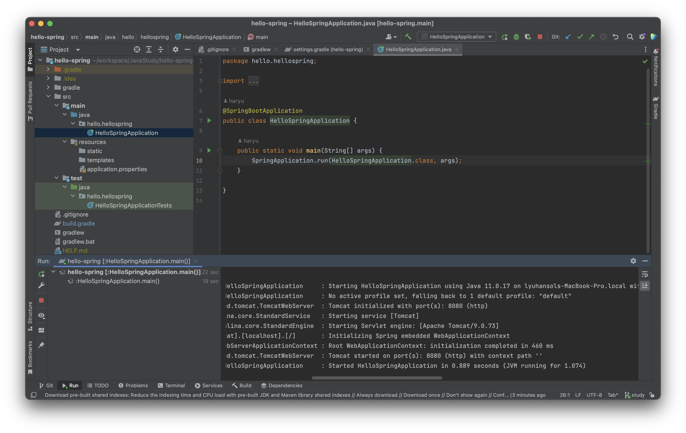
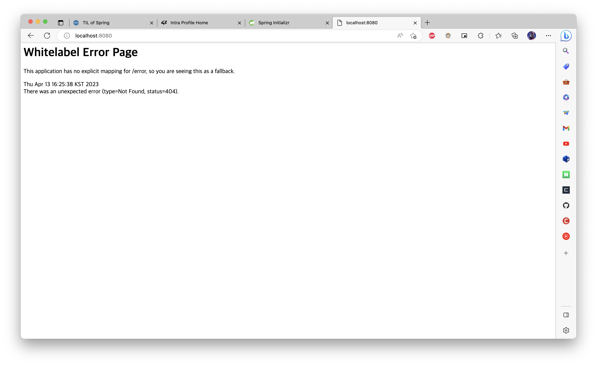
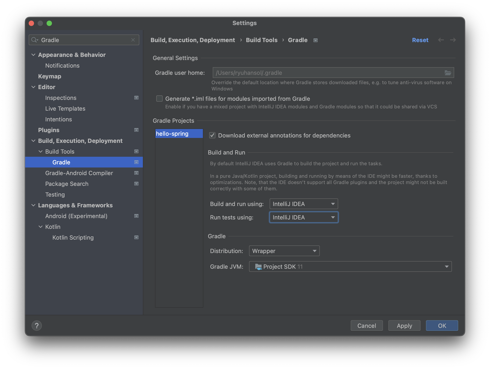

# TIL of Java Spring

본 내용은 JAVA 기초 학습 이후 백앤드 스프링 기초를 배우기 위해 김영한 교수님의 "스프링 입문 - 코드로 배우는 스프링 부트, 웹 MVC, DB 접근 기술" 의 내용 중 기억할 내용들을 메모하는 포스팅이다. 

백앤드.. 배우려면 열심히 해야지. 취업까지 한 고지다. 

## 강의 소개 
**목표 => 간단한 웹 어플리케이션 개발**
- 스프링 부트 프로젝트 생성 
- 스프링 부트로 웹 서버 실행 
- 회원 도메인 개발 
- 웹 MVC 개발 
- DB 연동 - JDBC, JPA, 스프링 데이터 JPA
- 테스트 케이스 작성
~ 큰그림과 핵심 기술들을 돌려보면서, 어디서 무엇이 어떻게 왜 쓰이는지를 파악하자 가 목표! 

내가 이 강의에서 지켜 나가고, 배워가야할 것 
- 첫 감 잡기에 만족하자
- 스프링 기술에 매몰되지 말자
- 실무에서 안 쓰는 건 과감히 제거하자.

김영한 교수님의 강의 시리즈를 다 볼 수 있을지는 애매하다(무엇보다 돈이;;). 일단 기본만 하고 실 프로젝트에 들어가봐야 알것 같긴한데... 흠 고민된다. 

## 프로젝트 생성

최초로 시작하면 들어와서 프로젝트 구성하는 용이다. 
- Maven : 라이브러리를 가져오고 관리해주는 패키지 매니저(old)
- Gradle : 라이브러리를 가져오고 관리해주는 패키지 매니저(요즘 관리용으로 사용한다. )
- Snapshot : 정식 버전 아님 / 숫자만 있는 버전들이 stable 버전임 

그런데 오랜만에 들어가서 보니 일단 프로젝트 생성하는 스프링 이니셜라이저에서 버전 11을 맞춰서 해야 하며'
인텔리제이에서 다음과 같은 에러가 발생했다. 

이에 대해 확인해본바 다음과 같은 문제였다.
[java - How can I fix "unsupported class file major version 60" in IntelliJ IDEA? - Stack Overflow](https://stackoverflow.com/questions/67079327/how-can-i-fix-unsupported-class-file-major-version-60-in-intellij-idea)

한 마디로 말하면 더 낮은 버전을 쓰려면 해당 버전을 다운로드를 받고 재설정을 해줘야 하고, 안그러면 최신버전이다보니 강의의 버전과 너무 차이가 나는 것이다 (...) 

그래서 일단 해당 프로젝트는 수동으로 Java se 11 버전을 추가로 설치했다. 

그렇게하면 환경설정-빌드항목에서 Gradle의 버전을 수동으로 지정해줄 수 있다. (자바 버전을 깔면 인식도 된다. ) 그렇게하면... 

짠 하고 다운로드가 실행되고 처음 필요한 패키지들에 대한 다운로드가 정상적으로 진행 되었다. 



성공적으로 마치면 초기 상태가 나타난다. 
강의에서는 gradle 관련해서 전혀 설명을 안해주신다(...) 일단 몰라도 된다고 하니 넘어가자.


모든 것을 마친 뒤 main 패키지 내부에 기본으로 생성되는 main 클래스를 그냥 다짜고짜 실행시키면 tomcat 서버가 가동된다. 


오예 서버 가동 성공 

꿀팁 
Gradle 을 기본값으로 해당 프로그램을 실행시키면, 거쳐서 실행되다 보니 느릴 때가 있고, 따라서 이런 경우를 막으려면 다음처럼 설정을 바꾸면 된다. 


그런데 아주 다소 희안한건, 내 탐켓 서버는 파비콘을 안 보여준다. 뭐징? 흐음... 


```toc

```
