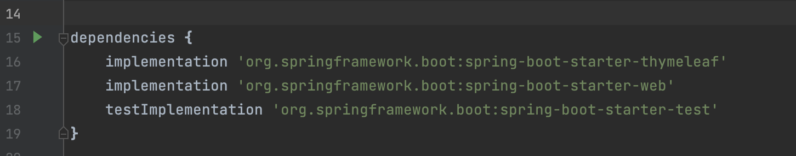
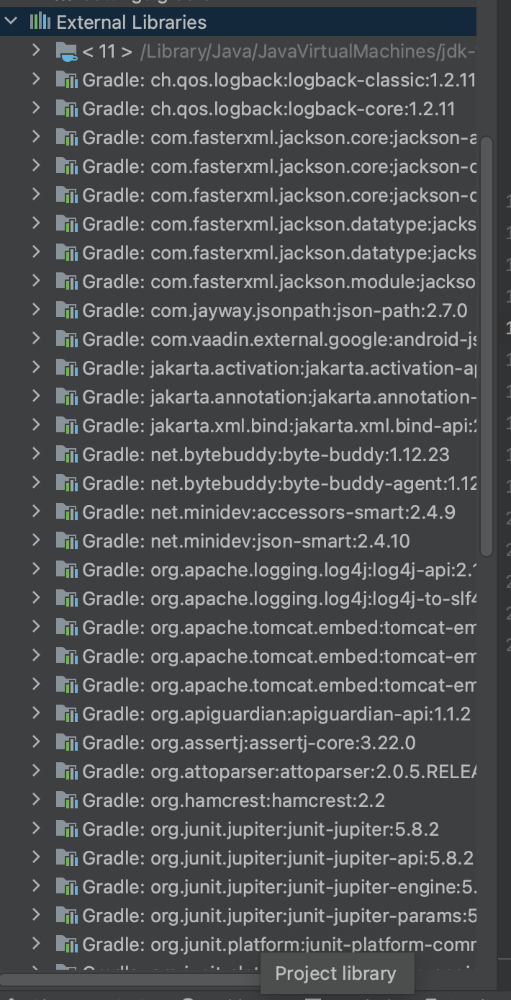
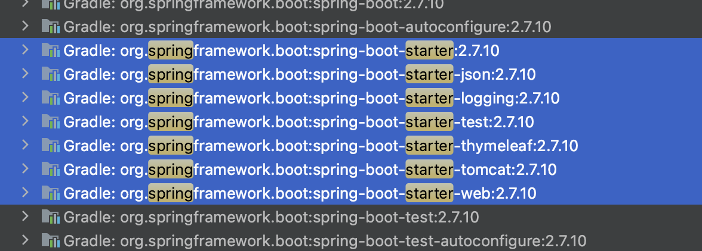
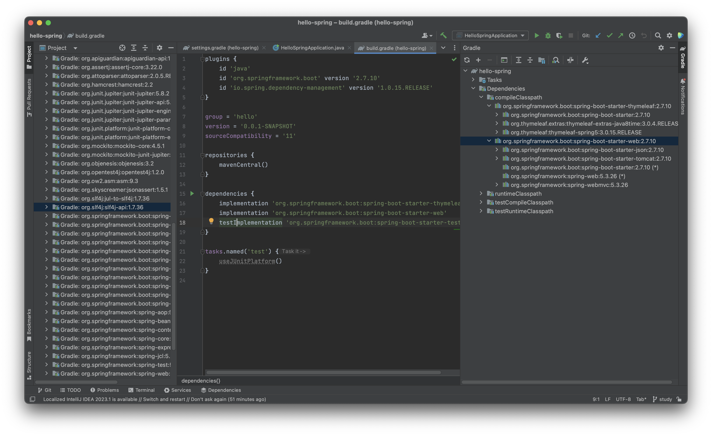
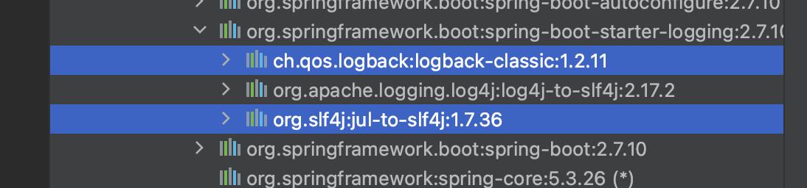
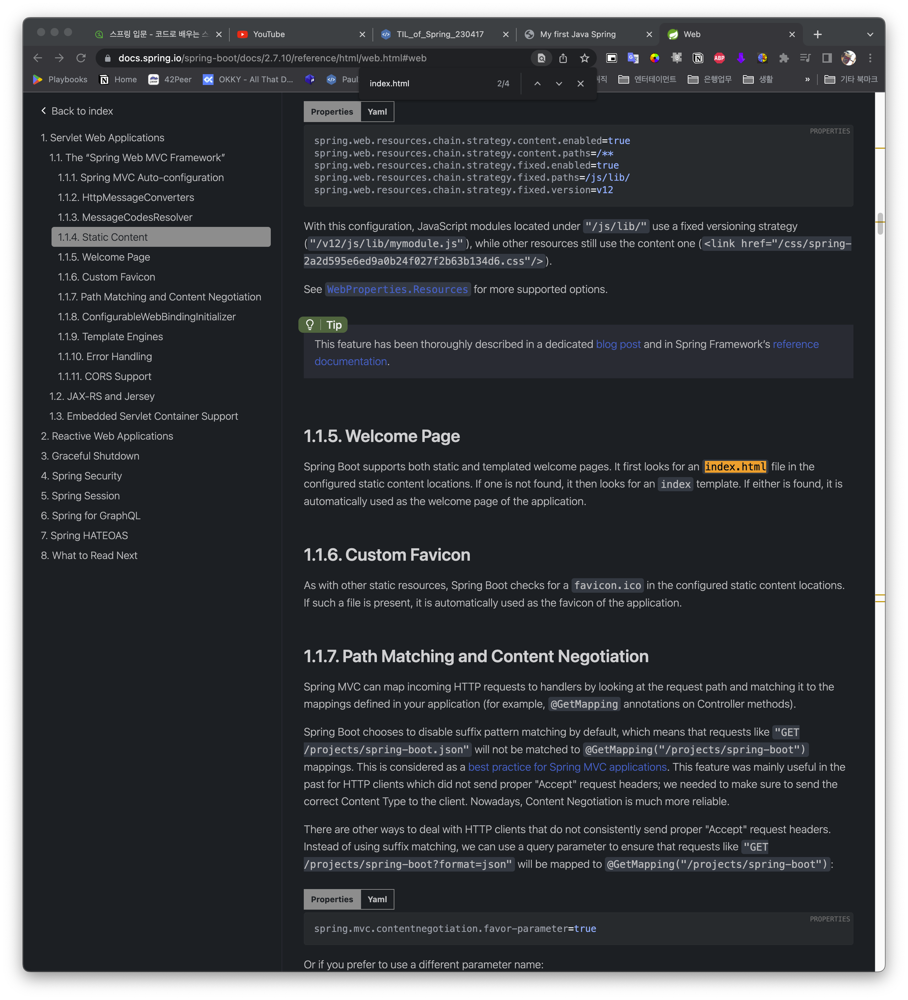
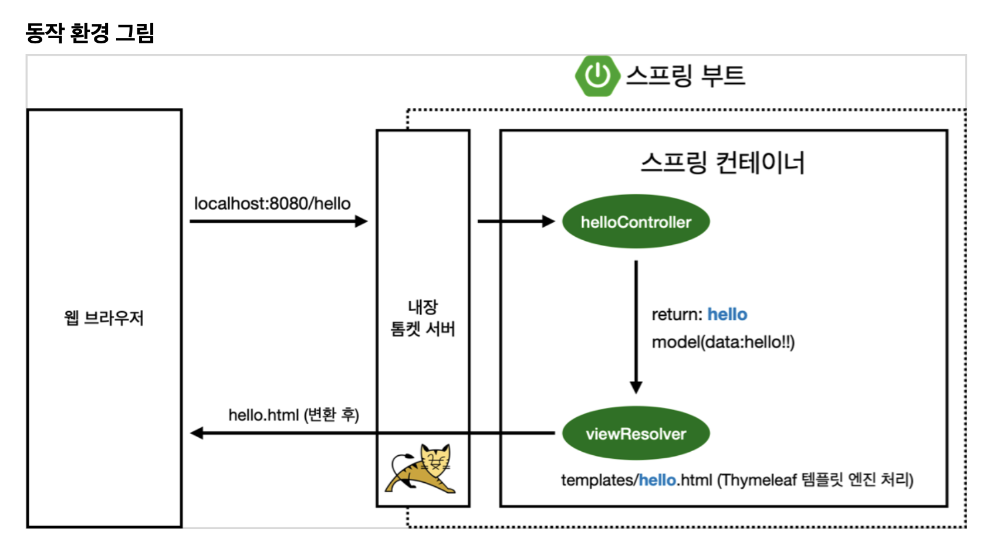

# TIL of Java Spring

본 내용은 JAVA 기초 학습 이후 백앤드 스프링 기초를 배우기 위해 김영한 교수님의 "스프링 입문 - 코드로 배우는 스프링 부트, 웹 MVC, DB 접근 기술" 의 내용 중 기억할 내용들을 메모하는 포스팅이다. 

백앤드.. 배우려면 열심히 해야지. 취업까지 한 고지다. 

# 라이브러리 살펴보기

- 이전에 프로젝트를 생성하면서 라이브러리를 많이 받아오진 않았다. 

- 하지만 막상 실제 다운로드 받아진 라이브러리는 정말 많은 것을 알 수있다. 


- 요즘의 웹 어플리케이션 빌드에서 보통 몇 십메가 정도의 라이브러리들은 자동으로 다운로드가 되고 사용된다. Gradle이나 Maven 같은 빌드 툴들은 `의존관계`를 관리해주는 기능을 갖고 있다. 
- 우리가 사용하려는 라이브러리를 선택하면, 해당 라이브러리가 동작하기 위한 의존 관계의 것들을 모두 자동으로 다운받고, 관리해주는 것이다. 

- 인텔리제이의 우측에 보면 Gradle 항목이 있고, 이를 누르면 실제 의존관계를 확인할 수 있다. 
- 또한 `(*)` 로 표시된 라이브러리들이 보이고, 해당 항목은 마치 의존성이 없는 것 처럼 보이지만, 사실은 없는게 아니라 다른 라이브러리들이 의존성을 위해 이미 다운로드 받았기 때문에 스킵되고 넘어간 것이다. 

- 과거에는 Tomcat 등의 서버도 결국 개발자가 전부 연결해주어야 했다. 하지만 이제는 embed webserver 라는 형식으로 프로젝트나 IDE가 내장하고 있고, 특별한 작업 없이 바로 실행이 되어 버리는 것이다. 
- 한 가지 꾸르팁. 실무에서는 system.out 과 같은 표준 출력으로 디버깅하지 않고 로거를 활용한다. 알아둘 것... 

- 위의 두 라이브러리가 로깅과 관련된 것으로, 두개의 조합이 성능이나 여러 면에서 이점이 있어 마치 표준처럼 다운로드되어 사용된다. 로거에 대해 더 자세히 알고 싶다면 slf4j, logback 알아볼 것 
- 테스트용으로는 `junit`이라는 라이브러리를 많이 쓰고, 강의 기준으로는 4버전에서 막 5버전으로 판올림되었다고 한다. 후속 학습이 필요한 부분이다. 
- 지금까지 언급된 핵심 라이브러리들을 정리하면 다음과 같다. 

- 스프링 부트 라이브러리
	- spring-boot-starter-web
		- spring-boot-starter-tomcat : 톰켓(웹서버) 
		- spring-webmvc: 스프링 웹 MVC
	- spring-boot-starter-thymeleaf: 타임리프 템플릿 엔진(view)
	- spring-boot-starter(공통) : 스프링 부트 + 스프링 코어 + 로깅 
		- spring-boot
			- spring-core
		- spring-boot-starter-logging
			- logback, sl4j
- 테스트 라이브러리 
	- spring-boost-starter-test
		- junit : 테스트 프레임 워크
		- mockito : 목 라이브러리
		- assertj : 테스트 코드를 좀더 편하게 작성을 돕는 라이브러리 
		- spring-test : 스프링 통합 테스트 지원 

# view 환경설정

- 기본적으로 웰컴 페이지는 `src/resources/` 내부에 index.html 파일을 넣어줌으로써 자동으로 인식되게 만들 수 있다. 
- 스프링 부트는 스프링을 감싸며 자바 생태계 견인 역할을 한다. 워낙 많은 내용들을 담고 있는 만큼 결국 다 알고 쓰는 것이 아니라, 필요한 것을 찾아 쓰는게 필요하다. 
- 따라서 그러한 접근 방법이 사용 가능하려면...
	1. spring.io 에 접속한다. 
	2. projects에 spring-boot를 선택한다. 
	3. Learn 항목의 RFC 문서를 확인한다. 

> 결국 핵심은 뭘 배우는 것 만큼 뭘 찾느냐도 굉장히 중요하다. 

- 정적인 페이지는 위처럼 하면 충분히 구현이 된다. 그런데 동적으로 상황에 맞춘 문서를 제작해야 한다면? 그때 템플릿 엔진이 필요해진다. 

- - -

-  Controller 만들기 
	- @ 지시자는 패키지에서 상당한 의미를 갖는것 같다. 
	- @GetMapping() 은 무엇에 대한 Get 요청은 이리로 와라~ 라는 의미를 포함하고 있다. 
- 그 이후에 thymeleaf 템플릿 엔진 동작을 지정해준 html 문서에 해당하는 클래스가 실행되고, data 항목에 우리가 지정한 데이터로 바꿔치기가 된다. 



- 여기서 한가지 기억할 것은 `spring-boot-devtools` 라이브러리를 추가하면 html 파일도 컴파일만 해주면 서버 재시작 없이도 해당 파일  위치에 대해 문서 변경이 가능하다. 
- intelliJ 컴파일 방법 : 메뉴 build->recompile 

# 후기..? 

와우... 자바와 관련된 내용이아니라 스프링과 관련되서 그런가, 왜 @이이고, mapping 이런 개념들이 상당히 생소하다. 

다행인건 GET 과 같은 HTTP 규약을 결국 편하게 쓰자고 하는 거니.. 생각보다 낯설진 않을지도...? 자바 학습했던 기초 뿐만 아니라 C++ 처럼 RFC를 좀 읽어봐야 하지 않을까 싶다. 

```toc

```
