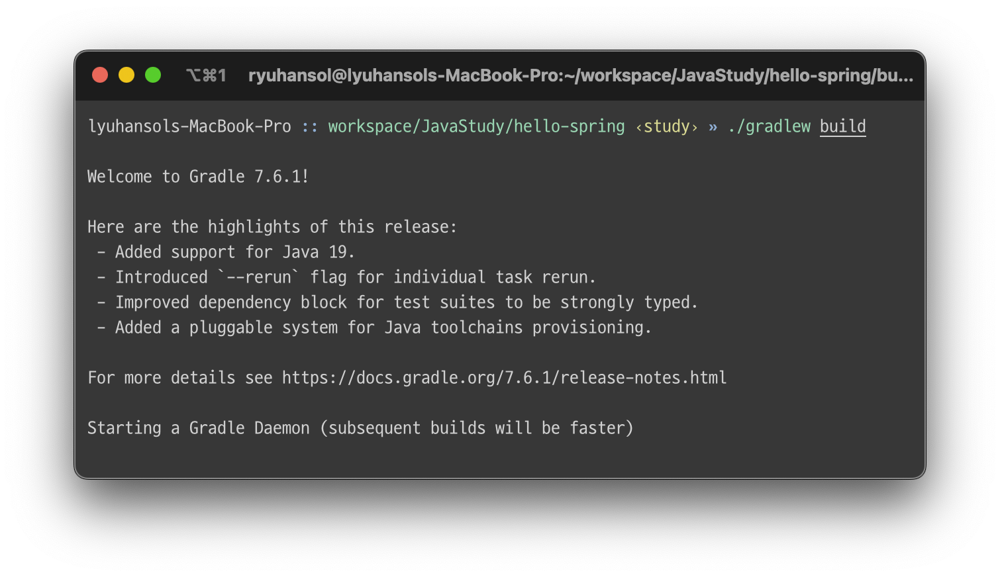
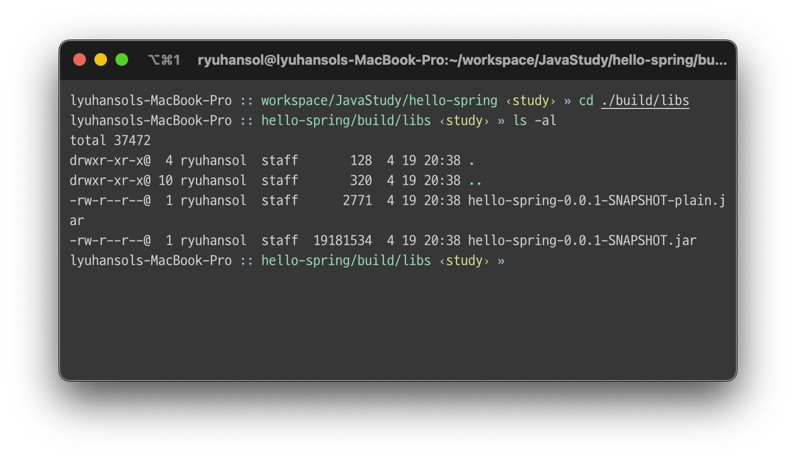
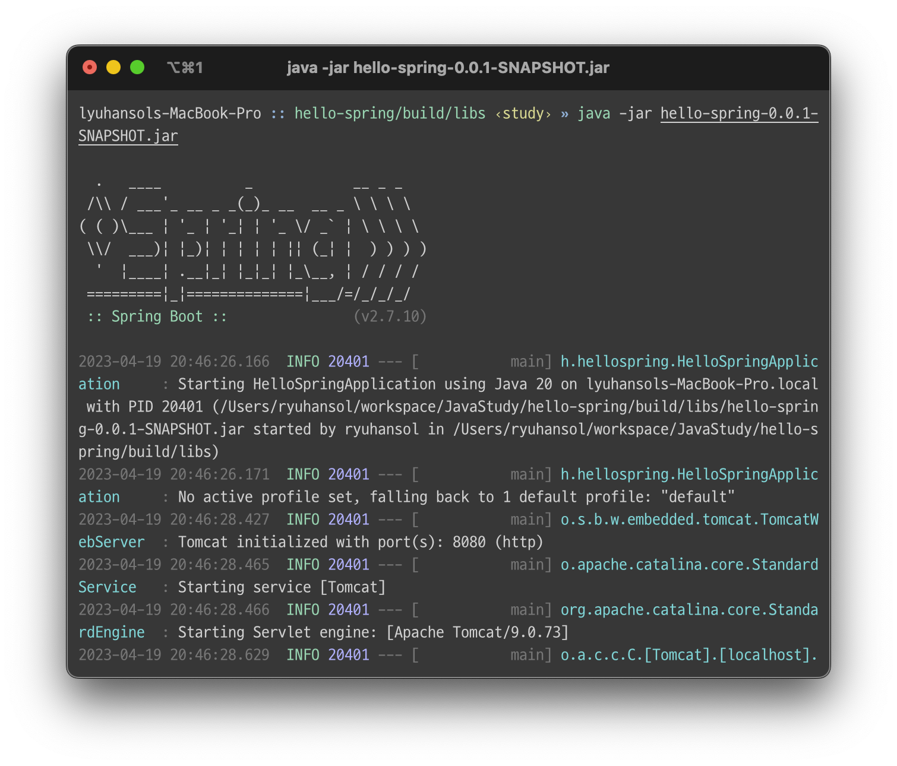
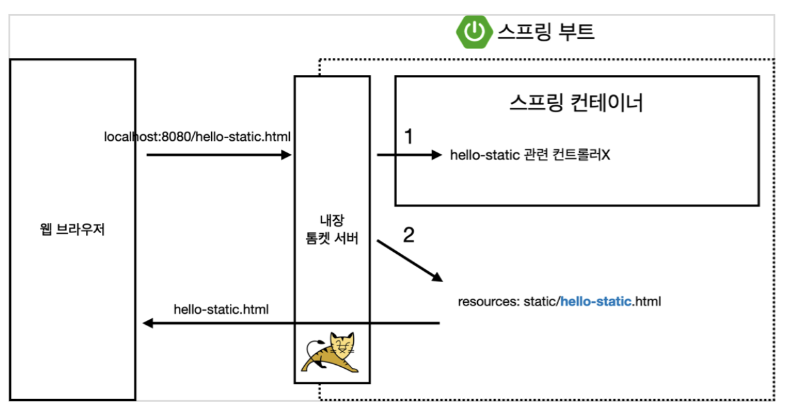

# TIL of Java Spring

본 내용은 JAVA 기초 학습 이후 백앤드 스프링 기초를 배우기 위해 김영한 교수님의 "스프링 입문 - 코드로 배우는 스프링 부트, 웹 MVC, DB 접근 기술" 의 내용 중 기억할 내용들을 메모하는 포스팅이다. 

백앤드.. 배우려면 열심히 해야지. 취업까지 한 고지다. 

# 빌드하고 실행하기

실제 동작하는 프로그램으로 만드는 것은 매우 간단하다. 
Mac OS 기준 `./gradlew build` 명령어를 통해 알아서 돌아가게 된다. 



빌드를 마친 후에는 `./build/libs` 경로를 따라 들어가면, 빌드가 된 완성 jar 파일이 눈에 들어올 것이다. 



그 뒤 실행은 `java -jar {파일명} `으로 정상 실행되는 것을 확인하면 빌드가 마무리 된 것이다. 

이렇게 완성된 빌드 파일을 서버에 올리고 실행을 시키면 기본적인 서버가 구성이 되어 서버로 동작하게 될 것이며, 여기에 각종 파이프나 포트를 통해 마이크로서버의 구축이나, 도커를 활용한 컨테이너 기법을 통해 시스템의 구조를 여러모로 수정할 수도, 제작할 수도 있는 것이다. 

* 추가로 알면 좋은 명령들 
```shell
./gradlew clean # 빌드 내용 삭제 
./gradlew clean build # 빌드를 완전히 삭제하고 재 빌드를 진행한다. 
```

- - - 
# 스프링 웹 개발 기초 

- 정적 컨텐츠 : 파일을 그대로 전달하는 방식
- MVC와 템플릿 엔진 : 서버에서 변형 및 조합을 통해 페이지를 만들어서 전달해주는 방식
- API : json과 같은 데이터 타입을 통해 전달해준다(?) ~ 데이터 흐름용에 가깝다

- 정적 컨텐츠 : 
	- 페이지를 그냥 서버에서 접근이 가능하고, 서버는 특별한 가공 없이 해당 내용을 요청받은 클라이언트에게 전달함. 
	- 여기서 스프링의 특징은 스프링 컨테이너에서 내장된 톰켓 서버로 온 요청에 대해 먼저 받아서 컨트롤러가 있는지 여부를 판단한다. 
	- 내부에 있는 리소스를 찾아서 이를 전달한다. 



- - -
# MVC와 템플릿 엔진

- - -
# API 

```toc

```
