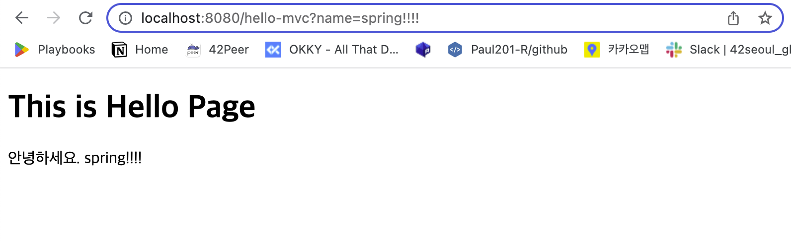
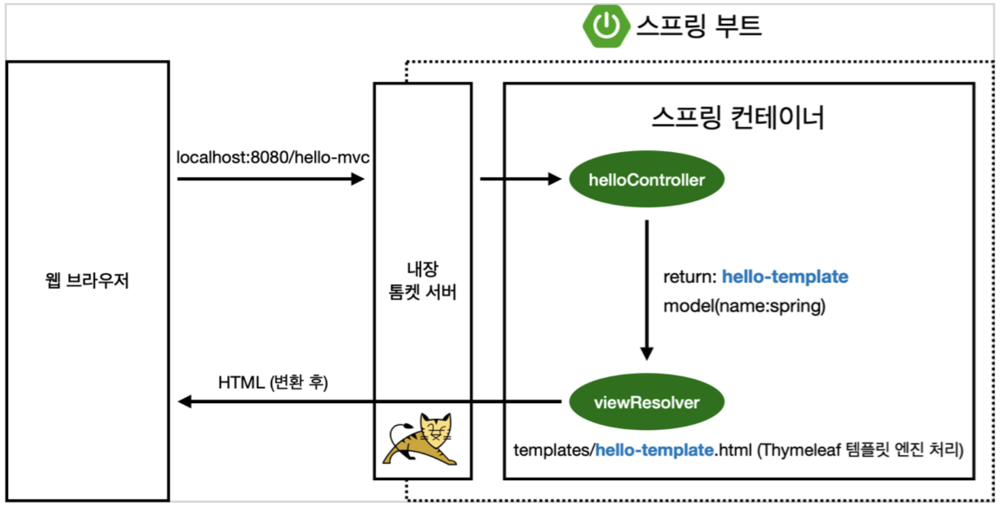
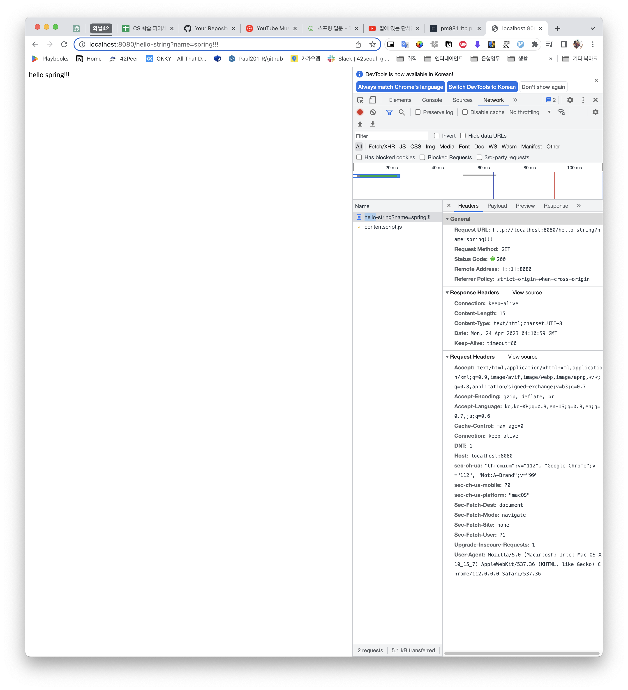
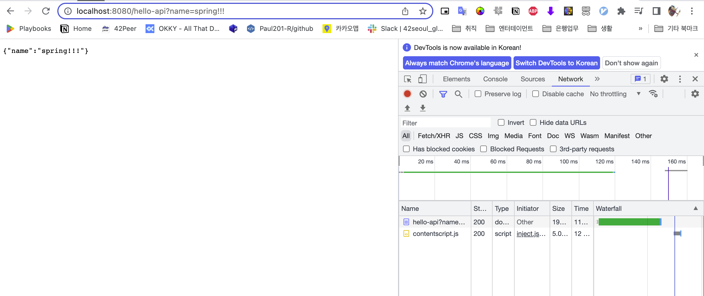
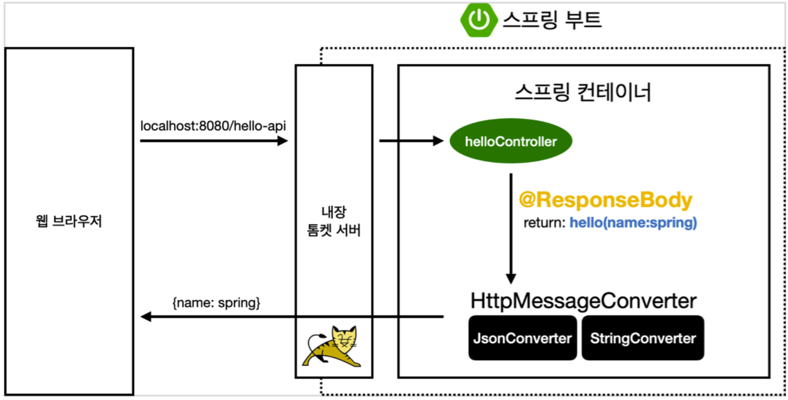

# TIL of Java Spring

본 내용은 JAVA 기초 학습 이후 백앤드 스프링 기초를 배우기 위해 김영한 교수님의 "스프링 입문 - 코드로 배우는 스프링 부트, 웹 MVC, DB 접근 기술" 의 내용 중 기억할 내용들을 메모하는 포스팅이다. 

백앤드.. 배우려면 열심히 해야지. 취업까지 한 고지다. 

- - -
# MVC와 템플릿 엔진
- MVC : Model, View, Controller 
```java
// Controller
@Controller
  public class HelloController {
      @GetMapping("hello-mvc")
      public String helloMvc(@RequestParam("name") String name, Model model) {
          model.addAttribute("name", name);
          return "hello-template";
      }
}
```

```html
// View
  <html xmlns:th="http://www.thymeleaf.org">
  <body>
  <p th:text="'hello ' + ${name}">hello! empty</p>
  </body>
  </html>
```
- 요즘은 MVC 스타일로 많이 사용한다. view 란 화면 자체를 그리는 것에만 집중해야 한다. 이에 비해 controller는 비즈니스 로직과 관련이 있거나 내부적 처리에 집중하느 것을 의미한다. 
- 이것을 Model, view, controller 로 분리해서 집중한다는 말은, 한 마디로 내부 구조를 명확하게 구분지어 화면을 뿌리는 요소와 내부 로직을 명확하게 구분지어주는 것을 의미한다. 

```java
package hello.hellospring.controller;  
import org.springframework.ui.Model;  
import org.springframework.stereotype.Controller;  
import org.springframework.web.bind.annotation.GetMapping;  
import org.springframework.web.bind.annotation.RequestParam;  
  
@Controller  
public class HelloController {  
@GetMapping("hello")  
public String hello(Model model){  
model.addAttribute("data", "hello!!");  
return "hello";//  
}  
@GetMapping("hello-mvc")  
public String helloMvc(@RequestParam(value = "name", required = true) String name, Model model) {  
model.addAttribute("name", name);  
return "hello-template";  
} //model 은 뷰에서 렌더링할 때 스는 도구다  
}
```

- 위의 예시로 작성을 하게 되면 localhost:8080/hello-mvc 로 GET 할 경우, 값을 받아야 함을 지정해줄 수 있다. 이렇게 지정하게 되면 템플릿을 아래처럼 설정하여 문서를 요청할 수 있게 된다. 

```html
<!DOCTYPE html>  
<html xmlns:th="http://www.thymeleaf.org">  
<head>  
<meta charset="UTF-8" http-equiv="Content-Type" content="text/html">  
<title>My first Java Spring</title>  
</head>  
<body>  
<h1>This is Hello Page</h1>  
<p th:text="'안녕하세요. ' + ${name}">안녕하세요. empty</p>  
<!--empty는 기본값-->  
</body>  
</html>
```





- MVC , 템플릿 엔진 이미지 동작 방식을 설명하면 다음과 같다. 
- 웹 브라우저에서 HTTP 메시지를 보낼 것이고 
- 톰캣 서버는 여기서 controller로 미리 접근 
- 여기서 retrun 값을 통해 특정 템플릿 페이지를 구동이 되면서 model에 필요한 정보가 함께 넘어간다. 
- view Resolver는 이 값을 통해 HTML 문서를 수정하여 보여준다. 

- - -
# API 
- 정적 컨텐츠를 제외하면 2가지만 고려하면 된다. 
	- Controller 로 전달하여 HTML 문서로 전달하나
	- API를 활용해 데이터로 전달하나 

- API의 방식으로 전달하게 되면, 다른 변환 없이 return하는 값이 그대로 전달된다. 
```java
@GetMapping("hello-string")  
@ResponseBody  
public String helloString(@RequestParam("name") String name){  
return "hello " + name;  
}
```

- 실제로 값을 전달해보면 반환값이 그냥 한방에 전달된다. 
- 이번엔 제대로 api 를 사용하는 것에 대해서 보면 다음과 같다. 

```java
@GetMapping("hello-api")  
@ResponseBody  
public Hello helloApi(@RequestParam("name") String name) {  
Hello hello = new Hello();  
hello.setName(name);  
return hello; // 객체 전달  
}  
  
static class Hello {  
private String name;  
  
public String getName(){  
return name;  
}  
public void setName(String name) {  
this.name = name;  
}  
  
}
```


- 클래스를 구축하고, 컨트롤러가 객체를 전달하도록 짜보았다. 
- 이렇게 만든 컨트롤러로 접근하게 되면 JSON 파일 형식으로 객체가 전달되는 것을 볼 수 있다. 
- 과거에는 JSON 외에도 XML 방식으로도 전달하고 그러했으나, JSON이 사실상 표준처럼 사용되게 되었다. 
- API 방식으로 반환한다고 할 때 이제는 JSON 방식이 기본이라고 생각하면 된다. (원한다면 XML 가능은 함)


- 구동 방식 
	- 서버로부터 HTTP 메시지를 받으면, 스프링 컨테이너로 전달한다. 
	- 스프링은 hello-api 라는 URL의 존재를 발견하고, @ResponseBody 라는 annotation이 붙어있음을 발견한다. 
		- 해당 어노테이션이 없으면 `viewResolver`에게 전달했었다. 
		- 하지만 해당 어노테이션이 있으면 바로 HTTP 메시지를 제작해야 한다고 판단하고 `HttpMassageConverter` 를 호출한다.
	- 이때 객체를 전달 -> `JSON` 방식으로 전달(default) ; `MappingJackson2HttpMessageConverter`
		- Jackson 라이브러리(스프링 default)
		- Gson 라이브러리 -> 구글에서 나온 라이브러리 
		- 내가 원하는 특정 라이브러리가 있다면 설정해주면 되는 것이다. 
	- 이때 문자열 전달 -> 문자열로 전달 ; `StringHttpMessageConverter`
	- byte 처리 등등 기타 여러 HttpMessageConverter가 기본으로 등록 되어 있다. 
- 이때 핵심! 과연 실무에서 이걸 건드릴까? -> 대게 거의 건드리지 않는다. (ㅎㅎ;;;! )

```toc

```
