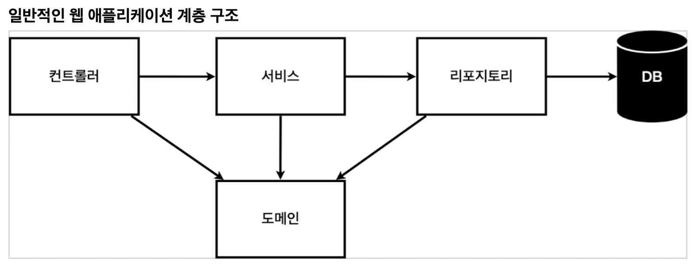
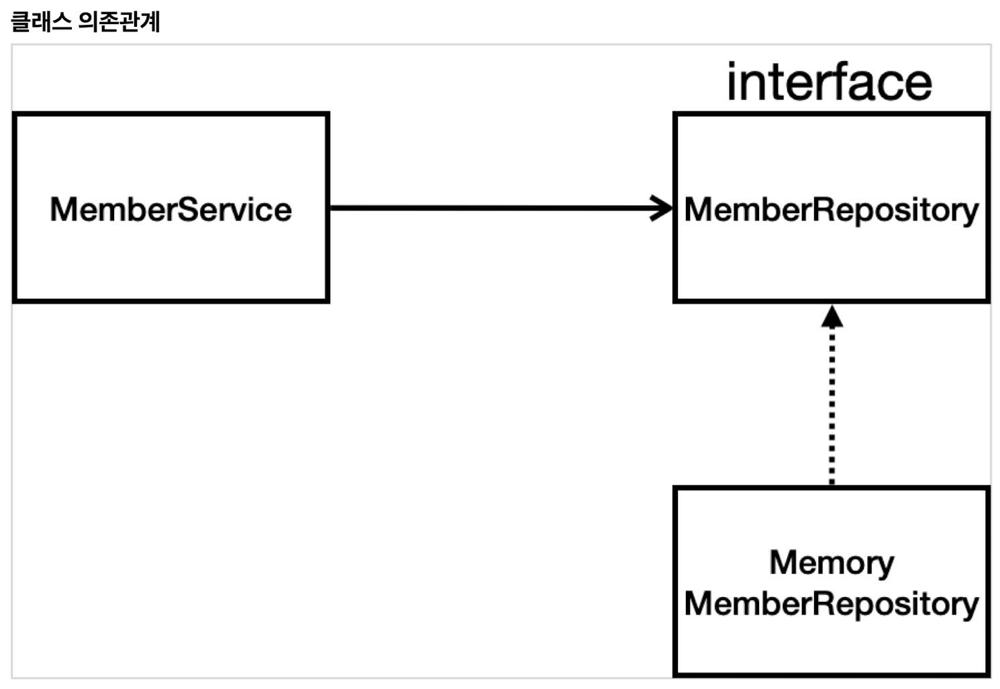

# TIL of Java Spring

본 내용은 JAVA 기초 학습 이후 백앤드 스프링 기초를 배우기 위해 김영한 교수님의 "스프링 입문 - 코드로 배우는 스프링 부트, 웹 MVC, DB 접근 기술" 의 내용 중 기억할 내용들을 메모하는 포스팅이다. 

백앤드.. 배우려면 열심히 해야지. 취업까지 한 고지다. 

- - -
# 회원 관리 예제 - 백엔드 개발 

## 비즈니스 요구사항 정리 
- 데이터 : 회원 ID, 이름 
- 기능 : 회원 등록, 회원 조회 
- 아직 데이터 저장소가 선정되지 않음(가상의 시나리오) 
- 간단하게 하는 이유는 스프링 생태계 파악용이니까.. 너무 복잡하게 생각하진 말자. 

- 컨트롤러 : 웹 MVC 컨트롤러 역할, 웹 환경에서의 다양한 요청의 1차적 집합소(?) 
- 서비스 : 핵심 비즈니스 로직을 구현, 룰, 제한사항, 서비스의 설계에서 가이드 역할을 해주는 공간
- 레포지터리 : 데이터베이스에 접근, 도메인 객체를 DB에 저장하고 관리하는 역할 
- 도메인 : 비즈니스 도메인 객체, 예) 회원, 주문, 쿠폰 등등 주로 데이터베이스에 저장하고 관리됨. 

- 아직 DB 선정이 되지 않아, 우선 인터페이스로 구현 클래스를 변경할 수 있도록 설계 
- 데이터 저장소는 RDB, NoSQL 등 다양한 저장소 고민중인 상태로 가정 
- 개발을 진행하기 위해서 초기 개발단계에서는 구현체로 가벼운 메모리 기반의 데이터 저장소 사용 
- **즉, 지금 하는 것은 매우 빠르게 프로토타입을 만드는 것을 상정한 설계로 진행한다고 보면 될 것 같다.**

- - - 
## 회원 도메인과 레포지터리 코딩 

```java
// hello.hellospring.domain.member class
package hello.hellospring.domain;  
  
public class Member {  
	private Long id; // 시스템이 임의로 정하는 값  
	private String name; // 걍 이름  
  
	public Long getId() {  
		return id;  
	}  
	public void setId(Long id) {  
		this.id = id;  
	}  
  
	public String getName() {  
		return name;  
	}  
	  
	public void setName(String name) {  
		this.name = name;
	}  
}
```

```java
// hello.hellospring.repository.MemberRepository interface
package hello.hellospring.repository;  
  
import hello.hellospring.domain.Member;  
  
import java.util.List;  
import java.util.Optional;  
  
public interface MemberRepository {  
	Member save(Member member);  
	Optional<Member> findById(Long Id); 
	// Optional Java 8에 들어간 기능, 
	// 간단하게 말하면 Null이 반환될 때 optional로 감싸서 진행하는 방식이다.  
	Optional<Member> findByName(String name);  
	List<Member> findAll();  
}
```

```java
package hello.hellospring.repository;  
  
import hello.hellospring.domain.Member;  
  
import java.util.*;  
  
public class MemoryMemberRepository implements MemberRepository {  
// implements 를 넣고 opt + enter 하면 해당 인터페이스 리스트를 전부 긁어올 수 있다.  
// 동시성 문제가 고려되어 있지 않음, 실무에서는 ConcurrentHashMap, AtomicLong 사용 고려  
  
	private static Map<Long, Member> store = new HashMap<>();  
	private static long sequence = 0L;  
  
	@Override  
	public Member save(Member member) {  
		member.setId(++sequence);  
		store.put(member.getId(), member);  
		return member;  
	}  
  
	@Override  
	public Optional<Member> findById(Long id) {  
		return Optional.ofNullable(store.get(id)); // Null 이 반환될 가능성이 있을 때 ofNullable 이라는 것으로 감싸면  
		// 클라이언트에서 적절한 조치를 취할 수 있음  
	}  
  
	@Override  
	public Optional<Member> findByName(String name){  
		return store.values().stream()  
				.filter(member -> member.getName()  
				.equals(name)).findAny();  
	}  
	@Override  
	public List<Member> findAll() {  
		return new ArrayList<>(store.values());  
	}  
  
	public void clearStore() {  
		store.clear();  
	}  
  
}
```


- 여기까지가 구현한 내용의 전부이다. 각 멤버를 구성하는 클래스를 구성하고, 그 클래스의 저장을 위한 인터페이스를 만든 뒤, 해당 내용을 실제 담을 클래스나 형식에는 인터페이스를 이용해 항상 기준을 잡는다. 
- 자잘하게 알 수 있었던 몇가지는 다음과 같다. 
	- <key>opt</key> + <key>enter</key> 를 활용하면 대부분의 경우 편리한 선택지를 제공한다. 
		- 인터페이스를 입력한 후 누르면, 인터페이스들이 자동으로 입력되어 준다. 
	- 동시성 문제로 각 자료구조마다 권장되는 경우와 그렇지 않은 경우가 있다. 자바 언어에 대한 이해도를 높이기 위해서도, 나중에 자료구조에 대해 이해도 그렇고 많이 기록할 필요가 있어 보인다. 
	- @Override 는 인터페이스에 맞춰 설계함을 나타내는 것으로 판단된다. 
- 이제 이에 대한 테스트케이스를 만들면 된다..!


```toc

```
