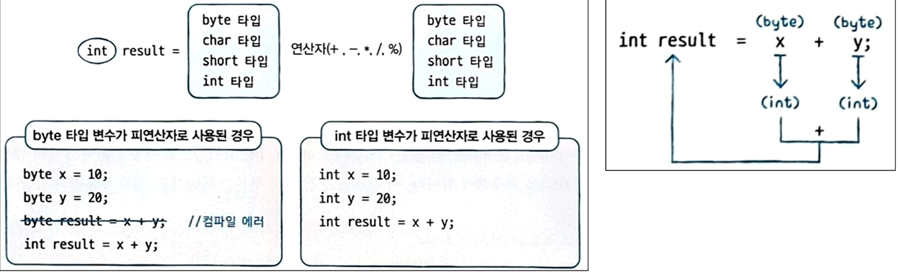

# TIL of Java Spring

본 내용은 Udemy를 통한 학습 내용이다.
복습 및 완벽 정리가 아닌, 핵심이나 놓치지 말 것들 위주의 정리인 만큼, 내용이 온전히 담기진 않는다. 

- - -
## 09강. 실수 타입, 논리 타입, 변수의 참조 타입, String 클래스, Object클래스, toString(), 이스케이문자 
- 왜 뒤에 f 등을 붙여서 실수를 표현하는가? 
	- 컴파일러에게 float 타입임을 알리기 위함 
- 정밀도 면에서 float보단 당연히 double 이 정밀도가 높다 
- C언어에서는 논리타입은 존재하지 않는다(0, 1이를 대신함)
- 자바 타입은 참과 거짓을 의미하는 true, false를 논리 리터럴로 사용한다. (1byte)
- 자바의 참조타입(String, Object... etc)
	- String 은 클래스 타입이며, 기본타입이 아닌 참조 타입임. 
	- 자바의 클래스의 최고 종상 클래스는 Object 클래스를 상속 받는다 
	- 기본적으로 참조 타입의 구조는 stack 에 heap에 생성되는 데이터의 주소값을 가지고 있는 형태로 생성된다. 
## 10강. 변수의 타입 변환의 개념, 자동 타입 변환, 강제 타입 변환, 정수 연산에서의 자동 타입 변환 
- 타입 변환이란? 
	- 변수가 다른 경우의 데이터를 저장하기 위해 변환되는 것을 이야기 한다. 
- 자동 타입 변환 / auto casting / promotion
	- 당연하게도 자연스럽게 컴파일을 통해 프로그램이 런타임 상황에서 능동적으로 데이터의 타입을 바꿔주는 것 
	- 기본 타입을 허용 범위 크기 순으로 나열하면 : 
	  byte < short < int < long < float < double (소수점 때문에 실수 타입이 더 크게 취급 된다.)
- 강제 타입 변환 casting
	- 큰 타입이 작은 허용범위 타입으로 변환되도록 개발자가 수동으로 억지로 형변환하는 것 
	- 데이터의 손실이 발생한다. 
- 정수 타입 변수가 산술 연산식에서 피연산자로 사용되면 int보다 작은 타입의 변수도 자동으로 int로 변환되어 연산을 수행한다. 
	
	- 혹여 굳이 연산된 값을 byte에 저장하고자 원하면 (byte)로 강제 형변환이 필요 

```toc

```
