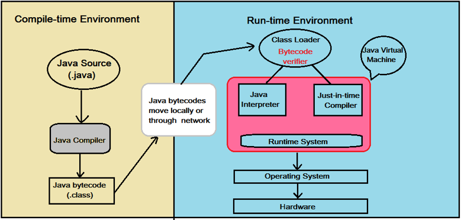
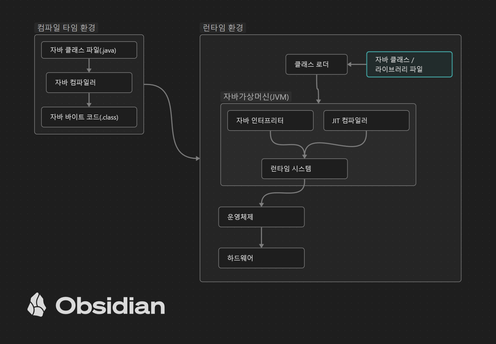
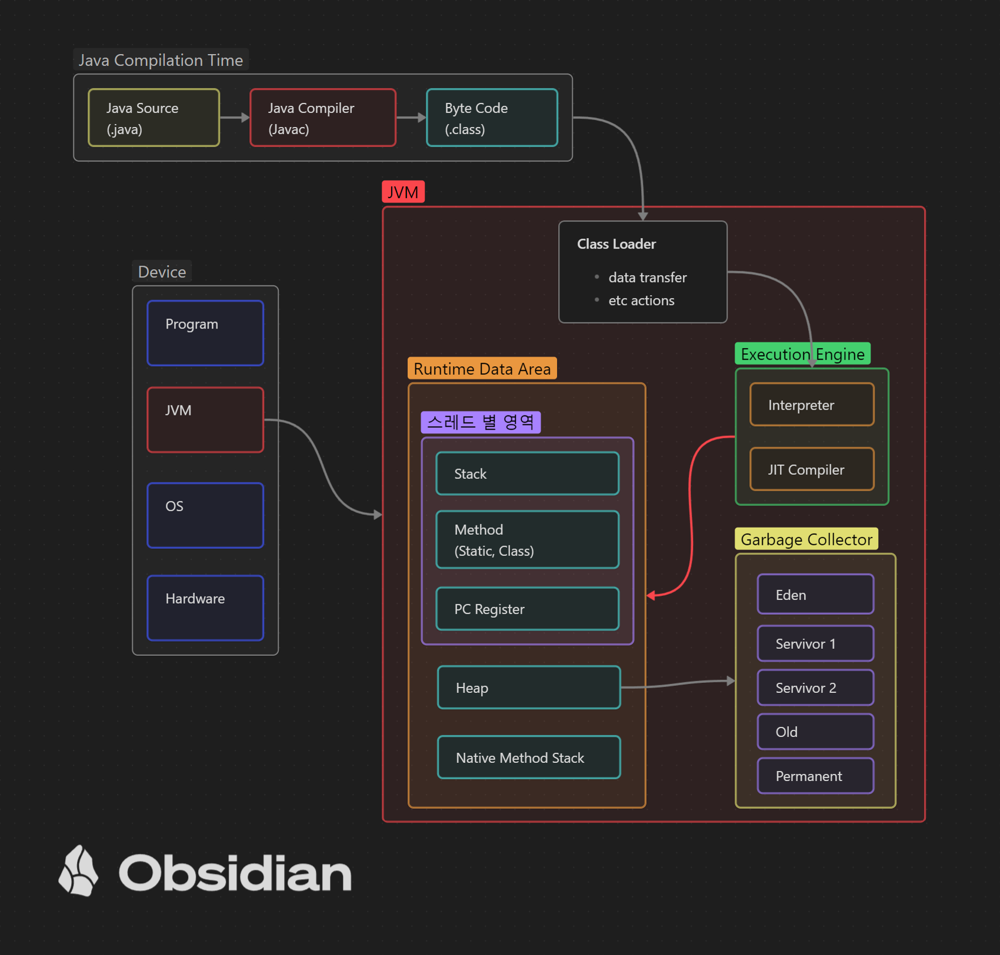

# 자바의 역사
1990년대, Sun Microsystems 에서 개발되었다. 당시 엔지니어 부서 중 하나인 'Green Team'은 이제 곧 소비자 개개인의 물건에 컴퓨터가 있는 시대를 예감하여, 이를 위한 새로운 언어 개발을 착수한다. 이때 Green Team 의 깃에서 greentalk 라고 부르다가, 이름을 `oak` 라고 짓게된다. 모바일 기기라는 개념조차 부족하던 시대 가전제품에 칩을 탑재할 용도로 언어가 만들어졌으나, 이 아이디어 자체가 시대를 너무 앞섰다. 당시 하드웨어가 구동 될만한 성능이 되지 못해 성공하지 못하였으나, 웹 애플리케이션에 적합한 언어로 되었고 1955년 Java 1.0 으로 세상에 나오게 된다. 
상당히 오랜시간 썬에서 업데이트 해왔으나 2010년 오라클에 인수되었다. 일부 오라클의 유료화 선언 등으로 논란이 있었으나, 결론적으로 자바는 무료로 사용할 수 있다. 
# 인터프리터와 컴파일러 
컴퓨터는 기계어, 즉 0, 1로 구성된 binary 데이터를 읽어낸다. 그러나 이를 보고 쓰기가 불편하였기에 이후 조금씩 사람이 이해하기 쉬운 단어로 번역되기 시작하였고, 그렇게 탄생한 것이 Assembly Language 이며, 이를 보다 높은 수준으로 사람이 인지하기 쉽게 만든 것이 High-Level Language 라고 부르는 고급 언어의 개념이다. 1950년대부터 해당 언어 개념이 발생하여 Java, C, Python, Perl 등이 이 개념에 속하는 언어로써 지금까지도 계속 사용된다. 
이러한 언어들의 특징은, 앞서 언급했듯 기계어에서 어셈블리 어로, 어셈블리어(또는 Low-Level Language) 가 High-Level Language로 변환되는 과정을 거친다. 그렇다는 것은 실제 디바이스가 이를 사용할 때는 다시 원래 형태로 변환을 시켜줘야 하고, 이때 사용하는 것이 Intergpreter 와 Compiler 이다. 
## Interpreter 
인터프리터는 사용자의 작성 소스 코드를 한 문장씩 읽어, 기계어로 바꿔주는 방식으로 기계가 소스 코드대로 작동하도록 하는 방식이다. 이 방식의 장점은 우선 컴파일 과정 대비, 한 문장을 읽고 바로 바로 실행하는 구조이므로 실행 자체가 바로 가능하다는 점에서 통 번역 과정을 가지는 것에 비해선 바로 실행이 가능하다는 이점이 있다. 이에 비해 컴파일 방식은 통으로 번역하는 만큼 프로그램의 크기가 크면 클 수록 컴파일 과정이 오래 걸리게 될 수 밖에 없다. 이러한 점에선 편리한 면이 있으며, 이에 반해 디바이스가 번역과 명령 수행을 동시에 진행하는 꼴이 되는 만큼 성능 상의 손해가 발생할 수 있다. 
## Compiler 
인터프리터 방식의 장점은 소스파일을 바로 구동 가능하다는 점이다. 하지만 구동 과정에서 언어를 한 줄씩 변환하는 형태로 구동되다 보니, 번역하는 과정과 구동하는 과정이 함께 일어난다는 점에서 성능적 손해가 크다. 그러나 이에 반해 컴파일 방식은 통으로 모든 소스를 번역해주는 과정을 거치므로, 실제 실행속도 면에서 장점이 크다. 하지만 프로그램의 규모가 커질 수록 당연히 컴파일 과정이 걸리며, 프로그램의 수정 사항이 발생했을 때 컴파일을 다시 해야 한다는 점에서 개발과 배포 면에서 손해가 크다. 
# 자바의 컴파일 
자바의 경우에는 상당히 특이한 구조를 가지고 있다. 이러한 부분에 대해선 JVM을 사용하는 독특한 구조를 갖고 있기 때문이다. 빌드 시 자바(`*.java`) 파일을 자바 컴파일러를 이용하여 JVM이 이해 가능한 중간 단계 언어 바이트 코드(`*.class`) 로 바꿔준다. 런 타임 시, 이 바이트 코드를 기계어로 바꿔주는 역할을 JVM이 해준다. Class Loader를 통해 바이트 코드가 JVM 내에 로드가 된 뒤 Runtime Data Area를 두고 Execution Engine 으로 가며, 이 엔진에서 바이트 코드로 변환이 이루어진다. 인터프리터 방식 도는 JIT컴파일러(Just-InTime) 방식이다. 인터프리터 방식은 고전적인 인터프리터 방식 그대로이며, JIT컴파일러 방식은 인터프리터 방식으로 사용하다가, 필요한 순간에 바이트 코드 전체를 기계어로 바꾸는 방식으로, 기계어는 캐싱을 이용하기 때문에 인터프리터의 단점을 극복할 수 있다. 

# 자바의 특징
자바의 특징은 JVM이 설치된 어느 기계에서든 동작이 가능하다는 점이 중요한 특징이다. C, C++ 같은 컴파일 언어의 경우 컴파일 된 컴파일된 호환 환경에서만 실행이 되기 때문에 JVM을 통한 프로그램들은 OS 환경이 달라도 동작한다는 점에서 이식성이 매우 뛰어나다고 볼 수 있다. 
이러한 특징은 기존의 의도보다도 웹에 최적화된 속성이다보니, 이에 맞춰 변하게 된다. 
### 1. 플랫폼 독립성 
자바의 가장 큰 특징중 하나로 플랫폼과 상관없이 JVM 에서 동작하므로, 한번 작성 된 이후 어디든 이식이 가능하다. 이 점은 웹 서버의 구성과 다양한 머신 위에서 편리하게 올릴 수 있으며, 다양한 지역에 동일한 구성의 서버들을 올리고, 같은 서비스를 일괄되게 보여줘야하는 점은 웹 환경에 적합하다. 
### 2. 보안성
웹 개발에서 보안은 매우 중요하다. 자바는 보안 기능들을 내장하고 있다는 점이 있는데 예를 들면 자바는 메모리 관리 기능을 가비지 컬렉터를 통해 메모리 관리를 자동으로 처리하며, 버퍼 오버플로와 같은 일반적인 보안 취약 점을 방지해준다. 
### 3. 애플릿 기술 도입, 그 이후엔...
자바 초기버전에서는 웹 브라우저 내에서 직접 실행 가능한 작은 프로그램인 애플릿이 도입되어, 동적 요소를 추가 가능하다는 점에서 웹 영역에서의 급속도의 성장을 도래했다. 
단, 이후 호환성 문제, 좀 더 발전된 웹 기술의 등장으로 현재는 자바 웹 스타트, JSP, HTML5와 JS 등의 기술로 변화, 대응 되었다. 

이후 지속적으로 Java의 사용자가 유지되고 있어 숙련된 개발자들과 커뮤니티가 잘 구축 되어 있으며, 기업용 솔루션으로 대용량 처리와 트랜잭션 관리가 강하다는 점, 다양한 표준 라이브러리와 프레임워크가 지원된다는 점 때문에 여전히 지속적으로 사용되는 언어로 자리매김하게 된다. 

# 자바의 컴파일 과정 


## 부분 설명 
### Class Loader 
1. 로딩( Loading) : JVM이 프로그램 실행을 위해 필요한 클래스 파일을 찾기 위해 읽는 과정. `*.class` 파일들을 읽어서 메모리로 로드한다.
2. 링킹(Linking) : 로드 후 JVM 내에서 실제 참조 될 수 있도록 연결하는 과정. 여기서는 세부적으로 검증, 준비, 해석 단계로 구분되어 진행된다. 
3. 초기화(Initialization) : 클래스 변수를 적절한 값으로 초기화 하는 과정이다. JVM 스펙에 따라 정적 변수에 기본값을 할당, 클래스 또는 인터페이스의 정적 초기화 블록이 실행된다. 
### Runtime Data Area
#### 스레드 별 영역 
- 위의 스레드 별 영역들은 JVM 런타임 데이터 영역에 포함되기는 하나, 동시에 스레드 별로 지니게 되는 영역이다. 
- Stack : 각 스레드마다 스택이 할당되고, 지역변수, 매개변수 등을 저장한다.
- Method Area : 모든 스레드가 공유하는 영역으로, 클래스 데이터, 상수, 정적 변수, JIT 컴파일러에 의해 컴파일된 코드 등을 저장한다. 
- PC Register : JVM 명령어의 주소의 위치를 가리킨다. 각 스레드는 자신만의 PC 레지스터를 가지며 스레드가 어느 지점의 코드를 실행하는지를 알려준다.
#### 그 밖의 영역
- Heap :
	- 객체 저장 : JVM 이 관리하는 메모리 중 객체와 배열을 저장하는 부분이다. 모든 스레드에서 공유되고, 가비지 컬렉션의 대상이다. 
	- 동적 할당 : 객체는 동적으로 할당되며 런타임 시 생성되고 삭제된다. 
- Native Method Stack : 
	- 네이티브 메서드 호출 : JVM 이 아닌 네이티브 코드를 실행할 때 사용되는 영역으로, Java가 아닌 다른 언어로 작성되었거나, 플랫폼 특화 기능을 사용할 때 코드가 실행되는 영역이다. 
	- JVM 외부 여동 : Java Native Interface(JNI)를 통해 네이티브 메모리 라이브러리를 사용하는 경우, 네이티브 메소드 스택이 함수 처리의 장소가 된다. 
### Execution Engine 
#### Interpreter
- 인터프리터 : 바이트 코드 명령어를 하나씩 해석하는 전형적인 방식의 인터프리터다. 전체적인 실행속도가 느리다는 단점을 가진다. 
#### JIT Compiler(Just In Time Compiler)
- JIT 컴파일러(Just-In-Time Compiler) : 
	- 인터프리터의 단점을 보완하고자 도입된 방식이다. 바이트 코드 전체를 컴파일 하여 바이너리 코드로 변경하고, 해당 메서드를 더이상 인터프리팅 하지 않고 바이너리 코드로 직접 실행한다. 따라서 실행속도가 인터프리터 방식보다 빠르다.  
	- 해당 방식은 바로 사용되는 것은 아니며 Java 프로그램에서도 메소드에 대해 정의된 임계값에서 시작되고 해당 메소드의 임계값 만큼 호출이 되면 JIT 컴파일이 트리거되는 구조다. 해당 방식에는 다른 최적화 레벨을 가지고 있고, 높은 수준일 수록 컴파일 비용이 높아지는 만큼 최적화는 더 좋은 레벨로 이루어진다. (cold, warm, hot, veryHot, scorching)
	- 해당 컴파일러를 사용 불가능하게 만들수도 있으나, 당연히 이렇게 하는 것은 JIT 컴파일의 문제점을 진단하거나, 일시적 해결을 위한 방법이며 권장되진 않는다. 
### Garbage Collector
1. Eden 영역 : 객체 최초 할당 영역, 객체의 생명의 시작점이며 빠르게 생성되며 소멸된다. (Minor GC)
2. Survivor 영역 : Eden 에서 살아남은 객체들이 들어오는 곳으로, 가비지 컬렉션 후 살아남은 객체들은 Survivor  영역 사이를 오가며 GC 이벤트를 거치게 된다. 
3. Old 영역 : Survivor 영역에서도 살아남아온 객체들이 이동하는 곳으로, 이 영역은 크기가 크고 GC 가 덜 발생하는 곳으로 여기서 수거되는 것은 Major GC,  Full GC 라고 부른다. 
4. Permanent 영역 : JVM 에 의해 사용되는 메타 데이터를 저장하는 곳이며, JAVA 8 이상부터 Metaspace 로 바뀌었다. (이전엔 PermGen 이라고 불렸다.)
5. 가비지 컬렉션 알고리즘 : JVM 구현체에 따라 알고리즘은 다를 수 있다. 대표적으로 Mark-Sweep, Copy, Mark-Compact 등이 존재한다. 
6. Stop-The-World 이벤트 : 가비지 컬렉션을 수행하는 동안 JVM 은 애플리케이션의 모든 스레드를 일시 중단한다. 이를 통해  GC 작업이 안정적이고 문제없이 수행되게 한다. 
## 구동 순서 
1. 개발자가 소스 코드를 작성한다. (`*.java`)
2. 자바 컴파일러가 소스파일을 읽고 JVM이 이해가 가능한 자바 바이트 코드(`*.class`) 로 번역을 해준다. 
   바이트 코드의 각 명령어는 1바이트 크기의 Opcode와 추가 피연산자로 이루어져 있다. 
3. 컴파일된 바이트 코드를 JVM 클래스 로더에게 전달한다. 
4. 클래스 로더는 동적 로딩(Dynamic Loading)을 통해 필요한 클래스들을 로딩 및 링크하여 런타임 데이터 영역(Runtime Data area), 즉, JVM의 메모리 영역에 올린다. 
	- **클래스 로더의 세부 동작**
		1. 로드 : 클래스 파일을 가져와 JVM의 메모리에 로드한다. 
		2. 검증 : 자바 언어 명세(Java Language Specification) 및 JVM 명세에 명시된 대로 구성되어 있는지 검사한다. 
		3. 준비 : 클래스가 필요로 하는 메모리를 할당한다(필드, 메서드, 인터페이스 등)
		4. 분석 : 클래스 상수 풀 내 모든 심볼릭 레퍼런스를 다이렉트 레퍼런스로 변경한다.
		5. 초기화 : 클래스 변수들을 적절한 값으로 초기화한다(static 필드)
5. 실행엔진(Execution Engine) 은  JVM 메모리에 올라온 바이트 코드들의 명령어를 수행하는 역할을 한다.  이때, 두 가지 방식으로 구동된다. 
위의 일련의 과정을 통해 자바는 "한 번 작성하면 어디서나 실행된다" 라는 철학을 실현하고, 바이트 형태로 컴파일 된 자바 프로그램은 다양한 플랫폼에서 구동된다. 

# [참고링크]
1. [JVM 동작 원리 및 기본개념](https://steady-snail.tistory.com/67)
2. [JIT컴파일러](https://www.ibm.com/docs/ko/sdk-java-technology/8?topic=reference-jit-compiler)
3. [Compiling Java *.class Files with javac](https://www.baeldung.com/javac)
4. [컴파일 과정](https://gyoogle.dev/blog/computer-language/Java/%EC%BB%B4%ED%8C%8C%EC%9D%BC%20%EA%B3%BC%EC%A0%95.html)

```toc

```
