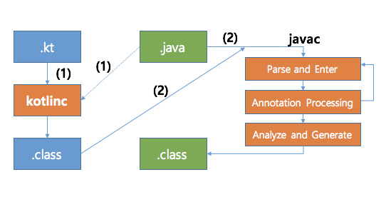

# kotlin이란?

자바 언어를 기반으로, JVM 위에서 동작하는 새로운 프로그래밍 언어이다. intelliJ IDE 로 유명한 JetBrains에서 개발되었다. 웹 프론트, 서버 백 앤드, 안드로이드 네이티브 프로그램을 작성 가능하며, 아직 불완전하지만 Kotlin native 를 통해 JVM없이 실행 가능한 단일 실행 프로그램도 만들 수 있는 언어이다. 
2010년 첫 버전이 등장한 이후로 지속적인 개선과 지원으로 많은 개발자들에게 관심을 받게 된다. 특히나 안드로이드 개발 면에서 자바 6에 대한 갈증을 해소하는 영역에서 많이 쓰인다. 2017년에는 구글 I/O에서 정식으로 코틀린을 안드로이드 개발 언어로 채택하게 되면서 더더욱 성장하는 중인 언어이다. 
## kotlin은 무슨 특징을 갖고 있을까?
- Null 안전성 : kotlin 의 유형 시스템은 null 참조가 역참조 되는 것을 방지한다. 
- 확장 기능 : kotlin을 사용하면 클래스에서 상속하지 않고도 새로운 기능으로 클래스를 확장 하는 기능이 추가되었다. 
- 고차 함수 및 람다 : kotlin 은 고차 함수 및 람다를 지원한다. 
- 데이터 클래스 : 데이터만 포함하는 클래스를 만드는 간결한 방법이 제공된다. 
- 컴패니언 객체 : kotlin은 컴패니언 객체에서 클래스의 정적 멤버를 정의할 수 있다. 
- 객체 지향 : kotlin은 객체 지향과 함수형 프로그래밍 두 가지 방식을 지원한다. 
- kotlin 표준 라이브러리 : kotlin은 풍부한 함수 및 유형 세트가 포함된 표준 라이브러리를 제공한다. 
정리한 내용들은 다소 생략이 많고, 차차 배워야 하는 내용이므로 후에 보다 깊게 알아보고자 한다. 그러나 몇 가지 좀 더 적어보자면...
위에서 언급한 JVM에서 탈피하여 스탠드 얼론으로 동작하는 것은 kotlin/Native  컴파일러로 컴파일 하는 경우를 말한다. LLVM을 기반으로 하며, 이렇게 되면 iOS나 Rasberry Pi 개발도 가능하다고 한다. 해당 내용을 지원하는 플랫폼으로는 macOS, iOS, tvOS, watchOS, Linux, Windows(MinGW), Android NDK 플랫폼이다. 
놀랍게도 자바스크립트로 컴파일되는(!) kotlin/JS, 웹 어셈블리나 멀티 플랫폼 개발이 가능한 kotlin/Multiplatform  등의 프로젝트도 존재한다. 특히 JetBrains에서 공식으로 제작한 코틀린 전용 웹 프레임워크로 ktor이라는 것도 있으며 ORM으로 Exposed, ktorm 도 준비되어 있다. 이러한 점에서 kotlin을 통한 개발 확장성은 상당한 편이다. 
생각보다 안드로이드 앱 개발을 위한 공신 언어라는 이미지가 강하게 굳어져 있긴 했지만 JAVA 와의 호환성 덕분에 Java로 구현된 대부분의 프로젝트에는 혼용이 가능하고, 코틀린의 장점이 차용될만한 프로젝트라면 수정을 통해 혼용이 가능하다. 
기본적인 문법 역시 Scala 2.x와 유사한 데, JetBrains 측에서도 일부 Scala 언어가 가진 암묵성 등의 특징은 빼고 명시성을 넣어 자유도 보다는 빠른 실 사용에 적합하도록 개발한 언어라고 언급하였다. 
# 그렇다면 컴파일은 어떠할까?
우선 코틀린은 기본적으로는 JVM 위에서 돌아가는 정적 타입 프로그래밍 언어라는 점은 명심하자. 정적 타입 언어란 객체의 타입이 컴파일 타임에 결정하는 언어로, 런타임에 메서드의 호출, 안정성 면에서 이점이 있는 언어를 말한다. 
어쨌든, 코틀린은 `*.kt`라는 확장자의 소스코드 파일에서 Java 컴파일 과정과 유사하다. kotlin compiler가 중간 단계의 바이트 코드인 `*.class` 코드로 변환되고 kotlin Runtime Library 에 의존되어 실행되게 된다. 
## Java, Kotlin이 혼재한다면?

기본적으로 Kotlin Compiler가 kt 파일을 컴파일 하는 과정에서 .java 파일도 함께 로드한다. 그리곤 Java의 컴파일러가 바이트코드를 생성한느 과정에서 컴파일 된 kotlin 의 바이트 코드의 경로를 class path에 추가하여 컴파일을 하게 된다. 
이러한 구조를 갖고 있다보니 Java Annotation 프로세서로 생성되는 코드를 사용시에는 문제를 갖고 있다. 왜냐하면 위 과정에서 보듯, Kotlin은 이미 컴파일 된 단계에서 Java 컴파일이 이루어지므로 Annotation Processing 단계에서 생성되는 코드는 Kotlin은 이미 컴파일 된 후이므로 충돌을 발생하게 만드는 것이다. 
이러한 점에서 빌드 순서를 조정하는 식으로도 해결이 가능할 순 있으나, Java 코드에서 Kotlin 코드를 호출 할 수는 없게 된다는 치명적인 단점을 가진다. 그렇기에 실질적으로 모듈 식으로 분리하여 사용하는 것이 현실적인 대안이 될 순 있다. 
## 참고 자료
[Learning Kotlin](https://sungcheol-kim.gitbook.io/learning-kotlin/ch.01)
[Kotlin 소개: 언어 개요](https://wiki.yowu.dev/ko/Knowledge-base/Kotlin/Learning/001-introduction-to-kotlin-an-overview-of-the-language)
[Kotlkin과 Java의 컴파일 순서](https://junuuu.tistory.com/893)
[Kotlin 도입 과정에서 만난 문제와 해결 방법](https://d2.naver.com/helloworld/6685007)
[Kotlin](https://namu.wiki/w/Kotlin)

```toc

```
