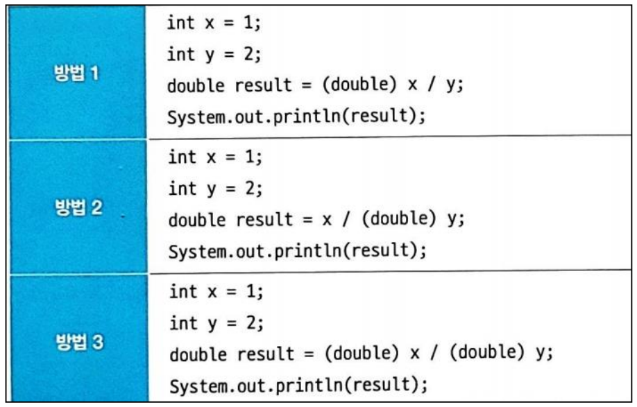
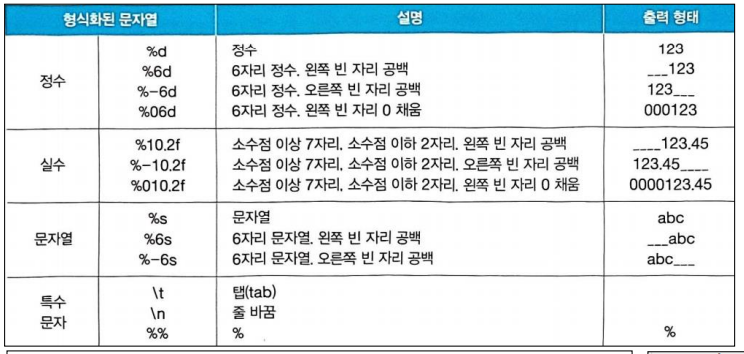
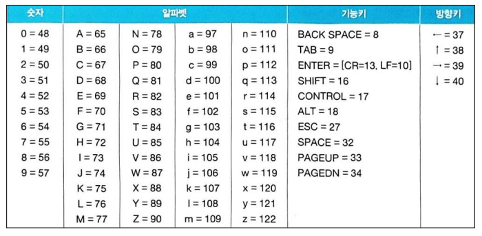

# TIL of Java Spring

본 내용은 Udemy를 통한 학습 내용이다.
복습 및 완벽 정리가 아닌, 핵심이나 놓치지 말 것들 위주의 정리인 만큼, 내용이 온전히 담기진 않는다. 

- - -
## 12강. 실수 연산에서의 자동 타입 변환, + 연산에서의 문자열 자동 타입 변환, 문자열을 기본 타입으로 강제 타입 변환 
### 1. 실수 연산에서의 자동 타입 변환
- 실수 타입의 기본형은 double 이다.
- 따라서 산술 연산식에서 실수 연산이 이루어지면 double 타입으로 자동 타입 변환되어 사용된다. (설령 int 타입 등과 혼합으로 계산이 되어도)
- 만약 정수 타입으로 연산이 반드시 필요하면, double 타입을 강제로 int로 변환해야 한다. 
- 자바에서 소문자 또는 대문자 F가 없는 실수 리터럴을 double 타입으로 해석한다. 따라서 실수 리터럴 등을 연산한 뒤에 float 타입에 저장하면 컴파일 에러가 발생한다. 

- 위 사진을 보면 중요한 부분을 시사 한다. 
	- 방법 1 의 경우 0을 얻는다. 왜냐면 서순 상 x/y가 정수값으로 연산이 먼저 처리 되고 double로 형변환 되기 때문이다. 
	- 따라서 방법 2, 또는 3의 경우 먼저 실수형을 먼저 변환해주는게 존재 하고, 방법 2는 이후 x가 auto casting이 되도록 했으며, 방법 3은 x 조차 수동 casting을 통해 실수 값으로 연산이 되게 했고, 이렇게 해야 실수 값으로 계산된 결과를 얻을 수 있다. 
### 2. + 연산에서의 문자열 자동 타입 변환
- 익히 알듯, 숫자 + 숫자 = 숫자 연산 / 문자열 + 숫자 = 문자열 연산

### 3. 문자열을 기본 타입으로 강제 타입 변환 
```java
String str = "10";
byte value1 = Byte.parseByte(str);
short value2 = Short.parseShort(str);
int value3 = Integer.parseInt(str);
long value4 = Long.parseLong(str);
float value5 = Float.parseFloat(str);
double value6 = Double.parseDouble(str);

String str2 = "true";
boolean value7 = Boolean.parseBoolean(str);

// NumberFormatException 은 문자열에 숫자만 있지 않고 다른 값들이 석여 있을 경우 
String str3 = "1a";
int value8 = Integer.parseInt(str3); // ErrorException
```

```Java
int value1 = "30";
String str = String.valueOf(value1);
System.out.println(str); // 문자열로 정수값 수정
```

## 13강. 실수 연산에서의 자동타입 변환, + 연산에서의 문자열 자동 타입 변환, 문자열을 기본 타입으로 강제 타입 변환 
- 실습 강좌이므로 스킵

## 14강. 변수와 시스템 입출력
### 1. 모니터로 변수 값 출력하기
- 기본적으로 아는 내용 그대로이므로, 형식화된 문자열 출력 방법만 정리한다. 

### 2. 키보드에서 입력된 내용을 변수에 저장하기
```java
int keycode = System.in.read();
// 키보드 입력 코드를 int 변수로 저장이 가능하다. 
// 원시적인 방법
```


```Java 
public static void main(String[] args) throws Exception {
	int keycode = 0;
	keycode = System.in.read();
	System.out.println("keycode: " + keycode);
	// window 의 경우 enter 를 누르면 CR(13) + LF(10) 두개의 키가 추가로 입력된다. 
	keycode = System.in.read();
	System.out.println("keycode: " + keycode);
	keycode = System.in.read();
	System.out.println("keycode: " + keycode);
}
```

```Java
public static void main(String[] args) throws Exception {
	int keycode = 0;

	while(true) {
		keycode = System.in.read();
		System.out.println("keycode: " + keycode);
		if (keycode == 113)
			break ; // keycode 113이면 값을 계속 입력 받지 않는다. 
	}
}
// 본 방식은 키 입력 하나씩만을 읽으므로 동시입력에 대해서는 읽지 못한다. 
// 이러한 단점 해결을 한 것이 Scanner 클래스이다. 
```

```Java
public static void main(String[] args) throws Exception {
	Scanner scanner = new Scanner(System.in); // 값 읽기

	String inputData = scanner.nextLine(); // 값 변수에 저장
	scanner.close(); // 리소스 닫기 
}
```

```Java
public static void main(String[] args) throws Exception {
	// 문자열을 지속적으로 받는 구조
	Scanner scanner = new Scanner(System.in);
	
	while(true){
		System.out.print("문자열을 입력하세요: ");
		inputData = scanner.nextLine();
		System.out.println("입력된 문자열: \"" + inputData + "\"");
		if (inputData.equals("q"))
			break;
	}
	System.out.println("종료")
	scanner.close();
}
```

```toc

```
