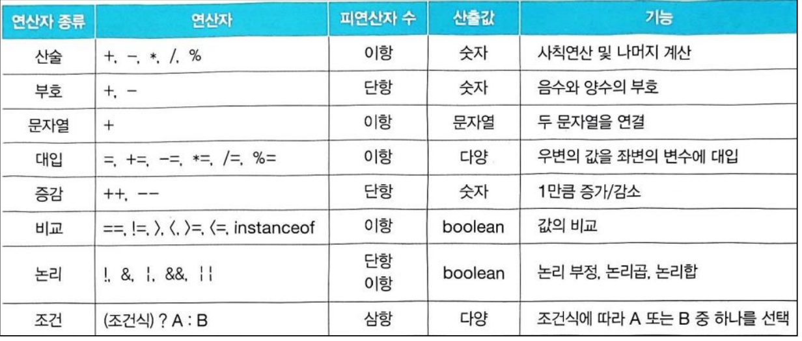
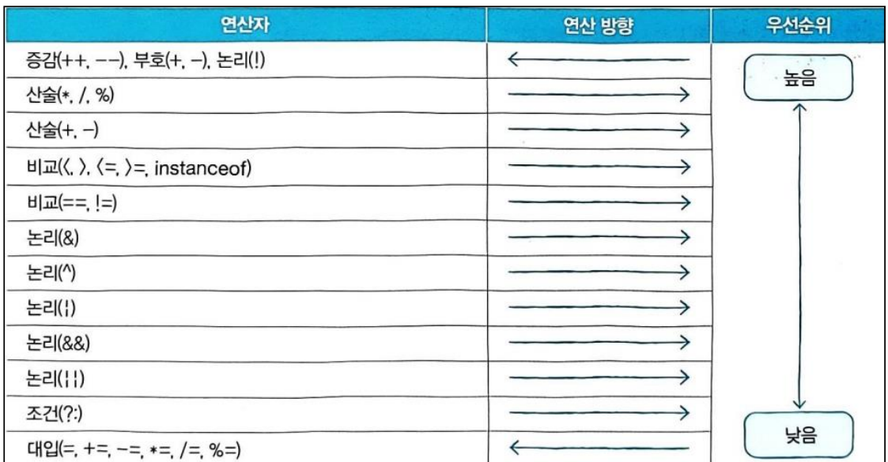
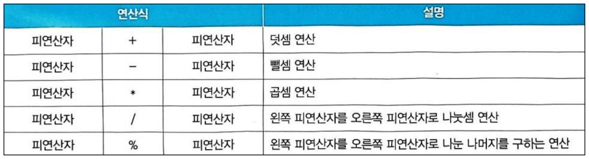
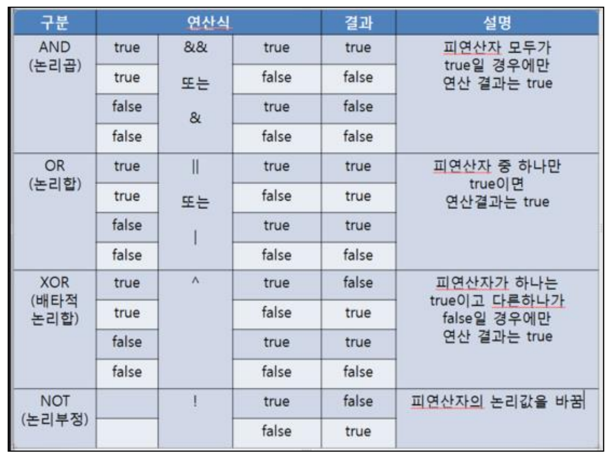

# TIL of Java Spring

본 내용은 Udemy를 통한 학습 내용이다.
복습 및 완벽 정리가 아닌, 핵심이나 놓치지 말 것들 위주의 정리인 만큼, 내용이 온전히 담기진 않는다. 

- - -
## 15강. printf() 사용법, system.in.read() 사용법, Scanner 클래스의 여러 메소드 사용법 

### printf 사용법 정리
Java의 `printf` 메소드는 출력 형식을 지정할 때 사용되며, `System.out` 객체를 통해 콘솔에 텍스트를 출력하는데 유용합니다. 여기서 핵심 포인트를 세 가지로 정리됨

1. **기본 사용법**: `printf`는 포맷 지정자를 사용하여 변수의 값을 문자열로 변환하고, 지정된 형식에 맞춰 출력한다. 기본 구조는 `System.out.printf("형식 문자열", 객체1, 객체2, ...);` 이다 

2. **포맷 지정자**: 포맷 지정자는 `%` 기호로 시작하며, 출력할 데이터의 타입과 형식을 지정한다. 예를 들어, `%d`는 정수를, `%s`는 문자열을 나타낸다. 정밀도, 폭, 사용할 공간, 숫자 형태 등을 세밀하게 조정할 수 있다

3. **예시**:
    - 정수 출력: `System.out.printf("%d", 101);` → 101
    - 소수점 아래 두 자리까지 출력: `System.out.printf("%.2f", 123.4567);` → 123.46
    - 문자열 및 숫자 혼합 출력: `System.out.printf("이름: %s, 나이: %d", "자비스", 5);` → 이름: 자비스, 나이: 5

`printf` 사용 시, 출력 포맷을 세밀하게 제어할 수 있어 복잡한 데이터를 사용자가 읽기 쉬운 형식으로 표현할 때 매우 유용하다. 포맷 지정자를 적절히 활용하면 다양한 출력 형식을 손쉽게 만들 수 있다.

Java에서 `printf` 메소드와 유사한 기능을 제공하는 다른 방법들 

1. **`String.format()`**: `printf`와 동일한 포맷 지정자를 사용하여 문자열을 형식화할 수 있다. 차이점은 이 메소드가 포맷된 문자열을 반환한다는 것이며, 이를 출력하려면 반환된 문자열을 `System.out.println()`을 통해 출력해야 한다. 이 방법은 문자열을 직접 조작하거나 다른 곳에서 사용해야 할 때 유용하다.

2. **`MessageFormat` 클래스**: 복잡한 메시지 포맷을 다룰 때 사용할 수 있는 클래스다. 위치 지정자와 패턴을 사용하여 국제화 및 지역화가 가능한 메시지를 생성할 수 있다. 이는 `printf`보다 더 유연한 메시지 형식을 제공하며, 다국어 애플리케이션 개발에 적합하다.

3. **`DecimalFormat` 클래스**: 숫자 형식을 지정할 때 사용된다. `printf`의 숫자 관련 포맷 지정자 기능을 확장하여, 소수점 표현, 그룹화, 퍼센트 표시 등 다양한 숫자 형식을 제어할 수 있다. 숫자를 형식화하는 데 있어서 보다 세밀한 제어가 필요할 때 유용하다.

### System.out 에 존재하는 표준 출력 스트림 주요 메서드 정리 

1. **`print()`**: 괄호 안에 있는 데이터를 그대로 출력한다. 문자열, 숫자, 다른 데이터 타입들을 인자로 받을 수 있으며, 데이터를 출력한 후에는 줄 바꿈을 하지 않는다.

2. **`println()`**: `print()` 메서드와 유사하게 작동하지만, 데이터 출력 후 자동으로 줄 바꿈을 한다. 이는 출력을 보다 정돈된 형태로 만들기 위해 자주 사용된다.

3. **`printf()`**: 형식화된 출력을 위해 사용됩니다. C언어의 `printf` 함수와 유사하게, 포맷 지정자를 사용하여 변수의 값을 문자열 형태로 변환하고, 지정된 형식에 맞춰 출력한다.

4. **`format()`**: `printf()`와 기능적으로 동일하며, 형식화된 문자열을 출력하는 데 사용된다. 이름만 다를 뿐, 사용법과 결과는 `printf()`와 같다.

5. **`write()`**: 바이트나 바이트 배열을 출력 스트림에 쓴다. 이 메서드는 주로 바이너리 데이터를 처리할 때 사용된다.

6. **`flush()`**: 출력 버퍼를 강제로 비우는 데 사용된다. 버퍼링된 모든 출력 데이터가 즉시 대상에 쓰여지도록 한다. 일반적으로 버퍼링을 사용하는 스트림에서 출력을 즉각 반영하고 싶을 때 사용된다.

7. **`close()`**: 스트림을 닫습니다. 더 이상의 쓰기 작업이 불가능하게 되며, 모든 시스템 자원이 해제된다. `System.out`을 닫는 것은 일반적으로 권장되지 않으며, 프로그램의 다른 부분에서 표준 출력이 필요할 때 문제를 일으킬 수 있다.

8. **`checkError()`**: 출력 중 오류가 발생했는지 확인한다. 오류가 발생하면 true를, 그렇지 않으면 false를 반환한다. 이는 출력이 성공적으로 이루어졌는지 간단히 확인할 때 유용하다.

이 메서드들은 표준 출력을 다루는 데 필수적이며, 텍스트 데이터를 콘솔에 출력하거나 간단한 로그를 남기는 등의 작업에 주로 사용된다. `PrintStream` 클래스는 텍스트 출력에 최적화되어 있으며, 바이너리 데이터를 다루려면 `OutputStream` 클래스 또는 그 서브 클래스를 사용하는 것이 좋다.

### System.in.read()
`System.in`은 Java에서 표준 입력 스트림을 대표하는 `InputStream`의 인스턴스다. 사용자의 입력을 받아들이는 데 사용되며, 주로 키보드 입력을 처리하는 데 사용된다. `InputStream` 클래스는 바이트 기반 입력 스트림의 기본 클래스이며, `System.in`을 통해 제공되는 주요 메서드들은 다음과 같습니다:

1. **`read()`**: 입력 스트림에서 데이터를 읽는다. 이 메서드는 호출될 때마다 입력 스트림에서 다음 바이트를 읽어 정수 형태로 반환한다. 파일의 끝에 도달하거나 스트림이 끝나면 `-1`을 반환한다. 이 메서드는 한 번에 한 바이트씩 읽기 때문에 문자 데이터를 처리할 때는 적합하지 않을 수 있다.

2. **`read(byte[] b)`**: 입력 스트림에서 바이트 배열 `b`의 길이만큼 데이터를 읽고, 읽은 바이트 수를 반환한다. 이 방법은 여러 바이트를 한 번에 읽을 수 있어 효율적이다.

3. **`read(byte[] b, int off, int len)`**: 입력 스트림에서 최대 `len` 길이의 데이터를 읽어 바이트 배열 `b`에 저장한다. `off`는 데이터를 저장할 배열의 시작 인덱스를 지정한다. 읽은 바이트 수를 반환하며, 스트림의 끝에 도달하면 `-1`을 반환한다.

4. **`skip(long n)`**: 입력 스트림에서 `n` 바이트를 건너뛰고, 실제로 건너뛴 바이트 수를 반환한다. 이 메서드는 데이터 스트림 내에서 특정 위치로 이동할 때 사용할 수 있다.

5. **`available()`**: 읽을 수 있는 바이트 수를 반환한다. 이 메서드는 입력 스트림에서 즉시 읽을 수 있는 바이트 수를 알려주며, 블로킹 없이 읽기 작업을 수행할 수 있는지 여부를 판단하는 데 사용할 수 있다.

6. **`close()`**: 입력 스트림을 닫는다. 스트림을 닫은 후에는 더 이상 읽기 작업을 수행할 수 없으며, 시스템 자원이 해제된다. 하지만 `System.in`을 직접 닫는 것은 일반적으로 권장되지 않는다. 프로그램의 다른 부분에서 표준 입력이 필요할 때 문제를 일으킬 수 있기 때문이다.

`System.in`은 주로 바이트 단위로 입력을 처리한다. 텍스트 입력을 처리하기 위해서는 `InputStreamReader`와 `BufferedReader`와 같은 래퍼 클래스를 함께 사용하는 것이 일반적이다. 예를 들어, `BufferedReader`를 사용하여 한 줄 씩 입력을 읽는 것은 문자열 처리에 매우 흔하고 유용한 방법이다.

### 자바는 클래스 단위 언어인데, 바이트 단위로 시스템 입출력을 쓰는게 맞을까? 적절한 방법인가?

Java에서 바이트 단위 또는 `int` 단위로 입력을 받는 것이 권장되는지 여부는 사용하는 상황과 필요한 처리의 성격에 따라 달라진다. Java의 설계 철학과 편의성, 유연성, 안정성을 고려할 때 몇 가지 관점으로 이러한 부분을 살펴볼 수 있다. 

1. **저수준 입력 처리**: 바이트 단위 또는 `int` 단위로 데이터를 읽는 것은 파일이나 네트워크 스트림으로부터 바이너리 데이터를 처리할 때 필요할 수 있다. 이런 경우에는 `InputStream`의 메서드들이 직접 사용되며, 이는 Java에서도 완전히 지원되는 접근 방식이고 문제도 없다.

2. **고수준 추상화**: Java는 객체 지향 프로그래밍 언어로, 안전성과 코드의 가독성, 재사용성을 높이기 위해 래퍼 클래스나 스트림 API와 같은 고수준의 추상화를 권장하는 것은 분명한 사실이다. 예를 들어, 텍스트 입력을 처리할 때는 `Scanner` 클래스나 `BufferedReader`를 사용하여 입력을 `String`이나 다른 래퍼 타입으로 쉽게 변환하는 것이 좋다. 이러한 방법은 코드를 더 이해하기 쉽고 오류를 줄일 수 있다.

3. **타입 안전성과 유연성**: 래퍼 클래스나 고수준 스트림 API를 사용하는 것은 타입 안전성과 유연성을 제공한다. 이는 Java의 강타입 언어로서의 특성을 활용하는 것으로, 실행 시간에 타입 오류를 방지하고, 다양한 유틸리티 메서드와 함께 쉽게 데이터를 처리할 수 있게 해준다.

결론적으로, Java에서는 저수준의 바이트 또는 `int` 단위 입력 처리가 필요한 경우가 있을 수 있으며 이에 대한 준비는 되어 있다. 하지만 대부분의 애플리케이션 개발에서는 고수준의 추상화와 라이브러리를 활용하는 것이 Java의 철학과 추상화, 다양한 클래스 자체가 가지고 있는 안전성과 유연성을 고려할 필요가 있고, 충분하다. 

### Scanner 클래스 
`Scanner` 클래스는 Java의 `java.util` 패키지에 포함되어 있으며, 다양한 입력 소스로부터 텍스트를 스캔하고 해석하는 데 사용된다. 키보드 입력, 파일, 문자열 등에서 데이터를 읽기 위한 메서드를 제공한다. 사용자로부터 텍스트 입력을 받거나 파일을 읽을 때 특히 유용하다.

- **기본 생성자와 메서드**: `Scanner` 객체는 `System.in`, 파일, `String` 등 다양한 입력 소스로부터 생성될 수 있다. 예를 들어, `new Scanner(System.in)`은 사용자의 키보드 입력을 받기 위해 사용된다.

- **데이터 읽기**: `Scanner` 클래스는 `nextInt()`, `nextDouble()`, `nextLine()` 등의 메서드를 제공하여 다양한 타입의 데이터를 읽는다. 이 메서드들은 입력된 데이터를 각각의 타입으로 파싱하여 반환한다.

- **패턴과 구분자 사용**: `Scanner`는 정규 표현식을 사용하여 입력을 특정 패턴에 따라 분할할 수 있다. `useDelimiter(String pattern)` 메서드를 사용하여 입력 데이터를 분할하는 기준(구분자)을 설정할 수 있다. 이 기능은 데이터가 특정 형식으로 입력될 때 유용하다.

- **입력 검사**: `hasNext()`, `hasNextInt()`, `hasNextDouble()` 등의 메서드를 사용하여 다음 입력이 특정 타입의 데이터인지 미리 확인할 수 있다. 이는 입력 오류를 방지하고 보다 안정적인 입력 처리를 가능하게 한다.

`Scanner` 클래스는 사용하기 쉽고 다양한 입력 소스를 지원하기 때문에 Java에서 입력을 처리하는 가장 일반적인 방법 중 하나다. 그러나 대량의 데이터를 처리하거나 고성능이 요구되는 애플리케이션에서는 다른 입출력 클래스를 고려하는 것이 좋을 수 있다.

## 16강. 연산자와 연산식 연산의 방향과 우선순위, 단항 연산자

### 연산자와 연산식 
- 연산자 : 연산에 사용되는 표시나 기호 
- 피연산자 : 연산되는 데이터를 말한다. 
- 연산식 : 연산자와 피연산자의 모음 



### 연산의 방향과 우선순위 



## 17강. 증감 연산자, 논리 부정 연산자, 이항 연산자-산술연산자

### 증감 연산자
- 전위와 후위가 있다. 알다시피 앞에 올 때는 값에 증감 처리 후 다른 연산이 이루어지며, 후위일 경우 다른 연산이 모두 마무리 되고 증감이 발생한다. 
### 논리 부정 연산자(!)
- True -> False, False -> True로 만드는 연산자

### 이항 연산자 - 산술 연산자 


- 피 연산자들 타입이 다른 경우에 따라 연산의 타입을 변환하고 연산이 되는 것을 기억해두자 
	- byte, short, char -> int 타입으로 바뀐 후 연산된다. 
	- long타입이 있는 정수 연산 -> long 타입으로 바뀐 후 연산된다. 
	- 실수 타입이 있으면 -> 허용 범위가 큰 실수 타입으로 변환된 후 연산된다 

## 18강. 부호 연산자(+, -), 증감 연산자, 논리 부정 연산자 
- 실습

## 19강. 비교 연산자, 논리 연산자, 대입 연산자, 삼항 연산자

### 이항 연산자 - 비교 연산자
- 우리가 너무 잘 아는 그거 그대로~
- double 0.1 과 float 0.1f는 표현 방식이 다르므로 같다고 볼 수 없다. 따라서 같은 타입으로 변경해야 정확한 비교가 가능해진다. 
- String 문자열의 경우 동등 비교 연산자를 활용할 경우, 객체이므로 주소값이 같은지 여부를 판단하는 꼴이 된다. 따라서 내용 자체의 같음 여부는 `.equals()` 메소드를 써서 비교해야 한다. 

### 이항 연산자 - 논리 연산자 

- & 와 && 는 산출 결과는 같지만, 연산과정이 다르다. &&는 피 연산자가 Flase 라면 뒤의 피연산자의 결과를 고려하지 않고 바로  False 를 반환한다. 그러나 &는 양쪽을 다 검토하고난 뒤에 비로소 결과를 반환하므로 성능적으로 효율적인 것은 && 라 할 수 있다.
- || 또한 &&와 똑같은 연산 방식으로 이해하면 된다. 
### 대입 연산자
- 우리가 아는 그것 그로

### 삼항 연산자 
- 우리가 아는 그것 그대로
## 20강. 산술 연산자, 비교 연산자, 논리 연산자, 대입 연산자, 삼항 연산자 
- 실습 

```toc

```
