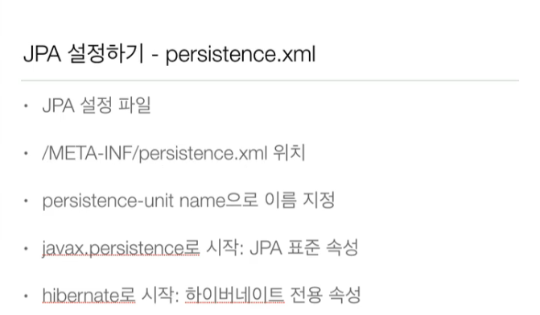
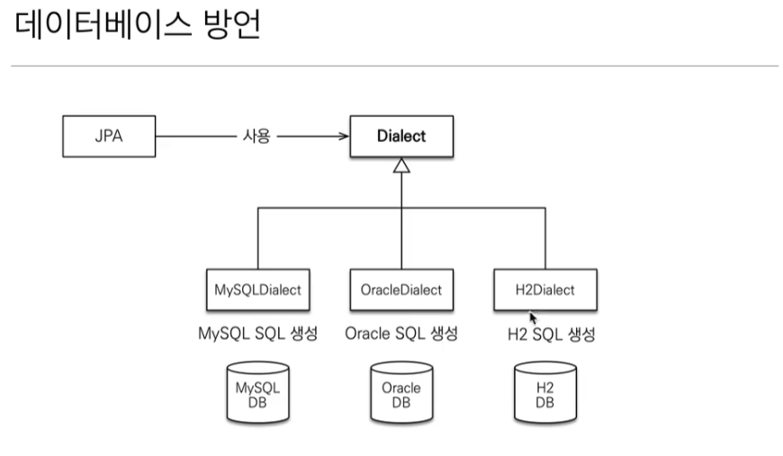

# 자바 ORM 표준 JPA 프로그래밍 - 기본편 
자바에 다양한 것들이 있겠지만 SQL 을 이해하고 JPA 활용도를 높이기 위해 해당 내용을 우선적으로 강의를 듣고 정리해보고자 한다. 

## Hello JPA - 프로젝트 생성 
1. 프로젝트 생성, 옛날엔 좀 그랬으나 지금은 intelliJ 를 활용해서 편하게 할 것 
2. h2 가 연습용으론 좋다 
3. 빈 프로젝트를 생성하고, hibernate, h2 database driver를 설치한다. 이때 기존의 강좌와는 다르게 작성해야 한다. 더불어 사용 시 spring boot 를 사용하는 만큼 스프링부트 기반으로 버전 관리를 해주면 좋다.
	```xml
	<?xml version="1.0" encoding="UTF-8"?>
<project xmlns="http://maven.apache.org/POM/4.0.0"
         xmlns:xsi="http://www.w3.org/2001/XMLSchema-instance"
         xsi:schemaLocation="http://maven.apache.org/POM/4.0.0 http://maven.apache.org/xsd/maven-4.0.0.xsd">
    <modelVersion>4.0.0</modelVersion>

    <groupId>jpa-basic</groupId>
    <artifactId>ex1-hello-jpa</artifactId>
    <version>1.0.0</version>

    <properties>
        <maven.compiler.source>21</maven.compiler.source>
        <maven.compiler.target>21</maven.compiler.target>
        <project.build.sourceEncoding>UTF-8</project.build.sourceEncoding>
    </properties>
    <dependencies>
        <dependency>
            <groupId>org.hibernate</groupId>
            <artifactId>hibernate-core</artifactId>
            <version>6.4.4.Final</version>
        </dependency>

        <dependency>
            <groupId>com.h2database</groupId>
            <artifactId>h2</artifactId>
            <version>2.2.224</version>
        </dependency>
    </dependencies>

</project>
	```
4. JPA 설정하기 - persistence.xml 
   강좌에선 maven을 쓰다보니 애매한감이 있지만 일단 배워둔다. 
5. 데이터베이스 방언 
   - JPA 는 특정 데이터베이스에 종속 X
   - 각각의 데이터베이스가 제공하는 SQL 문법과 함수는 조금씩 다름 
	   - 가변문자 : MySQL 은 VARCHAR, Oracle 은 VARCHAR2
	   - 문자열 자르는 함수 : SQL 표준은 SUBSTRING(), Oracle은 SUBSTR()
	   - 페이징 : MySQL 은 LIMIT, Oracle 은 ROWNUM
   - 방언 : SQL 표준을 지키지 않는 특정 데이터베이스 만의 고유의 기능
     

```toc

```
