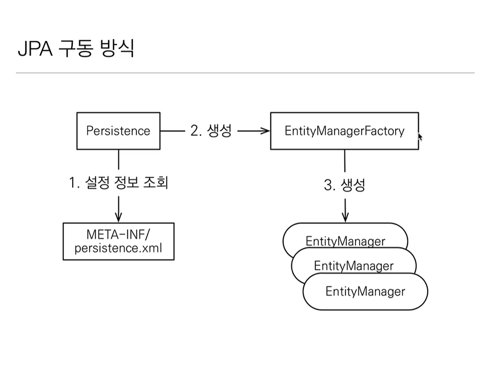

# 자바 ORM 표준 JPA 프로그래밍 - 기본편 
## Hello JPA - 애플리케이션 개발


### 주의 
1. Entity Manager 는 하나만 생성해서 애플리케이션 전체에서 공유한다. 
2. Entity Manager 는 thread 간의 공유가 아니라, 사용하고 버리는 구조다
3. <mark style="background: #FFB8EBA6;">JPA의 모든 데이터 변경은 트랜잭션 안에서 실행된다.</mark>
4. 위의 내용 덕분에 데이터의 트랜잭션 사이에서 데이터 객체는 변동 사항이 발생하면 자동으로 알아서 데이터의 변화를 저장하고 반영이 된다. 

### JPQL 소개 
- JPA 를 사용하면 Entity 객체 중심의 개발이 가능해진다.
- 기본적인 데이터의 탐색은 Entity Manager를 활용해도 된다. 
- 하지만 JPA 에서 디테일하게 검색을 하기 위한 방식은? 
- 모든 DB 데이터를 객체로 변환해서 검색하는 것은 불가능
- JPQL은 테이블이 아닌 객체를 대상으로 검색하는 객체 지향 쿼리로 기존의 쿼리와는 약간 다르다. 
	- SQL 에 의존적이지 않음
	- 이후 뒤에서 자세히 배울 예정 

```toc

```
