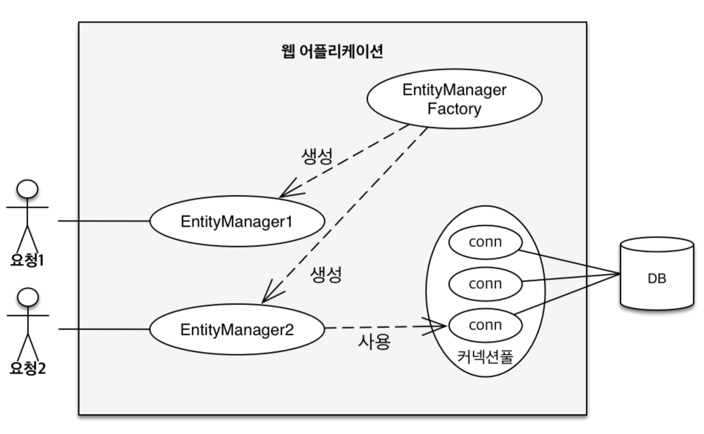
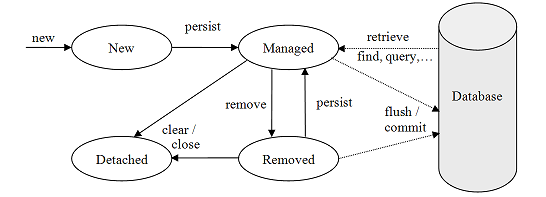
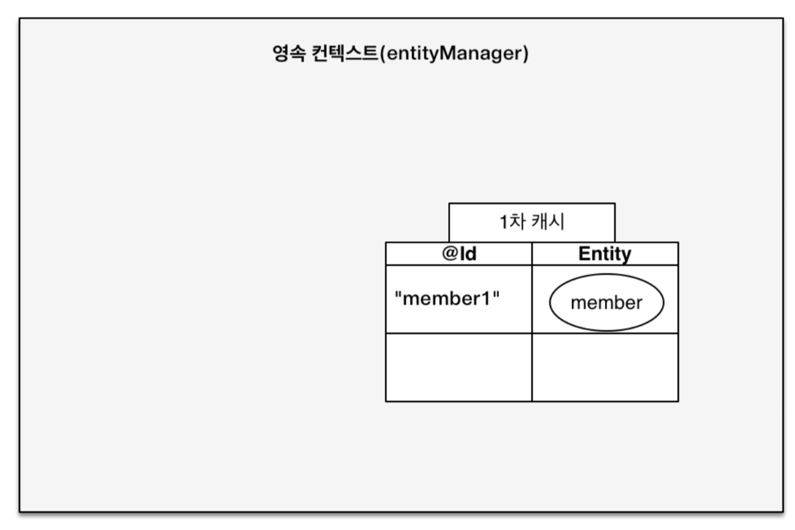
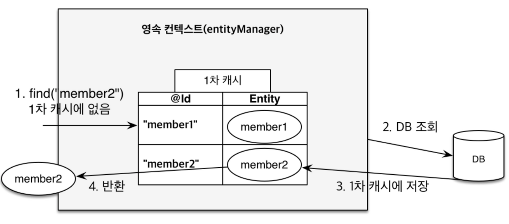
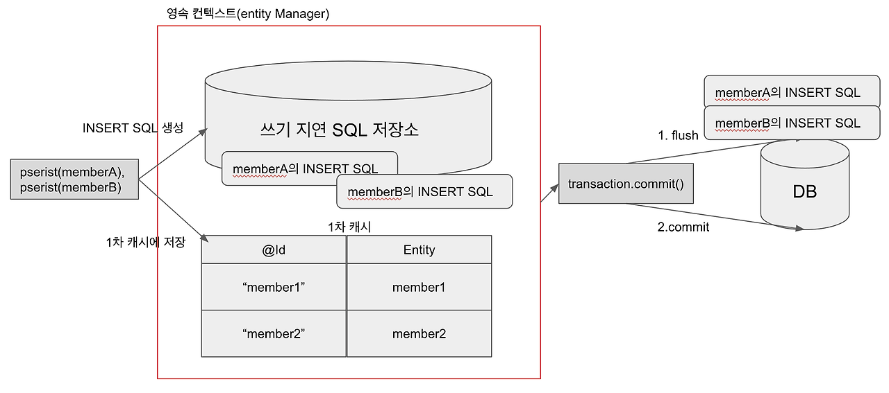
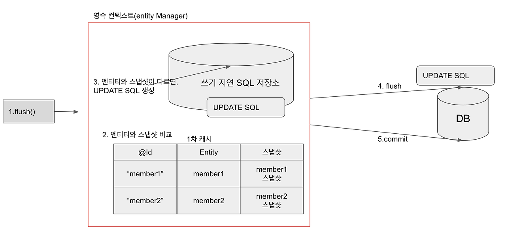

# 자바 ORM 표준 JPA 프로그래밍 - 기본편
## 영속성 컨텍스트(1)  
### JPA에서 가장 중요한 2가지 
1. 객체와 관계형 데이터베이스 매핑하기(Object Relational Mapping)
2. 영속성 컨텍스트 
### Entity Manager Factory, Entity Manager 

### 영속성 컨텍스트
- JPA를 이해하는데 가장 중요한 용어 
- 엔티티를 영구 저장하는 환경이라는 의미를 가진다. DB와 관련이 있으면서도 없다.
- `EntityManager.persist(entity)`
- 영속성 컨텍스트는 일종의 논리적 개념으로, manager를 통해서 접근이 가능해진다. 
- J2SE 환경 
	- Entity Manager 와 영속성 컨텍스트는 1:1로 생성이 된다. 
- J2EE, Spring 프레임워크와 같은 컨테이너 환경 
	- Entity Manager 와 영속성 컨텍스트는 N:1 의 관계를 가진다. 
### Entity 의 LifeCycle
- DB에서 가져오는 객체 Entity 는 나름의 생명 주기를 갖고 있다. 
- 비영속성(new / transient) : 영속성 컨텍스트와 전혀 관계가 없는 새로운 상태
- 영속(managed) : 영속성 컨텍스트에서 관리되고 있는 상태
- 준영속(detached) : 영속성 컨텍스트에 저장되었다가 분리된 상태
- 삭제(removed) : 삭제된 상태

### new / transient(비영속)
```java
// 객체를 생성한 상태(비영속)
Member member = new Member();
member.setId(1L);
member.setUsername("회원1");
```

### managed(영속)
```java
// 객체를 생성한 상태(비영속)
// 사실 이름만 붙였지 아무 상태도 아닌 상태나 마찬가지다.
Member member = new Member();
member.setId(1L);
member.setUsername("회원1");

EntityManager em = emf.createEntityManager();
em.getTransaction().begin();

// 객체를 저장한 상태(영속)
// 여기서부터 관리가 들어가고, 단, 해당 상태가 되었다고 DB에 저장되는게 아니다. 
em.persist(member);
// transaction 이 commit되는 시점에 쿼리가 DB로 날아가게 된다. 
```

### detatch, remove
```java
// 객체를 생성한 상태(비영속)
Member member = new Member();
member.setId(1L);
member.setUsername("회원1");

EntityManager em = emf.createEntityManager();
em.getTransaction().begin();

// 객체를 저장한 상태(영속)
em.persist(member);

// 강제로 영속성 상태에서 빼버린다. 
em.detatch(memver);

// DB에 실제로 데이터 자체를 삭제를 요청한다. 
em.remove(member);
```

### 영속성 컨텍스트의 이점 
지금까지 내용을 통해 알 수 있듯 DB와 실제 동작하는 어플리케이션 사이에 중간 계층의 느낌으로 영속성 컨텍스트는 존재한다. 그렇다면 무엇이 이점이 되는가?
1. 1차 캐시
2. 동일성(identity) 보장
3. 트랜잭션을 지원하는 쓰기 지연(transactional write-behind)
4. 변경감지(Dirty Checking)
5. 지연 로딩(Lazy Loading)

## 영속성 컨텍스트(2) 
### Entity 조회, 1차 캐시

사실상 1차 캐시가 영속성 컨텍스트라고 봐도 무방한데, 핵심은 EntityManager에서 persist 를 요청한 순간 위의 이미지 처럼 생성 된다는 점이다. 


이때 해당하는 내용을 요청하면, 영속성 컨텍스트를 1차 캐시처럼 사용하여 우선적으로 컨텍스트 내부를 뒤지게 된다. 
```java
// 객체를 생성한 상태(비영속)
Member member = new Member();
member.setId(1L);
member.setUsername("회원1");

EntityManager em = emf.createEntityManager();
em.getTransaction().begin();

// 객체를 저장한 상태(영속) - 1차 캐시에 저장됨
em.persist(member);

// 1차 캐시에서 조회
Member findMember = em.find(Member.class, "회원1");
// 1차 캐시에 없는 값을 조회하면?
Member findMember2 = em.find(Member.class, "회원2");
```
그런데 이때, 1차 캐시 즉, 영속성 컨텍스트에서 관리 중이지 않은 값도 요청을 받게 되면, 이때는 위의 그림처럼 DB에서 값을 받아오고 다시 영속성 관리로 들어가게 하여 캐싱의 역할을 수행하게 되는 것이다. 

그러나 이러한 형태가 되더라도 결국 <mark style="background: #FFB8EBA6;">트랜잭션의 사이에서 일어나는 캐싱</mark>이므로, 실질적으로 많은 양의 데이터를 오고가는 형태가 아닌 이상은 그렇게 성능적인 이점이 있는 구조는 아니다. 하지만 반대로 대용량 처리가 이루어진다고 한다면 이점은 갖춘다고 볼 수 있겠다. 

사실상 그렇기에, 이러한 영속성 컨텍스트의 1차 캐싱이 주는 성능적 이점보단 이러한 철학적 스텐스가 제공해주는 이점들이 두드러지고, 이러한 점을 이해하고 설계한 구조가 유의미할 수 있다.

### 영속성 Entity의 동일성 보장 
```java
Member a = em.find(Member.class, "member1");
Member b = em.find(Member.class, "member1");

System.out.println(a == b); // 동일성 비교 true
```
1차 캐시로 반복 가능한 읽기 등급(REPEATABLE READ)의 트랜잭션 격리 수준을 DB가 아닌 애플리케이션 차원에서 제공한다. 

즉, DB까지 내려가서 해당 Entity의 동일 여부를 탐색하지 않고, 영속성 컨텍스트 내부, Java의 특성을 활용한 동일성 보장을 구현할 수 있는 것이다. 

### 트랜잭션을 지원하는 쓰기 지연(Entity Regist)
```java
EntityManager em = emf.createEntityManager();
EntityTransaction transaction = em.getTransaction();
// 트랜잭션 시작
transaction.begin(); 

em.persist(memberA);
em.persist(memberB);
// 여기까지 INSERT SQL 이 보내지지 않고 대기한다. 

// 커밋의 순간 데이터베이스에 INSERT SQL을 보낸다. 
transaction.commit();
```

JPA 는 persist 요청과 함께 영속성 컨텍스트에서 관리하는 Entity 가 생성되면, 그와 동시에 쓰기 지연 SQL 저장소에 Insert 를 함으로써 우선 DB까지 가지 않고 쌓아둔다. (반복됨)

이후, transaction이 commit 이 되는 순간 쓰기 지연 SQL 저장소 쌓인 것들을 한꺼번에 `flush` 가 되면서 실제 `commit` 이 동작하게 된다. 

이렇게 관리해주는 것은 최적화 성능 면에서 이점이 있고, 그러나 MyBatis등을 활용하여 수동으로 SQL을 보낸다고 한다면 JPA가 제공해주는 최적화를 스스로 구현해야 한다.

### Dirty Checking(Modifying Entity)
```java
EntityManager em = emf.createEntityManager();
EntityTransaction transaction = em.getTransaction();
// 트랜잭션 시작
transaction.begin(); 

// 영속 엔티티 조회
Member memberA = em.find(Member.class, "memberA");

// 영속 엔티티 데이터 수정
memberA.setUsername("member-new-name");
memberA.setAge(10);

// em.update(member) 이런 코드가 있어야 할것 같으나.. 없어도 된다. 

transaction.commit();
```
레퍼런스 구조로 영속성으로 이미 데이터는 영속성 컨텍스트 안에서 존재한다.

또한 이때 값을 가지고 있던 최초의 snapshot 을 보관해두고 있는다. 

그 뒤에 값이 커밋되는 시점에 JPA가 Dirty Checking 을 전체 Entity에 실행하고, commit 전에 flush를 진행하여 DB에 이를 반영한다.



### remove Entity
```java

EntityManager em = emf.createEntityManager();
 
em.remove(member); // 엔티티 삭제
```
위의 구조처럼 Lazy하게 commit 시점에 일괄적으로 작동한다. 

```toc

```
