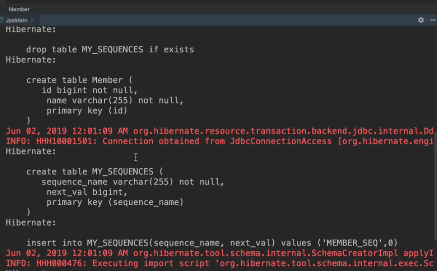
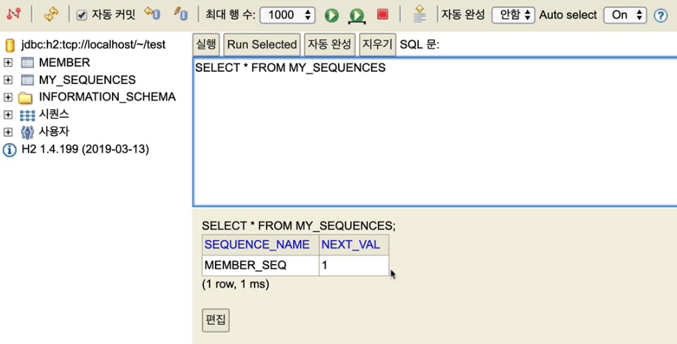
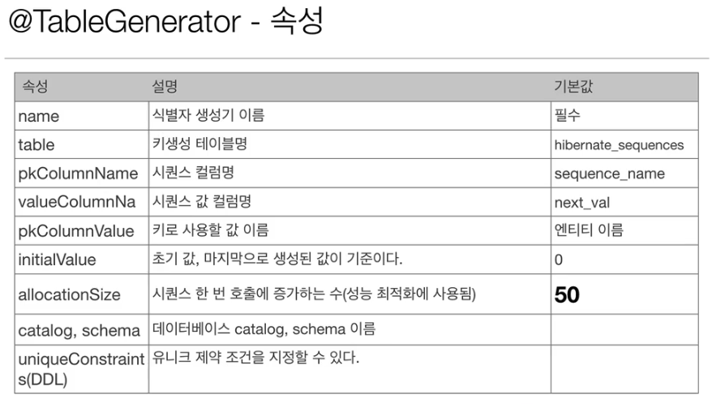

# 자바 ORM 표준 JPA 프로그래밍 - 기본편
## 준영속 상태
### 준영속
- 영속 -> 준영속 
- 영속 상태의 Entity가 영속성 컨텍스트에서 분리(detached)
- 영속성 컨텍스트가 제공하는 기능을 사용하지 못하는 상태를 의미한다. 

### 준영속 상태로 만드는 방법
- `em.detach(entity)` : 특정 Entity 만 준 영속상태로 전환한다. 
- `em.clear()` : 영속성 컨텍스트를 완전히 초기화 한다. 
- `em.close` : 영속성 컨텍스트를 종료 시킨다. 

## Entity Mapping : 객체와 테이블 매핑 
### Entity 매핑 소개
- 객체와 테이블 매핑 : @Entity, @Table
- 필드와 컬럼 매핑 : @Column
- 기본 키 매핑 : @Id
- 연관관계 매핑 : @ManyToOne, @JoinColumn
### @Entity
- JPA가 관리하며 entity  라고 부른다. 
- JPA 를 사용해서 테이블과 매핑할 클래스는 @Entity 가 필수로 붙어야 한다. 
- 주의사항 
	- 기본 생성자 필수(파라미터가 없는 public 또는 private 생성자)
	- final 클래스, enum, interface, inner 클래스 사용할 수 없다. 
	- 저장할 필드에 final 사용할 수 없다. 
### @Table
- Entity 와 매핑할 테이블을 수동으로 지정해줄 수 있다. (@Entity 로만 하며 자동 생성됨)

| *속성*                         | *기능*                    | *기본값*     |
| -------------------------- | --------------------- | ------- |
| name                       | 매핑할 테이블 이름            | 엔티티의 이름 |
| catalog                    | 데이터 베이스 catalog 매핑    |         |
| schema                     | 데이터 베이스 schema 매핑     |         |
| uniqueConstraints<br>(DDL) | DDL 생성 시 유니크 제약 조건 생성 |         |

## Entity Mapping : 데이터베이스 스키마 자동 생성 
### 데이터베이스 스키마 자동 생성 
- DDL을 애플리케이션 실행 시점에 자동 생성 
- 테이블 중심 -> 객체 중심 
- 데이터 베이스 방언을 활용해서 데이터 베이스에 맞는 적절한 DDL 생성 
- 이렇게 생성된 DDL은 개발 장비에서만 사용 
- 생성된 DDL은 운영섭에서는 사용하지 않거나, 적절히 다듬은 후 사용할 것 

### 데이터 베이스 스키마 자동 생성 - 속성 
`hibernate.hbm2ddl.auto`

| 옵션          | 설명                                 |
| ----------- | ---------------------------------- |
| create      | 기존 테이블 삭제 후 다시 생성한다(DROP + CREATE) |
| create-drop | create와 같으나 종료 시점에 테이블 DROP        |
| update      | 변경분만 반영(운영 DB에는 사용하면 안됨)           |
| validate    | Entity  와 테이블이 정상 매핑되었는지만 확인       |
| none        | 사용하지 않음                            |
- 잘 활용하면 좋은게, validate는 실제 서비스에서 옵션으로 두면 되지 않을까 싶다. 
### 데이터베이스 스키마 자동 생성 - 실습 
- 스키마 자동 생성하기 설정
- 스키마 자동생성하기 실행, 옵션별 확인 
- 데이터베이스 방언 별로 달라지는 것을 확인(varchar) 
- <mark style="background: #FF5582A6;">운영장비에는 절대 create, create-drop, update 사용하면 안된다.</mark>
	- 개발 초기 단계는 create 또는 update 
	- 테스트 서버는 update 또는 validate 
	- 스테이징과 운영 서버는 validate 또는 none 
	- 가능하면 개발 초기에도 하지 않는게 낫다. 왜냐면, 여러명이 개발 중이고 개발 전체를 파악하고 있는 것도 아닌데 시스템에서 자동으로 alter 등을 쳐서 바꾼다는게 굉장히 위험할 수 있다. 
	- 차라리 그래서 본인이 직접 스크립트를 적용하는 것을 권장한다. 
### DDL 생성 기능 
- 제약 조건 추가 예시 
	- 회원 이름 필수, 10자 초과x = `@Column(nullable=false,length=10)`
- 유니크 제약 조건 추가 
	- `@Table(uniqueConstraints= {@UniqueContraint( name="NAME_AGE_UNIQUE", columnNames="NAME", "AGE"} )})`
- DDL 생성 기능은 DDL을 자동 생성할 때만 사용되고 JPA의 실행 로직에는 영향을 주진 않는다. (즉 최초 생성시 자동으로 만들게 되면, create, create-drop, update... 인 설정일 경우 최초 어플리케이션 실행 시 생성을 도와준다. )

## Entity Mapping : 필드와 컬럼 매핑
### 매핑 어노테이션 정리 
- @Column : 컬럼 매핑
- @Enumerated : enum 용 
- @Temporal : TemporalType과 함께 쓰며 TIME, DATE, TIMESTAMP 세가지로 구분되어 들어갈 수 있다. DB는 날짜와 시간, 날짜-시간 함께 표기를 구분한다. 
- @Lob : varchar 대신 대용량 문자열을 저장할 때 사용한다 (BLOB, CLOB)
- @Transient : 특정 필드를 데이터베이스에서 사용하지 않고 싶을 때(임시, 어플리케이션 내에서만 사용하는 경우)

### @Column 

| 속성                        | 설명                                                                                                                            | 기본값                          |
| ------------------------- | ----------------------------------------------------------------------------------------------------------------------------- | ---------------------------- |
| name                      | 필드와 매핑할 테이블의 컬럼 이름                                                                                                            | 객체의 필드 이름                    |
| insertable, <br>updatable | 등록, 변경 가능 여부                                                                                                                  | TRUE                         |
| nullable(DDL)             | null 값의 허용 여부를 설정, false 로 설정하면 DDL 생성시 not null 제약조건이 붙는다.                                                                   |                              |
| unique(DDL)               | @Table 의 uniqueContraints와 같지만 한 컬럼에 제약 조건을 걸 때 사용된다.                                                                         |                              |
| columnDefinition<br>(DDL) | 데이터베이스 컬럼 정보를 직접 줄 수 있다. <br>ex) varchar(100) default 'EMPTY'                                                                 | 필드의 자바 타입과 방언 정보를 사용해        |
| length(DDL)               | 문자열 길이 제약 조건, String 타입에만 사용한다.                                                                                               | 255                          |
| precision,<br>scale(DDL)  | BigDeciman 타입에서 사용한다. (BigInteger도 사용 가능). precision 은 소수점을 포함한 전체 자리수를, scale은 소수의 자리수를 다룬다. 참고로 double, float타입에는 적용되지 않는다. | precision = 19,<br>scale = 0 |

- unique 는 클래스에서 하는 것이 낫다. 왜냐하면 컬럼에서 옵션을 주면 그 값이 랜덤값으로 생성되고 바꾸기가 안된다. 따라서 Entity의 겉에 옵션을 주는 게 이름도 수정이 가능하게 만들 수 있다. 

### @Enumerated
- enum  타입을 매핑할 때 사용하는 어노테이션 
- 주의 : Ordinal 옵션은 절대 쓰지 말 것 
- value 
	- EnumerateType.ORDINAL : enum의 순서를 데이터베이스에 저장 
	- EnumrateType.STRING : enum의 이름을 데이터베이스에 저장 
- 왜 ORDINAL은 안되는가? : <mark style="background: #FF5582A6;">순서를 저장하는 방식이기에 Enum에 변경이 생겨 중간에 타입이 추가가 된다면 enum의 순서를 기록하는 것은 그 의미가 훼손될 수 있음</mark>. 그러나 관리를 해야 하는 입장에서 생각해보면 심각한 문제를 초래할 수 있다. 

### @Temporal 
- 날짜 타입을 매핑 할 때 사용한다. 
- 하지만, Java 8 부터 LocalDateTime이 생기면서 `LocalDateTime`, `LocalDate`를 사용할 것을 권장한다.(최신 하이버네이트 지원) 

## Entity Mapping : 기본 키 매핑
### 기본키 매핑 방법
1. 직접 할당 : `@Id` 만 사용
2. 자동 생성 : `@GeneratedValue(strateygy = GenerationType.TYPE)`
	- IDENTITY : 데이터베이스에 위임, MySQL 
	- SEQUENCE : 데이터베이스 시퀀스 오브젝트 사용, ORACLE
		- `@SequenceGenerator` 필요
	- TABLE : 키 생성용 테이블 사용, 모든 DB
		- `@TableGenrator` 필요
	- AUTO : 방언에 따라 자동 지정, 기본값 

### IDENTITY 전략 - 특징
- 기본키 생성을 데이터베이스에게 위임
- 주로 MySQL, PostgreSQL, SQL Server, DB2에서 사용
- JPA는 보통 트랜잭션 커밋 시점에 INSERT SQL 실행 
- AUTO_INCREMENT 는 데이터베이스에 <mark style="background: #FFB86CA6;">INSERT SQL을 실행한 이후 ID값을 알 수 있다.</mark>
- IDENTITY 전략은 em.persist() 시점 즉시 INSERT SQL 실행하고 DB에서 식별자를 조회. 즉, 원래 영속성 컨텍스트로 관리 되는 상황의 특성 상 DB안에 들어갔다 와야 PK 값을 알수 있으니 persist 시점에서 바로 쿼리가 날아가고 저장되면서 pk 값을 알아내는 것이다.
- 따라서 persist 되는 시점에 id를 다행이 읽어 올 수 있다. 
> spring boot 는 어떤가? 
> 
> spring boot에서는 `persist(entity)`를 사용하지 않는다.(EntityManager를 굳이 불러낼 필요가 없다) 그렇다면 이 경우 Entity 를 생성하고 ID(pk) 값을 언제부터 알 수 있을까?
> 
> 정답은 `repository.save(entity)`를 호출한 시점이다. 이때 넣었던 entity 는 id(pk) 값을 알 수 있게 되는, persist와 동일한 방식으로 동작한다.
> 
> 따라서 객체를 생성하고 저장 한 뒤 해당 id가 필요한 상황에서는 영속성 컨텍스트가 동작하고 있기에 repository 에서 save를 호출하지 않아도 됨에도, `수동`으로 save()를 호출하면 해당 값을 가진 Entity 객체를 사용할 수 있다. 

### Sequence 전략 - 매핑
```java
@Entity 
@SequenceGenerator( 
	name = "MEMBER_SEQ_GENERATOR",
	sequenceName = "MEMBER _SEQ", // 매핑할 데이터베이스 시퀀스 이름
	initialValue = 1, allocationSize = 1)
public class Mmeber {
	@Id
	@GeneratedValue(strategy = GenerationType.SEQUENCE,
				generator = "MEMBER_SEQ_GENERATOR")
	private Long id;
	... // 중략
}
```
- SequenceGenerator 를 굳이 사용하지 않으면 Hibernate의 생성기를 그대로 사용한다. 하지만 관리 차원에서 다르게 관리를 하길 원한다면 위의 예시처럼 따로 설정해줄 수 있다. 

### SEQUENCE - @SequenceGenerator
- 주의 : allocationSize 기본값 = 50
- 위에서 언급한 Identity 전략은 persist()를 호출하면서 데이터베이스와 통신을 통해 id 값을 나타낸다. 하지만 이는 비효율성이 존재하고, 이에 비해 시퀀스 형태는 영속성 컨텍스트에 관리되다가 commit이 되는 시점에 미리 할당할 id 값을 가져오게 되고, 이를 이용해서 시퀀스 방식은 저장된게 아닌, 영속성 관리 상태인 Entity 의 Id 값을 알 수 있다. 
- 이때 중요한 것은, <mark style="background: #FF5582A6;">생성 당시 한번에 여러 개 생성한다면 그만큼 id가 할당 가능하도록 많이 allocationSize를 지정을 잘 해줘야 하며</mark>, 무조건 <mark style="background: #FF5582A6;">한개씩 생성한다면 1로 설정해야 낭비 없이 id 값을 영속성 상태에서도 알 수 있다.</mark> 

| 속성              | 설명                                                                                    | 기본값                |
| --------------- | ------------------------------------------------------------------------------------- | ------------------ |
| name            | 식별자 생성기 이름                                                                            | 필수                 |
| sequenceName    | 데이터베이스에 등록되어 있는 시퀀스 이름                                                                | hibernate_sequence |
| initValue       | DDL 생성시에만 사용됨. 시퀀스 DDL을 생성할 때 최초 시작하는 숫자를 지정                                          | 1                  |
| allocationSize  | 시퀀스가 한번 호출에 증가하는 수(성능 최적화에 사용. 데이터베이스 시퀀스 값이 하나씩 증가하도록 설정되어 있으면 이 값은 반드시 1로 설정해야 한다.) | 50                 |
| catalog, schema | 데이터베이스 catalog, schema 이름                                                             |                    |


### TABLE 전략
```java
@Entity 
@TableGenerator( 
	name = "MEMBER_SEQ_GENERATOR",
	sequenceName = "MY_SEQUENCES", // 매핑할 데이터베이스 시퀀스 이름
	pkColumnValue = "MEMBER_SEQ", allocationSize = 1)
public class Mmeber {
	@Id
	@GeneratedValue(strategy = GenerationType.TABLE,
				generator = "MEMBER_SEQ_GENERATOR")
	private Long id;
	... // 중략
}
```




- 키 생성 전용 테이블을 하나 만들어서 데이터베이스 시퀀스를 흉내 내는 전략 -> 왜냐면  Identity, Sequence 가 각각 적용 가능한 데이터베이스가 다르다보니 일괄 사용이 가능하도록 한다. 
- 장점 : 모든 데이터베이스에 적용 가능 
- 단점 : 성능 

### @TableGenerator - 속성

- 많이 쓰이진 않기에 이미지로 대체한다. 
- 실질적으로 상용으로 쓰기에는 위에서 언급하는 것들로 정확하게 연결시키는 게 낫다. 
- 시퀀스 전략과 마찬가지로 여기서도 pk를 위한 사전 할당이 이루어지므로 기본값은 50이지만, 상황에 맞춰 1로 할 수도, 더 많이나 더 적게도 설정이 가능하다. 

### 권장하는 식별자 전략은?
- 기본키 제약 조건 : null 안됨, 유일, 변하면 안된다. 
- `미래`까지 이 조건을 만족하는 자연키는 찾기 어렵다. `대리키(대체키)`를 사용하자.
	- 예시 ) 주민등록번호를 기본키로? -> 자연스럽게 생성되는 것 만으론 부족하다. 
	- 권장 : <mark style="background: #FFB86CA6;">Long 형 + 대체 키 + 키  생성 전략</mark> 사용
- 즉, 어플리케이션의 성향에 따라 달라지기야 하겠지만, 기본적인 auto increment와 함께 uuid를 대체키로 둔다던지, 랜덤하게 생성되는 값을 가질 수 있도록 하는 것이 중요하다. 

## Entity Mapping : 실전 예제 1 - 요구사항 분석과 기본 매핑
### 데이터 중심 설계의 문제점 
> 예시 코드는 생략 

데이터에서 관련 테이블끼리 ID로만 주고받아 만들어진 형태
- Id를 따라 타고 들어가 다시 jpa에서 EntityManager로 값을 찾아오는 구조. 
- 이러한 방식은 객체 설계를 테이블 설계에 맞춘 방식
- 테이블의 외래키를 객체에 그대로 가져옴
- 객체 그래프 탐색이 불가능 
- 참조가 없으므로 UML도 잘못됨 

```toc

```