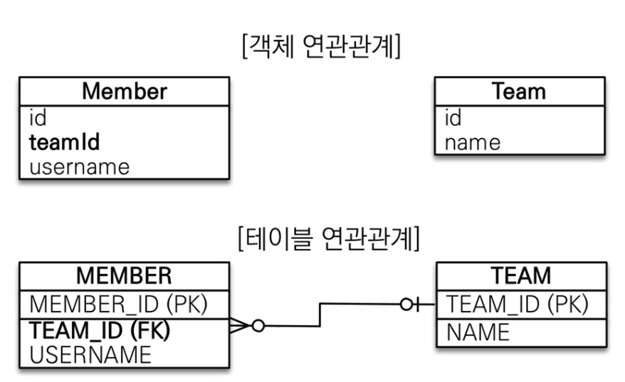
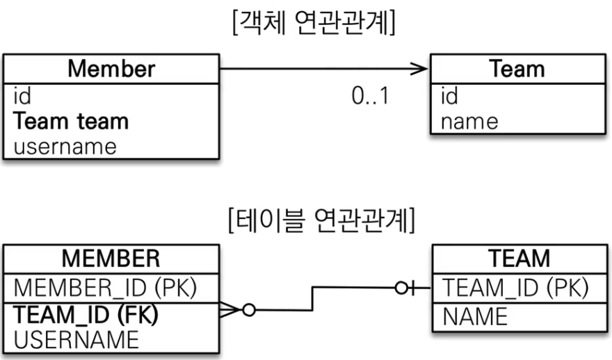

# 자바 ORM 표준 JPA 프로그래밍 - 기본편
## 연관관계 매핑 기초 - 단방향 연관관계 
### 목표 
- 객체와 테이블 연관관계의 차이를 이해 
- 객체의 참조와 테이블의 외래 키를 매핑 
- 용어 이해 
	- 방향(Direction): 단방향, 양방향
	- 다중성(Multiplicity): 다대일, 일대다, 일대일, 다대다의 이해 
	- 연관관계의 주인(Owner): 객체 양방향 연관관계는 관리 주인이 필요

### 예제 시나리오
- 회원, 팀이 있다. 
- 회원은 하나의 팀에만 소속될 수 있다
- 회원과 팀은 다대 일 관계이다. 

### 객체를 테이블에 맞추어 모델링 
- 연관관계를 고려하지 않은 객체 설계 

- 이렇게 구조를 짜면 이러한 데이터를 생성할 때 애매함을 우선 보여준다. 
```java
// 전략 

Team team = new Team();  
team.setName("TeamA");  
dbManager.persist(team);  
  
Member member = new Member();  
member.setUsername("user1");  
// team Id를 설정하는 것은 좀... 객체지향스럽지 않다. 
member.setTeamId(team.getId());  
dbManager.persist(member);

// 후략 
```

- 뿐만 아니라 값을 찾을 때도 문제가 된다. 
```java
// 전략 

Team team = new Team();  
team.setName("TeamA");  
dbManager.persist(team);  
  
Member member = new Member();  
member.setUsername("user1");  
member.setTeamId(team.getId());  
dbManager.persist(member);


// 연관관계를 찾아내기 위해, 탐색을 위해 절차가 까다로워진다. 
Member findMember = dbManager.find(Member.class, member.getId());

Long findTeamId = findMember.getTeamId();
Team findTeam = dbManager.find(Team.class, findTeamId)

// 후략 
```

### 객체를 테이블에 맞춘, 데이터 중심의 모델링은 협력관계를 만들 수 없다. 
- 테이블은 외래 키로 조인을 사용해서 연관된 테이블을 찾는다. 
- 객체는 참조를 사용해서 연관된 객체를 찾는다. 
- 테이블과 객체 사이에는 이런 큰 간격이 있다. 

### 객체 지향 모델링
- 객체의 연관관계를 사용한 형태는 다음과 같이 설계할 수 있다. 

- 객체 지향형으로 하는 방식은 설정과 데이터를 끄집어 내는게 매우 편리하다. 
```java
package singleDirectionAssociation;  
import jakarta.persistence.*;  
  
@Entity  
public class Member {  
    @Id  
    @GeneratedValue    @Column(name = "MEMBER_ID")  
    private Long id;  
  
//    @Column(name = "TEAM_ID")  
//    private Long teamId;  
  
    @ManyToOne  
    @JoinColumn(name = "TEAM_ID")  
    private Team team;  
  
  
    @Column(name = "USERNAME")  
    private String username;

//...후략
```

```java
// 전략

Team team = new Team();  
team.setName("TeamA");  
dbManager.persist(team);  

Member member = new Member();  
member.setUsername("user1");  
// ID로 찾아들어갈 필요가 없다.
// member.setTeamId(team.getId());  
member.setTeam(team);  
dbManager.persist(member);  

            System.out.println(member.getTeam());

// 후략
```

```toc

```
