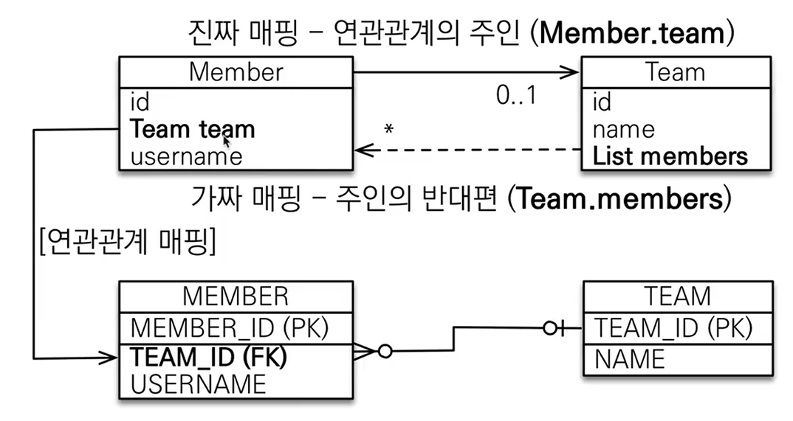
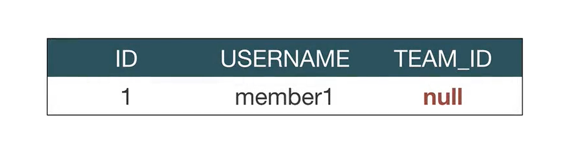
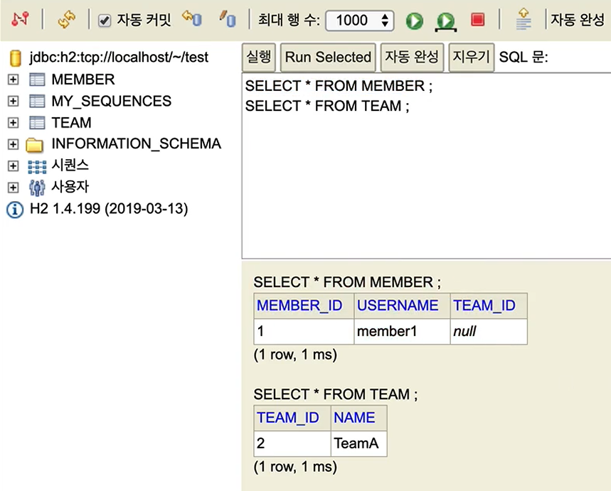

# 자바 ORM 표준 JPA 프로그래밍 - 기본편
## 연관관계 매핑 기초 - 양방향 연관관계와 연관관계의 주인 1 
### 양방향 연관관계
- 양쪽에서 참조해서 갈 수 있도록 만드는 것.
- 테이블의 연관관계는 기존의 단방향과 달리 차이가 없다. 
- 여기서 테이블을 기준으로 곰곰히 생각해보면, 어떤 관계량 양쪽에서 어느쪽 외래키를 가지고 있기만 해도 실질적으로 양방향인 것을 의미한다고 볼 수 있다. 

```java
	// 전략
	// team 의 Entity 
	@OneToMany(mapped by = "team")
	List<Member> members = new ArrayList<>();
	// 후략 
```
- 이렇게 설정하면 이제 Team, Member 각 객체에서 양방향으로 연결되고 서로 왔다갔다 하면서 데이터를 접근할 수 있게 바뀐다. 
- 물론, 이렇게 양방향인 것보다 객체 중심으로 생각해보면 단방향인게 나을 수 있지만 이는 후술할 예정...
### 연관관계의 주인과 mapped by 
- mapped by = JPA 의 이해 난이도를 높이는 주범
- 객체와 테이블 사이에 연관관계를 맺는 차이를 이해해야 한다. 

### 객체와 테이블이 관계를 맺는 것의 차이점 
- 객체 연관관계 = 2개(객체의 참조는 양쪽에서 가능하게 된다.)
	- 회원 -> 팀 연관관계 1개 (단방향)
	- 팀 -> 회원 연관관계 1개 (단방향)
- 테이블의 연관관계 = 1개(외래 키 하나로 연결되어 있다.)
	- 회원 <-> 팀의 연관관계 1개(양방향)

### 객체의 양방향 관계
- 위에서 언급했듯 객체의 양방향이라는 것은 실질적으로 서로 다른 단방향 두 개일 뿐이다. 
- 즉, 객체에서 관계를 양방향으로 참조하려면 <mark style="background: #FF5582A6;">단방향 연관관계를 2개</mark> 만들어야 한다. 
- A -> B = a.getB() 
- B -> A = b.getA()
```java
class A {
	private B b;

	public B getB(){
		return this.b 
	}
}

class B {
	private A a;
	
	public A geta(){
		return this.a 
	}
}
```

### 테이블의 양방향 연관관계 
- 테이블은 외래키 하나로 조인이 되고 관계를 구현하는게 가능함. 
```SQL
SELECT *
FROM MEMBER M
JOIN TEAM T ON M.TEAM_ID = T.TEAM_ID
```

```SQL
SELECT *
FROM TEAM T
JOIN MEMBER M ON T.TEAM_ID = M.TEAM_ID
```

### 그런데 이러면... 둘 중 하나는 외래키를 관리 해야 한다. 
- 양 방향의 논리 상 어느 쪽에서 무언가를 바꾼다는 것은, 모두 가능한 이야기이며, 또 그렇기에 한쪽이 변화가 발생했을 때, 다른 쪽도 이에 맞춰 대응이 되는 구조가 생겨야 한다. 이에 기준을 정하게 됨. 
- 이러한 개념적 과정을 거쳐 생겨난 개념이 `연관관계의 주인(Owner)` 이다. 

### 연관관계의 주인(Owner)
- 양방향 매핑 규칙 
	- 객체의 두 관계 중 하나를 연관관계의 주인으로 지정 
	- 연관관계의 주인만이 외래 키를 관리(등록, 수정)
	- <mark style="background: #FF5582A6;">주인이 아닌 쪽은 읽기만 가능</mark>(매우 중요, 매핑 당한 쪽에 뭘 바꿔도 바뀌지 않음)
	- 주인은 mappedBy 속성 사용할 수 없음 
	- 주인이 아닌 관계에선 mappedBy 속성을 넣어 주인을 지정해준다. 

### 누구를 주인으로 해야 하는가?
- <mark style="background: #BBFABBA6;">외래 키</mark>가 있는 곳을 주인으로 정해라(Team 기준에선 주 키니까)
- 여기서는 Member.team 이 연관관계의 주인이다.


## 연관관계 매핑 기초 - 양방향 연관관계와 연관관계의 주인 2
### 양방향 매핑 시 가장 많이 하는 실수 
- 연관관계의 주인에 값을 입력하지 않는 경우
```java
Team team = new Team();
team.setName("team A");
em.persist(team);

Member member = new Member();
member.setName("member1");
// member.setTeam(team);

// 역방향(주인이 아닌 방향) 만 연관관계 설정 
// 이 부분은 읽기 전용이라 사실상 의미가 없다. 넣어도 변하지 않는다. 
team.getMembers().add(member);

em.persist(member);
```


- 위의 방식으로 코드를 짜고 나면 다음처럼 결과가 나오게 된다. 

- 보이는 것 처럼 Team 에는 딱히 의미가 없다. 변하는게 없는 것이다. 
- 그러나 Member에서 Team_ID라는 외래키는 null로 끝나고 관계가 확실하게 정리가 안되어 있다. 
- 고민해야 할 지점. 가짜 연관관계인 경우 영속성 컨텍스트를 생각하나, 구조를 생각하나 읽기 전용이니 당연히 `List<Member>` 를 설정해줄 필요는 없다. 
	- 하지만, 곰곰히 생각해보면 코드 내부에서 Team 을 지속적으로 쓴다고 생각해보자. 그 경우 Lazy Loading으로 값을 JPA는 DB에 요청 쿼리를 날리게 되는데, 그렇다면 쿼리를 한 번 더 날린다는 비용을 지불하고 다시 find 를해서 쓰는게 맞을까? 
	- <mark style="background: #FFB8EBA6;">객체적으로 생각할 때, Team 생성 -> Member 생성, Member에 Team 등록 -> Team에 Member 등록을 해 줌으로써 이후 find를 할 때, 쿼리를 날리지 않도록 하는게 보다 효율적이고, 객체 지향적 설계가 아닐까?</mark>
- 그러나 !!! 그럼에도 불구하고 `List<Member>` 에 값을 add 해주는 게 필요하다. 왜일까?
	- 우선 기본적으로 default로 Lazy Loading이던 earger Loading이던 영속성 컨텍스트에서 commit 이 되지 않은 member가 있다고 하자. 
	- 이때 Team을 불러오거나 생성 한 뒤, 해당 값을 member.setTeam을 해주면 영속성 컨텍스트 안에 member의 관계 설정은 전혀 문제 없고, 1차 캐싱에서 값의 문제는 발생하지 않는다. 
	- 하지만, Team의 경우를 생각해보면, team.getMembers() 라는 메소드로 `List<Member>` 를 불러오게 되면, 기존의 내용들은 문제 없이 1차캐싱에 없으니 JPA가 요청할 것이고 쿼리가 날아간다. 
	- 그런데 member가 여전히 commit이 안된 상태라면, DB 상에서도 아직 member가 적용되어 있지 않은 상태일 것이며, 그 말은 getMembers를 한 순간에는 member가 commit 되기 전의 내용만을 담고 있을 것이며, 그렇기에 team.getMembers()를 한 뒤에 add를 해서 현재 member를 넣어 줘야 최신의, 지금 방금 생성한 객체 member도 들어간 최신의 상태가 영속성 컨텍스트 안에 존재 하게 되는 것이다. 
	- 뿐만 아니라 테스트 코드를 짜는 경우 같은 경우에도 DB 없이 진행하는 과정에서 커밋이 안되어 있고, 당연히 영속성 관리에서는 없는 리스트를 뽑아내어 테스트 에러가 발생하고 마는 것이다. 

### 양방향 연관관계의 주의 - 실습 
- 순수 객체 상태를 고려해서 항상 양쪽에 객체 사이에 값을 세팅해주자. 
- 연관관계 편의 메소드를 생성하자 : 다대일 중 어느쪽에 넣을지 고려할 것. 

```java
// Member Entity 
// 전략
	// 이렇게 해두면 휴먼 이슈를 최소화 시킬 수 있다. 
	public void changeTeam(Team team) {
		this.team = team;

		team.getMembers().add(this); 
		// 1차 캐시에 들어가 있으니 당연히 버그를 최소화한 설계를 구현할 수 있다. 
		// 단 성능적으로 굳이 하는 행위가 될 수는 있다.
		// 더불어 java의 관례 때문에 getter, setter를 쓰는 것 보단 
		// 아예 메소드를 분리해 내는게 코드의 의미를 파악하기 용이하다. 
		// 또한 이걸로 로직이 끝나지 않을 수도 있으므로, 
		// 그만큼 조심해서 내용을 바라보면서 작성해주는게 좋다. 
	}
// 후략
```

- 양방향 매핑 시에 무한 루프를 조심하자. 
	- 예를 들어, toString()과 같은 것을 만들어서 호출하면 member -> team 호출, team은 team 내 members를 일괄 호출 이것이 무한 반복이 될 수 있다.
	- 이 밖에도 lombok, json 생성 라이브러리 같은 것도 결국 관계 때문에 무한 루프를 타고 들어가다 오버플로가 나올 수 있다. 
	- 따라서 lombok, toString은 가능하면 쓰지 말고, 쓰더라도 체크하여 무한 루프 요소를 빼야 한다. 
	- 또한 controller 단에서 entity 를 절대 반환하지 말고 DTO를 생성하여서 JSON을 직접 만들어서 사용하도록 해, 무한루프가 생기지 않도록 해야 한다. 

### 양방향 매핑 정리 
- 단방향 매핑 만으로도 이미 연관관계는 매핑이 완료 된 것이다. 
- 양방향 매핑은 반대방향으로 조회(객체 그래프 탐색) 기능이 추가된 것 뿐
- JPQL에서 역방향으로 탐색할 일이 많다. 
- 단방향 매핑을 잘하고 양방향은 필요할 때 추가해도 됨(테이블에 영향을 주지 않음)
- 하물며 스프링에서 repository 가 존재하기도 하고, JPQL을 활용해서 직접 구현하는 식으로 해도 된다.(굳이 많이 쓰지 않는다면)

### 연관관계의 주인을 정하는 기준 
- 비즈니스 로직을 기준으로 연관관계의 주인을 선택하면 안됨
- <mark style="background: #FF5582A6;">연관관계의 주인은 외래키의 위치를 기준으로 정해야한다</mark>. 


```toc

```
