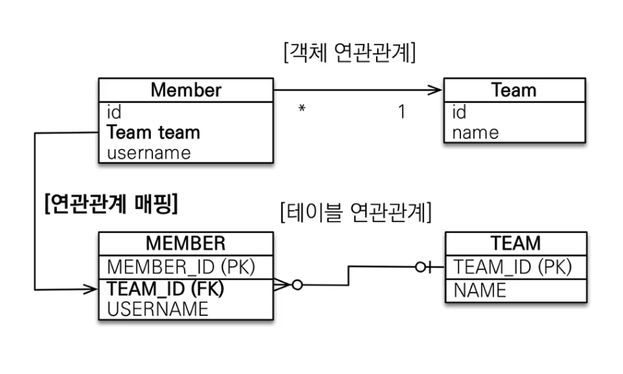
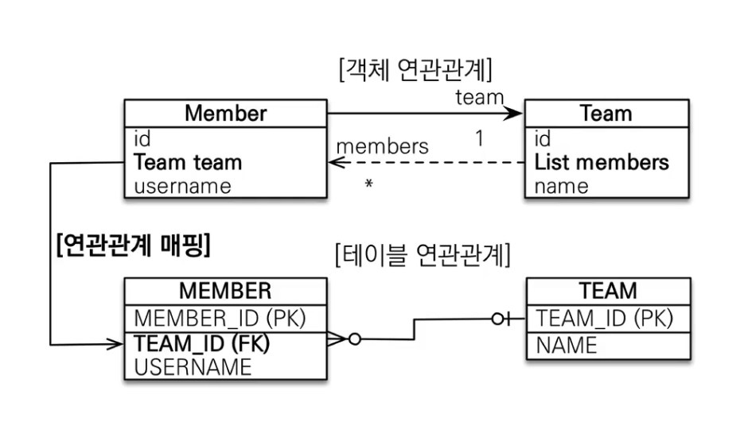

# 자바 ORM 표준 JPA 프로그래밍 - 기본편
## 다양한 연관관계 매핑 - 다대일
### 연관관계 매핑 시 고려사항 3가지 
- 다중성
- 단방향, 양방향
- 연관관계의 주인

### 다중성
어노테이션은 JPA가 제공하며, DB랑 매핑을 위해 만들어진 것들이다. 
- 다대일 : `@ManayToOne`
- 일대다 : `@OneToMany`
- 일대일 : `@OneToOne`
- 다대다 : `@ManyToMany` -> 쓰면 안된다. 

### 단방향, 양방향 
- 테이블 
	- 외래키 하나로 양쪽 조인이 가능하다. 
	- 사실 방향이란 개념이 없다. 
- 객체
	- 참조용 필드가 있는 쪽으로만 참조 가능
	- 한쪽만 참조하면 단방향 / 아니면 양방향 

### 연관관계의 주인
- 테이블은 외래키 하나로 두 테이블의 연관관계를 맺음
- 객체의 양방향 관계는 A->B B->A처럼 참조가 2군데
- 객체 양방향 관계는 둘 중 테이블의 외래키를 관리할 곳을 지정해줘야 한다. 
- 연관관계의 주인 = 외래키를 관리하는 참조
- 주인의 반대편 = 외래키에 영향을 주지 않고, 단순 조회만을 진행한다.

### 다대일 [N : 1]

- 다대일 관계에서 외래키는 반드시 다 쪽에 있어야 한다. 
- 다대일 단방향 정리 
	- 가장 많이 사용되는 연관관계
	- 다대일의 반대는 일대다 

### 다대일 양방향 

- 다대일 양방향 정리 
	- 외래키가 있는 쪽이 연관관계의 주인이다. 
		- `@ManyToOne`, `@JoinColumn` 으로 연결
		- 일대다 쪽은 `OneToMany`를 하고  `mappedBy` 옵션을 꼭 지정해줘야 한다. 


## 다양한 연관관계 매핑 - 일대다

## 다양한 연관관계 매핑 - 일대일

## 다양한 연관관계 매핑 - 다대다


```toc

```
