# 자바 ORM 표준 JPA 프로그래밍 - 기본편
## 다양한 연관관계 매핑 - 일대다 
### 일대다 단방향
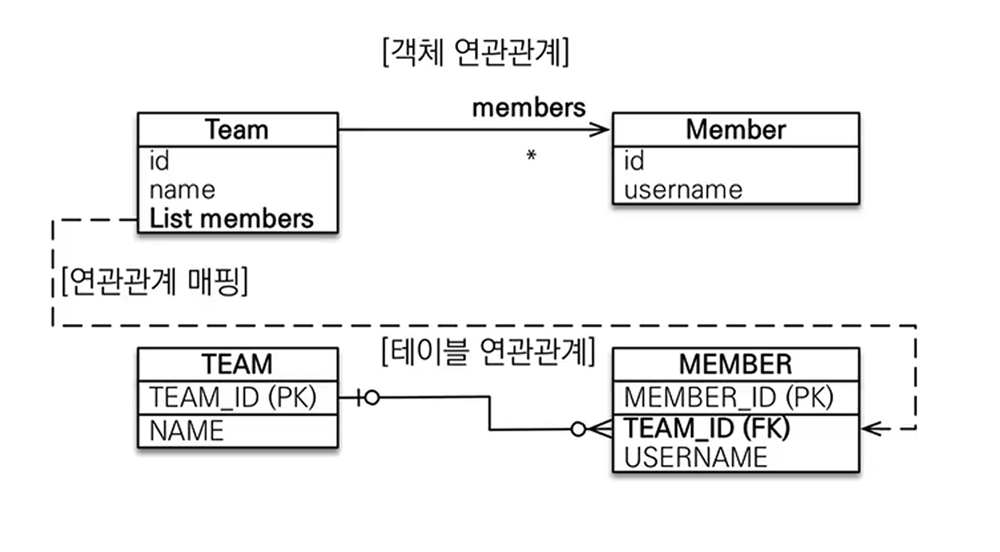
- 실무에서 연관관계의 주인이 Team이 되는 경우를 말한다.
- 대충 상황적으로 Team 입장에서 Member를 기록해야 하나, Member는 Team을 고려하지 않는 경우 나올 수 있는 설계다. 
- 그런데 실질적인 테이블 데이터 간의 연관관계를 생각해보면, Team 은 외래키를 가질 수가 없다. 
- 여기서 이 관계의 핵심문제는 <mark style="background: #FF5582A6;">개발자 입장에서 일 쪽에 작업을 한것 뿐이라고 생각했는데, 관계 특성 상 다(N)에 해당하는 쪽에도 영향을 미쳤다는 점이다</mark>. 

### 일대다 단방향 정리 
- 일대다 단방향은 일대다에서 일(1)이 연관관계의 주인이 되는 것 
- 테이블 일대다 관계는 항상 다(N) 쪽에 외래키가 있다. 
- 객체와 테이블의 차이 때문에 반대편 테이블의 외래키를 관리하는 특이한 구조
- `@JoinColumn` 을 꼭 사용해야함. 그렇지 않으면 조인 테이블 방식을 사용해야 한다. (중간 테이블을 하나 추가해야한다.)
- 일대다 단방향 매핑의 단점
	- 엔티티가 관리하는 외래키가 다른 테이블에 있음
	- 연관관계 관리를 위해 추가로 일(1) 쪽 UPDATE SQL 이 실행됨
- 따라서 애매한 부분이 있으므로, <mark style="background: #FFB86CA6;">객체지향적으로 손해를 보는 부분이 있음에도 다대일 양방향으로 매핑을 거는 게 낫다. </mark>

### 일대다 양방향 
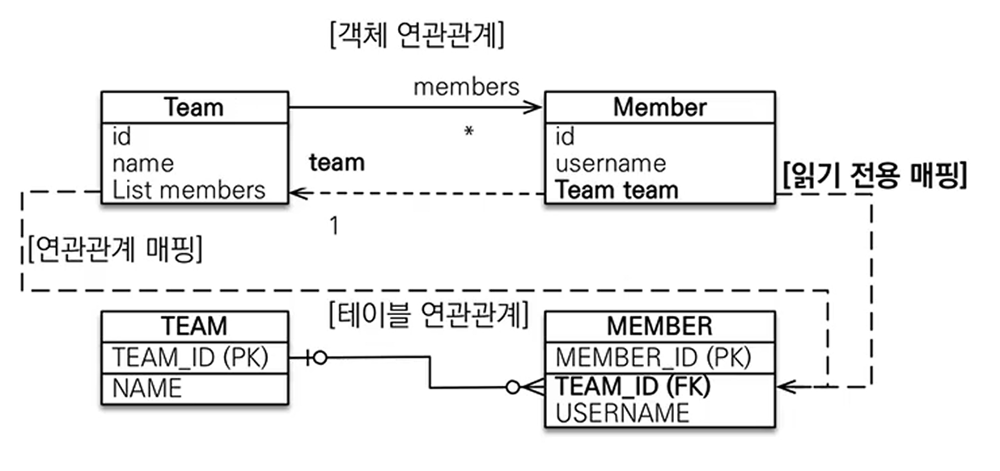
- Member 즉, 다에 해당하는 부분에 다음 어노테이션을 넣어줌으로써 해당 관계의 원칙만 지키는 형태를 만들어내는 것이다. 
- Member에 넣을 어노테이션
	- `ManyToOne`
	- `@JoinColumn(name = "TEAM_ID", insertable = false, updatable = false)` : 읽기 전용으로 만들어버리는 것

### 일대다 양방향 정리 
- 공식적으로 이러한 방식의 매핑은 없음
- 위에서 언급한 방식으로 읽기 전용 필드로 만들어 양방향처럼 사용할 수 있음
- 걍 다대일 양방향을 사용하자... 

## 다양한 연관관계 매핑 - 일대일 
### 일대일 : 단방향
- 일대일 관계는 반대도 동일한 일대일이다. 
- 주 테이블이나 대상 테이블 중 외래키의 위치는 선택 가능하다. 
- 외래키에 데이터 베이스 유니크(UNI) 제약 조건 추가 

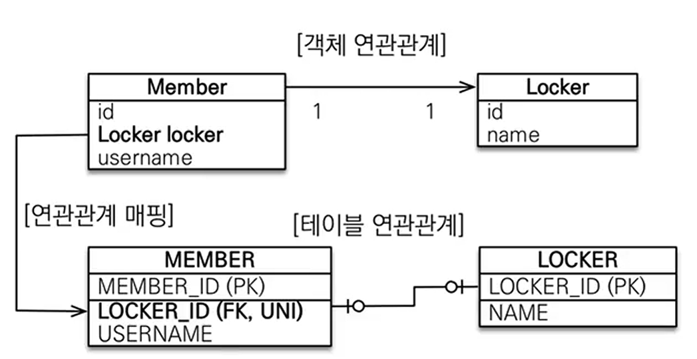
- 멤버와 Locker 객체를 활용해서 만들어보는 형태
- 다대일 단방향 매핑과 유사하다. 
### 일대일 : 주 테이블에 외래 키 양방향 
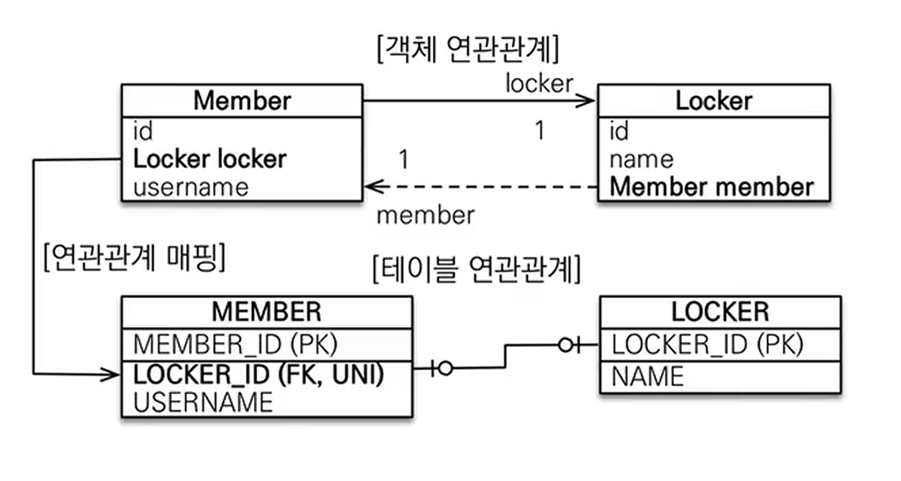
- 다대일 양방향 매핑처럼 외래 키가 있는 곳이 연관관계의 주인
- 반대편은 mappedBy 적용하면 된다. 

### 일대일 : 대상 테이블에 외래 키 단방향
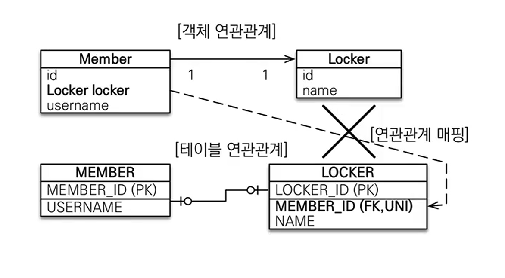
- 이런 방식은 지원도 안되고, 특성을 구현하여 실질적으로 존재하도록 만드는 방법도 없다. 
- 양방향 관계는 지원된다. (대상 테이블이 사실상 주인이란 소리임)

### 알아두면 좋은 것
- 대상 테이블에 외래 키 양방향으로 구성하는 것이 좋은 경우가 있다. 
	- 왜냐하면 대상 즉, Locker 가 여러 개를 복수로 사용하게 되는 비즈니스 로직으로 변경된다고 하자. 이때 연관관계의 주인이 Member 인 경우, 수정해야할 포인트들이 많이 생긴다. 
	- 하지만 역으로 대상 테이블에 외래 키를 넣게 되면, 유니크 설정만 풀고, <mark style="background: #FF5582A6;">Member는 읽기 구조로 다대일로 변경하면</mark> 매우 손쉽게 비즈니스 로직 수정에 대응이 가능하다. 
- 그러나 여기서 <mark style="background: #FF5582A6;">하나의 Locker 를 여러 사람이 소유하고 사용할 수 있는 비즈니스 로직으로 된다고 하면</mark>, 그때는 <mark style="background: #FF5582A6;">주 테이블에 외래 키를 넣는 구조가 되는 게 수정이 쉽다.</mark>
- 즉 JPA, 객체를 활용한 데이터를 다룰 때는 종합적인 판단이 중요하다. 
- 강의 저자는 명확한 1:1 관계라고 한다면 주 테이블 양방향 내지는 단방향으로 가져간다고 한다.

### 일대일 정리 
- 주 테이블에 외래 키를 놓는 경우
	- 주 객체가 대상 객체의 참조를 가지는 것처럼, 주 테이블에 외래 키를 두고 대상 테이블을 찾음
	- 객체 지향 개발자 선호
	- JPA 매핑이 편리함
	- 장점 : 주 테이블 조회로 대상까지 쉽게 확인 가능
	- 단점 : 값이 없으면 외래 키에 null 허용
- 대상 테이블에 외래 키를 놓는 경우
	- 대상 테이블에 외래 키가 존재
	- 전통적인 데이터베이스 개발자 선호
	- 장점 : 주 테이블과 대상 테이블을 일대일에서 일대 다로 관계 변경 시 테이블 구조 유지 
	- 단점 : 프록시 기능의 한계로 지연로딩으로 설정해도 항상 즉시 로딩

## 다양한 연관관계 매핑 - 다대다
### 다대다
- 관계형 데이터베이스는 정규화된 테이블 2개로 다대다 관계를 표현할 수 없다. 
- 연결 테이블을 추가해서 일대다-다대일 관계로 풀어 내야 한다. 
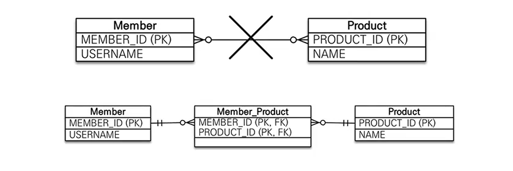
- 객체는 컬렉션을 사용해서 객체 2개로 다대다 관계를 표현 할 수 있다(이부분이 애매한 문)

- `@ManyToMany` 사용
- `@JoinTable` 로 연결 테이블 지정
- 다대다 매핑 : 단, 양방향 모두 가능 

### 다대다 매핑의 한계 
- 편리해 보이지만 실무에서 사용되기가 말이 안됨
- 연결 테이블이 단순히 연결만 하고 끝나지 않음
	- 추가적인 데이터가 더 들어가야 하는 경우 있음
	- 숨겨진 테이블로 인해 쿼리가 더 많이, 더 이상하게 날아갈 수 있음 
- 주문 시간, 수량 같은 데이터 들어올 수 있음
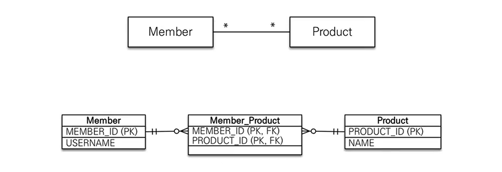

### 다대다 한계 극복
- 연결 테이블용 엔티티 추가(연결 테이블을 엔티티로 승격 시켜준다)
- `@ManyToMany` -> `@OneToMany` & `@ManyToOne`
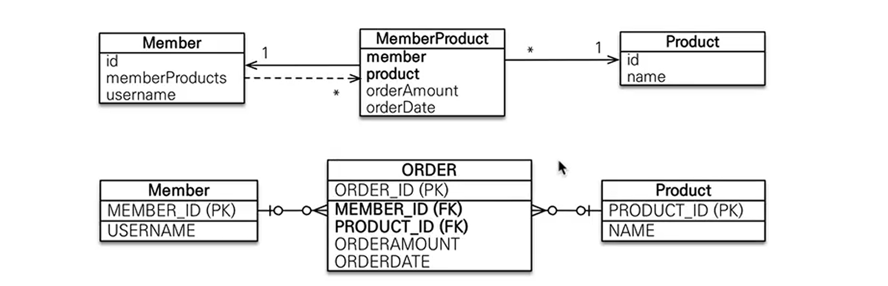

## 다양한 연관관계 매핑 - 실전예제 3
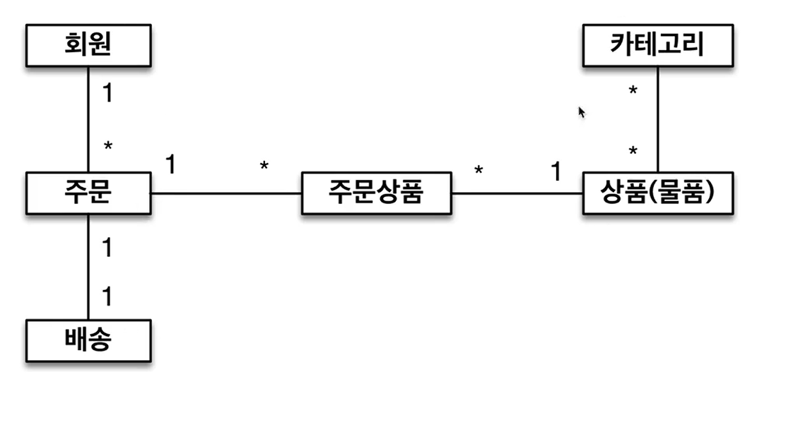
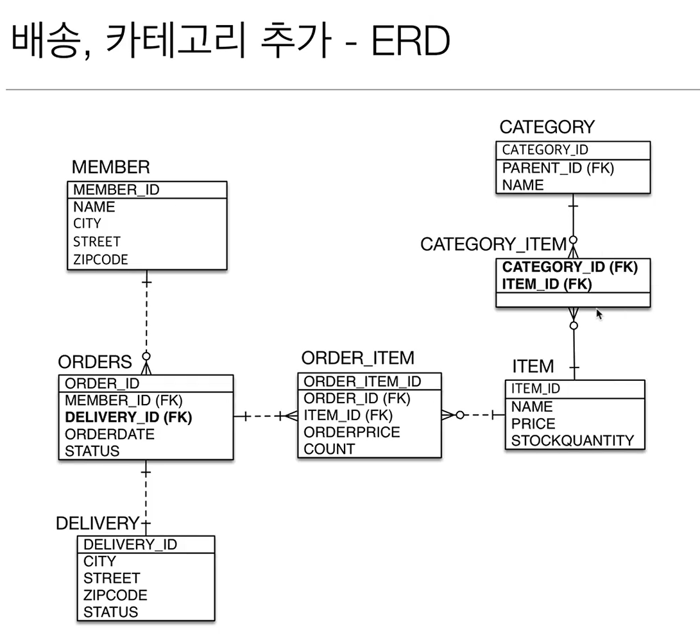
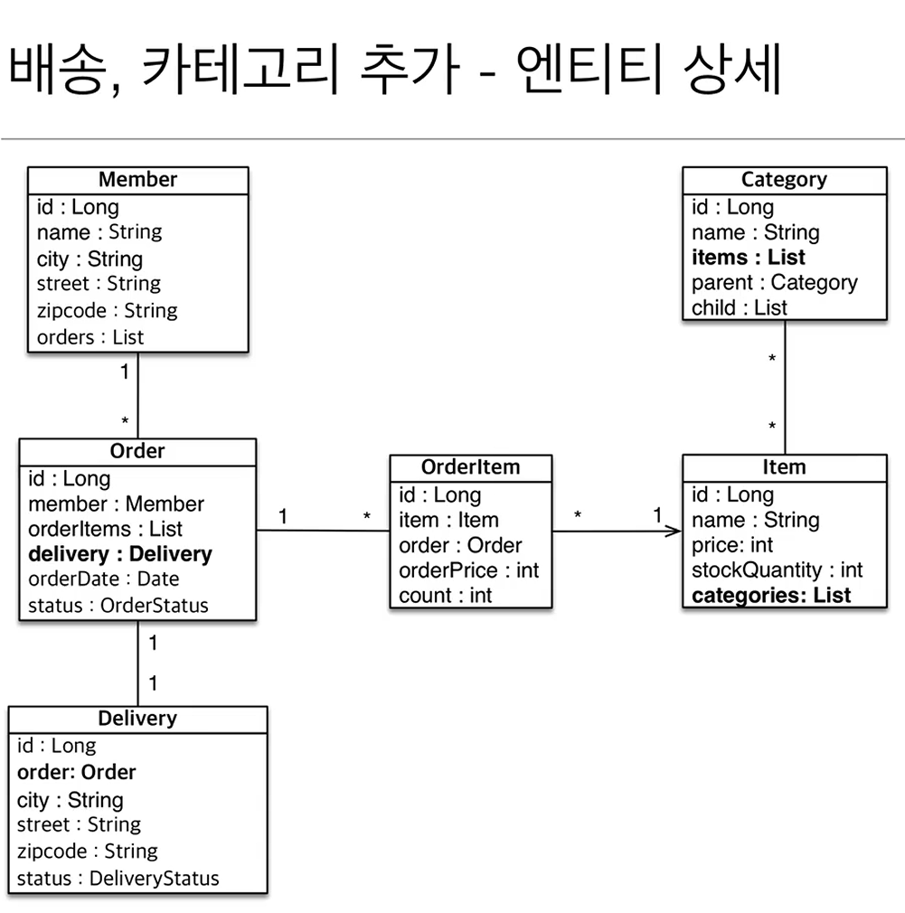

- 해당 내용을 전체 구현을 다하더라도, 최신 JPA 예약어에 걸리는 것인지 ORDER 테이블이 에러가 발생한다. 
- 이럴 때는 백틱으로 감싸고 쌍따옴표로 테이블 명임을 지정해줘야 에러가 발생하지 않았다 ... ㅠ

```java
// Member.java
package practice_3;  
  
import jakarta.persistence.*;  
  
import java.util.ArrayList;  
import java.util.List;  
  
@Entity  
public class Member {  
  
    @Id  
    @GeneratedValue    @Column(name = "MEMBER_ID")  
    private Long id;  
  
    @Column  
    private String name;  
  
    @Column  
    private String city;  
  
    @Column  
    private String street;  
  
    @Column  
    private String zipcode;  
  
    @OneToMany(mappedBy = "member")  
    private List<Order> orders = new ArrayList<Order>();  
  
}
```

```java
// Order.java
package practice_3;  
  
import jakarta.persistence.*;  
  
import java.time.LocalDate;  
import java.time.LocalDateTime;  
import java.util.ArrayList;  
import java.util.Date;  
import java.util.List;  
  
@Entity  
@Table(name = "`ORDER`")  
public class Order {  
    @Id  
    @GeneratedValue    @Column(name = "ORDER_ID")  
    private Long id;  
  
    @ManyToOne  
    @JoinColumn(name = "MEMBER_ID")  
    private Member member;  
  
    @OneToMany(mappedBy = "order")  
    private List<OrderItem> orderItems = new ArrayList<>();  
  
    @OneToOne  
    @JoinColumn(name = "DELIVERY_ID")  
    private Delivery delivery;  
  
    @Column  
    private Date orderDate;  
  
    @Enumerated(EnumType.STRING)  
    private OrderStatus status;  
  
}
```

```java
// Delivery.java
package practice_3;  
  
import jakarta.persistence.*;  
  
@Entity  
public class Delivery {  
  
    @Id  
    @GeneratedValue    @Column(name = "DELIVERY_ID")  
    private Long id;  
  
    // 이렇게 잡음으로써 Order가 주인, Delivery가 양방향의 읽기 전용이 된다.  
    @OneToOne(mappedBy = "delivery")  
    private Order order;  
  
    @Column  
    private String city;  
  
    @Column  
    private String street;  
  
    @Column  
    private String zipcode;  
  
    @Enumerated(EnumType.STRING)  
    private DeliveryStatus status;  
  
}
```

```java
// OrderItem.java
package practice_3;  
  
import jakarta.persistence.*;  
  
@Entity  
public class OrderItem {  
    @Id  
    @GeneratedValue    @Column(name = "ORDER_ITEM_ID")  
    private Long id;  
  
    @ManyToOne  
    @JoinColumn(name = "ORDER_ID")  
    private Order order;  
  
    @ManyToOne  
    @JoinColumn(name = "ITEM_ID")  
    private Item item;  
  
    @Column  
    private int orderPrice;  
  
    @Column  
    private int count;  
  
}
```

```java
// Item.java
package practice_3;  
  
import jakarta.persistence.*;  
  
import java.util.ArrayList;  
import java.util.List;  
  
@Entity  
public class Item {  
    @Id  
    @GeneratedValue    @Column(name = "ITEM_ID")  
    private Long id;  
  
    @Column  
    private String name;  
  
    @Column  
    private int price;  
  
    @Column  
    private int stockQuantity;  
  
    @ManyToMany(mappedBy = "items")  
    private List<Category> categories = new ArrayList<>();  
}
```

```java
// Category.java
package practice_3;  
  
import jakarta.persistence.*;  
  
import java.util.ArrayList;  
import java.util.List;  
  
@Entity  
public class Category {  
    @Id  
    @GeneratedValue    @Column(name = "CATEGORY_ID")  
    private Long id;  
  
    @Column  
    private String name;  
  
    @ManyToMany  
    @JoinTable(name = "CATEGORY_ITEM",  
        joinColumns = @JoinColumn(name = "CATEGORY_ID"),  
            inverseJoinColumns = @JoinColumn(name= "ITEM_ID")  
    )  
    private List<Item> items = new ArrayList<>();  
  
    @ManyToOne  
    @JoinColumn(name = "PARENT_ID")  
    private Category parent;  
  
    @OneToMany(mappedBy = "parent")  
    private List<Category> children = new ArrayList<>();  
  
  
}
```

- 구현에 포함되지만 enum 같은 것들은 제외하였다. 
- ManyToMany 는 확실히 구현 방식에 비해 사용성이 떨어지는게 느껴진다. 가능하면 OrderItem 처럼 쪼개서 활용하는게 낫다고 보여진다. 


```toc

```
