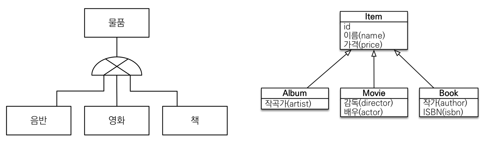
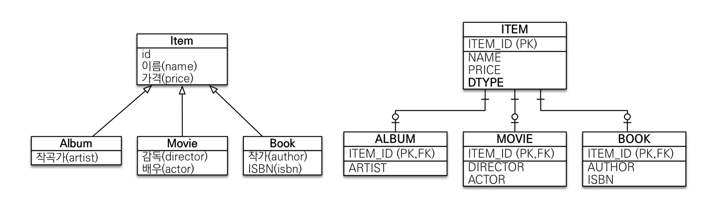
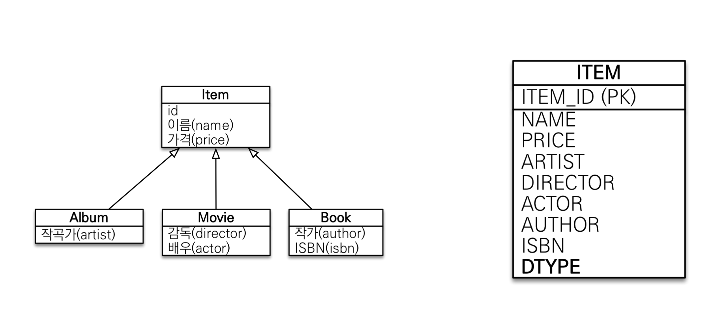
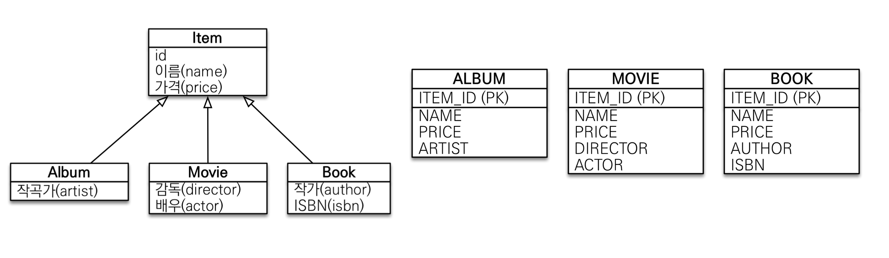
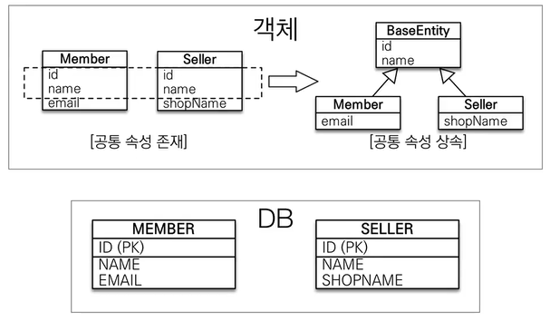
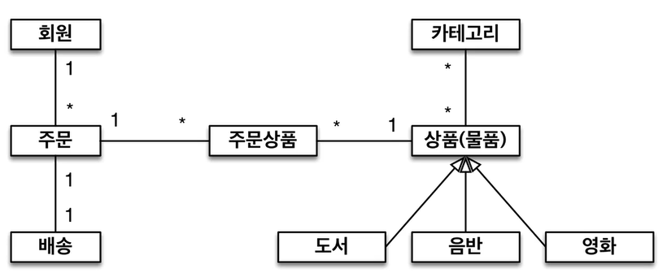

# 자바 ORM 표준 JPA 프로그래밍 - 기본편
## 고급 매핑 - 상속관계 매핑 
### 상속관계 매핑 
- 관계형 데이터 베이스는 상속 관계X
- 슈퍼타입, 서브타입 관계라는 모델링 기법이 객체 상속과 유사 
- 상속 관계 매핑 : 객체의 상속과 구조, DB의 슈퍼 타입 서브타입 관계를 매핑하는 것을 말한다. 



- 슈퍼타입 / 서브타입 논리 모델을 실제 물리 모델로 구현하는 방법 
	- 각각 테이블로 변환 -> 조인 전략 
	- 통합 테이블로 변환 -> 단일 테이블 전략
	- 서브 타입 테이블로 변환 -> 구현 클래스 마다 테이블 전략 

### 조인 전략

- 결과적으로 하위 객체들은 ID가 PK이자 FK로 갖추게 되고, ITEM을 자동으로 일괄 정리가 된다. 
- `DiscriminatorColumn()` : 해당 내용을 넣어주면 좋다. (각 자식을 구분하기 위한 컬럼을 자동 생성한다.)
- `DiscriminatorValue()`: 자식객체 엔티티에 등록하면 해당 값으로 DTYPE 을 지정해주게 된다. 
- 기본적으로 사용하기 적절한 전략이라고 생각하면 좋다. 
- 장점 
	- 테이블 정규화
	- 외래키 참조 무결성 제약 조건 활용 가능 
	- 저장공간 효율화
- 단점 
	- 조회 시 많은 조인으로 성능이 저하된다. 
	- 조회 쿼리가 복잡하다
	- 데이터 저장 시 INSERT SQL 2회 호출한다. 
### 단일 테이블 전략 

- 소규모 프로젝트, 컬럼 구분이 많이 필요하지 않다면 테이블을 하나로 만들어서 사용이 된다. 
- 성능 상 이점이 많다. 하지만 당연히 그만큼 단순하여 다양하게 적용하기에 한계가 있다. 
- 장점 
	- 조인이 필요 없으므로 일반적으로 조회 성능이 빠르다
	- 조회 쿼리가 단순하다
- 단점 
	- 자식 엔티티가 매핑한 컬럼은 모두 null 허용
	- 단일 테이블에 모든 것을 저장하므로 테이블이 커질 수 있고, 오히려 성능이 낮아질 수 있다. 
### 구현 클래스마다 테이블 전략

- ITEM 테이블이 없이 각 테이블로 구조가 짜여지고, 각 테이블만 생성된다. 
- 좋은 점은 개별 테이블이므로 사실상 별도의 테이블을 두는 것과 같은 효과를 가지며, 통합으로 관리할 필요가 없다면 각 기 개별로 관리하는 만큼 적은 데이터, 적은 탐색등 용이하다. 
- 단 통합 관리, 상위 객체로 객체지향적으로 탐색 시에는 아예 다른 테이블로 분리 되는 만큼 유니온으로 전체를 개별 탐색하는 등 성능 상 최악일 수 있다.
- 기본적으로 사용하지 않기를 권장한다. 데이터 베이스 설계자와 ORM 전문가 둘다 손해가 커서 추천되지 않는다고 보면 된다.  
- 장점
	- 서브 타입을 명확히 구분해서 처리할 때 효과적 
	- not null 제약 조건 사용 가능
- 단점
	- 여러 자식 테이블을 함께 조회할 때 성능이 느림(UNION SQL)
	- 자식 테이블을 통합해서 쿼리하기 어려움 
### 주요 어노테이션 
- `@Inheritance(strategy=InheritanceType.XXX)`
	- JOINED: 조인 전략 
	- SINGLE_TABLE: 단일 테이블 전략
	- TABLE_PER_CLASS: 구현 클래스 마다 테이블 전략
- `@DiscriminatorColumn(name="DTYPE")` : 싱글테이블 형식에선 필수. 타입을 지정하는 용의 컬럼을 넣으라는 명령 어노테이션
- `@DiscriminatorValue("XXX")` : 위에서 구분컬럼의 어노테이션과 쌍을 이루는 것으로, 상속 받는 엔티티들에 대해 
- DTYPE 컬럼을 생성해서 구분할 수 있도록 하는게 성능 상 이점이 있다.
- JPA의 장점은 이렇게 어노테이션만 바꾸어도 데이터베이스 전략이 바꿀 수 있고 그만큼 코드 변경 없이 적용되는점이 상당한 이점이다. 
## 고급 매핑 - Mapped Superclass - 매핑 정보 상속 
### @MappedSuperclass 
- 상속과 크게 상관은 없는 영역이다. 
- 공통 매핑 정보가 필요할 때 사용하여 작성을 덜하게 만들어준다.(id, name)

- BaseEntity 에 해당되는 것을 만들고, 여기서 해당 어노테이션을 넣어줌으로써 명시적이고 투명한 JPA 규칙을 적용하고, ORM 프레임 워크의 호환성을 최적화하는 데 도움을 준다. 
- 특성
	- 상속관계 매핑 X
	- 엔티티 아니며, 테이블과 매핑도 아니다. 
	- 부모 클래스를 상속 받는 자식클레스에 매핑 정보만 제공(다형성을 활용한 상위 클래스 검색 등 활용 불가)
	- 조회, 검색 불가(em.find(BaseEntity) x)
	- 직접 생성해서 사용할 일이 없으므로 추상 클래스 권장
- 테이블과 관계 없고, 단순히 엔티티가 공통으로 사용하는 매핑 정보를 모으는 역할
- 주로 등록일, 수정일, 등록자, 수정자 같은 전체 엔티티에서 공통 사용 정보를 적용할 때 사용한다. 
## 고급 매핑 - 실전 예제 4
### 요구사항 추가 
- 상품 종류는 음반, 도서, 영화가 있고 이후 더 확장 할 수 있다. 
- 모든 데이터는 등록일과 수정일이 필수다.
### 도메인 모델 

### 조건
- 각 세부 구성요소를 싱글 테이블로 설계할 것
### 상속성, JPA, 생각
- 사용자가 많지 않은 경우에는 상속을 활용하는 형태 등으로 데이터를 세세하게 관리하는게 좋을 수 있다. 
- 하지만 대용량 데이터 관리가 들어가거나 하게 되면, 오히려 이러한 관리가 정상 작동을 안하는 경우, 복잡한 에러가 발생할 시발점의 역할을 하기도 한다. 그렇다면 오히려 데이터를 더 단순하게 관리하는 것이 효과적일수도 있다는 것이 김영한 선생님의 경험적 총론이다. 
- 결국 정답은 없다. 다양한 구조나 절차, 규칙을 사용하는 것에 대해 결국 이점이 있으면 단점도 발생하게 되는 것이므로, trade-off를 넘어서는 그 시점에 그 상황과 규모에 맞은 변화를 대비하고 적용하는 것이 필요하다. 

## 프록시와 연관관계 관리 - 프록시
## 프록시와 연관관계 관리 - 즉시 로딩과 지연로딩 
## 프록시와 연관관계 관리 - 영속성 전이(CASCADE)와 고아 객체
## 프록시와 연관관계 관리 - 실전 예제 5


```toc

```
