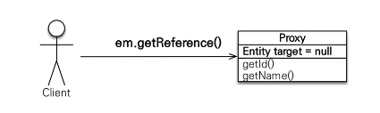
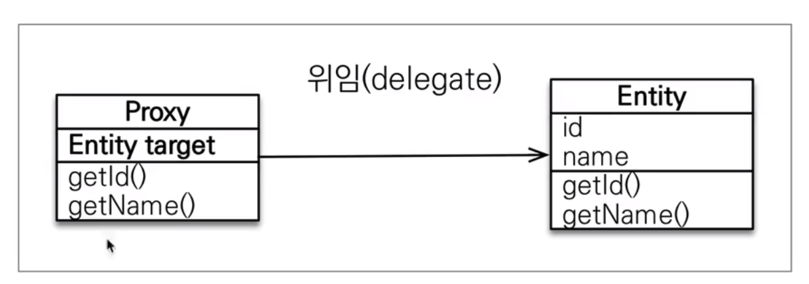
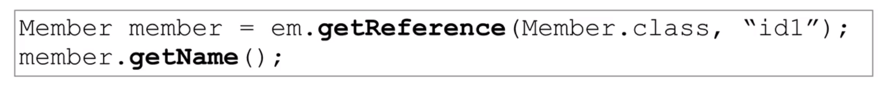
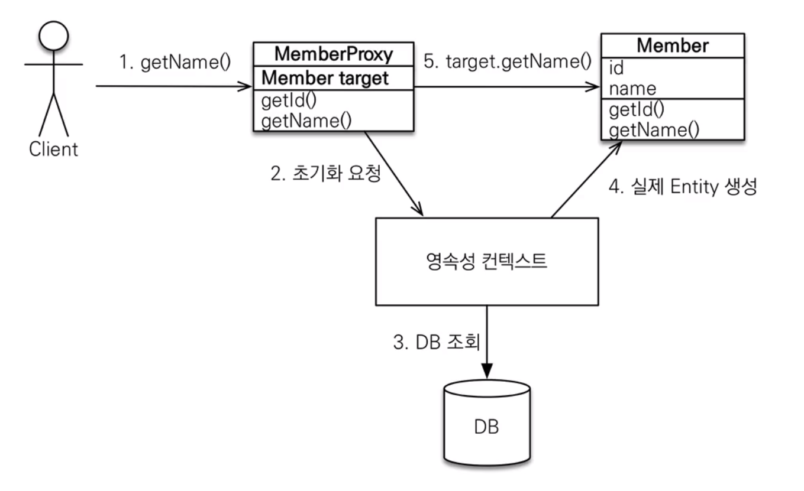
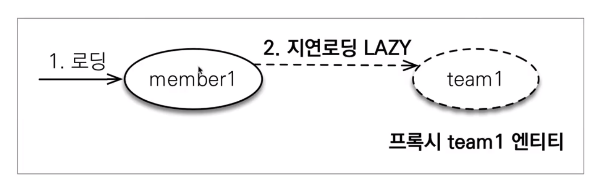
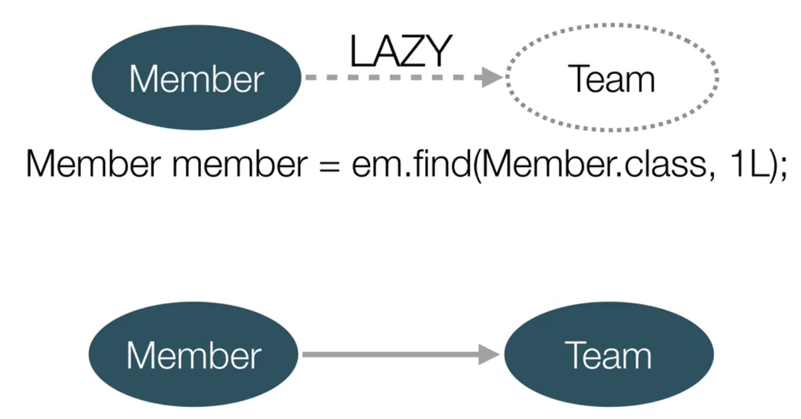

# 자바 ORM 표준 JPA 프로그래밍 - 기본편
##  프록시와 연관관계 정리 - 프록시
### 프록시 기초 
- 멤버를 조회할 때 팀도 함께 조회해야 하는가?
	- 쿼리가 나갈 때 한 번에 검색되어 나오는게 좋지 않을까? 
	- 반대로 연관관계가 있다고 해서, 사용하지 않고 멤버만 사용한다면? 
	- 결국 경우에 따라 비즈니스 로직, 실제 쿼리가 달라질 수 있다. 
	- 이러한 상황을 JPA는 프록시와 지연 로딩을 활용하여 해결한다. 

- `em.find()` vs `em.getReference()` 
- em.find() : 데이터베이스를 통해 실제 엔티티 객체 조회 
- em.getReference() : 데이터베이스 조회를 미루는 가짜(프록시) 엔티티 객체 조회
	- 즉, 이후 실제 값을 접근하려고 하면, 그 때 쿼리를 날려 실제 데이터를 가져 온다. 


### 프록시 특징 
- 실제 클래스를 상속 받아서 만들어짐 
- 실제 클래스와 겉 모양 동일
- 사용 입장에선 객체와 프록시 객체 구분 하지 않고 사용하면 됨(이론상)
- 프록시 객체는 실제 객체의 참조(target)을 보관 
- 프록시 객체를 호출하면 프록시 객체는 실제 객체의 메소드 호출 

### 프록시 객체의 초기화



### 프록시의 특징
- 프록시 객체는 처음 사용할 때 한 번만 초기화 
- 프록시 객체를 초기화 할 때, 프록시 객체가 실제 엔티티로 바뀌는 것 아님. 초기화 되면, 프록시 객체를 통해 실제 엔티티에 접근 가능 
- 프록시 객체는 원본 엔티티를 '상속' 받음, 따라서 타입 체크 시 주의 해야함. (`==` 비교는 실패, instance of 사용해야함)
	- 즉, 프록시 객체는 동일 타입은 아니며, 프록시 타입과 원래 사용하는 객체의 타입이 다를 수도 있다. 
	- 같은 대상을 찾게 되면, 프록시로 먼저 초기화를 하든, 객체를 먼저 찾고 프록시를 나중에 초기화를 하든, 결론적으로 선행한 타입에 맞춰서 정리된다(`==` 의 true를 위해)
		- 즉, `em.find`를 먼저 하고, `em.getReference`를하면 영속성 컨텍스트 덕에 두 객체 모두 요청한 엔티티 클래스 타입을 가지며
		- 반대의 경우, 둘다 프로시 객체 타입으로, 값만을 상속받은 형태가 된다.
- 영속성 컨텍스트에 찾는 엔티티가 있으면 `em.getReference()`를 호출해도 실제 엔티티 반환 
- 영속성 컨텍스트의 도움을 받을 수 없는 준 영속 상태일 때, 프록시를 초기화하면 문제 발생(hibernate의 경우 org.hibernate.LazyInitializationException 발생)
### 프록시 확인
- 프록시 인스턴스 초기화 여부 확인: `PersistenceUnitUtil.isLoaded(Object entity)`
- 프록시 클래스 확인 방법 : `entity.getClass().getName()` 출력하기
- 프록시 강제 초기화 : `org.hibernate.Hibernate.initialize(entity)` (강제로 쿼리를 호출해준다)
- 참고 : JPA 표준은 강제 초기화 없음
##  프록시와 연관관계 정리 - 즉시 로딩과 지연 로딩
### 지연 로딩 LAZY를 사용해서 프록시로 조회 
```java
@Entity
publuc class Member {
// . . . 전략

@ManyToOne(fetch = FetchType.LAZY) // Proxy type으로 준비한다는 의미를 내포한다...!
@JoinColumn(name = "TEAM_ID")
private Team team;

// . . . 후략

}
```
### 지연 로딩 


- 결국 비즈니스 로직 상 바로 필요가 없다면, 이러한 형식으로 지연 로딩을 통해 효율적으로 쓰는게 좋다. 
- 하지만 비즈니스 로직상 함께 사용하는 경우라면?
### 즉시 로딩 EAGER 를 사용해서 함께 조회
```java
@Entity
publuc class Member {
// . . . 전략

@ManyToOne(fetch = FetchType.EAGER) // 이번엔 바로 로딩이 이루어진다. 프록시를 거치지 않는다.
@JoinColumn(name = "TEAM_ID")
private Team team;

// . . . 후략

}
```
### 프록시와 즉시 로딩 주의 
- 가급적 지연 로딩만 사용(특히 실무에선) 
	- 생각해보면, LAZY라고 하더라도, 얼마나 어떻게 가져올지에 따라 문제가 커질 수도 있는데 EAGER를 설정하는 순간 재앙급 문제가 발생할 수 있다.
	- 따라서 실무에서는 절대 사용하면 안된다. 차라리 JPQL을 최대한 활용하는 게 핵심이다. 
- 즉시 로딩을 적용하면 예상하지 못한 SQL이 발생
- <mark style="background: #FF5582A6;">즉시 로딩은 JQPL에서 N+1의 문제를 일으킨다.</mark>
	- JPQL은 기본적으로 SQL을 자바 식으로 번역해둔 것일 뿐. 최적화가 되어있지 않다. 
	- 이런 상황에서 EAGER 설정이 있는 경우, 고려되지 않은 값을 또 SQL을 호출하게 되는 것이다. 이것이 N+1 의 문제다. (최초 1쿼리에 따라서 N개만큼 쿼리가 나간다는 의미이다.) -> LAZY로 하는 순간 쿼리가 줄어들게 되는 것이다. 
	- 고급 기술로 fetch join이라는 형태로 동적으로 한 번에 가져올 경우를 판단하고 가져오는 형태로 최적화를 할 수 있다. 
	- 그 외에 annotation, batch 등을 통해 해결하는 방법도 있다.(fetch join 정도면 일단은 충분하다)
- `@ManyToOne`, `@OneToOne`은 기본이 즉시로딩 -> LAZY로 설정해야함 
- `@OneToMany`, `@ManyToMany`는 기본이 지연로딩 
- <mark style="background: #FF5582A6;">위의 두 경우가 다르기 때문에, 혹시 모를 실수를 고려하면, 모든 경우에 LAZY로 전략을 설정해주어야 한다. </mark>
### 지연 로딩 활용 
- 비즈니스 로직 상 자주 함께 사용한다면 즉시 로딩, 그렇지 않다면 지연 로딩 
- 하지만 실무에서는 위에서 언급한 것처럼 문제를 감안해야 하므로 무조건 LAZY Loading 을 사용해야 한다.
##  프록시와 연관관계 정리 - 영속성 전이(CASCADE) 와 고아 객체
### 영속성 전이 : CASCADE
- 특정 엔티티를 영속 상태로 만들 때 연관된 엔티티도 함께 영속 상태를 만들고 싶을 때 사용한다. 
### CascadeType의 종류
- `CascadeType.ALL`
	- 모든 Cascade를 적용한다.
- `CascadeType.PERSIST`
	- 엔티티를 영속화할 때, 연관된 하위 엔티티도 함께 유지한다.
- `CascadeType.MERGE`
	- 엔티티 상태를 병합(Merge)할 때, 연관된 하위 엔티티도 모두 병합한다.
- `CascadeType.REMOVE`
	- 엔티티를 제거할 때, 연관된 하위 엔티티도 모두 제거한다.
- `CascadeType.DETACH`
	- 영속성 컨텍스트에서 엔티티 제거
	- 부모 엔티티를 detach() 수행하면, 연관 하위 엔티티도 detach()상태가 되어 변경 사항을 반영하지 않는다.
-  `CascadeType.REFRESH`
	- 상위 엔티티를 새로고침(Refresh)할 때, 연관된 하위 엔티티도 모두 새로고침한다.
### 영속성 전이 : 저장
```java
@OneToMany(mappedBy="parent", cascade=CascadeType.PERSIST)
```
### 고아 객체 - 주의
- 참조가 제거된 엔티티는 다른 곳에서 참조하지 않는 고아 객체로 보고 삭제 기능
- 참조하는 곳이 하나일 때 사용해야 함. 
- 특정 엔티티가 개인 소유할 때 사용 
- `@OneToOne`, `@@neToMany` 만가능 
- 참고로 개념적으로 부모를 제거하면, 자식은 고아가됨. 따라서 고아 객체제거 기능을 활성화 하면 부모를 제거할 때 자식도 함께 제거된다. 이것은 CascadeType.REMOVE 처럼 동작한다. 
### 영속성 전이 + 고아객체, 생명주기 
- `CascadeType.ALL` + `orphanRemoval=true`
- 스스로 생명주기를 관리하는 엔티티는 em.persist()로 영속화, em.persist()로 영속화, en.remove()로 제거 
- 두 옵션을 모두 활성화 하면 부모 엔티티를 통해 자식의 생명 주기도 관리됨. 
- 도메인 주도 설계(DDD)의 Aggregate Root 개념을 구현할 때 유용
> CascadeType.REMOVE vs orphanRemoval=true 
> 전자는 부모 엔티티가 삭제되면 자식 엔티티도 삭제 된다. 즉, 부모가 자식의 생명주기를 관리한다. 
> 만약, CascadeType.REFRESH 도 함께 사용 시, 자식 엔티티의 전체 생명주기를 관리할 수 있다. 그러나 이 옵션의 경우, 부모가 자식과의 관계를 제거해도, 자식 엔티티는 삭제되지 않고 남아 있다. 
> 후자는 기본적으로 부모가 삭제되면 자식도 삭제된다. 그러나 동시에 부모가 관계를 제거하는 경우에도, 자식은 고아로 취급, 그대로 사라진다. 
##  프록시와 연관관계 정리 - 실전 예제 5 - 연관관계 관리
### 글로벌 페치 전략 설정 
1. 모든 연관관계는 LAZY LOADING 
2. @ManyToOne, @OneToOne은 기본이 즉시 로딩이므로, 지연로딩으로 반드시 변경

```toc

```
