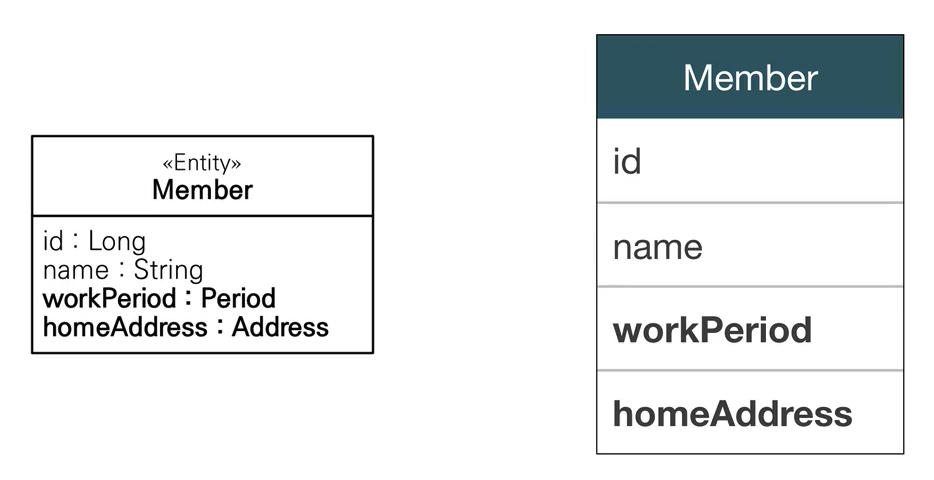
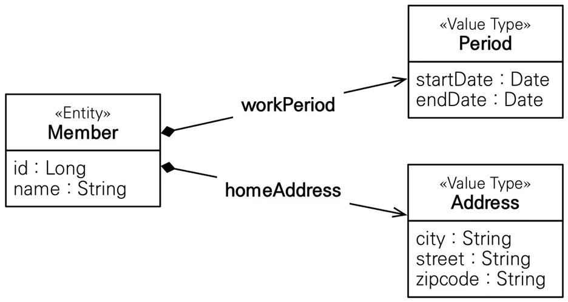
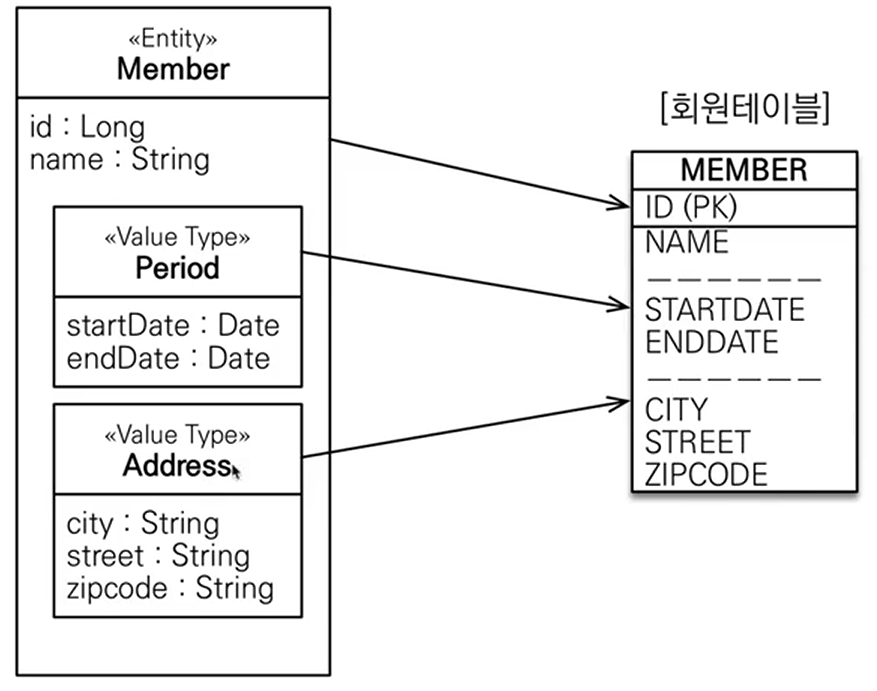
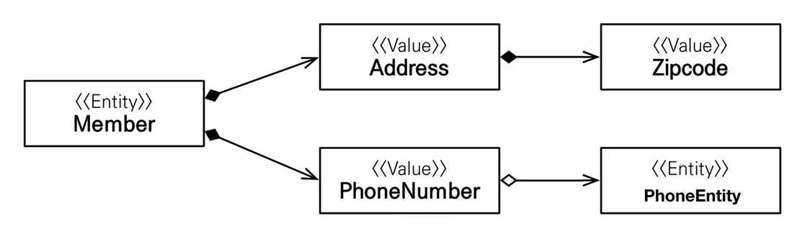
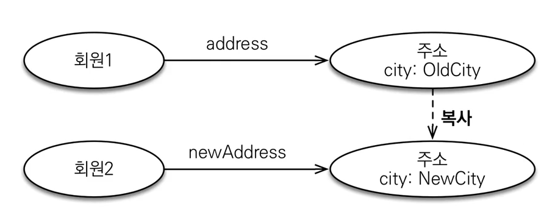
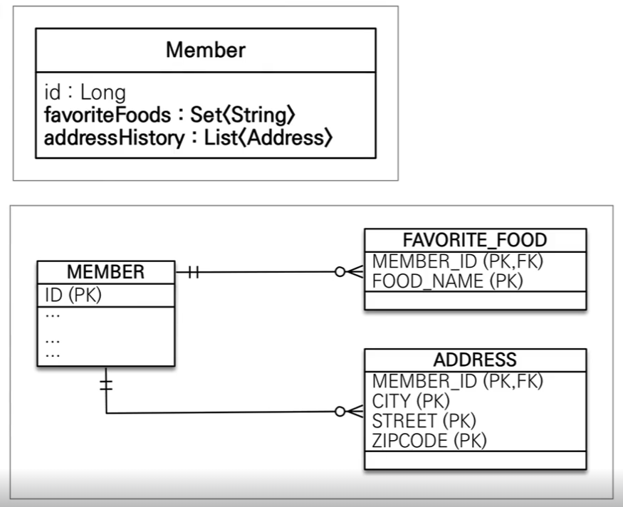

# 자바 ORM 표준 JPA 프로그래밍 - 기본편
## 값 타입 - 기본값 타입
### JPA의 데이터 타입 분류
#### Entity Type
- `@Entity`로 정의하는 객체
- 데이터가 변해도 식별자로 지속적으로 추적 가능
#### Value Type
- int, Integer, String 처럼 단순히 값으로 사용하는 자바 기본 타입이나 객체
- 식별자가 없고 값만 있으므로 변경 시 추적 불가
### 값 타입 분류
- 기본값 타입 
	- 자바 기본 타입(int, double)
	- 래퍼 클래스(Integer, Long, ...)
	- String
- 임베디드 타입(embedded type, 복합값 타입)
- 컬렉션 값 타입(collection value type)
### 기본값 타입 
- 생명주기를 Entity 에 의존한다. 
	- 예시 ) 회원 삭제 -> 내부 나이 필드 함께 삭제 됨
- 값타입은 공유하면 안됨 
	- 예시 ) 회원 이름 변경 시, 다른 회원의 이름도 함께 변경되면 안됨
### [참고] 자바의 기본타입은 공유되지 않는다
- java의 구조상 primitive type은 stack에 저장되므로, 공유되지 않는다. 즉, 항상 값이 복사되서, 각 변수의 값으로 지정된다. 
- 그러나, primitive가 아닌 타입들은 모두 heap에 저장되고, 변수는 그 heap을 가리키므로 구조가 다르다. 또한 Integer, String 같은 특수 케이스는 공유 가능하지만, 변경이 안된다. 
## 값 타입 - 임베디드 타입 ⭐
### 임베디드 타입 
- 새로운 값 타입을 직접 정의할 수 있다. 
- JPA는 임베디드 타입이라고 부른다. 
- 주고 기본값 타입을 모아서 만들어서 복합값 타입(Composit value type)이라고도 부른다. 
- int, String과 같은 `값 타입`
- 예시 : 회원 엔티티는 이름, 근무 시작일, 근무 종료일, 주소 도시, 주소 번지, 주소 우편번호를 가진다. 
	- 이 경우 회원 엔티티는 이름, 근무기간, 집 주소를 가진다. 


> 한 마디로 클래스를 새로 만들어 타입을 커스텀 한 것
### 임베디드 타입 사용법 
- `@Embeddable` : 값 타입을 정의하는 곳에 표시 
- `@Embedded` : 값 타입을 사용하는 곳에 표시
- 기본 생성자 필수
### 임베디드 타입의 장점 
- 재사용
- 높은 응집도 
- Period.isWork() 와 같이 해당 값 타입만을 사용하는 의미 있는 메소드 만들 수 있다. (객체지향적 설계에 유효하다.)
- 임베디드 타입을 포함한 모든 값 타입은, 값 타입을 소유한 엔티티 생명주기를 의존한다. 
### 임베디드 타입과 테이블 매핑

```java
// Member.java
@Entity
public class Member extends BaseEntity {
	@Id
	@GeneratedValue
	@Column(name = "MEMBER_ID")
	private Long id;

	@Column(name = "USERNAME")
	private String username;

	// 기간 period
	// private LocalDateTime startDate;
	// private LocalDateTime endDate;
	@Embedded
	private Period workPeriod;

	// 주소
	// private String city;
	// private String street;
	// private String zipcode;
	@Embedded
	private Address homeAddress;
}
```

```java
// Period.java
@Embeddable
public class Period {
	private LocalDateTime startDate;
	private LocalDateTime endDate;


	public Period(LocalDateTime start, LocalDateTime end) {
		this.startDate = start;
	}
	// 다양한 메서드... 후략
}

// Address.java
@Embeddable
public class Address {
	private String city;
	private String street;
	private String zipcode;

	public Address(String city, String, street, String zipcode) {
		this.city = city;
		this.street = street;
		this.zipcode = zipcode;
	}
	// 다양한 메서드... 후략
}
```
- 어노테이션은 Embeddable 만 필수다 
- 구성을 하게 되면 훨씬 객체지향적으로 구현되고, 대신 테이블은 임베디드 타입이 아닌 경우와 동일하게 구성 된다. 
### 임베디드 타입과 테이블 매핑 
- 임베디드 타입은 Entity의 값일 뿐이다. 
- 임베디드 타입을 사용하기 전과 후의 테이블은 동일하다. 
- 객체와 테이블을 아주 세밀하게(find-grained) 매핑하는 것이 가능하다. 
- 잘 설계한 ORM 애플리케이션은 매핑한 테이블의 수보다 클래스의 수가 더 많다.
### 임베디드 타입과 연관관계 

- 지금까지 설명한 것 처럼 값타입인 Address는 값타입인 Zipcode를 가질 수 있다. 
	- 당연히 Embedded 안에 @Column이나 JPA와 관련한 어노테이션을 가질 수 있다. 
- 값 타입인 PhoneNumber는 Entity를 가질수 있다(!) 
	- 왜냐하면 FK 를 가지는 것은 전혀 어려운 문제가 아니기 때문이다. 
### @AttributeOverride: 속성 재 정의 
- 한 엔티티에서 같은 값 타입이 필요한 경우? 
	- 예시 ) 사용자의 집주소, 근무 주소가 둘다 같은 Address 타입이라면?
- 컬럼명이 중복됨 -> 기본적으로 두개를 넣으면 에러 발생 
- `@AttributeOverrides`, `@AttributeOverride` 를 사용해서 컬럼 명 속성을 재정의 가능하다. 
```java
// Member.java
@Entity
public class Member extends BaseEntity {
	@Id
	@GeneratedValue
	@Column(name = "MEMBER_ID")
	private Long id;

	@Column(name = "USERNAME")
	private String username;

	// 기간 period
	@Embedded
	private Period workPeriod;

	// 주소
	@Embedded
	private Address homeAddress;
	@Embedded
	@AttributeOverrides({
		@AttributeOVerride(name="city", column=@Column("WORK_CITY")),
		@AttributeOVerride(name="street", column=@Column("WORK_STREET")),
		@AttributeOVerride(name="zipcode", column=@Column("WORK_ZIPCODE")),
	})
	private Address workAddress;
}
```
### 임베디드 타입과 null
- 임베디드 타입이 null이면 내부 구성요소도 모두 null로 기록된다. 
## 값 타입 - 값 타입과 불변 객체
- 값타입은 복잡한 객체 세상을 조금이라도 단순화하려고 만든 개념이다. 따라서 값 타입은 단순하고 안전하게 다룰 수 있어야 한다. 
### 값 타입 공유 참조 
- 임베디드 타입과 같은 값 타입을 여러 엔티티에서 공유하면 위험하다. 
- 부작용이 발생할 수 있다. 
	- 예시 ) 유저 1, 유저 2의 주소를 같은 값타입 변수로 설정한다. -> 이후 유저 1의 주소를 바꿔도 유저 2가 같이 변경이 발생한다. -> 이러한 위험을 막기 위해선 무조건 생성 시에는 값을 복사해서 쓸 수 있도록 만들어야 한다. 
	- 만약 의도한 것이라면? -> 이 경우엔 특히나 Entity로 차라리 아예 분리를 시키고 FK로 관계를 연결 시켜 둬야 한다. 
### 값 타입 복사 
- 값 타입의 실제 인스턴스인 값을 공유하는 것은 위험
- 대신 값(인스턴스)를 복사해서 사용해야 한다. 

### 객체 타입의 한계 
- 항상 값을 복사해서 사용하면, 위에서 언급한 공유 참조 부작용은 해결할 수 있다.
- 문제는 임베디드 타입처럽 <mark style="background: #FF5582A6;">직접 정의한 값 타입은 자바 기본 타입이 아니라 '객체 타입' 이다.</mark>
- 자바 기본 타입에 값을 대입하면 값을 복사한다. 
- <mark style="background: #FF5582A6;">객체 타입은 참조 값을 직접 대입하는 것을 막을 방법이 없다.</mark> 
- <mark style="background: #FF5582A6;">객체의 공유 참조는 피할 수 없다.</mark>
### 불변 객체 
- 객체 타입을 수정할 수 없게 만들면 부작용을 원천 차단해버릴 수 있다. 
- 불변 객체로 설계해야 한다
- 불변 객체: 생성 시점 이후 절대 값을 변경할 수 없는 객체 
- 생성자로만 값을 설정하고, 수정자를 만들지 않으면 됨
- 참고 ) Integer, String은 대표적인 자바 불변 객체다. 
## 값 타입 - 값 타입의 비교
### 값 타입의 비교 
- 인스턴스가 달라도 그 안에 값이 같으면 같은 것으로 취급 되어야 한다. 
- 동일성(identity) 비교 : 인스턴스의 참조 값을 비교, == 사용
- 동등성(equivalence) 비교 : 인스턴스의 값을 비교, equals() 사용 
- 값 타입은 `a.equals(b)` 의 형태를 사용해서 동등성을 비교해야 한다. 
- 값 타입의 equals() 메소드를 적절하게 재정의가 필요하다.(가능하면 자동으로 생성해주는 것을 따라가고, hashCode도 함께 정의되어야 한다.)
## 값 타입 - 값 타입 컬렉션 ⭐
### 값 타입 컬렉션

- 결론 -> 일대다의 별도의 테이블로 구성하는 것이 핵심이다. 
- 단 이때, Entity화 하지 않기 위해, 값타입으로 만들기 위해서는 모든 구성요소들을 PK로 하는 값을 만들어 내야 한다. 
### 값 타입 컬렉션 
- 값 타입을 하나 이상 저장할 때 사용 
- `@ElementCollection`, `@CollectionTable` 을 써서 기록한다
- 데이터베이스는 컬렉션을 같은 테이블에 저장할 수 없다. 
- 컬렉션을 저장하기 위한 별도의 테이블이 필요함. 
```java
//Member 예시 ...
public class Member extends BaseEntity {
	// 전략
	@ElementCollection 
	@CollectionTable(name = "FAVORITE_FOOD", joinColumn = 
		@JoinColumn(name = "MEMBER_ID")
	)
	@Column(name = "FOOD_NAME") // 값이 하나 뿐일 땐 예외적으로 가능
	private Set<String> favoriteFoods = new HashSet<>;

	@ElementCollection 
	@CollectionTable(name = "ADDRESS", joinColumn = 
		@JoinColumn(name = "MEMBER_ID")
	)
	private List<Address> addressHistory = new ArrayList<>;
	// 후략
}
```
### 값 타입 컬렉션 사용 
- 값 타입 저장 예제 
- 값 타입 조회 예제 : 지연 로딩 전략 사용 
- 값 타입 수정 예제 
- 참고 : 값 타입 컬렉션은 영속성 전에(Cascade), 고아 객체 제거 기능을 필수로 가진다. 
### 값 타입을 컬렉션의 제약사항 
- 값 타입은 Etntity와 다르게 식별자 개념 없음 
- 값 변경시 추적 어려움 
- 값 타입 컬렉션에 변경 사항이 발생하면, 주인 엔티티와 연관된 모든 데이터를 삭제하고, 값 타입 컬렉션에 있는 현재 값을 모두 다시 저장한다. 
- 값 타입 컬렉션을 매핑하는 테이블은 모든컬럼을 묶어서 기본키를 구성한다: null입력 x, 중복 저장 x)
### 값 타입 컬렉션 대안 
- 실무 상황에서는 상황에 따라 <mark style="background: #FF5582A6;">값 타입 컬렉션 대신 일대다 관계</mark>를 고려해라. 
- 일대다 관계를 위한 엔티티를 만들고 여기에서 값타입을 사용
- 영속성 전이(Cascade) + 고아 객체 제거를 사용해서 값 타입 컬렉션처럼 사용한다. 
```java
//Member 예시 ...
public class Member extends BaseEntity {
	// 전략
	@ElementCollection 
	@CollectionTable(name = "FAVORITE_FOOD", joinColumn = 
		@JoinColumn(name = "MEMBER_ID")
	)
	@Column(name = "FOOD_NAME") // 값이 하나 뿐일 땐 예외적으로 가능
	private Set<String> favoriteFoods = new HashSet<>;

	// @ElementCollection 
	// @CollectionTable(name = "ADDRESS", joinColumn = 
		@JoinColumn(name = "MEMBER_ID")
	)
	// private List<Address> addressHistory = new ArrayList<>;

	// 개선된 버전, 훨씬 응용이 편리하다
	@OneToMany(cascade = CascadeType.All. orphanRemoval = true)
	@JoinColumn(name = "MEMBER_ID")
	private List<AddressEntity> addressHistory = new ArrayList<>();
	// 후략
}
```
### 정리 
#### Entity Type 
- 식별자 
- 생명 주기 관리
- 공유
#### Value Type
- 식별자 없음
- 생명주기는 Entity 에 의존 
- 공유하지 않는 것이 안전(복사하여서 사용)
- 불변 객체로 만드는 것이 안
## 값 타입 - 실전 예제 6 - 값 타입 매핑

---
## 객체지향 쿼리 언어 1 - 기본문법 : 소개
## 객체지향 쿼리 언어 1 - 기본문법 : 기본 문법과 쿼리 API
## 객체지향 쿼리 언어 1 - 기본문법 : 프로젝션(SELECT)
## 객체지향 쿼리 언어 1 - 기본문법 : 페이징
## 객체지향 쿼리 언어 1 - 기본문법 : 조인
## 객체지향 쿼리 언어 1 - 기본문법 : 서브 쿼리
## 객체지향 쿼리 언어 1 - 기본문법 : JPQL 타입 표현과 기타식
## 객체지향 쿼리 언어 1 - 기본문법 : 조건식(CASE 등)
## 객체지향 쿼리 언어 1 - 기본문법 : JPQL 함수 
---
## 객제지향 쿼리 언어 2 - 중급 문법 : 경로 표현식
## 객제지향 쿼리 언어 2 - 중급 문법 : 페치 조인 1 - 기본
## 객제지향 쿼리 언어 2 - 중급 문법 : 페치 조인 2 - 한계
## 객제지향 쿼리 언어 2 - 중급 문법 : 다형성 쿼리
## 객제지향 쿼리 언어 2 - 중급 문법 : 엔티티 직접 사용
## 객제지향 쿼리 언어 2 - 중급 문법 : Named 쿼리
## 객제지향 쿼리 언어 2 - 중급 문법 : 벌크 연산

```toc

```
