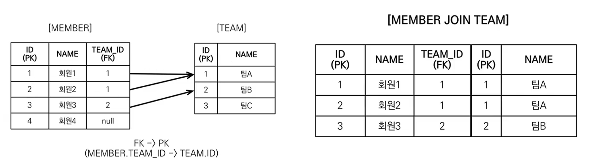
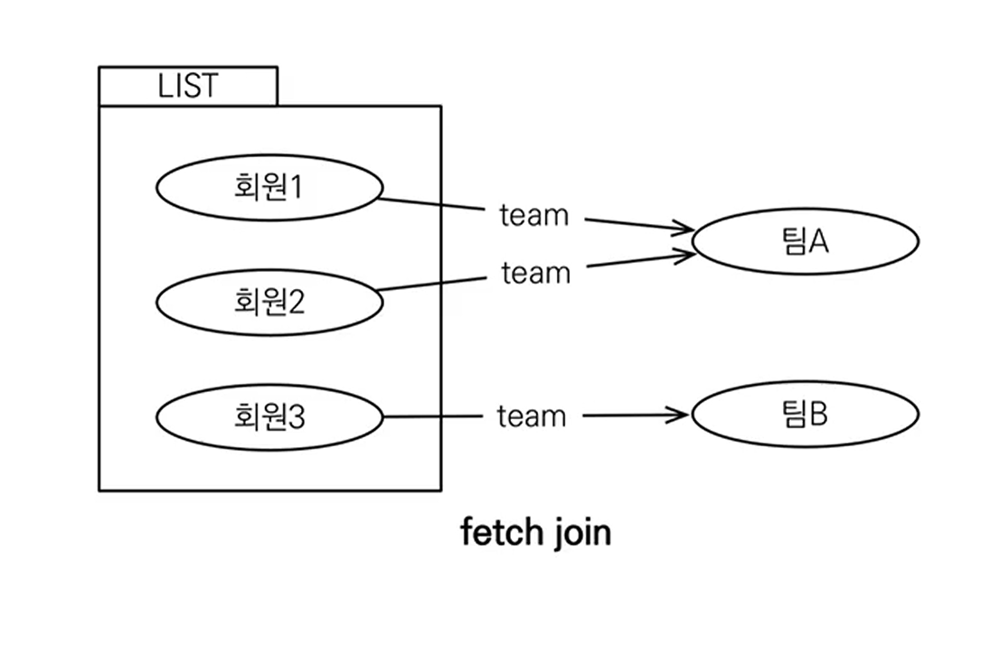
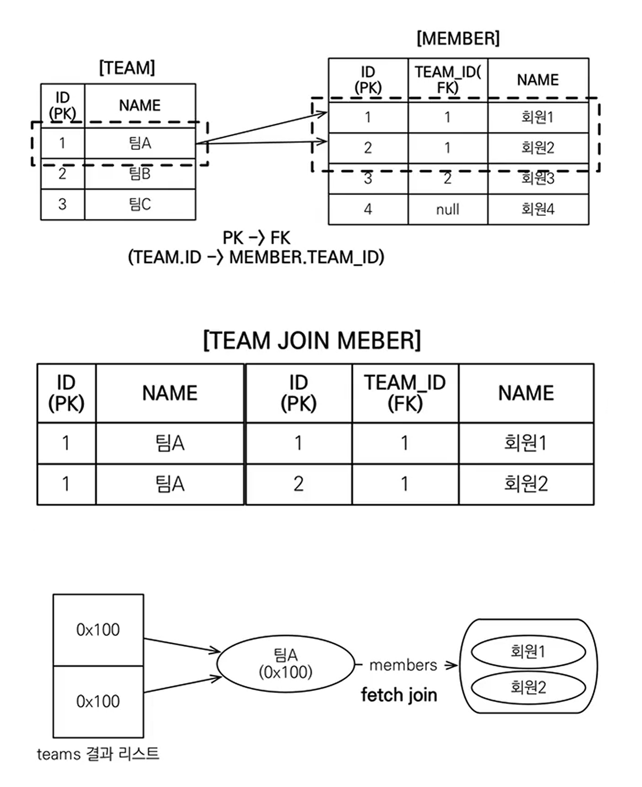

# 자바 ORM 표준 JPA 프로그래밍 - 기본편
## 객제지향 쿼리 언어 2 - 중급 문법 : 경로 표현식
### 경로 표현식 
- 개념 : 테이블 간의 관계를 통해 복합 객체 내의 속성에 접근할 수 있도록 돕는 것을 말한다. 
- 경로 표현식을 사용하는 이유 
	- 복합객체접근 : JPA 엔티티의 관계를 활용하여 복합 객체 내의 속성을 접근할 수 있다. 
	- 쿼리 간소화 : 복잡한 쿼리를 더 간단하고 읽기 쉽게 만들어준다. 이로써 개발자는 복잡한 조인 연산 없이도 필요한 데이터를 쉽게 접근이 가능하다. 
	- ORM과의 호환성 : 현대 ORM 프레임워크는 경로 표현식을 사용하여 데이터베이스와 객체 지향 프로그래밍 언어 사이의 간격을 연결한다. 
- 점을 찍어 객체 그래프를 탐색하는 것
```sql
select m.username -> 상태 필드
	from Member m 
		join m.team t -> 단일 값 연관 필드
		join m.orders o -> 컬렉션 값 연관 필드
where t.name = '팀A'
```
### 경로 표현식 용어 정리 
- 상태 필드(state field) : 단순히 값을 저장하기 위한 필드(ex: m.username)
- 연관 필드(association field) : 연관관계를 위한 필드 
	- 단일 값 연관 필드 : `@ManyToOne`, `@OneToOne`, 대상이 엔티티(ex: team)
	- 컬렉션 값 연관 필드 : `@OneToOne`, `@ManyToMany`, 대상이 컬렉션(ex: m.orders)
### 경로 표현식 특징 
- 상태필드 : 경로 탐색의 끝, 탐색 ❌, 더 이상의 깊이가 없다. 
- 단일 값 연관 경로 : 묵시적 내부 조인(inner join) 발생, 탐색 ⭕, 더 내부의 객체로 탐색이 가능하다. 묵시적 내부조인이란, 객체 입장에선 . 을 눌러서 좀더 쉽게 접근하는 것으로 보이지만, 막상 내부적으로 성능 면에서 조인이 발생하는 만큼 실무에서 조심스럽게 사용해야함. 
	- 따라서 실무에서는 묵시적 내부 조인이 일어나도록 하면 안되고, 성능에 지대한 영향을 주고 튜닝이 매우 어려워진다. 
- 컬렉션 값 연관 경로 : 묵시적 내부 조인 발생, 탐색 ❌, 컬렉션 값의 경우 SIZE 정도를 제외하면 .으로 내부로 들어가 탐색 가능한 것이 거의 없어 쓸모가 없다. 
	- FROM 절에서 명시적 조인을 통해 별칭을 얻으면 별칭을 통해 탐색 가능
### 상태 필드 경로 탐색
- JPQL : `select m.username, m.age from Member m`
- SQL : `select m.username, m.age, from Member m`
### 단일 값 연관 경로 탐색 
- JPQL : `select o.member from Order o`
- SQL : `select m.* from Orders o inner join Member m on o.member_id = m.id`
### 명시적, 묵시적 조인
- 명시적 조인 : join 키워드 직접 사용하는 조인
	- `select m from Member m join m.team t`
- 묵시적 조인 : 경로 표현식에 의해 묵시적으로 SQL 조인이 발생하는 경우(내부 조인만 가능)
	- `select m.team from Member m`
### 경로 표현식의 예제 
```sql 
select o.member.team from Order o -> 성공
select t.members from Team -> 성공
select t.members.username from Team t -> 실패 
select m.username from Team t join t.members m -> 성공
```
### 경로 탐색을 사용한 묵시적 조인 시 주의사항 
- 항상 내부 조인 
- 컬렉션은 경로 탐색의 끝, 명시적 조인을 통해 별칭을 얻어야 함
- 경로탐색은 주로 SELECT, WHERE 절에서 사용하지만 묵시적 조인으로 인해 SQL의 FROM(JOIN) 절에 영향을 줌
### 실무 조언
- 가급적 묵시적 조인 대신에 <mark style="background: #FF5582A6;">명시적 조인 사용</mark> 
- 조인은 SQL 튜닝에 중요 포인트 - 성능에 지대한 영향을 준다.
- 묵시적 조인이 일어나는 상황을 한눈에 파악하기 어려움. (이게 문제이므로 결국 사용을 안 하는게 낫다.)
## 객제지향 쿼리 언어 2 - 중급 문법 : 페치 조인 1 - 기본
### 페치 조인(fetch join)
- SQL 조인 종류 ❌
- JPQL에서 성능 최적화를 위해 제공하는 기능 
- 연관된 엔티티나 컬렉션을 SQL 한 번에 함께 조회하는 기능
- join fetch 명령어 사용 
- 실무에서 정말 많이 사용하는 중요한 기술이다. 
- 페치 조인 ::= `[LEFT [OUTER] | INNER] JOIN FETCH 조인경로`


### 엔티티 페치 조인 
- 회원을 조회하면서 연관된 팀도 함게 조회(SQL 한 번에)
- SQL을 보면 회원 뿐만 아니라 팀`(T.*)`도 함께 `SELECT`
- JPQL : `select m from Member m join fetch m.team`
- SQL : `SELECT M.*, T.* FROM MEMBER M INNER JOIN TEAM T ON M.TEAM_ID = T.ID`

### 페치 조인 사용 코드 
```java
String jpql = "select m from Member m join fetch m.team";
List<Member> members = em.createQuery(jpql, Member.class).getResultList();
for (Member meber : members) {
	System.out.println("username = " + member.getUsername() + ", " + 
						"teamName = " + member.getTeam().name());
}
```
- 최초의 검색 시 영속성 컨텍스트가 들어가므로, 뒤에 걱정없이 일괄 호출이 가능하다. 
### 컬렉션 페치 조인
- 일대다 관계, 컬렉션 페치 조인 
- JPQL : `select t from Team t join fetch t.members where t.name = '팀A`
- SQL : `SELECT T.*, M.* FROM TEAM T INNER JOIN MEMBER M ON T.ID = M.TEAM_ID WHERE T.NAME = '팀A'`
- <mark style="background: #FF5582A6;">이렇게 할 경우 일대 다로 원하는 데이터를 잘 들고는 오나, 중복이 발생하는 관계에서 값이 여러개가 나올 수 있다...!</mark>

### 컬렉션 페치 조인 사용 코드 
```java
String jpql = "select t from Team t join fetch t.members where t.name = '팀A'";
List<Team> teams = em.createQuery(jpql, Team.class).getResultList();
for (Team team : teams) {
	Suystem.out.println("teamname = " + team.getName() + ", team = " + team);
	for (Member member : team.getMembers()) {
		//페치 조인으로 팀과 함게 조회해서 지연로딩 발생 안함 
		System.out.println("-> username = " + member.getUsername() + " , member = " + member);
	}
}
```
- 이렇게 출력하면, 하나의 팀에 참여한 인원수 만큼 같은 값이 나올 수 있다. 
- 이러한 형태는 JPA 기본 스펙에서 지원하는 형태이기 때문이며, 실제로 이러한 값을 원한 결과일 수 도 있기 때문에 DB는 그대로 전달, JPA도 그대로 전달해주게된다. 
### 페치 조인과 DISTINCT
- SQL의 DISTINCT 는 중복된 결과를 제거하는 명령 -> 단, 원래 DB에서도 이것 만으로 완벽하게 제거가 되지 않는다.
- JPQL의 DISTINCT 2가지 기능 제공(DB에서 주는 정도로 끝나지 않음)
	- SQL에 DISTINCT 를 추가한다. 
	- 애플리케이션에서 엔티티 중복제거
- `select distinct t from Team t join fetch t.memebers where t.name = '팀A'`
- SQL에 DISTINCT 를 추가하지만 데이터가 다르므로 SQL 결과에서 중복제거 실패

| ID<br>(PK) | NAME | ID<br>(PK) | TEAM_ID<br>(FK) | NAME |
| ---------- | ---- | ---------- | --------------- | ---- |
| 1          | 팀A   | 1          | 1               | 회원1  |
| 1          | 팀A   | 2          | 1               | 회원2  |
- DISTINCT 가 추가로 애플리케이션에서 중복 제거 시도 
- 같은 식별자를 가진 Team 엔티티 제거 
- 이러한 키워드인 distinct 는 반드시 일대다인 상황에서 성립되지, 다대일인 경우에선 중복이 발생하지 않는다.

### 페치 조인과 일반 조인의 차이
- 일반 조인 실행 시 <mark style="background: #FF5582A6;">연관된 엔티티를 함께 조회하지 않음</mark>. 자연스럽게 지연로딩의 설정이라면 그대로 작동하게 된다.
	- JPQL : `select t from Taem t join t.members m where t.name = '팀A`
	- SQL : `SELECT t.* FROM TEAM T INNER JOIN MEMBER M ON T.ID = M.TEAM_ID WHERE T.NAME = '팀A'`
- JPQL 은 결과를 반환할 대 연관 관계 고려 ❌
- 단지 SELECT 절에 지정한 엔티티만 조회할 뿐 
- 여기서는 팀 엔티티만 조회 하고 회원 엔티티는 조회 ❌
- 페치 조인을 사용할 태만 **연관된 엔티티도 함게 조회(즉시 로딩)**
- 페치 조인은 **객체 그래프를 SQL 한번에 조회하는 개념**
### 페치 조인 실행 예시 
- 페치 조인은 연관된 엔티티를 함게 조회함 
- JPQL : `select t from Team t join fetch t.members where t.name = '팀A'` 
- SQL : `SELECT T.*, M.* FROM TEAM T INNER JOIN MEMBER M ON T.ID = M.TEAM_ID WHERE T.NAME = '팀A'`
## 객제지향 쿼리 언어 2 - 중급 문법 : 페치 조인 2 - 한계
### 페치 조인의 특징과 한계 
- 페치 조인 대상에는 별칭을 줄 수 없다. : 하이버네이트 가능, 가급적 사용 ❌
	- 관례적인 면에서, 관리 차원에서 생각과 다를 수 있으므로 주의하라는 것이다. 
	- 실무에서 사용될 가능성이 있는 경우는, 여러 관계성을 걸쳐서 페치 조인이 필요한 경우일 수 있다. (Team -> Members -> Orders ...etc)
- **둘 이상 컬렉션은 페치 조인할 수 없다.** 
	- 일대다인 경우도 데이터가 늘어나거나 중복 등 정합성에서 문제가 발생하는데, 다대다로 진행이 된다면 정말 예상치 못한 일이 발생할 수 있다.
- 컬렉션을 페치 조인하면 페이징 API를 사용할 수 없다. 
	- 일대일 다대일 같은 단일 값 연관 필드들은 페치 조인해도 페이징 가능. 
	- 그러나 문제는 일대다인 경우 페이징 시 데이터 정합도 맞지 않으며, 오류도 발생할 수 있다. 
	- 하이버네이트는 경고 로그를 남기고 메모리에서 페이징(매우 위험)
### 페치 조인 - 정리 
- 모든 것 페치 조인으로 해결할 수 없음 
- 페치 조인은 객체 그래프를 유지할 때 사용하면 효과적 
- 여러 테이블을 조인해서 엔티티가 가진 모양이 아닌 전혀 다른 결과를 내야 하며, 페치 조인 보다는 일반 조인을 사용하고 필요한 데이터들만 조회해서 DTO로 반환하는 것이 효과적
## 객제지향 쿼리 언어 2 - 중급 문법 : 다형성 쿼리
### TYPE
- 조회 대상을 특정 자식으로 한정 
	- 예) Item 중 Book, Movie를 조회하라
- JPQL : `select i from Item i where type(i) IN (Book, Movie)`
- SQL : `SELECT i FROM Item WHERE i.DTYPE in ('B', 'M')`
### TREAT(JPA 2.1)
- 자바 타입 캐스팅과 유사
- 상속 구조에서 부모 타입을 특정 자식 타입으로 다룰 때 사용 
- FROM, WHERE, SELECT(하이버네이트 지원) 사용
- 예시 ) 부모인 Item 과 자식인 Book이 있다. 
	- JPQL : `select i from Item i where treat(i as Book).author = 'kim`
	- SQL : `SELECT i.* FROM Item i WHERE i.DTYPE = 'B' and i.author = 'kim'`
## 객제지향 쿼리 언어 2 - 중급 문법 : 엔티티 직접 사용
### 엔티티 직접 사용 - 기본 키 값 
- JPQL 에서 엔티티를 직접 사용하면 SQL 에서 해당 엔티티의 기본 키 값을 사용 
- JPQL : 
	- `select count(m.id) from Member m` : 엔티티의 아이디를 사용 
	- `select count(m) from Member m` : 엔티티를 직접 사용
- SQL : `SELECT COUNT(m.id) AS CNT FROM Member m` : JPQL 둘다 같은 다음 SQL 실행
- 엔티티를 파라미터로 전달 
```java
String jpql = "select m from Member m where m = :member";
List<Member> resultList = em.createQuery(jpql)
								.setParameter("member", member)
								.getResultList();
```
- 식별자를 직접 전달
```java
String jpql = "select m from Member m where m = :memberId";
List<Member> resultList = em.createQuery(jpql)
								.setParameter("memberId", memberId)
								.getResultList();
```
- 실행된 SQL : `SELECT m.* FROM Member m WHERE m.id=?`
## 객제지향 쿼리 언어 2 - 중급 문법 : Named 쿼리
### Named 쿼리 - 정적 쿼리 
- 미리 정의해서 이름을 부여해두고 사용하는 JPQL
- 정적 쿼리 
- 어노테이션, XML 에 정의
- 애플리케이션 로딩 시점에 초기화 후 재사용 
- **애플리케이션 로딩 시점에 쿼리를 검증**
### Named 쿼리 - 어노테이션 
```java 
@Entity
@NamedQuery(
		name = "Member.findByUsername",
		query = "select m from Member m where m.username = :username")
public class Member {
	//... 
}
```

```java
List<Member> resultList = 
	em.createQuery("Member.findByUsername", Member.class)
		.setParameter("username", "회원1")
		.getResultList();
```
### Named 쿼리 - XML 에 정의
- META-INF/persistence.xml
```xml 
<persistence-unit name="jpabook" >
	<mapping-file>META-INF/ormMember.xml</mapping-file>
```
- META-INF/ormMember.xml
```xml
<? xml version="1.0" encoding="UTF-8"?>
<entity-mappings xmlns="https://xmlns.jcp.org/xml/ns/persistence/orm" version="2.1">
	<named-query name="Member.findByUsername">
		<query><![CDATA[
			select m
			from Member m
			where m.username = :username
		]]></query>
	</named-query>

	<named-query name="Member.count">
		<query>select count(m) from Member m</query>
	</named-query>
</entity-mappings>
```
### Named 쿼리 환경에 따른 설정 
- XML이 항상 우선권을 가진다. 
- 애플리케이션 운영 환경에 따라 다른 XML을 배포할 수 있다.
## 객제지향 쿼리 언어 2 - 중급 문법 : 벌크 연산
### 벌크 연산 
- 재고가 10개 미만인 모든 상품의 가격을 10% 상승하려면? 
- JPA 변경 감지 기능으로 실행하려면 너무 많은 SQL 실행 
	- 1. 재고가 10개 미만인 상품 리스트로 조회
	- 2. 상품 엔티티의 가격을 10% 증가한다. 
	- 3. 트랜잭션 커밋 시점에 변경감지가 동작한다. 
- 변경된 데이터가 100건이라면 100번의 UPDATE SQL 실행됨
### 벌크 연산 예제 
- 쿼리 한 번으로 여러 테이블 로우 변경(엔티티) 
- excuteUpdate() 의 결과는 영향 받은 엔티티 수 반환 
- UPDATE, DELETE 지원 
- INSERT(insert into.. select, 하이버네이트 지원)
```java
String qlString = "update Product p " +
				  "set p.price = p.price * 1.1 " +
				  "where p.stockAmount < :stockAmount";

int resultCount = em.createQuery(qlString)
						.setParameter("stockAmount", 10)
						.executeUpdate();
```
### 벌크 연산 주의 사항 
- 벌크 연산은 영속성 컨텍스트를 무시하고 데이터베이스에 직접 쿼리
	- 벌크 연산을 먼저 실행 -> 이렇게 하면 애초에 문제 발생 안함 
	- 벌크 연산 수행 후 영속성 컨텍스트 초기화 -> 이 경우 꼬일 수 있으니, 벌크 연산 후 바로 플러시를 날려버리고 데이터의 문제를 없애버리면 된다. 
```java 
Member member3 = new Member();
member3.setUsername("회원3");
member3.setAge(0);
member3.setTeam(teamB);
em.persist

int resultCount = em.creatQuery("update Member m set m.age = 20").executeUpdate();

Member findMember = em.find(Member.class, member3.getId());
System.out.println("findMemember = " + findMember.getAge()); // 여기서 에러 발생 
// 왜냐면 Update 구분이 영속성 컨텍스트에 반영이 안되고
// DB 자체만 수정했고 
// 영속성 컨텍스트에 아직 member3 가 존재하므로, age 는 0인 경우만 가지고 있다. 
```

```java 
Member member3 = new Member();
member3.setUsername("회원3");
member3.setAge(0);
member3.setTeam(teamB);
em.persist

int resultCount = em.creatQuery("update Member m set m.age = 20").executeUpdate();

em.clear(); // 강제 영속성 초기화(member3가 사라짐)

Member findMember = em.find(Member.class, member3.getId());
System.out.println("findMemember = " + findMember.getAge());
```

```toc

```
