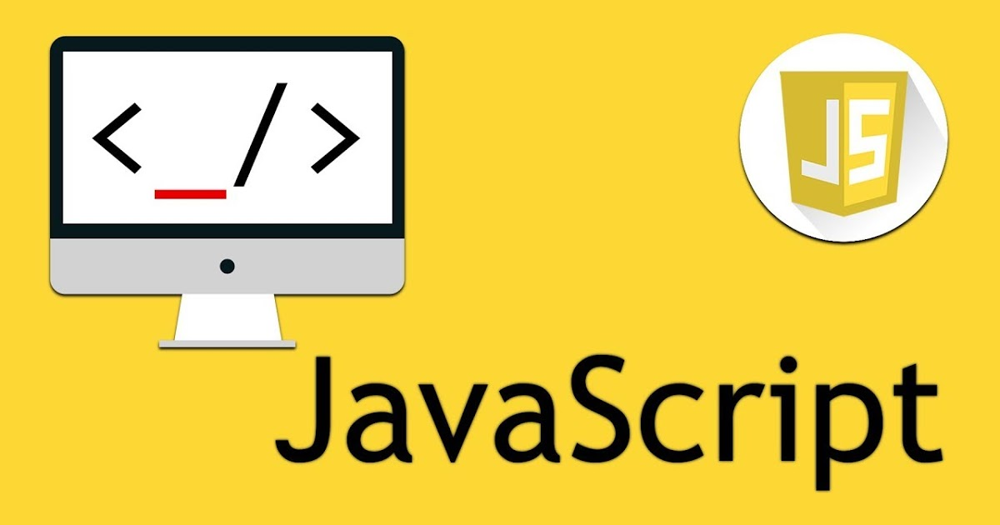
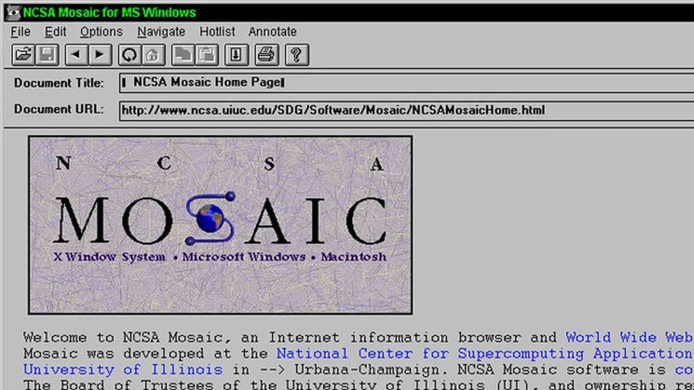
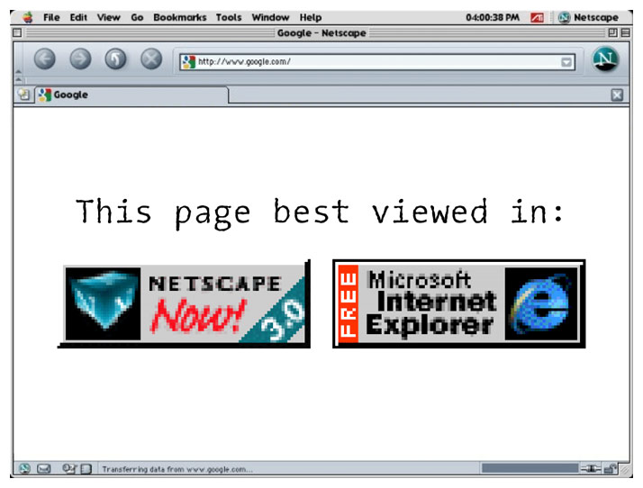
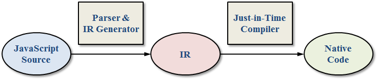
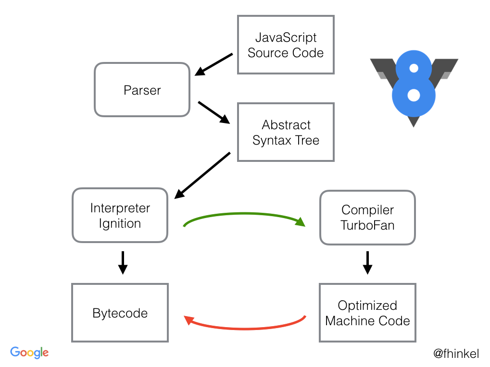
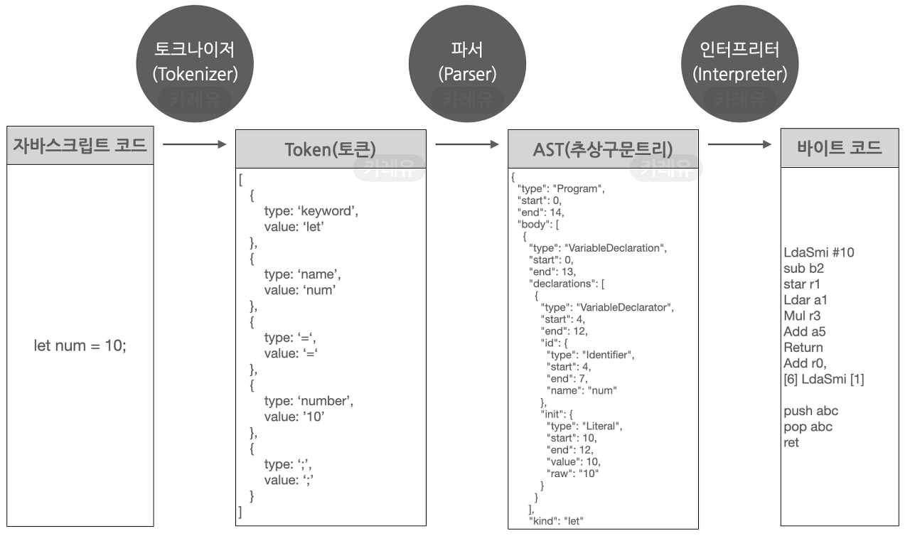
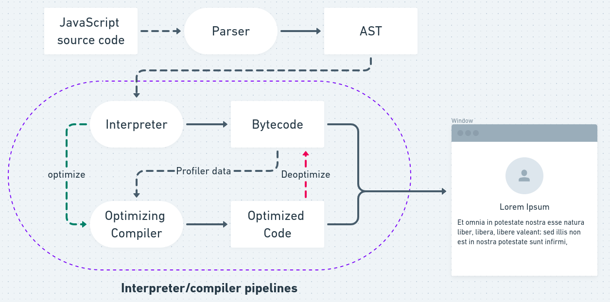

# 자바스크립트

## 자바 스크립트의 개요
JavaScript 는 가벼운  인터프리터 혹은 JIT 컴파일 프로그래밍 언어로 보통 웹 페이질를 위한 스크립트 언어로 알려져 있지만, 자바 런타임 엔진을 통해 비브라우저 환경에서 동작하기도 하는 프로그래밍 언어이다. 기본적으로 프로토타입 기반, 다중 패러다임, 단일 스레드, 동적 언어로 객체지향형, 명령형, 선언형 스타일을 지원한다. 
JS의 표준은 ECMAScript 언어 사양(ECMA-262) 와 국제화 API 사양(ECMA-402) 이다. 

## JS의 역사
1993년 PC의 보급이 시작되던 시절, 네트워크 환경에서의 컴퓨터를 잘 모르는 사람도 쉽게 사용이 가능한 UI 요소가 가미된 브라우저 Mosaic Web Browser가 출시하게 된다. Marc Andreessen이 최초로 만든 브라우저였다. 

네트워크 세상이 열리고, 그는 기존의 노하우를 살려 Netscape 라는 회사를 설립하고, 94년도에 이르러선 좀더 UI를 다듬고 Netscape Navigator 라는 브라우저를 시장에 진출하게 된다. 당시에는 HTML, CSS의 기본적인 기능만 지원되었으나, 그럼에도 선풍적인 인기로 시장을 장악해 나갔다. 
그러나 정적인 요소들만을 지원하며 동적으로 반응하지 못하는 한계를 개선하고 싶었던 그는 이러한 동적 기능을 위한 추가 스크립트 식 언어를 추가하기로 했다. 여기엔 몇 가지 다른 대안도 있었지만 (대표적인 예시가 Java), 이는 적절하진 못했고, 이에 Scheme 을 만든 Brenden Eich 를 영입하면서 새로운 언어 Mocha 를 만들게 된다. 이후엔 이름도 바뀌어 LiveScript라고 부르게 되며 해당 스크립트를 해석하고 실행하는 인터프리터가 포함된 브라우저를 통해 개발자들이 동적인 요소의 실행을 스크립트를 통해 하고, 이걸로 DOM 요소들을 조작하는게 가능하다는 점을 강조한다. 
이후에 그들은 당시 Java가 인기에 편승하고자 이후에는 JavaScript라고 이름을 변경, 당연한 말이지만 이는 시장에 나름의 울림이 되고, 내노라 하는 기업들도 해당 시장에 대해 접근하기 시작한다. 특히 Miocrosoft 사는 Netscape 사의 성공을 보고 브라우저의 흥행을 예측하면서, NN 브라우저를 역으로 엔지니어링 하여 자신만의 스크립트 해석이 가능한 코드를 짜게 되면서, JScript라는 걸 만들게 되고, Internet Explorer 라는 프로그램을 발표, 단, 이때부터 서로 다른 브라우저의 호환성 문제가 발생하기 시작하면서 개발자들은 고통 받게 된다. 

결국 Netscape는 개판이 되는 개발 환경을 우려하여 JavaScript 의 표준안을 ECMA International 에 찾아가 제안하게 되고, 표준적인 스크립트를 ECMAScript 1이 출시하게 되지만, 이미 IE 점유율은 95% 이상인 마이크로소프트 입장에선 '내가 곧 법이다' 를 시전, ECMAScript를 만들었음에도 표준으로써 힘을 발휘하지 못하게 된다. 
이후에는 파이어폭스와 또 다른 ActionScript의 등장, Opera와 같은 브라우저들도 생겨나고, 정신 없는 상황이 이어진다. 하지만 그렇기에 더더욱 개발자들의 커뮤니티가 생겨나고, 그 사이에 강력한 라이브러리 들이 등장, 이러한 라이브러리 jQuery, dojo, mootools와 같은 것들은 항상 한가지 개발자가 다른 브라우저들을 일일히 고민하지 않도록 만드는 것을 초점으로 만들어졌고, 그 중에서도 jQuery 가 특히나 흥하게 된다. 단, 여전히 한끗이 부족한 상황이 이어진다. 

마소의 깡패짓, 점유율율찍누를 통해 공고하던 브라우저 시장은, 갑작스럽게 변동이 찾아오게 된다. 이는 구글에서 2008년 출시한 Chrome 때문이었다. 이 브라우저에 대해선 여러가지 이유가 있었겠지만 한 마디로 말하면 빨랐다. JIT 컴파일러를 탑재한 엔진은 JavaScript를 실행하는 속도가 매우 빨랐고, IE에 대한 피로도, 사용자들의 인식의 변화 등등... 바람은 구글에게 불어주었고, IE의 몰락은 눈에 보일 정도가 되었다. 당연히 이렇게 되자 위기감을 느낀 기업들은 2008년 7월에 이르러서야 생산적인 대화가 시작한다. 
2009년 ECMAScript 5, 2015년 ECMAScrpit 6 등장과 함께 JS라는 언어의 완성도는 급격하게 이루어진다. 라이브러리의 도움 없이 JS만으로도 충분히 웹 사이트, 웹 애플리케이션 구현이 가능해져 갔으며, 현재에 이르러서는 SPA의 구현도 충분히 가능해 졌고, 이러한 구현을 돕는 React, Angular, Vue, Svelt 와 같은 라이브러리의 탄생으로 웹 개발은 한층 편해졌다. 뿐만 아니라 V8엔진 덕에 node.js가 등장, 백엔드 서비스까지도 영향력을 줄 수 있게 되었으며, bun과 같이 이젠 더욱 v8도 넘어서서 빠른 성능을 자랑하는 런타임 엔진이 등장하는 등 지속적으로 JS의 영향력을 높여가고 있다. 
## 그렇다면 컴파일은 어떻게 하는가?
크롬의 등장 이후 현재의 대부분의 브라우저들은 JavaScript엔진에 대해 JIT 컴파일러 방식을 활용한다. 단 초기 버전에서는 단순환 JIT 컴파일 방식이었다면 지금에 들어서는 Adaptive 컴파일 방식으로 약간 변경이 되기는 했다. 
### Just-In-Time Compilation 
사실 자바를 좀 공부했다면 이미 알 것이지만, Java가 JIT 컴파일 방식을 활용해 JVM 내부에서 동작하는 바이트 코드들을 인터프리팅 하면서도 효과적으로 성능을 끌어올린다. 

이와 마찬가지로 JavaScript 를 Text 형태로 배포되면, 이를 중간 언어인 byte code로 변환하게 된다. 그런 다음 엔진은 인터프리터 모드라면 생성된 바이트 코드들을 한줄씩 읽고 동작하게 되고, JIT 모드라면 바이트 코드를 기반으로 native code를 생성, 이를 수행하게 된다. 
단, 이는 Java처럼 성능상의 이점이 무조건 있다- 는 것과는 조금 다르다. JITC는 컴파일 과정 자체가 수행 중에 발생하고, 이는 당연히 오버헤드가 생기니 무조건 인터프리터보다 낫다- 라고 하기엔 다소 문제가 있긴 하다. 그러나, 그럼에도 최소한의 최적화와 캐싱 기능을 통해 한 번 컴파일 되고 난 다음부터는 컴파일 없이 native 코드를 수행한다는 점 등에서 인터프리터보다 성능 상 월등한 이점을 가지다보니 JIT 컴파일 방식을 쓰게 된 것이다. 
그러나 여기서도 두 가지 문제를 지적받는데, JS는 공부 조금 해본 사람이라면 알듯이 변수의 타입이 수행 도중에 달라질 수 도 있고 object로 상속되는 prototype의 기반한 방식을 사용하는 등으로 매우 동적인 언어라는 점 따라서 native코드가 생성되는 경우에 다양한 경우를 고려해야하며, 따라서 생성되는 코드가 복잡해질 수 있다는 점. JS의 코드가 Java 처럼 컴퓨팅 능력이 필요한, 즉 연산이 많은 언어라기 보단 동적으로 대응하는 경우, 화면 레이아웃이 수정되는 등 전반적으로 Java처럼 동일 연산이 자주 반복되는,  `hotspot`이라고하는 특징이 발생이 적어 JIT 방식이 과연 효과적인가? 라는 지적이다.  최근 들어서는 웹의 기능이 무거워지고 HTML5에 들어서서 컴퓨팅적인 면, 복잡한 연산도 요구되는 점 등을 들어 달라지고 있긴 하지만.... 

### Adaptive JIT Compilation 
이런 상황이 이어지다 보니 현재의 JS 엔진들은 단순하게 JIT 방식을 통해 접근하는 방법보단  보다 융통성 있는 방법을 추구하여, adaptive compilation 이란 방식을 사용한다. 반복 수행의 정도를 보고, 그에 따라 서로 다른 최적화 수준을 적용하는 것이다. 

adaptive JITC들은 공통적으로 내부에 runtime profiler라는 것을 두며, 함수의 수행 빈도를 기록한다. 또한 사용하는 변수들의 값, 타입을 profiling  하다가 optimizing JIT 을 적용, 이들 정보를 native 코드로 생성하여 캐싱하는 식으로 성능을 끌어올리며, 그렇지 않은 경우 바이트 코드를 인터프리팅 하는 식으로 하여 최적화를 이루어냈다. 여기에 Hidden class, Inline Caching 과 같은 방식을 추가로 도입하여 엔진 내부에 삽입. JS 언어가 지원하지 않는 개념이지만 엔진 내부에 추가함으로써 훨씬 더 훌륭한 최적화를 구현해 냈다. 
### 구체적인 엔진 동작 방식
1. 코드를 의미 있는 조각으로 렉싱/ 토크나이징을 한다. 특히 그런 상황에서 Abstract Syntax Tree라는 구조로 파싱을 하게 되는데, 이러한 상태에서 바이트코드로 변환하는 것이 바로 Ignition(점화) 단계다. 
   
2. 이그니션 단계에서는 바이트 코드라는 형태의 결과물이 나오고, 일반적으로 JS가 수행된다. 
3. 이때 반복적이고, 자주 사용되는 경우등이 profiler를 통해 profiling 되고 있고, 그때 JIT이 등장, native 코드를 생성, 캐싱이 되면서 성능적 이점을 확보한다. 
4. 그러나 이러는 와중에 예외케이스가 발생하면 slow case라고 단정하며 점프하게 되는데, 이는 엔진 내부에 미리 C 등으로 구현된 helper function 을 호출하여 동작을 수행하여 빠르게 넘어가도록 한다. 
   
### 결론적으로...
JS는 결국 어느 한쪽에 귀결되는 언어가 아니게 되었다. 웹이라는 환경의 중요성은 계속 커지고, 접근성의 시작과도 같은 역할을 하게 되면서 이제는 GPU까지 사용하도록 요구되고 있고, native  앱과의 경계는 이미 2010년 후반대부터 무너지기 시작했다. 
인터프리터적으로 동작하지만, 한편으론 컴파일을 하는 방법을 갖고 있는 언어라고 이해하는 것이 가장 좋을 것이다. 
## 참고 자료 
[A crash course in just-in-time (JIT) compilers](https://hacks.mozilla.org/2017/02/a-crash-course-in-just-in-time-jit-compilers/)

[자바스크립트 엔진의 최적화 기법 (1) - JITC, Adaptive Compilation](https://meetup.nhncloud.com/posts/77)

[자바스크립트 엔진의 최적화 기법 (2) - Hidden class, Inline Caching](https://meetup.nhncloud.com/posts/78)

[JavaScript는 어떻게 컴파일될까?](https://velog.io/@wish/JavaScript%EB%8A%94-%EC%96%B4%EB%96%BB%EA%B2%8C-%EC%BB%B4%ED%8C%8C%EC%9D%BC%EB%90%A0%EA%B9%8C)

[JAVASCRIPT.INFO-자바스크립트 소개-자바스크립트란?](https://ko.javascript.info/intro)


```toc

```
