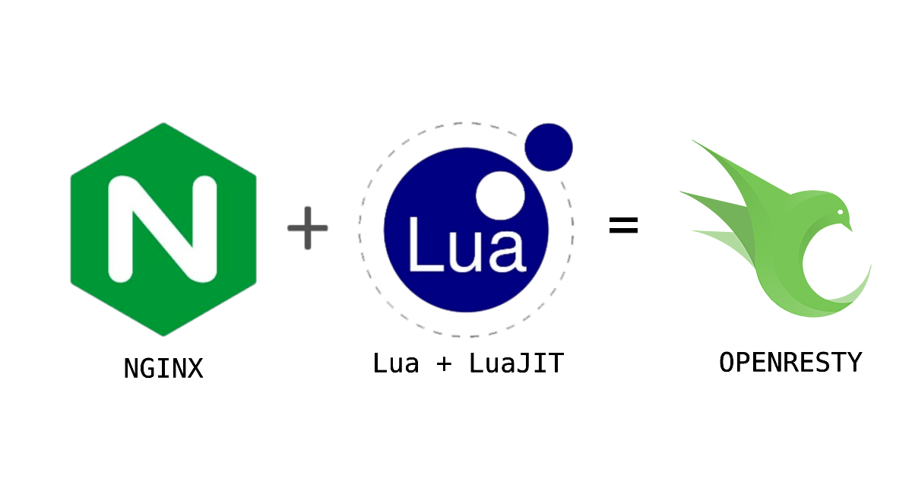

# Lua Script 란 
1993년 개발된 프로그래밍 언어. 브라질 리우데자네이루의 교황청대학교에서 호베르투 예루잘링스키 및 2명이 공동 제작했다. 달을 의미하는 포르투갈어 단어에서 따왔다. 스크립트 언어를 하나의 목적으로 가지고 있기 때문에 굉장히 작고 가벼운 인터프리터형 언어다. 

태생 자체가 C/ C++  프로그램 내부에 포함시키기 쉬운 깔끔한 문법의 가벼운 스크립트 언어를 목표로 개발 되었다.  교황청대학교 컴퓨터 그래픽 기술 연구소에서 내부적으로 개발해서 사용하던 기존의 데이터 처리용 스크립티 언어 SOL과 DEL의 한계를 극복할 더 강력한 언어가 요구되었다고 한다. 
## 언어적 특징 
### 가벼움 
인터프리터의 용량이 KB 단위로 작고 굉장히 빠르다. 굉장히 적은 데이터 형만 지원하고, 쉽게 붙일 수 있기에 절차적으로도, 객체지향적으로도, 함수형으로도 이용이 가능하다. 
### 문법적 특징
- 기본 자료형 : `nil, boolean, string, function, table, userdata, thread`
- null 이 Lua 에선 nil 로 쓴다.
- 진리값은 boolean 타입일 때, true, false가 참 거짓을 나타내고, boolean 타입이 아닐 경우 nil이 거짓, 나머지는 모두 참. C 언어랑 달리 0 도 참이다. 
- `==`의 반대 연산자는 `~=`를 쓴다.
- 논리 연산자는 `not`, `and`, `or` 로 쓴다. 
- bitwise 연산자는 `&, |, ~(이항 비트 XOR), >>, <<, ~(단항 비트 NOT)`
- `^`가 `xor`관련이 아닌 pow, 즉 거듭제곱 연산자이다. 
- 복합 대입 연산자는 지원하지 않는다.
- 문자열 합치기는 `A . . B`이다. 
- `self` 라는 예약어가 있는데, 예약어로 분류되진 않으나 콜론을 사용한 함수 호출시 `self` 변수를 다른 OOP 언어에서 제공하는 this나 self 변수처럼 함수 안에서 사용이 가능하다. 
- 반복 제어문에서 continue 는 없고, goto가 있어 비슷하게 구현이 된다. 
- 인덱스가 1부터 시작한다. 
- 함수가 일급객체다, 즉 함수를 만들어 변수에 대입하는 방식으로 작성이 가능하다. funtiuon(argument) return argument end 같이 한줄로 쓰기가 가능하다. 
- 기본 자료형의 thread 타입이 있으나, 실제로는 coroutine이다. 
- 문자열 패턴 매칭이라는, [정규 표현식](https://namu.wiki/w/%EC%A0%95%EA%B7%9C%20%ED%91%9C%ED%98%84%EC%8B%9D "정규 표현식")과 유사한 기능을 지원한다. 다만, 정규 표현식과 다르고 기능도 훨씬 단순하다. Lua 창시자가 직접 만든 라이브러리 [LPeg](http://www.inf.puc-rio.br/~roberto/lpeg/ "http://www.inf.puc-rio.br/~roberto/lpeg/")가 사실상 표준 패턴 매칭 라이브러리다.
- 다른 언어들과는 달리 삼항 조건 연산자 `(condition ? exprIfTrue : exprIfFalse)` 를 지원하지 않는다. `condition and exprIfTrue or exprIfFalse` 표현으로 대체 가능하다. 정확히는 `exprIfTrue`가 참이라는 보장이 있어야 대체 가능하다.
- Lua의 한 줄 주석은 `--Hello, World!`처럼 `--(문자)` 형식으로 적는다.
- Lua의 여러 줄 주석은 `--[[문자]]--` 형식으로 대괄호 2개를 붙여 적는다.
### 테이블 
Lua에서는 테이블은 우리가 흔히 아는 테이블과는 달리 배열과 딕셔너리 기능을 기본적으로 모두 할 수 있다.  

```lua
local Table = {2, 5, "s", true, false, a = 2, {2,4,f = 2}, "g"}
```
  
위와 같이 다른 언어의 배열과는 다르게 다양한 자료형을 키로 사용가능한데, 이것을 가지고 단순한 구조체, 배열 뿐만 아니라 객체, 클래스, 인터페이스 등을 구현해낼 수 있다. 사실 Lua의 테이블은 단순히 저장하는 것이 아니라 메타 테이블과 같이 써서 테이블에 기능을 붙일 수 있기 때문이다. 그래서 Lua를 잘 다루려면 테이블과 메타 테이블을 잘 다룰 수 있어야 한다.
### 함수형 프로그래밍 
Lua도 일단은 함수형 프로그래밍이 어느 정도 된다. 함수를 [익명함수](https://namu.wiki/w/%EC%9D%B5%EB%AA%85%ED%95%A8%EC%88%98 "익명함수")로 생성할 수도 있고 전달할 수도 있다([JavaScript](https://namu.wiki/w/JavaScript "JavaScript")에서 지원하는 정도와 비슷하다). 그리고 사실 파일로 저장해서 불러오는 스크립트 **자체**가 함수다. 대신 성능을 위해서 스택의 크기가 고정되어 있기 때문에 어떤 함수든지 지역 변수를 255개 이상 만들 수가 없다. 대신 전역 범위에 저장하는 `_G`라는 테이블이 존재한다.  
  
[클로저](https://namu.wiki/w/%ED%81%B4%EB%A1%9C%EC%A0%80#s-2.3 "클로저")와 익명함수를 지원한다.
  
다만 함수형 프로그래밍에서 흔히 쓰이는 `map`, `filter`, `reduce` 등의 함수가 기본적으로 제공되지는 않는다.
## Lua의 인기 이유 
1. <mark style="background: #FFB8EBA6;">경량성과 빠른 실행속도</mark> : Lua가 매우 경량의 언어이며, 런타임 오버헤드가 매우 낮다. JS가 이런 면에선 성능적인 이점이 부족하며, nginx를 기준으로 생각한다면 빠른 처리가 요구되는 프록시 서버에서 JS를 쓰기보단 Lua를 통해 빠르게 처리하는게 효과적일 수 있는 것이다. 
2. <mark style="background: #FFB8EBA6;">유연한 확장성</mark> : Lua 자체는 확장을 염두한 설계가 되어 있고 그렇기에 nginx를 포함 다양한 곳에서 작업이 수행 가능하게 구성되어 있다. 
3. <mark style="background: #FFB8EBA6;">쉬운 통합</mark> : nginx 등에서 통합을 위한 모듈이 잘 구성되어있고 복잡한 처리로직을 쉽게 구현할 수 있다. 

## 결론 Why Lua?
Lua 스크립트는 nginx 라는 프록시 서버에서 모듈로써 통합이 잘 되어 있고, 그 가벼움과 성능적 이점 덕분에 서버가 갖춰야 할 덕목을 해치지 않으면서도 필요한 기능을 쉽고 빠르게 구현이 가능하다. 물론  JS 가 개발자에게 더 친숙할 수는 있고 방대한 개발 생태계를 활용하는데 있어 이점은 크지만, 구현 가능한 내용이 Lua로 구현 가능하다고 판단이 선다고 하면 굳이 JS로 이를 구현하기보다 통합된 Nginx와 Lua의 장점을 활용하는게 더 낫다고 볼 수 있다. 

---
# Lua 프로그래밍 기초 문법

Lua는 로블록스 게임 개발을 위해 필요한 프로그래밍 언어이다.  
여태까지 사용했던 JAVA, PHP, JS와는 문법이 좀 달라서 가장 기초적인 문법들을 정리해보았다.  
  
## 1. 주석
```lua
-- 루아에서두개의 연속된 대쉬(--)는 그 대쉬가 있는 한 줄을 주석으로 처리한다.

--[[ 
	여러줄 주석을 사용하려면 이 형태를 이용한다.
]]--
```

## 2. 변수 - 범위(scope)
- Lua 에서는 변수선언할때 아무런 앞에 아무런 글자를 붙히지 않으면 범위가 전체(Global)에 해당한다. (global 일 때는 따로 정의를 하지 않는다.)
- 한 영역에서만 유효하려면 "local"로 정의한다.

```lua
print("What is local")

a=3 

print(a) // 3 

if true then 
  local a = 20 
  local b = "bbbbb"
  print (a) // 20
  print (b) // bbbb 
end

print (a) // 3
print (b) // nil
```

## 3. 유형, 변수타입 (Type)
Lua는 Java처럼 변수를 선언 할 때 타입을 설정할 필요는 없다.  
물론 형 자체는 존재한다.
- **nil** : 빈 값, type도 nil ( 자바의 null )
- **boolean** : true 또는 false 가진 값의 type 입니다
- **number** : 모든 숫자입니다. 정수, 소수점있는 숫자 모두 포함입니다.
- **string** : 문자를 갖고 있으면 문자형이 됩니다
- **function** : 로직을 포함한 함수를 나타내는 변수는 유형도 function 입니다
- **table** : 여러 변수들의 그룹을 나타내는 변수입니다. 아주 중요 ( Array유형도 table이다.) / 테이블을 클래스처럼 활용할 수도 있다.

```lua
local a = 10 
print (type(a)) // number

a= nil
print (type(a)) //nil

a = "hello"
print (type(a)) //string

a = 3123.1231
print (type(a)) //number

a = (1 > 3) 
print (type(a)) // boolean

a = {} 
print (type(a)) // table

b = {"Lua", "Tutorial"}
print (type(b)) // table

```

## 4. 연산자 (Operation)
자바와는 조금 다르다.  
자바의 "++" 같이 증가나 이런건 없다.

```lua
// 1. 수식 연산자
+ : 더하기
- : 빼기
* : 곱하기
/ : 나누기 --> 결과가 소수점까지 나와요
% : 나머지
^ : 몇 승

// 2. 관계 연산자 -  결과가 boolean
== : 같다
~= : 다르다
>
<
>=
<=
  
// 3. 논리연산자 - 결과가 boolean
and : A and B -- A 가 참이고 B가 참이여야 참
or : A or B -- A 또는 B 가 참이여야 참
not : 참이면 거짓, 거짓이면 참 

// 4. 기타 : 오히려 가장 쓸모 있는
.. : 두 문자를 붙여줌 
# : 배열/테이블의 갯수 카운트

//예시
local a = {"hi", " my", " name", " is", " nova"} 
print(a[1].."!!!"..a[2]..a[3]..a[4]..a[5]) print(#a)
                                                 
//결과
hi!!! my name is nova                                                 
```

## 5. 반복문
Lua에서 제공하는 반복 기능은  
1. while  
2. for  
3. repeat until  
4. ipairs / pairs ( table 대상 반복 )
---
**1. while (조건) do ~ end**
```lua
a = 10

while( a < 20 )
do
   print("value of a:", a)
   a = a+1
end
```

while 다음에 오는 조건이 참이 될 때까지 do ~ end 사이를 계속 실행한다.  
종종 while (true) 같은 것을 이용해서 무한히 돌게 만들기도 하는데, **그러면 사이에 반드시 wait() 같은 간격을 두어야 한다. 그런게 없이 while (true) 하면 바로 프로그램**은 종료된다.

**2. for ~ do ~ end**
```lua
for i = 10,20,1 
do 
   print(i) 
end
```

처음 값이 두번째 값이 될 때까지, 세번째 값을 처음 값에 더한다.  
세번째 값을 생략하면 (1) 이라고 생각해서 계속 더한다.

**3. repeat ~ until (조건)**
```lua
a = 10

repeat
   print("value of a:", a)
   a = a + 1
until( a > 15 )
```

while 과 거의 비슷한데 while (조건) do .... end 대신  
repeat .... until (조건)으로 표시한다.  
개인적으로 조건이 앞에 있는 것들이 혼동을 덜 줘서 가능하면 while을 사용한다.

## 6. 조건문

- **if (조건) then ~A~ else ~B~ end**
    
    조건이 참이면 A를 실행하고 거짓이면 B를 실행한다.  
    else ~B~ 부분은 없어도 상관없다.  
    즉, 조건이 참이면 A만 실행 아니면 그냥 바로 밖의 다음 줄로 진행이 된다.
    

```lua
local a  = false
local b = true

if (a and b)
then
    print ("A and B is true")
else
    print (" A or B is false")
end
```

- **if 문안의 if문**

```lua
if false
then
   print (1)
else if true
   then
      print (2)
   else
      print (3)
   end
end
```

## 7. 함수

**함수 정의 방법**

```lua
local function hihi (a,b) 
	print("hihihi") 
	return 123 
end 

hihi()  // hihihi
print(type(hihi)) // function
print(hihi) // function: abc...(함수의 위치주소)
print(hihi()) // hihihi 123
```

**함수 사용의 팁**  
1. 변수와 마찬가지로 local을 붙히면 해당 범위안에서 사용, 아무것도 없으면 global 함수가 된다.  
2. 함수의 파라미터 안에 다른 함수를 넣어서 함수 안에서 불러 쓸 수 있다.

```lua
myprint = function(param) 
	print("This is my print function - ##",param,"##") 
end 

function add(num1,num2,functionPrint) 
	result = num1 + num2 
	functionPrint(result) 
end 
    
myprint(10) 
add(2,5,myprint)
```

3. 파라미터가 미리 확정되지 않았을 때 ...형태로 넘겨서 함수 안에서 하나씩 불러 쓸 수 있다.

```lua
function average(...) 
	result = 0 
	local arg = {...} 
    for i,v in ipairs(arg) do 
      result = result + v 
	end 
    return result/#arg 
    end 
    
    print("The average is",average(10,5,3,4,5,6))
```
## 8. String

유용한 String들 모음  
1. 모든 글씨 대문자 : string.upper()  
2. 날짜를 자리수에 맞춰 표시 : string.format()  
3. 변수에 저장된 이름으로 대화 만들기 : "Hi! "..playername  
4. 반복되는 문장 함수로 표시 : string.rep("WHAT!",100)  
5. 날짜 등으로 자리수 고정해야할때 : string.format("%03d",aaa) 하면 빈칸에 0

**예시**

```lua
myname = "nobakee" 

print(string.upper(myname)) // NOBAKEE
 
date = 3; month = 5; year = 2020 
print(string.format("Date %02d/%02d/%03d", date, month, year)) // Date 03/05/2020

print("Hello! "..myname) //  Hello! nobakee
print(string.rep("WHAT! ", 100)) // WHAT! x100번
```
## 9. Array

> **다른언어들과 다르게 Lua에서는 Array의 첫번째 값의 인덱스가 1부터 시작한다.**

animals = {강아지,돼지,닭,고양이,말}

- 다른 언어 : animals[3] = 고양이
- Lua : animals[3] = 닭

**Array 기초 사용 예시**

```lua
texts = {} 
print(type(texts)) 

//#texts 는 texts라는 배열의 크기를 나타냄
texts = {"a","b","c","d","e","d","f"}
print("size : "..#texts) 
      for i=1,#texts do print(texts[i]) 
      end 
      
texts = {1,2,3,4,5} 
print("size : "..#texts) 
      for i=1,#texts do print(texts[i]) 
      end
```

**이중 Array 사용 예시**

```lua
m_array = {} 
  for i=1, 10 do 
    m_array[i] = {} 
  	for j=1, 10 do 
    m_array[i][j] = i*j 
  end 
end 

for i=1, 10 do 
  for j=1, 10 do
    print("["..i.."]["..j.."]"..m_array[i][j]) 
    end
  end
```

여기서 중요한 것은 값을 할당할 때  
m_array[i] = {} 로 미리 array를 쭉 선언해줘야 동작한다는 것이다.
## 10. table

**Table은 Lua의 유일한 자료구조 이다.**  
Table은 여러 다른 데이터들의 그룹이다.  
그안에는 숫자, 문자, 함수, 다른테이블 모두 포함 할 수 있다.  
이 Table을 활용해서 클래스처럼 사용하기도 하고, 배열로 사용하기도 한다.  
이전의 Array도 하나의 Table 이라고 볼 수 있다.

```lua
table = {"abc" , 1, 2, name = 'chan', age = 26, 999} 
```

> **위 예시 테이블에서 key값이 없는 값들은 array처럼 순서대로 1부터 시작하는 index를 가지게 된다.  
> 중간에 name = "chan" 처럼 키값을 가지는 값이 있으면 무시하고 index를 카운트한다.**
> 
> ```javascript
> // 테이블에서 값에 접근하는 예시
> table = {"abc" , 1, 2, name = 'chan', age = 26, 999} 
> table[1] = "abc"
> table[2] = 1
> table[3] = 2
> table[4] = 999
> table.name = 'chan' 
> table["name"] = 'chan' 
> ```

테이블을 선언할 때 값을 넣는 방법

```lua
// 테이블에서 값에 접근하는 예시
// 두 방법 모두 같은 결과
t1 = {x = 0, y = 1}
t2 = {}; t2.x = 0; t2.y = 1

//굳이 이럴 필요는 없겠지만 이 역시 같은 표현
t3 = {"red","yellow","blue"} 
t4 = {[1]="red",[2]="yellow", [3]="blue"}
```

> 테이블은 숫자 대신 'key'형태로 이름을 가질 수 있고, 호출할때는 ' . ' 으로 접근한다.

이런 그룹화된 table을 쉽게 다루기 위해서 **iterator** 이라는 반복을 도와주는 기능이 제공된다.  
for문과 함께 사용하여 쉽게 table 내부를 반복 할 수 있다.

- **pairs** : 테이블 안의 index, key index **무관하게 전체**를 보여준다.
- **ipairs** : 테이블 안의 **숫자 index만** 뽑아서 보여준다.

```lua
table = {"abc" , 1, 2, name = 'chan', age = 26, 999} 

//pairs 예시
print('pairs 테스트')
for key, value in pairs(table) do
  print ("key: "..key, "value: "..value)
end
//결과 : table 안의 내용 모두 출력 (key:1 value:"abc"..)형태


//ipairs 예시
print('pairs 테스트')
for index, value in ipairs(table) do
  print ("index: "..index, "value: "..value)
end
//결과 : table 안의 key값들을 제외한 내용 출력 (index:4 value:999..)형태


//결과값 테스트
print("결과")
print (table.name) //chan
print (table["name"]) // chan
print (table[1]) //abc
```

**테이블을 클래스처럼 사용하는 방법은 추후에 업데이트 예정**  
(테이블과 메타테이블을 활용해 클래스처럼 만들수 있음, 상속 포함)  
  
## 11. Module

Module은 어떤 함수들을 미리 만들어 놓고, 불러와서 사용할 수 있도록 한 "함수 모음" 이라고 할 수있다.

lua_module.lua라는 파일에 table을 하나 만들어 return 한다.  
사용하는 쪽에서는 require 명령어를 이용해 불러서 사용 할 수 있다.

```lua
// 1. module script 생성
// 2. 테이블 선언 및 함수 정의
local mymath = {}

function mymath.add(a,b)
	print(a+b)
end

function mymath.sub(a,b) 
	print(a-b)
end 

function mymath.mul(a,b)
	print(a*b) 
end 

function mymath.div(a,b)
	print(a/b) 
end 

return mymath
```

사용하는 쪽에서는

```lua
mymathmodule = require("mymath") 
mymathmodule.add(10,20) 
mymathmodule.sub(30,20)
mymathmodule.mul(10,20) 
mymathmodule.div(30,20)
```

> **보통 로블록스에서는 ServerStorage에 module Script 를 생성하고, 다른 곳에서 불러서 사용한다.**

---

**실 사용 예시**

1. 모듈 생성

```lua
// 보통 ServerStorage안의 module Script 내부에서 생성

local MoneyManager = {} 
local questReward = 100 

// 함수 정의
function MoneyManager.finishQuest(player) 
	player.Money = player.Money + questReward 
end 

return MoneyManager
```

2. 사용

```lua
// 다른 스크립트에서
local MoneyManager = require(ServerStorage.ModuleScript)
```

공통된 기능들을 이렇게 모두 한군데 모아두면 유지보수시 편하다.  
다른 사람들이 만든 모듈들도 한번 찾아보자.

---
# 참고 자료 
- https://velog.io/@goyou123/LUA
- https://deface.tistory.com/17
- https://namu.wiki/w/Lua
- https://www.lua.org/about.html
- https://docs.nginx.com/nginx/admin-guide/dynamic-modules/lua/
- 오잉? 이런 대안도 있다. https://openresty.org/en/

```toc

```
