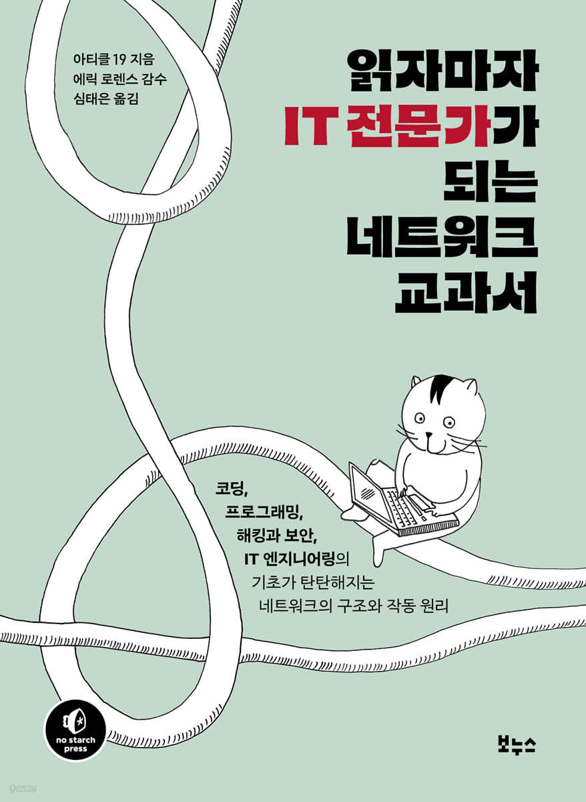

# TIL of Network

네트워크에 대한 이해도가 필요한 시점이 왔다고 생각했다. 백엔드 개발도 해보았고, 보안이나 연결도 얼추 해보았으나, 정작 네트워크에 대한 이해도가 높은지 애매했다. 그 와중에 이런 책을 발견하였다. 



내용 구성이나, 이제는 읽어 볼 때 이해가 안되진 않을거란 생각이 들었고, 틈틈히 읽을 때마다 읽은 만큼 키워드를 저장 해 놓으려고 한다. 웹 정복은 한참 걸리겠지만...! 그래도 꾸준히 정리 해놓자.

---

# 1 네트워크는 어떻게 인터넷이 될까?
- 각 센터는 서로 직간접적으로 연결되어 있으며, 이러한 센터를 `노드(node)` 라고 부른다. 
- `노드`는 정보를 주고 받는 모든 네트워크 상의 기기들을 말하며, 노드의 공통점은 주소가 존재한다는 점이다.(IP) 
- `라우터` 네트워크를 걸쳐서 데이터를 전달해주는 중간 노드들
- `패킷(packet)` 인터넷 트래픽을 구성하는 데이터 조각을 가리킨다. 
- `서버` - `클라이언트` : `서버` 는 네트워크 상에서 서비스를 제공하는 대상이며, 다른 노드로부터 정보를 전송 및 수신하여 사용하는 쪽 노드를 `클라이언트` 라고 부른다. 
- `네트워크 유형`
	- <mark style="background: #BBFABBA6;">중앙 집중식 네트워크</mark> : 하나의 라우터에 여러 클라이언트가 연결되는 구조
	- <mark style="background: #BBFABBA6;">비집중식 네트워크</mark> : 여러 클라이언트가 여러 라우터에 연결되어 있는 형태, 현대의 인터넷의 전체적인 구조
	- <mark style="background: #BBFABBA6;">분산 네트워크</mark> : 서버와 클라이언트의 경계가 없고, 계층이 없이 서로 연결된 형태이며, 모든 노드가 동등하고 서로 직접 소통할 수 있다.
- `하드웨어 주소`
	- <mark style="background: #FFB8EBA6;">MAC 주소</mark> : 모든 컴퓨터라고 부를 수 있는 디바이스가, 네트워크 연결을 위해서는 네트워크 카드라고 하는게 필요하며 거기엔 MAC(Media Access Control Address) 주소가 담겨 있다. 이 주소는 네트워크에서 사용되는 모든 기기를 물리적으로 식별하는 용도이므로 `디바이스 ID` 라고도 부른다. 단, 로컬 환경 한정이다. 단 기기와 사용자를 식별할 수 있어, 네트워크 노드도 MAC 주소를 요구, 저장하는 경우도 있다. 
	- <mark style="background: #FFB8EBA6;">임의의 MAC 주소</mark>
- **기기가 네트워크에 연결되는 방법**
	- <mark style="background: #ABF7F7A6;">라우터에 신호 보내기</mark> : DHCP(Dynamic Host Configuration Protocol, 동적 호스트 구성 프로토콜)을 통해 기기 네트워크 카드에 따로 네트워크 주소가 할당 된다. 
		- 네트워크 주소를 기기에 보내주게 된다. 
		- 로컬 네트워크의 표준 게이트웨이를 통해 기기 신호를 보내서 네트워크로 전송할 데이터를 요구한다. 
	- <mark style="background: #ABF7F7A6;">연결하기</mark> : MAC에 네트워크 주소가 할당되면 연결이 끝났으므로 데이터 송수신이 가능하다. 
---
# 2 인터넷에서 정보는 어떤 모습일까? 
## 패킷이란 
- <mark style="background: #BBFABBA6;">패킷(Packet)</mark> : 전송될 데이터는 원본 파일 형식을 따르지 않고, 분할되고 조정된 패킷의 형태로 교환 혹은 그룹화되어 전달된다. 
- <mark style="background: #BBFABBA6;">패킷 헤더(packet header)</mark> : 데이터를 잘게 쪼개 전송하는데, 이때 각 패킷에는 주소 태그를 비롯해 패킷을 설명하는 것들이 헤더에 담겨져 있다. 

## 패킷은 무엇으로 구성될까?
- 패킷은 당연히 0, 1의 이진 바이너리 형태를 취하고 있다. 구성된 정보를 전송 매체에 따라 다양하게 인코딩과 디코딩을 통해 데이터를 파악한다. 

## 패킷 전송 
- 이진수로 패킷이 전달되는 방법은 우선 이진수 신호가 <mark style="background: #ABF7F7A6;">주파수 변조(FM, Frequency Modulation)</mark>라는 과정을 거쳐 전송된다. 
- 우선 한 쪽 노드에서 데이터를 선정하고, 이 데이터를 패킷의 형태로 쪼갠다. 
- 패킷은 이진 코드로 물리적 전송이 일어나는데, 이때를 주파수 변조라고 부르며, 반대편 노드로 오게 되면, 이진의 숫자 더미를 복호화해서 패킷으로 만들고, 패킷은 모여서 원본과 동일한 데이터 형태를 갖게 된다. 
---
# 3 인터넷에서 기기는 어떻게 통신할까? 
## 프로토콜 
- 기기가 서로 통신할 때는 양쪽 모두 이해할 수 있는 언어를 사용해야 하고, 이러한 규약을 <mark style="background: #ADCCFFA6;">프로토콜</mark> 이라고 부른다. 
- <mark style="background: #ADCCFFA6;">TCP(Transmission Control Protocol, 전송 제어 프로토콜)</mark> : 패킷을 정확하고 완전한 형태로 전송하지만, 다른 프로토콜에 비해 보내는 속도가 느린 편이다.
- <mark style="background: #ADCCFFA6;">UDP(User Datagram Protocol, 사용자 데이터그램 프로토콜)</mark> : 정확한 패킷 전달이나 전송 순서보다 속도를 우선시하는 프로토콜이다. 
- <mark style="background: #ADCCFFA6;">QUIC(Quick UDP Internet Connections, 빠른 UDP 인터넷 연결)</mark> : 여러개의 빠른 UDP 연결을 활용하지만, TCP 처럼 정확하고 신뢰할 수 있는 방식으로 데이터 전송 

## 프로토콜과 표준을 다루는 국제기구 
- 미국전기전자학회(IEEE. Institute of Electrical and Electronics Engineers)
- 국제인터넷표준화기구(IETF. Internet Engineering Task Force)
- 국제전기통신연합 표준화 부문(ITU-T. International Telecommunication Union's Standardization Sector)
- 국제표준화기구(ISO. International Organization for Standardization)

## 인터넷 프로토콜(IP)
- IP는 주소와 패킷의 형식을 규정하느데 쓰인다. 
- 공용 IP 주소 : 외부에서 연결이 가능한 공공의 IP 주소이다.
- 사설 IP 주소 : 인터넷에 직접 접속할순 없지만 중개자를 통해 접속할 수 있는 주소이다. 
```toc

```
