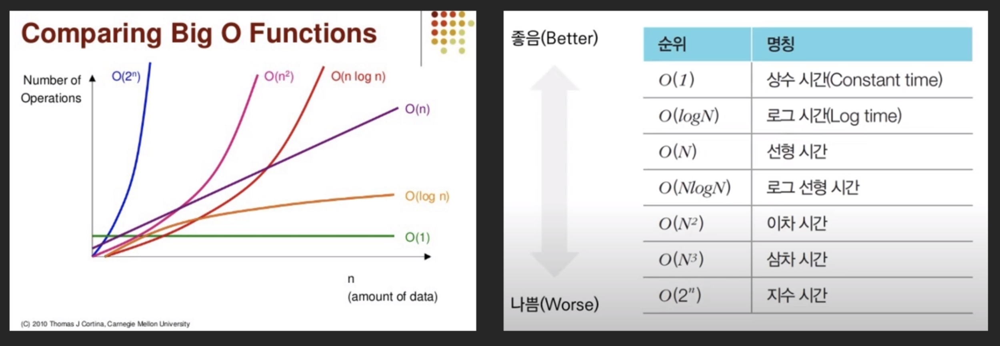

# part 0. 소개
## 강의 안내 
- 강의 진행 언어 : python 
- 가끔 C++ 섞을 예정
## 강의 구성 소개 
### part 1. 코딩테스트 준비 어떻게 해야 하나요 
#### 1. 코딩테스트란
#### 2. 코딩 테스트 출제 경향 
#### 3. 코딩 테스트 채점 기준 
#### 4. 문제 해결 시작하기

### part 2. 알고리즘 유형 분석 
#### 1. 자료구조 
#### 2. 완전탐색 
#### 3. 탐욕법
#### 4. DFS, BFS, 백트래킹 
#### 5. 이분 탐색 
#### 6. 동적 계획법
---
# part 1. 코딩 테스트 준비 어떻게 해야 하나요?
## chapter 1. 코딩테스트란? 
- 온라인 저지를 꾸준하게 활용하는게 당연히 좋다. 
- 본 강의는 백준을 주로 활용한다. << 나도 꾸준하게 풀긴 해야함 
### 언어 고르기 
- 무슨 언어로 문제를 풀어야 하는가?
	- 3대장 : C++, java, python 
	- 본 강의는 파이썬 위주 
- 진로가 확고하면 해당 언어로 연습하는 것이 좋다. 
	- 단, 마이너한 언어를 쓰면 문제 해결 시 난감할 수 있다. 
	- 기업 코텍에서는 언어 특성 차이로 인한 이슈는 없도록 내는 편
### IT 기업들이 코테를 보는 이유는? 
- 2015~16년부터 시작됨. 
- 보통 서류에서 떨어뜨리기 보단 일단 올려서 코테 보고, 이후 인적성 등을 통해 최종적으로 골라내어 선별하게 됨
- 코딩 테스트는 적잖은 비용이듬에도 기업이 선호함. 
	- 표준 입출력, 표준 STL을 사용하므로 일관적이고 공정한 방식이 될 수 있다. 
	- 수많은 응시자들을 순위 매기기 좋다. 
	- **문제 해결 능력(Problem Solving)** + 코딩능력을 단 시간내에 측정 가능 : 신입은 어느 팀에 배정시켜 어떤 기술스택/프레임워크를 시킬지 모르니까 
### 코테를 잘하려면 어떻게 해야할까?
- 알고리즘 문제 푸는 과정에서 요구되는 요소들 
	1. 📜독해력 : 문제를 빠르고 정확하게 파악
	2. 🛠️배경지식 : 필수 자료구조, 알고리즘 지식들 
	3. 💡문제해결력 : 솔루션, 아이디어
	4. 💻구현력 : 코딩, 생각을 실제 코드로 구현해내기 - 시뮬레이션 문제의 경우 로직은 알려주나, 구현 자체가 난이도 높은 경우가 있다. 지금 나는 어떤지를 봐야 한다. 
	5. ✅검증, 디버깅 : 틀렸을 경우 틀린 곳, 반례 찾아내는 센스가 필요하다.
-> 내가 문제 어떤 부분에서 약한지를 보고 집중적으로 학습이 필요하다. 
- 1  ~ 5번을 한번에는 어려우니 순차적으로 하자
- 우선 필수 자료구조, 알고리즘을 먼저 다 훑고 (2번) 
  문제 해결력을 트레이닝 한 뒤(3번)
  구현력을 키우자 (4, 5번)
---
## chapter 2. 코딩 테스트 출제 경향 
### 기업코테 
#### 삼성 : A 형 / 3급 신입 공채 
- 3시간 2문제 
- 사용 가능 언어 : C, C++, java, python 
- 시뮬레이션, 구현, DFS/BFS 주로 출제, 어려운 알고리즘보단 구현력 중시

#### LINE 
- 3시간 5 ~ 6 문제 
- 사용 가능 언어 : C++, java, JavaScript, python, kotlin, Swift
- 구현, 탐색, 시뮬레이션, 자료구조 등 출제 

#### Kakao
- 5시간 7문제 
- 사용 가능 언어 : C++, java, JS, python, kotlin, swift
- 구현, 문자열, 탐색, DP, DFS/BFS, 그래프 등 범위 넓은 편 
- 카카오 코테가 가장 어렵다는게 학계의 정설
---
## chapter 3. 코딩 테스트 채점 기준 
### 코딩 테스트 채점 기준 
- 기업별로 당연히 상이하다. 
- 일반적으로는...
	- 푼 문제 수 많을 수록 순위 높음
	- 같은 문제라면 더 적은 시도 횟수, 더 빠른 맞춤이 순위가 높음 
	- 절반 이상 풀었다면 합격권인 경우 많았음 
		- 삼성은 2문제 중 1문제 이상, 카카오는 7문제 중 4문제 정도 
		- 문제 난이도와 응시자들의 평균 실력에 따라 달라질 수 있음 
- 문제 마다 존재하는 제한 조건
	- 시간 제한 
	- 메모리 제한 
### 시간/공간 복잡도(Complexity)
#### 문제가 '어렵다' 란? 
- 푸는 데 오래 걸리는 문제들도 컴퓨터의 빠른 연산으로 풀 수 있다. 단, 이때 컴퓨터에서도 시간이 걸리는 경우가 있고, 이를 시간 복잡도를 통해 파악한다. 
- 예시 : 
	- 문제 : N이 주어지면 1 ~ N 까지의 합을 출력하세요
	- 풀이 : N(N + 1)/2
		- 주어진 N값이 크든 작던 연산을 최소화시키는 방
- 여기서 알 수 있는 점은...
	- 문제를 푸는 솔루션은 하나가 아닐 수 있다
	- 알고리즘에 따라 답의 구하는데 걸린 시간이 다를 수 있다. 
#### 시간 복잡도 Time Complexity 
- 알고리즘의 최악의 경우 실행시간 
- 입력량 N에 비해서 얼마나 연산을 많이 하는지를 나타냄
- 결국 알고리즘의 효율성 척도
- 빅오 표기법Big-O notation으로 나타낸다.
- 주먹구구식 계산법, c++ **1초 연산 시 총 1억** 번 넘기면 위험하다. 
	- 보통 k 중 for 문 = O(N k승)

#### 빅오 표기법 Big-O notation
- 가장 큰 항을 살리고, 그보다 작은 항은 다 떼면 된다 
- 계수, 상수도 의미 없어서 빼고
- 가장 크게 증가하는 항이 중요하다 


#### 공간 복잡도 Space Complexity 
- N 에 비례해서 메모리를 얼마나 쓰는지를 나타냄
- 일반적으로 trade-off 관계 : 메모리(공간) - 시간 

#### 문제에서 주먹구구식으로 따져보기
##### 예시 1) 
- 문제 : 시간제한 2초, 메모리 제한 64MB
  입력 : 0 <= N <= 100,000,000 
- 이 문제에서 가능한 시간/공간 복잡도는? 
	- 1억개에 1초 정도라고 했으니 O(N) 은 가능, 이차시간 부턴 안됨. 따라서 로그 선형시간 복잡도까지도 괜찮. 
	- 공간 복잡도를 고려하면  정수 1개당 4바이트, 1억개면 안될 것이고, N에 루트를 씌우면 10^4로 공간 복잡도를 통과할 수 있다. 
##### 예시 2) 
- 문제 : 시간 제한 1초, 메모리 제한 128MB
  입력 : - 1,000 <= N <= 1,000
- 이 문제에서 가능한 시간/공간 복잡도는? 
	- O(N^2) 까지는 N의 범위가 2천인걸 감안해도 충분히 시간 복잡도는 됨 
	- 공간 복잡도는 4바이트 기준 O(N^2) 라고 한다면 2000^2 로 4곱하면 16MB가 나와서 공간복잡도 가능, N^3은 계산시 32GB가 나와서 어려움 

---
## chapter 4. 문제 해결 시작하기 
### 코테에 필요한 기본 지식 
- 변수, 함수, 배열, 반복문, 조건문, 문자열 등을 주로 사용 
- 상속, 포인터 등은 거의 쓰지 않음 
- 입출력함수
- 빠른 입출력 함수
- 오버플로우
	- Python 에선 고려하지 않아도 되나 primitive 한 자료형을 사용하는 경우엔 고려해야함. 
	- 기업 코테에선 오버플로우가 날 수 있는 문제는 잘 나오진 않음(이란 건 나올 순 있단 거니..흠), 값의 나오는 범위를 잘 고려해야함(int, long...)

```toc

```
