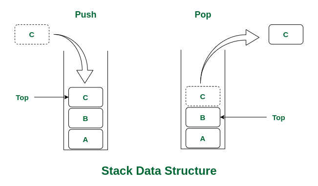
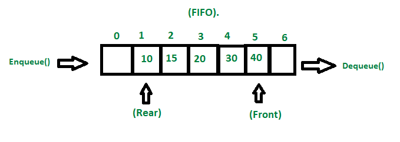
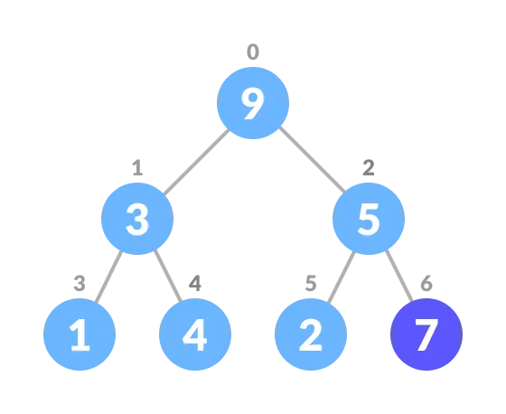
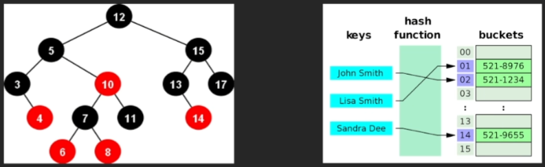

# part 2. 알고리즘 유형 분석 - 자료구조
##  Chapter 1. 자료구조 - 배열, 벡터, 연결리스트
### 배열 Array 
- 삽입 / 삭제 : O(N) - <mark style="background: #BBFABBA6;">삽입이나 삭제는 결국 내부 데이터를 옮기거나 하므로 최악의 경우를 상정하여 속도가 설정됨. </mark>
- 탐색 : O(1) - <mark style="background: #BBFABBA6;">메모리 상의 위치를 계산해서 접근하므로 접근의 속도가 매우 빠른 것이다. </mark>
- C++에서 사이즈 변경 불가 / Python은 리스트를 사용
  ```cpp
  // C++
  int arr[4] = {10, 11, 12, 13};
  arr[2] = 5; 
	```
	```python
	# python
	arr = [10, 11, 12, 13]
	arr[2] = 5
	```
### 벡터 Vector 
- 삽입 / 삭제 : O(N)
- 탐색 : O(1) 
- 동적 배열 : 사이즈 수정 가능 
  ```cpp
  // C++ 
  // C++에선 필수 오브 필수 
  vector<pair<int, int> > v;
  v.push_back(make_pair(123, 456));
  v.emplace_back(789, 987);
  printf("size: %d\n", v.size());
  for(auto p : v)
	  printf("%d, %d\n", p.first, p.second);
	```
	```python
	# python
	# python 은 vector가 딱히 없이 리스트를 그대로 활용이 가능하다. 
	v = []
	v.append((123, 456))
	v.append((789, 987))
	print("size:", len(v))
	for p in v:
		print(p)	
	```
### 연결 리스트 Linked List 
- 삽입 / 삭제 : O(1)
- 탐색 : O(N) - <mark style="background: #FF5582A6;">노드 구조다 보니, 삽입이나 삭제는 노드들의 주소값 연결만으로 해결되지만 탐색은 모든 노드를 찾아 다녀야 한다. </mark>
- 자주 쓰이는 구조는 아니지만 다른 자료 구조들을 구현할 때 많이 쓰인다. 
  ```cpp
  //C++ 
  list<int> l;
  l.emplace_back(0);
  l.emplace_back(1);
  l.emplace_back(2);
  l.emplace_back(3);
  printf("size: %d\n", l.size());
  for(auto i : l)
	  printf("%d\n", i);
	```
##  Chapter 1. 자료구조 - 스택, 큐 
### 스택 Stack(파이썬은 그냥 리스트로...)

```cpp
// C++
stack<int> s;
s.push(123);
s.push(456);
s.push(789);
while(!s.empty()) {
	printf("%d\n", s.top());
	s.pop();
}
```
```python
# python
s = []
s.append(123)
s.append(456)
s.append(789)
while len(s) > 0:
	print(s[-1])
	s.pop(-1)
```
### 큐 Queue

```cpp
// C++
queue<int> q;
q.push(123);
q.push(456);
q.push(789);
while(!q.empty()) {
	printf("%d\n", q.front());
	s.pop();
}
```
```python
# python
from collections import deque

q = deque()
q.append(123)
q.append(456)
q.append(768)
while len(q) > 0:
	print(s.popleft())
```
##  Chapter 1. 자료구조 - 우선순위 큐
### 우선순위 큐 Priority Queue(Heap)

- 삽입 / 삭제 : O(logN)
```cpp
// C++ : max-heap
// 최상단 노드가 최댓값인 형태로 되어 있다. 
priority_queue<int> pq;
pq.push(456);
pq.push(123);
pq.push(789);
while(!pq.empty()) {
	printf("%d\n", pq.top());
	pq.pop();
}
```
```python
# python : min-heap
# 루트노드가 최솟값이 위치하게 된다. 
import heapq

pq = []
heapq.heappush(pq, 456)
heapq.heappush(pq, 123)
heapq.heappush(pq, 789)
while len(pq) > 0:
	print(heapq.heappop(pq)) # 파이썬은 pop 역할 메소드는 값을 빼면서 반환까지 하므로 쓰기 편함

print(pq[0]) # 루트 노드 확인이 가능함 

from queue import PriorityQueue # 이런 자료구조 클래스도 있음
# thread safe 성격이 있다보니 안전하지만 느리다
```

##  Chapter 1. 자료구조 - 맵, 집합
### 맵 Map(Dictionary)

- key, value
- 삽입 / 삭제
	- C++ : O(logN), 보통 트리 구조로 구현된 경우 LogN의 시간복잡도를 가진다. 
	- Python : O(1) , hash 함수를 통해 변환된 키 값을 활용하여 주소값을 지정해주고 ,탐색 시간 자체를 줄이게 된다. 
```c++
// C++
// RB 트리로 구현되어 있음
map<string, int> m;
m["Yoondy"] = 40;
m["sky"] = 100;
m["Jerry"] = 50;
printf("size: %d\n", m.size());
for(auto p : m)
	printf("%d, %d\n", p.first, p.second);
```
```python
# Python
# hash 구조로 되어 있음 
m = {}
m["Yoondy"] = 40
m["sky"] = 100
m["Jerry"] = 50
print("size : ", len(m))
for k in m:
	print(k, m[k])
```

### 집합 Set 
- 중복 없는 개체들의 모임 
- 삽입 / 삭제
	- C++ : O(logN)
	- Python : O(1)
```cpp
// C++
set<int> s;
s.insert(456);
s.insert(12);
s.insert(456);
s.insert(7890);
s.insert(7890);
s.insert(456);
printf("size : %d\n", s.size());
for (auto i : s)
	printf ("%d\n", i);
```
```python
s = set()
s.add(456)
s.add(12)
s.add(456)
s.add(7890)
s.add(7890)
s.add(456)
print("size : ", len(s))
for i in s:
	print(i)
```

## 번외 
### 빠른 입출력을 위한 장치 
```python
import sys

# 입력 받기
# 한 줄 입력 받을 때
line = sys.stdin.readline().strip()

# 여러 줄 입력 받을 때, 예를 들어 첫 줄에 입력 받을 줄의 수가 주어지는 경우
n = int(sys.stdin.readline())
for _ in range(n):
    line = sys.stdin.readline().strip()

# 정수 여러 개가 공백으로 구분되어 입력될 때
numbers = list(map(int, sys.stdin.readline().split()))

# 출력하기
# sys.stdout.write 사용 (print 대신 사용)
sys.stdout.write("Hello, World!\n")

# 출력 시, 문자열과 변수를 함께 출력하려면 f-string이나 format()을 사용
name = "World"
sys.stdout.write(f"Hello, {name}!\n")

# 끝에 개행문자를 항상 붙여야 함을 주의하세요.
```
- `sys.stdin.readline().strip()`: 입력 받은 문자열의 양 끝에서 개행문자나 공백을 제거한다. `strip()`을 사용하지 않으면 개행문자까지 포함되어 입력된다.
- `map(int, sys.stdin.readline().split())`: 공백으로 구분된 여러 개의 숫자를 입력받아 정수로 변환한다.
- `sys.stdout.write()`: `print()` 함수 대신 사용되며, 자동 개행이 없기 때문에 개행이 필요한 경우 `\n`을 명시적으로 붙여줘야 한다. 

### 유용한 메서드 모음 
```python
# 배열(Array) - Python에서는 리스트(list)가 배열의 역할을 수행
arr = [1, 2, 3] # 배열 생성
arr.append(4) # 배열 끝에 항목 추가
arr.insert(2, 5) # 배열의 특정 위치에 항목 삽입
arr.pop() # 배열의 마지막 항목을 제거하고 그 항목 반환
arr.pop(0) # 배열의 첫 번째 항목 제거

# 스택(Stack) - 리스트를 사용하여 스택 구현
stack = [] # 스택 생성
stack.append('a') # 스택에 항목 추가(push)
stack.pop() # 스택에서 항목 제거(pop), 마지막에 추가된 항목 반환

# 큐(Queue) - collections.deque를 사용하여 큐 구현
from collections import deque
queue = deque() # 큐 생성
queue.append('a') # 큐에 항목 추가(enqueue)
queue.popleft() # 큐에서 항목 제거(dequeue), 첫 번째 항목 반환

# 우선순위 큐(Priority Queue) - heapq 모듈 사용
import heapq
priority_queue = [] # 우선순위 큐 생성
heapq.heappush(priority_queue, (priority, item)) # 우선순위 큐에 항목 추가
heapq.heappop(priority_queue) # 우선순위 큐에서 가장 낮은 우선순위 항목 제거 및 반환

# 맵(Map) - Python에서는 딕셔너리(dict)가 맵의 역할을 수행
map = {'key1': 'value1', 'key2': 'value2'} # 맵 생성
map['key3'] = 'value3' # 맵에 항목 추가
map.pop('key3') # 맵에서 항목 제거
'key1' in map # 맵에 특정 키가 있는지 확인

# 집합(Set)
set = {1, 2, 3} # 집합 생성
set.add(4) # 집합에 요소 추가
set.remove(4) # 집합에서 요소 제거, 요소가 집합에 없으면 KeyError 발생
set.discard(5) # 집합에서 요소 제거, 요소가 집합에 없어도 에러 발생하지 않음
set.union({5, 6}) # 두 집합의 합집합
set.intersection({2, 3, 5}) # 두 집합의 교집합
```
### 유용한 메서드 모음 2
#### 리스트(List)
- `len(arr)`: 리스트의 길이(항목 수)를 반환한다.
- `arr.count(x)`: 리스트에서 x 값의 항목 수를 반환한다.
- `arr.reverse()`: 리스트의 항목 순서를 뒤집는다.
- `arr.index(x)`: x 값을 가진 첫 번째 항목의 인덱스를 반환한다. x가 리스트에 없는 경우 ValueError가 발생한다.
- `arr.extend(iterable)`: 리스트 끝에 모든 iterable 항목을 추가한다.
#### 스택(Stack) - 리스트 활용
- 스택 관련 메서드는 리스트 메서드를 그대로 사용한다는 걸 잊지 말자. 스택의 주요 작업은 `append()`로 push하고, `pop()`으로 pop해준다는 개념을 기억할 것.
#### 큐(Queue) - `collections.deque`
- `len(queue)`: 큐의 길이(항목 수)를 반환합니다.
- `queue.appendleft(x)`: 큐의 맨 앞에 항목 x를 추가합니다. 이는 deque를 스택처럼 사용할 때 유용할 수 있다.
- `queue.clear()`: 큐의 모든 항목을 제거한다.
#### 우선순위 큐(Priority Queue) - heapq 모듈
- `heapq.nlargest(n, iterable[, key])`: 데이터 집합에서 가장 큰 n개의 항목을 반환한다. 
- `heapq.nsmallest(n, iterable[, key])`: 데이터 집합에서 가장 작은 n개의 항목을 반환한다. 
- `heapq.heapify(x)`: 리스트 x를 선형 시간 내에 in-place로 힙으로 변환한다. 
#### 맵(Map) - 딕셔너리(Dict)
- `map.update(other)`: 맵(딕셔너리)에 다른 딕셔너리나 키/값 쌍의 반복 가능한 객체의 내용을 추가한다. 
- `map.keys()`: 딕셔너리의 모든 키를 포함하는 뷰를 반환한다.
- `map.values()`: 딕셔너리의 모든 값을 포함하는 뷰를 반환한다.
- `map.items()`: 딕셔너리의 모든 키/값 쌍을 포함하는 뷰를 반환한다.
#### 집합(Set)
- `set.union(*others)`: 여러 집합의 합집합을 반환한다.
- `set.intersection(*others)`: 여러 집합의 교집합을 반환한다.
- `set.difference(*others)`: 여러 집합과의 차집합을 반환한다. 첫 번째 집합에는 있지만 다른 집합에는 없는 요소들로 구성된다.
- `set.symmetric_difference(other)`: 두 집합의 대칭 차집합을 반환한다. 양쪽 집합 중 하나에만 있는 요소들로 구성된다.
- `set.update(*others)`: 집합에 여러 집합의 합집합을 추가한다.
- `set.intersection_update(*others)`: 집합을 여러 집합의 교집합으로 업데이트한다.
- `set.difference_update(*others)`: 집합에서 다른 집합들에 포함된 요소들을 제거한다.

### python 유용한 모듈 및 링크 모음 
- **collections 모듈**: 다양한 컨테이너 데이터 타입들(`Counter`, `deque`, `defaultdict` 등)을 제공한다. [공식 문서 보기](https://docs.python.org/3/library/collections.html)
	- `Counter`: 요소들의 개수를 셀 때 유용한 딕셔너리 서브클래스다. 각 요소를 딕셔너리의 키로, 그 요소의 개수를 딕셔너리 값으로 저장한다.
	- `OrderedDict`: 항목이 추가된 순서를 기억하는 딕셔너리의 서브클래스다. Python 3.7부터는 기본 딕셔너리도 삽입 순서를 보장하지만, 명시적으로 순서가 중요한 경우 사용될 수 있다.
	- `defaultdict`: 호출 시 기본값을 제공하는 딕셔너리의 서브클래스다. 존재하지 않는 키를 조회할 때 주어진 기본값을 사용하여 해당 키에 대한 항목을 자동으로 생성한다.
- **heapq 모듈**: 힙 큐 알고리즘, 특히 우선순위 큐 기능을 제공한다. 최소값 또는 최대값을 빠르게 찾는 데 유용하다. [공식 문서 보기](https://docs.python.org/3/library/heapq.html)
- **itertools 모듈**: 반복 가능한 데이터 구조를 효율적으로 처리할 수 있는 함수들을 제공한다. 예를 들어, `permutations`, `combinations`는 순열과 조합을, `product`는 데카르트 곱을 쉽게 계산할 수 있게 해 준다. [공식 문서 보기](https://docs.python.org/3/library/itertools.html)
- **bisect 모듈**: 정렬된 배열에 대한 이진 검색 기능을 제공한다. `bisect_left`, `bisect_right` 함수는 특정 요소를 정렬된 리스트에 삽입할 가장 왼쪽(오른쪽) 위치를 찾는 데 사용된다. [공식 문서 보기](https://docs.python.org/3/library/bisect.html)
- **string 모듈**: 문자열 상수와 공통 문자열 작업을 위한 유틸리티 함수들을 제공한다. 예를 들어, `string.ascii_lowercase`, `string.ascii_uppercase`는 각각 소문자와 대문자 알파벳을 포함한 문자열을 제공한다. [공식 문서 보기](https://docs.python.org/3/library/string.html)

```toc

```
