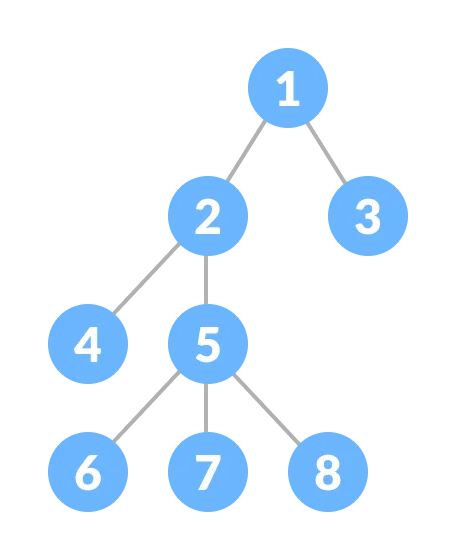
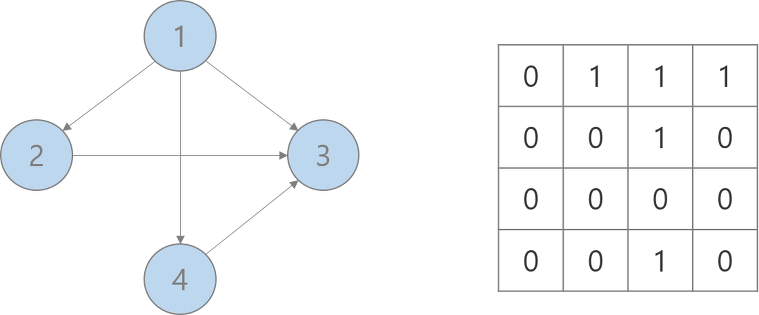
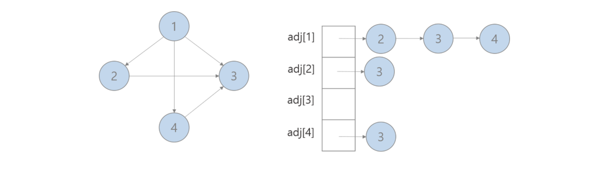
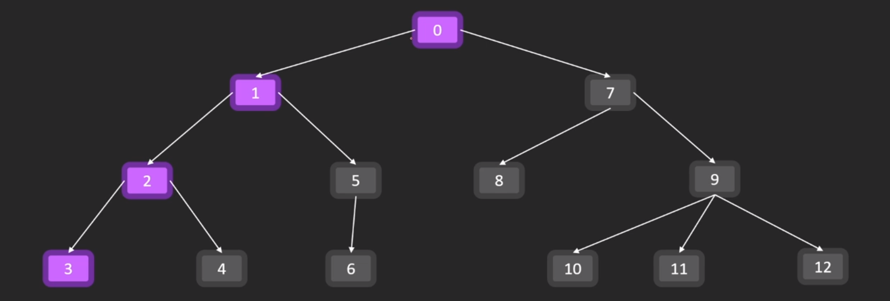
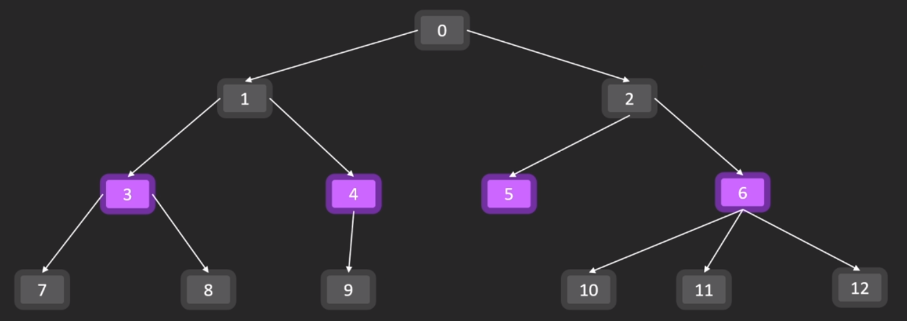
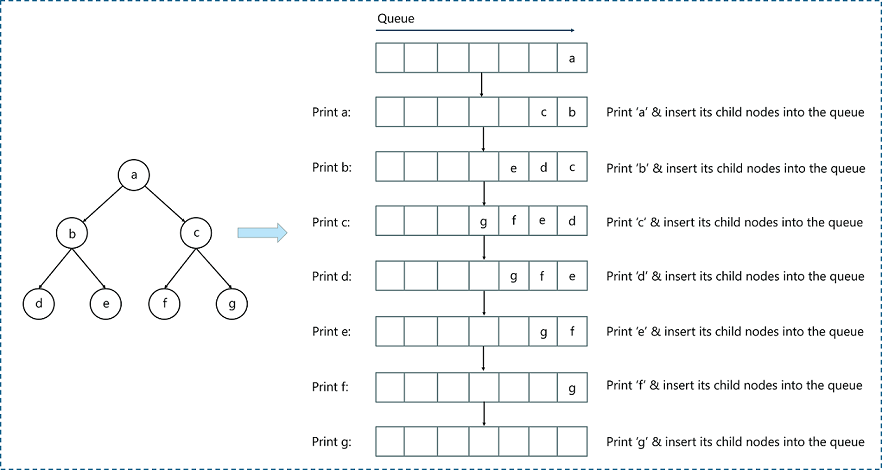
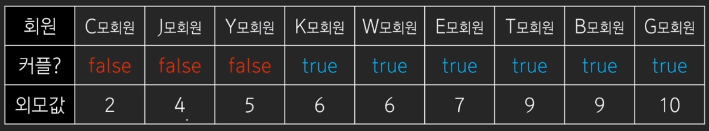

# part2. 알고리즘 유형 분석 - DFS, BFS, 백트레킹 
## 그래프 자료구조 Graph
- Vertex(= node)
- edge
- 방향성
	- 무방향 그래프 (= 양방향 그래프)
	- 방향 그래프
- 순환 여부
	- 순환 그래프(Cyclic Graph)
	- 비순환 그래프(Acyclic Graph)
- `방향성 비순환 그래프(DAG, dircted Acyclic Graph)`
- 연결요소 Connected Component 
	- 정점 
	- 연결선(간선)
## 트리 자료구조(tree)
- 순환성이 없는 무방향 그래프 형태
- 트리는 특정하지 않는 한 어떤 노드이든 <mark style="background: #BBFABBA6;">루트root</mark> 가 될 수 있다. 
- 가장 바깥쪽 노드는 <mark style="background: #ABF7F7A6;">리프 노드 leaf node</mark> 라고 한다. 
- node A에서 B로 가는 경로는 반드시 존재 하며 유일하다. (반드시 1개 존재)
- 노드개수  = 간선 개수 + 1


- 전산적으로 사용되는 구조에서는 이런 특징을 가진다. 
	- 자료구조에서의 트리는 부모 -> 자식 관계가 있는 방향 그래프이다. 
	- 루트 root 는 하나다 
## 코드로 그래프를 나타내는 방법 
### 1. 인접행렬 

- 방향성이 있는 경우 같은 짝일 때 비대칭 구조가 되지만, 방향성이 없는(무방향, 양방향) 경우에는 대칭형태로 표가 나오게 된다. 
## 2. 인접 리스트 

- C++ 에서는 벡터, python 에서는 리스트, 배열로 구현하는 경우가 많다. 

## 3. 인접행렬 vs 인접 리스트 비교 
- 비교 
	- 간선 개수에 따라 행렬은 개수의 제곱 만큼 공간을 할당해야함. 그러나 인접리스트는 표현해야할 양에서 적기에 메모리 공간에서 절약이 된다.
	- 인접행렬은 공간을 많이 쓰는 만큼, 시간적으로 탐색 속도가 매우 빠를 수 있다. 
	  예) 위의 예시의 경우 인접 행렬은 `G[0][3]`을 접근하면 시간복잡도 O(1)로 탐색이 끝난다. 
	- 반대로 인접 리스트는 시간적으로 탐색에서 분리한 면이 있다. 
	- 결과적으로 간선이 적으면 적을 수록 인접리스트가 좋아지고, 간선이 많아지면 많아질 수록 인접 리스트의 공간적 메리트가 소멸되므로, 차라리 인접 행렬이 낫다. 
	  예 ) 정점과 간선의 개수로 파악하면 된다. 
	  정점이 100개 간선이 최대 N²개까지 나온다면 -> 공간적으로 메리트 희석될 수 있음, 인접 행렬로 푸는게 접근성이 좋음
	  정점은 N개이고 간선이 2N 정도라면? 인접 리스트가 효과적이다. 
	- 단, 알고리즘 문제에서 문제에 따라 어느 쪽을 써도 기본적으로 크게 상관은 없다(극한의 조건이 아닌 이상)
## 깊이 우선 탐색 DFS (Depth First Search)

- 스택, 재귀를 사용해서 구현한다. 
- 참고로 완전탐색 방식이다. 가볼 수 있는 노드에서 갈 수 없을 때까지 내려갔다 올라오기를 반복한다. 
```python
adj = [[0] * 13 for _ in ragnge(13)]
adj[0][1] = adj[0][7]  = 1
adj[1][2] = adj[1][5] = 1
# ... 

def dfs(now):
	for nxt in range(13):
		if adj[now][nxt]:
			dfs(nxt)

dfs(0)
```
## 너비 우선 탐색 BFS (Breadth First Search)

- 큐를 사용해서 구현한다.
- 완전 탐색 방식인 것은 동일하다. 

```python
from collections import dequeue 
adj = [[0] * 13 for _ in ragnge(13)]
adj[0][1] = adj[0][2]  = 1
adj[1][3] = adj[1][4] = 1
# ... 

def bfs():
	dq = dequeue()
	dq.append(0)
	while dq:
		now = dq.popleft()
		for nxt in range(13):
			if adj[now][nxt]:
				dp.append(nxt)

bfs()
```


## DFS & BFS 
- 공통점
	- 완전탐색 구조를 갖고 있으므로 장단점이 그대로 나온다.
	- 모든 경우의 수를 다 보는 방식이며 그렇기에 확실하나, 반대로 결과 도출까지 연산량이 많다.
- 차이점
	-  특정 목표 노드까지 최단으로 탐색하는 경우 두 방법 모두 탐색이 가능하다. 하지만 DFS의 경우 최단거리 탐색에서 끝까지 탐색을 마쳐야 결과를 알 수 있다. 이에 비해 <mark style="background: #FFB8EBA6;">BFS 는 처음 만난 경우가 최단거리임을 보장해줄 수 있어서</mark> 그 상황에서 탐색이 종료 시킬 수 있다. 
- 인접행렬 vs 인접리스트 
	- 정점 V, 간선 E
	- 인접행렬 : O(V²)
	- 인접리스트 : O(V+E) ≑ O(max(V, E))
	- 식으로 봐도 알 수 있듯이 V, E의 값 자체가 크지 않다면 유의미 하지 않는다. 인접리스트를 구현시에는 그 값의 규모를 파악하고 적용하는게 낫고, 간선이 너무 많다면 굳이 리스트 형태로 하느니 인접 행렬로 하는게 나을 수 있다.
## 예제문제 (1) 
### 길찾기 문제 
- 보통 4방향이 많다(dy, dx 구조로 짜면 좋다)
- 방향값을 미리 코드에 짜두고 for문으로 순회하는 기법을 익혀둘 것
- dy, dx를 쓰지 않아도 구현은 가능하다 그러나..
	- 코드가 길어진다
	- 길어진다 = 실수 가능성이 발생한다. 
## 백트래킹 Backtracking
- 기본적으로 모든 경우를 탐색하며 DFS/BFS와 유사하다. 
- 단, <mark style="background: #FF5582A6;">가지치기</mark> 를 통해 탐색의 경우의 수를 줄인다는 차이가 있다. 

## boj.kr/11724
```python
import sys

sys.setrecursionlimit( 10 ** 6)
input = sys.stdin.readline # 입력이 들어오는 줄이 많아서 빠른 입력을 넣어줌 
N, M = map(int, input().split)
adj = [[0] * N for _ in range(N)]

for _ in range(M):
	a, b = map(lamda x: x - 1, map(int, input().split()))
	adj[a][b] = adj[b][a] = 1

ans = 0
chk = [False] * N

def dfs(now):
	for nxt in range(N):
		if adj[now][nxt] and not chk[nxt]:
			chk[nxt] = True
			dfs(nxt)

for i in range(N):
	if not chk[i]:
		ans += 1
		chk[i] = True
		dfs[i]

print(ans)

```
## boj.kr/2178
```python

dy = (0, 1, 0, -1)
dx = (1, 0, -1, 0)
N, M = map(int, input().split)
board = [input() for _ in range(N)]

def is_valid_coord(x, y):
	return <= 0 y < N and 0 <= x <M M

def bfs():
	chk = [[False] * M for _ in range(N)]
	chk[0][0] = True
	dq.append((0, 0, 1))
	while dq:
		y, x, d = dq.popleft()
		nd = d + 1

		if y == N - 1 and x == M - 1:
			return d

		for k in range(4):
			ny = y + dy[k]
			nx = x + dx[k]
			if is_valid_cood(nx, ny) and board[ny][nxy == '1'and not chk[ny][nx]:
				chk[ny][nx] = True
				dq.append((ny, nx, nd))
print(bfs())
```
# part2. 알고리즘 유형 분석 - 이분 탐색 Binary Search
## 이진탐색 Binary Search
- 탐색 전에 반드시 정렬 되어 있어야 한다. 
- 살펴보는 범위를 절반씩 줄여가면서 답을 찾는다. 
- 정렬 O(NlogN) +  이진탐색 O(logN) -> 결과적으로 <mark style="background: #FFB8EBA6;">O(N log N)</mark>
- 미리 정렬 되어있다면 <mark style="background: #FFB8EBA6;">O(log N)</mark>
- 선형 탐색이 빠르다고 느껴지지 않는가?O(N) -> 탐색을 여러번 해야 한다고 하면? 탐색을 여러번 하는 경우 최대 O(N²) 까지도 탐색이 늘어날 수도 있다. 따라서 시간을 좀 소모하더라도 정렬 이후 진행하면 여전히 <mark style="background: #FFB8EBA6;">O(N log N)</mark> 정도이므로 여러번의 탐색시 이진탐색은 장점을 가진다. 
## 라이브러리 
### [C++] lower/upper_bound 
- C++에서 바이너리 탐색을 쉽게 해주는 도구, 특정 값이 존재하는 위치 내지는 그것보다 큰 값이 가리키는 위치를 파악하는 용도. 

### [Python] bisect_left/right
```python
from bisect import bisect_left, bisect_right
v = (0, 1, 3, 3, 6, 6, 6, 7, 8, 8, 9)
three = bisect_right(v, 3) - bisect_left(v,3)
four = bisect_right(v, 4) - bisect_left(v,4)
six = bisect_right(v, 6) - bisect_left(v,6)
print(f' number of 3: {three}') # 2
print(f' number of 4: {four}') # 0
print(f' number of 6: {six}') # 3
```

## Parametric Search 매개변수 탐색 
### 파라메트릭 서치
- 최적화 문제를 결정 문제로 바꿔서 이진탐색으로 푸는 방법이다. 
- 최적화 문제 Optimization Problem 
	- 문제 상황을 만족하는 변수의 최솟값, 최댓값을 구하는 문제
- 결정 문제
	- Yes/No 문제
- 유데미 수강생들의 외모값과 커플/솔로 여부가 주어진다. 커플들의 솔로들 보다 외모값이 높다. 외모값이 최소 몇 이상일 때부터 커플인가?

- 기준선 보다 왼쪽 오른쪽을 구분지어버림으로써 수치로의 값이 아닌, Yes, No 로 만든다.
- 선형 탐색 시 전체 요소를 확인해봐야 한다. -> 이분 탐색으로 하면 더 빠르게 탐색이 가능하다. 
## boj.kr/2512

## boj.kr/10815

# part2. 알고리즘 유형 분석 - 동적계획법 Dynamic Programming 
## 동적 계획법
### 개요
- 문제를 쪼개서 <mark style="background: #FFB86CA6;">작은 문제의 답</mark>을 구하고, 그걸로<mark style="background: #FF5582A6;"> 더 큰 문제의 답을 구하는 것</mark>을 반복 
- 분할 정복과 비슷한 느낌
### DP 구현 2가지
- Top-down : 
	- 구현 : 재귀
	- 저장 방식 : 메모이제이션Memoization
- Bottom-up
	- 구현 : 반복문 
	- 저장방식 : 타뷸레이션 Tabulation

## 메모이제이션, 타뷸레이션 
### 메모이제이션 
- 부분 문제들의 답을 구하고, 중복 연산을 방지하여 cache 에 저장하고 다음 번엔 그대로 사용하는 구조다. 
- 필요한 부분들만 구한다 Lazy-Evaluation 
- top-down 방식에서 사용
### 타뷸레이션 
- 부분 문제들의 답을 미리 다 구해두면 편하다. 
- 테이블을 채워 나간다는 의미라서 Tabulation 이라고 부른다. 
- 필요 없는 부분도 일단 다 구한다. Eager-Evaluation 
- Bottom-up 방식에서 사용 
## 피보나치 수열 Fibonacci
- f(0) = 0
- f(1) = 1 
- f(i + 2) = f(i+1) + f(i)
- 중복 되는 경우는 찾아서 저장해두면 효과적으로 빠르게 구할 수 있다. 
### boj.kr/2748

## 이항 계수
- bino(n, 0) = 1
- bino(n, n) = 1
- bino(n, r) = bino(n-1, r-1) + bino(n -1, r)

### boj.kr/11051
- 이항계수 2
### 삼각수 


```toc

```
