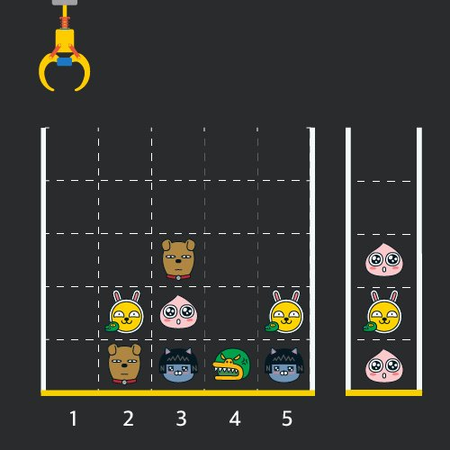

# 크레인 인형뽑기 게임
###### 문제 설명

게임개발자인 "죠르디"는 크레인 인형뽑기 기계를 모바일 게임으로 만들려고 합니다.  
"죠르디"는 게임의 재미를 높이기 위해 화면 구성과 규칙을 다음과 같이 게임 로직에 반영하려고 합니다.


게임 화면은 **"1 x 1"** 크기의 칸들로 이루어진 **"N x N"** 크기의 정사각 격자이며 위쪽에는 크레인이 있고 오른쪽에는 바구니가 있습니다. (위 그림은 "5 x 5" 크기의 예시입니다). 각 격자 칸에는 다양한 인형이 들어 있으며 인형이 없는 칸은 빈칸입니다. 모든 인형은 "1 x 1" 크기의 격자 한 칸을 차지하며 **격자의 가장 아래 칸부터 차곡차곡 쌓여 있습니다.** 게임 사용자는 크레인을 좌우로 움직여서 멈춘 위치에서 가장 위에 있는 인형을 집어 올릴 수 있습니다. 집어 올린 인형은 바구니에 쌓이게 되는 데, 이때 바구니의 가장 아래 칸부터 인형이 순서대로 쌓이게 됩니다. 다음 그림은 [1번, 5번, 3번] 위치에서 순서대로 인형을 집어 올려 바구니에 담은 모습입니다.


만약 같은 모양의 인형 두 개가 바구니에 연속해서 쌓이게 되면 두 인형은 터뜨려지면서 바구니에서 사라지게 됩니다. 위 상태에서 이어서 [5번] 위치에서 인형을 집어 바구니에 쌓으면 같은 모양 인형 **두 개**가 없어집니다.


크레인 작동 시 인형이 집어지지 않는 경우는 없으나 만약 인형이 없는 곳에서 크레인을 작동시키는 경우에는 아무런 일도 일어나지 않습니다. 또한 바구니는 모든 인형이 들어갈 수 있을 만큼 충분히 크다고 가정합니다. (그림에서는 화면표시 제약으로 5칸만으로 표현하였음)

게임 화면의 격자의 상태가 담긴 2차원 배열 board와 인형을 집기 위해 크레인을 작동시킨 위치가 담긴 배열 moves가 매개변수로 주어질 때, 크레인을 모두 작동시킨 후 터트려져 사라진 인형의 개수를 return 하도록 solution 함수를 완성해주세요.

##### [제한사항]

- board 배열은 2차원 배열로 크기는 "5 x 5" 이상 "30 x 30" 이하입니다.
- board의 각 칸에는 0 이상 100 이하인 정수가 담겨있습니다.
    - 0은 빈 칸을 나타냅니다.
    - 1 ~ 100의 각 숫자는 각기 다른 인형의 모양을 의미하며 같은 숫자는 같은 모양의 인형을 나타냅니다.
- moves 배열의 크기는 1 이상 1,000 이하입니다.
- moves 배열 각 원소들의 값은 1 이상이며 board 배열의 가로 크기 이하인 자연수입니다.

##### 입출력 예

|board|moves|result|
|---|---|---|
|[[0,0,0,0,0],[0,0,1,0,3],[0,2,5,0,1],[4,2,4,4,2],[3,5,1,3,1]]|[1,5,3,5,1,2,1,4]|4|

##### 입출력 예에 대한 설명

입출력 예 #1

인형의 처음 상태는 문제에 주어진 예시와 같습니다. 크레인이 [1, 5, 3, 5, 1, 2, 1, 4] 번 위치에서 차례대로 인형을 집어서 바구니에 옮겨 담은 후, 상태는 아래 그림과 같으며 바구니에 담는 과정에서 터트려져 사라진 인형은 4개 입니다.


```python 
# 내가 푼 방식 
def solution(board, moves):
    answer = 0
    stack = []
    
    # board 2차원 기준 반복 작업
    # moves에 따라서 크래인 이동
    # board 에 moves 한 위치에서 인형을 stack
    # stack 은 쌓아올린 것과 그 아래를 조사, 같은 인형 -> 두개 소실 
    # 소실 시 answer에 + 2 추가해주기
    
    # print("인형 통의 크기 : ", len(board))
    
    # for i in range(len(board)):
    #     print(board[i])
    
    for crane in moves:
        pos = crane - 1
        for i in range(len(board)):
            if board[i][pos] == 0:
                continue
            else:
                stack.insert(0, board[i][pos])
                # print("현재 스텍 상황: ", stack)
                board[i][pos] = 0
                if len(stack) >= 2 and stack[0] == stack[1]:
                    # print("조건 확정")
                    answer += 2
                    if len(stack) >= 3:
                        stack = stack[2:]
                        # print("정리 후: ", stack)
                break
    # print(stack)

    return answer
```

# 키패드 누르기
###### 문제 설명

스마트폰 전화 키패드의 각 칸에 다음과 같이 숫자들이 적혀 있습니다.


이 전화 키패드에서 왼손과 오른손의 엄지손가락만을 이용해서 숫자만을 입력하려고 합니다.  
맨 처음 왼손 엄지손가락은 `*` 키패드에 오른손 엄지손가락은 `#` 키패드 위치에서 시작하며, 엄지손가락을 사용하는 규칙은 다음과 같습니다.

1. 엄지손가락은 상하좌우 4가지 방향으로만 이동할 수 있으며 키패드 이동 한 칸은 거리로 1에 해당합니다.
2. 왼쪽 열의 3개의 숫자 `1`, `4`, `7`을 입력할 때는 왼손 엄지손가락을 사용합니다.
3. 오른쪽 열의 3개의 숫자 `3`, `6`, `9`를 입력할 때는 오른손 엄지손가락을 사용합니다.
4. 가운데 열의 4개의 숫자 `2`, `5`, `8`, `0`을 입력할 때는 두 엄지손가락의 현재 키패드의 위치에서 더 가까운 엄지손가락을 사용합니다.  
    4-1. 만약 두 엄지손가락의 거리가 같다면, 오른손잡이는 오른손 엄지손가락, 왼손잡이는 왼손 엄지손가락을 사용합니다.

순서대로 누를 번호가 담긴 배열 numbers, 왼손잡이인지 오른손잡이인 지를 나타내는 문자열 hand가 매개변수로 주어질 때, 각 번호를 누른 엄지손가락이 왼손인 지 오른손인 지를 나타내는 연속된 문자열 형태로 return 하도록 solution 함수를 완성해주세요.

##### [제한사항]

- numbers 배열의 크기는 1 이상 1,000 이하입니다.
- numbers 배열 원소의 값은 0 이상 9 이하인 정수입니다.
- hand는 `"left"` 또는 `"right"` 입니다.
    - `"left"`는 왼손잡이, `"right"`는 오른손잡이를 의미합니다.
- 왼손 엄지손가락을 사용한 경우는 `L`, 오른손 엄지손가락을 사용한 경우는 `R`을 순서대로 이어붙여 문자열 형태로 return 해주세요.

---

##### 입출력 예

|numbers|hand|result|
|---|---|---|
|[1, 3, 4, 5, 8, 2, 1, 4, 5, 9, 5]|`"right"`|`"LRLLLRLLRRL"`|
|[7, 0, 8, 2, 8, 3, 1, 5, 7, 6, 2]|`"left"`|`"LRLLRRLLLRR"`|
|[1, 2, 3, 4, 5, 6, 7, 8, 9, 0]|`"right"`|`"LLRLLRLLRL"`|

##### 입출력 예에 대한 설명

**입출력 예 #1**

순서대로 눌러야 할 번호가 [1, 3, 4, 5, 8, 2, 1, 4, 5, 9, 5]이고, 오른손잡이입니다.

|왼손 위치|오른손 위치|눌러야 할 숫자|사용한 손|설명|
|---|---|---|---|---|
|*|#|1|L|1은 왼손으로 누릅니다.|
|1|#|3|R|3은 오른손으로 누릅니다.|
|1|3|4|L|4는 왼손으로 누릅니다.|
|4|3|5|L|왼손 거리는 1, 오른손 거리는 2이므로 왼손으로 5를 누릅니다.|
|5|3|8|L|왼손 거리는 1, 오른손 거리는 3이므로 왼손으로 8을 누릅니다.|
|8|3|2|R|왼손 거리는 2, 오른손 거리는 1이므로 오른손으로 2를 누릅니다.|
|8|2|1|L|1은 왼손으로 누릅니다.|
|1|2|4|L|4는 왼손으로 누릅니다.|
|4|2|5|R|왼손 거리와 오른손 거리가 1로 같으므로, 오른손으로 5를 누릅니다.|
|4|5|9|R|9는 오른손으로 누릅니다.|
|4|9|5|L|왼손 거리는 1, 오른손 거리는 2이므로 왼손으로 5를 누릅니다.|
|5|9|-|-||

따라서 `"LRLLLRLLRRL"`를 return 합니다.

**입출력 예 #2**

왼손잡이가 [7, 0, 8, 2, 8, 3, 1, 5, 7, 6, 2]를 순서대로 누르면 사용한 손은 `"LRLLRRLLLRR"`이 됩니다.

**입출력 예 #3**

오른손잡이가 [1, 2, 3, 4, 5, 6, 7, 8, 9, 0]를 순서대로 누르면 사용한 손은 `"LLRLLRLLRL"`이 됩니다.

```python
# 내가 푼 방식
def solution(numbers, hand):
    answer = ''
    left = {1:0, 4:1, 7:2}
    right = {3:0, 6:1, 9:2}
    middle = {2:0, 5:1, 8:2, 0:3}
    LH = [3, 0]
    RH = [3, 2]
    
    def cordChange(height, width):
        return [height, width]
    
    for number in numbers:
        # print("현재 손 위치: L: ", LH, " / R: ",RH )
        if number in left.keys():
            LH = cordChange(left[number], 0)
            answer += 'L'
        elif number in right.keys():
            RH = cordChange(right[number], 2)
            answer += 'R'
        else: 
            lLength = abs(middle[number] - LH[0]) + 1 - LH[1]
            rLength = abs(middle[number] - RH[0]) + abs(1 - RH[1])
            if lLength < rLength:
                LH = cordChange(middle[number], 1)
                answer += 'L'
            elif lLength > rLength:
                RH = cordChange(middle[number], 1)
                answer += 'R'
            else:
                if hand == 'left':
                    LH = cordChange(middle[number], 1)
                    answer += 'L'
                else :
                    RH = cordChange(middle[number], 1)
                    answer += 'R'
    return answer
```

# 성격 유형 검사하기
###### 문제 설명

나만의 카카오 성격 유형 검사지를 만들려고 합니다.  
성격 유형 검사는 다음과 같은 4개 지표로 성격 유형을 구분합니다. 성격은 각 지표에서 두 유형 중 하나로 결정됩니다.

|지표 번호|성격 유형|
|---|---|
|1번 지표|라이언형(R), 튜브형(T)|
|2번 지표|콘형(C), 프로도형(F)|
|3번 지표|제이지형(J), 무지형(M)|
|4번 지표|어피치형(A), 네오형(N)|

4개의 지표가 있으므로 성격 유형은 총 16(=2 x 2 x 2 x 2)가지가 나올 수 있습니다. 예를 들어, "RFMN"이나 "TCMA"와 같은 성격 유형이 있습니다.

검사지에는 총 `n`개의 질문이 있고, 각 질문에는 아래와 같은 7개의 선택지가 있습니다.

- `매우 비동의`
- `비동의`
- `약간 비동의`
- `모르겠음`
- `약간 동의`
- `동의`
- `매우 동의`

각 질문은 1가지 지표로 성격 유형 점수를 판단합니다.

예를 들어, 어떤 한 질문에서 4번 지표로 아래 표처럼 점수를 매길 수 있습니다.

|선택지|성격 유형 점수|
|---|---|
|`매우 비동의`|네오형 3점|
|`비동의`|네오형 2점|
|`약간 비동의`|네오형 1점|
|`모르겠음`|어떤 성격 유형도 점수를 얻지 않습니다|
|`약간 동의`|어피치형 1점|
|`동의`|어피치형 2점|
|`매우 동의`|어피치형 3점|

이때 검사자가 질문에서 `약간 동의` 선택지를 선택할 경우 어피치형(A) 성격 유형 1점을 받게 됩니다. 만약 검사자가 `매우 비동의` 선택지를 선택할 경우 네오형(N) 성격 유형 3점을 받게 됩니다.

**위 예시처럼 네오형이 비동의, 어피치형이 동의인 경우만 주어지지 않고, 질문에 따라 네오형이 동의, 어피치형이 비동의인 경우도 주어질 수 있습니다.**  
하지만 각 선택지는 고정적인 크기의 점수를 가지고 있습니다.

- `매우 동의`나 `매우 비동의` 선택지를 선택하면 3점을 얻습니다.
- `동의`나 `비동의` 선택지를 선택하면 2점을 얻습니다.
- `약간 동의`나 `약간 비동의` 선택지를 선택하면 1점을 얻습니다.
- `모르겠음` 선택지를 선택하면 점수를 얻지 않습니다.

검사 결과는 모든 질문의 성격 유형 점수를 더하여 각 지표에서 더 높은 점수를 받은 성격 유형이 검사자의 성격 유형이라고 판단합니다. 단, 하나의 지표에서 각 성격 유형 점수가 같으면, 두 성격 유형 중 사전 순으로 빠른 성격 유형을 검사자의 성격 유형이라고 판단합니다.

질문마다 판단하는 지표를 담은 1차원 문자열 배열 `survey`와 검사자가 각 질문마다 선택한 선택지를 담은 1차원 정수 배열 `choices`가 매개변수로 주어집니다. 이때, 검사자의 성격 유형 검사 결과를 지표 번호 순서대로 return 하도록 solution 함수를 완성해주세요.

---

##### 제한사항

- 1 ≤ `survey`의 길이 ( = `n`) ≤ 1,000
    - `survey`의 원소는 `"RT", "TR", "FC", "CF", "MJ", "JM", "AN", "NA"` 중 하나입니다.
    - `survey[i]`의 첫 번째 캐릭터는 i+1번 질문의 비동의 관련 선택지를 선택하면 받는 성격 유형을 의미합니다.
    - `survey[i]`의 두 번째 캐릭터는 i+1번 질문의 동의 관련 선택지를 선택하면 받는 성격 유형을 의미합니다.
- `choices`의 길이 = `survey`의 길이
    
    - `choices[i]`는 검사자가 선택한 i+1번째 질문의 선택지를 의미합니다.
    - 1 ≤ `choices`의 원소 ≤ 7
    
    |`choices`|뜻|
    |---|---|
    |1|매우 비동의|
    |2|비동의|
    |3|약간 비동의|
    |4|모르겠음|
    |5|약간 동의|
    |6|동의|
    |7|매우 동의|
    

---

##### 입출력 예

|survey|choices|result|
|---|---|---|
|`["AN", "CF", "MJ", "RT", "NA"]`|[5, 3, 2, 7, 5]|`"TCMA"`|
|`["TR", "RT", "TR"]`|[7, 1, 3]|`"RCJA"`|

---

##### 입출력 예 설명

**입출력 예 #1**

1번 질문의 점수 배치는 아래 표와 같습니다.

|선택지|성격 유형 점수|
|---|---|
|매우 비동의|어피치형 3점|
|비동의|어피치형 2점|
|약간 비동의|어피치형 1점|
|모르겠음|어떤 성격 유형도 점수를 얻지 않습니다|
|**약간 동의**|**네오형 1점**|
|동의|네오형 2점|
|매우 동의|네오형 3점|

1번 질문에서는 지문의 예시와 다르게 비동의 관련 선택지를 선택하면 어피치형(A) 성격 유형의 점수를 얻고, 동의 관련 선택지를 선택하면 네오형(N) 성격 유형의 점수를 얻습니다.  
1번 질문에서 검사자는 `약간 동의` 선택지를 선택했으므로 네오형(N) 성격 유형 점수 1점을 얻게 됩니다.

2번 질문의 점수 배치는 아래 표와 같습니다.

| 선택지        | 성격 유형 점수              |
| ---------- | --------------------- |
| 매우 비동의     | 콘형 3점                 |
| 비동의        | 콘형 2점                 |
| **약간 비동의** | **콘형 1점**             |
| 모르겠음       | 어떤 성격 유형도 점수를 얻지 않습니다 |
| 약간 동의      | 프로도형 1점               |
| 동의         | 프로도형 2점               |
| 매우 동의      | 프로도형 3점               |

2번 질문에서 검사자는 `약간 비동의` 선택지를 선택했으므로 콘형(C) 성격 유형 점수 1점을 얻게 됩니다.

3번 질문의 점수 배치는 아래 표와 같습니다.

|선택지|성격 유형 점수|
|---|---|
|매우 비동의|무지형 3점|
|**비동의**|**무지형 2점**|
|약간 비동의|무지형 1점|
|모르겠음|어떤 성격 유형도 점수를 얻지 않습니다|
|약간 동의|제이지형 1점|
|동의|제이지형 2점|
|매우 동의|제이지형 3점|

3번 질문에서 검사자는 `비동의` 선택지를 선택했으므로 무지형(M) 성격 유형 점수 2점을 얻게 됩니다.

4번 질문의 점수 배치는 아래 표와 같습니다.

|선택지|성격 유형 점수|
|---|---|
|매우 비동의|라이언형 3점|
|비동의|라이언형 2점|
|약간 비동의|라이언형 1점|
|모르겠음|어떤 성격 유형도 점수를 얻지 않습니다|
|약간 동의|튜브형 1점|
|동의|튜브형 2점|
|**매우 동의**|**튜브형 3점**|

4번 질문에서 검사자는 `매우 동의` 선택지를 선택했으므로 튜브형(T) 성격 유형 점수 3점을 얻게 됩니다.

5번 질문의 점수 배치는 아래 표와 같습니다.

|선택지|성격 유형 점수|
|---|---|
|매우 비동의|네오형 3점|
|비동의|네오형 2점|
|약간 비동의|네오형 1점|
|모르겠음|어떤 성격 유형도 점수를 얻지 않습니다|
|**약간 동의**|**어피치형 1점**|
|동의|어피치형 2점|
|매우 동의|어피치형 3점|

5번 질문에서 검사자는 `약간 동의` 선택지를 선택했으므로 어피치형(A) 성격 유형 점수 1점을 얻게 됩니다.

1번부터 5번까지 질문의 성격 유형 점수를 합치면 아래 표와 같습니다.

|지표 번호|성격 유형|점수|성격 유형|점수|
|---|---|---|---|---|
|1번 지표|라이언형(R)|0|튜브형(T)|3|
|2번 지표|콘형(C)|1|프로도형(F)|0|
|3번 지표|제이지형(J)|0|무지형(M)|2|
|4번 지표|어피치형(A)|1|네오형(N)|1|

각 지표에서 더 점수가 높은 `T`,`C`,`M`이 성격 유형입니다.  
하지만, 4번 지표는 1점으로 동일한 점수입니다. 따라서, 4번 지표의 성격 유형은 사전순으로 빠른 `A`입니다.

따라서 `"TCMA"`를 return 해야 합니다.

**입출력 예 #2**

1번부터 3번까지 질문의 성격 유형 점수를 합치면 아래 표와 같습니다.

|지표 번호|성격 유형|점수|성격 유형|점수|
|---|---|---|---|---|
|1번 지표|라이언형(R)|6|튜브형(T)|1|
|2번 지표|콘형(C)|0|프로도형(F)|0|
|3번 지표|제이지형(J)|0|무지형(M)|0|
|4번 지표|어피치형(A)|0|네오형(N)|0|

1번 지표는 튜브형(T)보다 라이언형(R)의 점수가 더 높습니다. 따라서 첫 번째 지표의 성격 유형은 `R`입니다.  
하지만, 2, 3, 4번 지표는 모두 0점으로 동일한 점수입니다. 따라서 2, 3, 4번 지표의 성격 유형은 사전순으로 빠른 `C`, `J`, `A`입니다.

따라서 `"RCJA"`를 return 해야 합니다.

```python
# 내 스타일로 풀기 
def solution(survey, choices):
    answer = ''
    pointList = {'R':0, 'T':0, 'C':0, 'F':0, 'J':0, 'M':0, 'A':0,'N':0}
    for chars, choice in zip(survey, choices):
        if choice in { x for x in range(1, 4)}:
            pointList[chars[0]] += 4 - choice 
        elif choice in { x for x in range(5, 8)}:
            pointList[chars[1]] += choice - 4
        else:
            continue
            
    def compareSurvey(var1, var2):
        if pointList[var1] > pointList[var2]:
            return var1
        elif pointList[var1] < pointList[var2]:
            return var2
        else:
            return var1

    answer += compareSurvey('R', 'T')
    answer += compareSurvey('C', 'F')
    answer += compareSurvey('J', 'M')
    answer += compareSurvey('A', 'N')
    return answer
```

``` python
# 남이 푼 방식 
# 깔끔해서 가져와봄 
def solution(survey, choices):

    my_dict = {"RT":0,"CF":0,"JM":0,"AN":0}
    for A,B in zip(survey,choices):
        if A not in my_dict.keys():
            A = A[::-1]
            my_dict[A] -= B-4
        else:
            my_dict[A] += B-4

    result = ""
    for name in my_dict.keys():
        if my_dict[name] > 0:
            result += name[1]
        elif my_dict[name] < 0:
            result += name[0]
        else:
            result += sorted(name)[0]

    return result
```

# 개인정보 수집 유효기간
###### 문제 설명

고객의 약관 동의를 얻어서 수집된 1~`n`번으로 분류되는 개인정보 `n`개가 있습니다. 약관 종류는 여러 가지 있으며 각 약관마다 개인정보 보관 유효기간이 정해져 있습니다. 당신은 각 개인정보가 어떤 약관으로 수집됐는지 알고 있습니다. 수집된 개인정보는 유효기간 전까지만 보관 가능하며, 유효기간이 지났다면 반드시 파기해야 합니다.

예를 들어, A라는 약관의 유효기간이 12 달이고, 2021년 1월 5일에 수집된 개인정보가 A약관으로 수집되었다면 해당 개인정보는 2022년 1월 4일까지 보관 가능하며 2022년 1월 5일부터 파기해야 할 개인정보입니다.  
당신은 오늘 날짜로 파기해야 할 개인정보 번호들을 구하려 합니다.

**모든 달은 28일까지 있다고 가정합니다.**

다음은 오늘 날짜가 `2022.05.19`일 때의 예시입니다.

|약관 종류|유효기간|
|---|---|
|A|6 달|
|B|12 달|
|C|3 달|

|번호|개인정보 수집 일자|약관 종류|
|---|---|---|
|1|`2021.05.02`|A|
|2|`2021.07.01`|B|
|3|`2022.02.19`|C|
|4|`2022.02.20`|C|

- 첫 번째 개인정보는 A약관에 의해 2021년 11월 1일까지 보관 가능하며, 유효기간이 지났으므로 파기해야 할 개인정보입니다.
- 두 번째 개인정보는 B약관에 의해 2022년 6월 28일까지 보관 가능하며, 유효기간이 지나지 않았으므로 아직 보관 가능합니다.
- 세 번째 개인정보는 C약관에 의해 2022년 5월 18일까지 보관 가능하며, 유효기간이 지났으므로 파기해야 할 개인정보입니다.
- 네 번째 개인정보는 C약관에 의해 2022년 5월 19일까지 보관 가능하며, 유효기간이 지나지 않았으므로 아직 보관 가능합니다.

따라서 파기해야 할 개인정보 번호는 [1, 3]입니다.

오늘 날짜를 의미하는 문자열 `today`, 약관의 유효기간을 담은 1차원 문자열 배열 `terms`와 수집된 개인정보의 정보를 담은 1차원 문자열 배열 `privacies`가 매개변수로 주어집니다. 이때 파기해야 할 개인정보의 번호를 오름차순으로 1차원 정수 배열에 담아 return 하도록 solution 함수를 완성해 주세요.

---

##### 제한사항

- `today`는 "`YYYY`.`MM`.`DD`" 형태로 오늘 날짜를 나타냅니다.
- 1 ≤ `terms`의 길이 ≤ 20
    - `terms`의 원소는 "`약관 종류` `유효기간`" 형태의 `약관 종류`와 `유효기간`을 공백 하나로 구분한 문자열입니다.
    - `약관 종류`는 `A`~`Z`중 알파벳 대문자 하나이며, `terms` 배열에서 `약관 종류`는 중복되지 않습니다.
    - `유효기간`은 개인정보를 보관할 수 있는 달 수를 나타내는 정수이며, 1 이상 100 이하입니다.
- 1 ≤ `privacies`의 길이 ≤ 100
    - `privacies[i]`는 `i+1`번 개인정보의 수집 일자와 약관 종류를 나타냅니다.
    - `privacies`의 원소는 "`날짜` `약관 종류`" 형태의 `날짜`와 `약관 종류`를 공백 하나로 구분한 문자열입니다.
    - `날짜`는 "`YYYY`.`MM`.`DD`" 형태의 개인정보가 수집된 날짜를 나타내며, `today` 이전의 날짜만 주어집니다.
    - `privacies`의 `약관 종류`는 항상 `terms`에 나타난 `약관 종류`만 주어집니다.
- `today`와 `privacies`에 등장하는 `날짜`의 `YYYY`는 연도, `MM`은 월, `DD`는 일을 나타내며 점(`.`) 하나로 구분되어 있습니다.
    - 2000 ≤ `YYYY` ≤ 2022
    - 1 ≤ `MM` ≤ 12
    - `MM`이 한 자릿수인 경우 앞에 0이 붙습니다.
    - 1 ≤ `DD` ≤ 28
    - `DD`가 한 자릿수인 경우 앞에 0이 붙습니다.
- 파기해야 할 개인정보가 하나 이상 존재하는 입력만 주어집니다.

---

##### 입출력 예

|today|terms|privacies|result|
|---|---|---|---|
|`"2022.05.19"`|`["A 6", "B 12", "C 3"]`|`["2021.05.02 A", "2021.07.01 B", "2022.02.19 C", "2022.02.20 C"]`|[1, 3]|
|`"2020.01.01"`|`["Z 3", "D 5"]`|`["2019.01.01 D", "2019.11.15 Z", "2019.08.02 D", "2019.07.01 D", "2018.12.28 Z"]`|[1, 4, 5]|

---

##### 입출력 예 설명

**입출력 예 #1**

- 문제 예시와 같습니다.

**입출력 예 #2**

|약관 종류|유효기간|
|---|---|
|Z|3 달|
|D|5 달|

|번호|개인정보 수집 일자|약관 종류|
|---|---|---|
|1|`2019.01.01`|D|
|2|`2019.11.15`|Z|
|3|`2019.08.02`|D|
|4|`2019.07.01`|D|
|5|`2018.12.28`|Z|

오늘 날짜는 2020년 1월 1일입니다.

- 첫 번째 개인정보는 D약관에 의해 2019년 5월 28일까지 보관 가능하며, 유효기간이 지났으므로 파기해야 할 개인정보입니다.
- 두 번째 개인정보는 Z약관에 의해 2020년 2월 14일까지 보관 가능하며, 유효기간이 지나지 않았으므로 아직 보관 가능합니다.
- 세 번째 개인정보는 D약관에 의해 2020년 1월 1일까지 보관 가능하며, 유효기간이 지나지 않았으므로 아직 보관 가능합니다.
- 네 번째 개인정보는 D약관에 의해 2019년 11월 28일까지 보관 가능하며, 유효기간이 지났으므로 파기해야 할 개인정보입니다.
- 다섯 번째 개인정보는 Z약관에 의해 2019년 3월 27일까지 보관 가능하며, 유효기간이 지났으므로 파기해야 할 개인정보입니다.

```python
# 내 스타일로 풀기 
# 정규식을 활용해서 최대한 풀어본 방법그러나.. 너무 복잡했고, month 가 배수인경우 0이 되는 케이스를 못찾았었다. 
import re

def solution(today, terms, privacies):
    answer = []
    
    conditionDate = [int(today[0:4]), int(today[5:7]), int(today[8:10])]
    termsDict = dict()
    dateDict = dict()
    typeDict = dict()
    deleteList = []

    for term in terms:
        match = re.match(r'([A-Z])\s(\d+)', term)
        termsDict[match.group(1)] = int(match.group(2))
    
    i = 1
    for privacy in privacies:
        target = re.match(r'(\d{4})\.(\d{2})\.(\d{2})\s([A-Z])', privacy)
        dateDict[i] = [int(target.group(1)), int(target.group(2)), int(target.group(3))]
        typeDict[i] = target.group(4)
        i += 1
        
    def findDeleteTarget(limit, target):
        print(limit, " vs ", target)
        if (limit[0] > target[0]):
            return True
        if (limit[0] == target[0]) and (limit[1] > target[1]):
            return True
        if (limit[0] == target[0]) and (limit[1] == target[1]) and (limit[2] > target[2]):
                return True
        return False
    
    for key in dateDict.keys():
        limit = termsDict[typeDict[key]]
        day = dateDict[key][2] - 1
        month = dateDict[key][1] + limit
        if day == 0:
            day = 28
            month -= 1
        addOn = 0
        if month > 12:
            addOn = month // 12
            month = month % 12
            if month == 0:
                month = 12
                addOn -= 1
        year = dateDict[key][0] + addOn 
        if findDeleteTarget(conditionDate, [year, month, day]):
            answer.append(key)

    print("오늘: ",conditionDate)
    print("만료 기간: ", termsDict)
    print("각 문서 날짜: ",dateDict)
    print("각 문서 타입: ", typeDict)
    return answer

```

```python
# 남들꺼 
# 최고의 케이스라고 본다. 걍 이렇게 일수로 환산해서 계산하면 될 것을 너무 고생했다...
# 리스트 컴프리헨션의 기본구조 
# [expression for item in iterable if condition]
# 를 기억하라...! 
# enumrate(iterable object) 이 표현을 사용하면 
# 숫자 인덱스와 값을 동시에 한꺼번에 출력이 가능해진다. 
def to_days(date):
    year, month, day = map(int, date.split("."))
    return year * 28 * 12 + month * 28 + day

def solution(today, terms, privacies):
    months = {v[0]: int(v[2:]) * 28 for v in terms}
    today = to_days(today)
    expire = [
        i + 1 for i, privacy in enumerate(privacies)
        if to_days(privacy[:-2]) + months[privacy[-1]] <= today
    ]
    return expire
```

# 신고 결과 받기 
###### 문제 설명

##### 문제 설명

신입사원 무지는 게시판 불량 이용자를 신고하고 처리 결과를 메일로 발송하는 시스템을 개발하려 합니다. 무지가 개발하려는 시스템은 다음과 같습니다.

- 각 유저는 한 번에 한 명의 유저를 신고할 수 있습니다.
    - 신고 횟수에 제한은 없습니다. 서로 다른 유저를 계속해서 신고할 수 있습니다.
    - 한 유저를 여러 번 신고할 수도 있지만, 동일한 유저에 대한 신고 횟수는 1회로 처리됩니다.
- k번 이상 신고된 유저는 게시판 이용이 정지되며, 해당 유저를 신고한 모든 유저에게 정지 사실을 메일로 발송합니다.
    - 유저가 신고한 모든 내용을 취합하여 마지막에 한꺼번에 게시판 이용 정지를 시키면서 정지 메일을 발송합니다.

다음은 전체 유저 목록이 ["muzi", "frodo", "apeach", "neo"]이고, k = 2(즉, 2번 이상 신고당하면 이용 정지)인 경우의 예시입니다.

|유저 ID|유저가 신고한 ID|설명|
|---|---|---|
|"muzi"|"frodo"|"muzi"가 "frodo"를 신고했습니다.|
|"apeach"|"frodo"|"apeach"가 "frodo"를 신고했습니다.|
|"frodo"|"neo"|"frodo"가 "neo"를 신고했습니다.|
|"muzi"|"neo"|"muzi"가 "neo"를 신고했습니다.|
|"apeach"|"muzi"|"apeach"가 "muzi"를 신고했습니다.|

각 유저별로 신고당한 횟수는 다음과 같습니다.

|유저 ID|신고당한 횟수|
|---|---|
|"muzi"|1|
|"frodo"|2|
|"apeach"|0|
|"neo"|2|

위 예시에서는 2번 이상 신고당한 "frodo"와 "neo"의 게시판 이용이 정지됩니다. 이때, 각 유저별로 신고한 아이디와 정지된 아이디를 정리하면 다음과 같습니다.

|유저 ID|유저가 신고한 ID|정지된 ID|
|---|---|---|
|"muzi"|["frodo", "neo"]|["frodo", "neo"]|
|"frodo"|["neo"]|["neo"]|
|"apeach"|["muzi", "frodo"]|["frodo"]|
|"neo"|없음|없음|

따라서 "muzi"는 처리 결과 메일을 2회, "frodo"와 "apeach"는 각각 처리 결과 메일을 1회 받게 됩니다.

이용자의 ID가 담긴 문자열 배열 `id_list`, 각 이용자가 신고한 이용자의 ID 정보가 담긴 문자열 배열 `report`, 정지 기준이 되는 신고 횟수 `k`가 매개변수로 주어질 때, 각 유저별로 처리 결과 메일을 받은 횟수를 배열에 담아 return 하도록 solution 함수를 완성해주세요.

---

##### 제한사항

- 2 ≤ `id_list`의 길이 ≤ 1,000
    - 1 ≤ `id_list`의 원소 길이 ≤ 10
    - `id_list`의 원소는 이용자의 id를 나타내는 문자열이며 알파벳 소문자로만 이루어져 있습니다.
    - `id_list`에는 같은 아이디가 중복해서 들어있지 않습니다.
- 1 ≤ `report`의 길이 ≤ 200,000
    - 3 ≤ `report`의 원소 길이 ≤ 21
    - `report`의 원소는 "이용자id 신고한id"형태의 문자열입니다.
    - 예를 들어 "muzi frodo"의 경우 "muzi"가 "frodo"를 신고했다는 의미입니다.
    - id는 알파벳 소문자로만 이루어져 있습니다.
    - 이용자id와 신고한id는 공백(스페이스)하나로 구분되어 있습니다.
    - 자기 자신을 신고하는 경우는 없습니다.
- 1 ≤ `k` ≤ 200, `k`는 자연수입니다.
- return 하는 배열은 `id_list`에 담긴 id 순서대로 각 유저가 받은 결과 메일 수를 담으면 됩니다.

---

##### 입출력 예

|id_list|report|k|result|
|---|---|---|---|
|`["muzi", "frodo", "apeach", "neo"]`|`["muzi frodo","apeach frodo","frodo neo","muzi neo","apeach muzi"]`|2|[2,1,1,0]|
|`["con", "ryan"]`|`["ryan con", "ryan con", "ryan con", "ryan con"]`|3|[0,0]|

---

##### 입출력 예 설명

**입출력 예 #1**

문제의 예시와 같습니다.

**입출력 예 #2**

"ryan"이 "con"을 4번 신고했으나, 주어진 조건에 따라 한 유저가 같은 유저를 여러 번 신고한 경우는 신고 횟수 1회로 처리합니다. 따라서 "con"은 1회 신고당했습니다. 3번 이상 신고당한 이용자는 없으며, "con"과 "ryan"은 결과 메일을 받지 않습니다. 따라서 [0, 0]을 return 합니다.

---

##### 제한시간 안내

- 정확성 테스트 : 10초

```python
# 내가 한 것 
# 생각보다 set을 사용한다고 획기적으로 값이 줄진 않더라
# 컴프리헨션 잘 써서 사전형 만드는게 중요 
import re

def solution(id_list, report, k):
    id_count = {id: set() for id in id_list}
    mail_list = {id: 0 for id in id_list}
    # 바로 진행
    for data in report:
        reporter, target = map(str, data.split())
        id_count[target].add(reporter)
        
    for key in id_count:
        if len(id_count[key]) >= k:
            for target in id_count[key]:
                mail_list[target] += 1
                
    return list(mail_list.values())
```

# 붕대감기 
###### 문제 설명

어떤 게임에는 `붕대 감기`라는 기술이 있습니다.

`붕대 감기`는 `t`초 동안 붕대를 감으면서 1초마다 `x`만큼의 체력을 회복합니다. `t`초 연속으로 붕대를 감는 데 성공한다면 `y`만큼의 체력을 추가로 회복합니다. 게임 캐릭터에는 최대 체력이 존재해 현재 체력이 최대 체력보다 커지는 것은 불가능합니다.

기술을 쓰는 도중 몬스터에게 공격을 당하면 기술이 취소되고, 공격을 당하는 순간에는 체력을 회복할 수 없습니다. 몬스터에게 공격당해 기술이 취소당하거나 기술이 끝나면 그 즉시 `붕대 감기`를 다시 사용하며, 연속 성공 시간이 0으로 초기화됩니다.

몬스터의 공격을 받으면 정해진 피해량만큼 현재 체력이 줄어듭니다. 이때, 현재 체력이 0 이하가 되면 캐릭터가 죽으며 더 이상 체력을 회복할 수 없습니다.

당신은 `붕대감기` 기술의 정보, 캐릭터가 가진 최대 체력과 몬스터의 공격 패턴이 주어질 때 캐릭터가 끝까지 생존할 수 있는지 궁금합니다.

`붕대 감기` 기술의 시전 시간, 1초당 회복량, 추가 회복량을 담은 1차원 정수 배열 `bandage`와 최대 체력을 의미하는 정수 `health`, 몬스터의 공격 시간과 피해량을 담은 2차원 정수 배열 `attacks`가 매개변수로 주어집니다. 모든 공격이 끝난 직후 남은 체력을 return 하도록 solution 함수를 완성해 주세요. **만약 몬스터의 공격을 받고 캐릭터의 체력이 0 이하가 되어 죽는다면 -1을 return 해주세요.**

---

##### 제한사항

- `bandage`는 [`시전 시간`, `초당 회복량`, `추가 회복량`] 형태의 길이가 3인 정수 배열입니다.
    - 1 ≤ `시전 시간` = `t` ≤ 50
    - 1 ≤ `초당 회복량` = `x` ≤ 100
    - 1 ≤ `추가 회복량` = `y` ≤ 100
- 1 ≤ `health` ≤ 1,000
- 1 ≤ `attacks`의 길이 ≤ 100
    - `attacks[i]`는 [`공격 시간`, `피해량`] 형태의 길이가 2인 정수 배열입니다.
    - `attacks`는 `공격 시간`을 기준으로 오름차순 정렬된 상태입니다.
    - `attacks`의 `공격 시간`은 모두 다릅니다.
    - 1 ≤ `공격 시간` ≤ 1,000
    - 1 ≤ `피해량` ≤ 100

---

##### 입출력 예

|bandage|health|attacks|result|
|---|---|---|---|
|[5, 1, 5]|30|[[2, 10], [9, 15], [10, 5], [11, 5]]|5|
|[3, 2, 7]|20|[[1, 15], [5, 16], [8, 6]]|-1|
|[4, 2, 7]|20|[[1, 15], [5, 16], [8, 6]]|-1|
|[1, 1, 1]|5|[[1, 2], [3, 2]]|3|

---

##### 입출력 예 설명

**입출력 예 #1**

몬스터의 마지막 공격은 11초에 이루어집니다. 0초부터 11초까지 캐릭터의 상태는 아래 표와 같습니다.

|시간|현재 체력(변화량)|연속 성공|공격|설명|
|---|---|---|---|---|
|0|30|0|X|초기 상태|
|1|30(+0)|1|X|최대 체력 이상의 체력을 가질 수 없습니다.|
|2|20(-10)|0|O|몬스터의 공격으로 연속 성공이 초기화됩니다.|
|3|21(+1)|1|X||
|4|22(+1)|2|X||
|5|23(+1)|3|X||
|6|24(+1)|4|X||
|7|30(+6)|5 → 0|X|5초 연속 성공해 체력을 5만큼 추가 회복하고 연속 성공이 초기화됩니다.|
|8|30(+0)|1|X|최대 체력 이상의 체력을 가질 수 없습니다.|
|9|15(-15)|0|O|몬스터의 공격으로 연속 성공이 초기화됩니다.|
|10|10(-5)|0|O|몬스터의 공격으로 연속 성공이 초기화됩니다.|
|11|5(-5)|0|O|몬스터의 마지막 공격입니다.|

몬스터의 마지막 공격 직후 캐릭터의 체력은 5입니다. 따라서 `5`을 return 해야 합니다.

**입출력 예 #2**

몬스터의 마지막 공격은 8초에 이루어집니다. 0초부터 8초까지 캐릭터의 상태는 아래 표와 같습니다.

|시간|현재 체력(변화량)|연속 성공|공격|설명|
|---|---|---|---|---|
|0|20|0|X|초기 상태|
|1|5(-15)|0|O|몬스터의 공격으로 연속 성공이 초기화됩니다.|
|2|7(+2)|1|X||
|3|9(+2)|2|X||
|4|18(+9)|3 → 0|X|3초 연속 성공해 체력을 7만큼 추가 회복하고 연속 성공이 초기화됩니다.|
|5|2(-16)|0|O|몬스터의 공격으로 연속 성공이 초기화됩니다.|
|6|4(+2)|1|X||
|7|6(+2)|2|X||
|8|0(-6)|0|O|몬스터의 마지막 공격을 받아 캐릭터의 체력이 0 이하가 됩니다.|

몬스터의 공격을 받아 캐릭터의 체력이 0 이하가 됩니다. 따라서 `-1`을 return 해야 합니다.

**입출력 예 #3**

몬스터의 마지막 공격은 8초에 이루어집니다. 0초부터 5초까지 캐릭터의 상태는 아래 표와 같습니다.

|시간|현재 체력(변화량)|연속 성공|공격|설명|
|---|---|---|---|---|
|0|20|0|X|초기 상태|
|1|5(-15)|0|O|몬스터의 공격으로 연속 성공이 초기화됩니다.|
|2|7(+2)|1|X||
|3|9(+2)|2|X||
|4|11(+2)|3|X||
|5|-5(-16)|0|O|몬스터의 공격을 받아 캐릭터의 체력이 0 이하가 됩니다.|

몬스터의 공격을 받아 캐릭터의 체력이 0 이하가 됩니다. 따라서 `-1`을 return 해야 합니다.

**입출력 예 #4**

몬스터의 마지막 공격은 3초에 이루어집니다. 0초부터 3초까지 캐릭터의 상태는 아래 표와 같습니다.

|시간|현재 체력(변화량)|연속 성공|공격|설명|
|---|---|---|---|---|
|0|5|0|X|초기 상태|
|1|3(-2)|0|O|몬스터의 공격으로 연속 성공이 초기화됩니다.|
|2|5(+2)|1 → 0|X|1초 연속 성공해 체력을 1만큼 추가 회복하고 연속 성공이 초기화됩니다.|
|3|3(-2)|0|O|몬스터의 마지막 공격입니다.|

몬스터의 마지막 공격 직후 캐릭터의 체력은 3입니다. 따라서 `3`을 return 해야 합니다.

```python
# 내가 푼 것
# 사소한 조건 에러는 항상 찾기 어렵다. 
# 만약 가능하다면 글자를 적어서 조건을 기록해놓고화는게 중요할 것으로 보인다.
# 다른 사람들도 거의 비슷하게 사용한 것이 보인다. 
def solution(bandage, health, attacks):
    answer = health
    attackTime = { s : d for s, d in attacks}
    healCount = 0

    for i in range(int(attacks[-1][0] + 1)):
        if i in attackTime:
            healCount = 0
            answer -= attackTime[i]
        else:
            healCount += 1
            if healCount == bandage[0]:
                answer += bandage[2] 
                healCount = 0
            answer += bandage[1] 
        if answer > health:
            answer = health
        if answer <= 0:
            return -1 
    return answer
```

```toc

```
