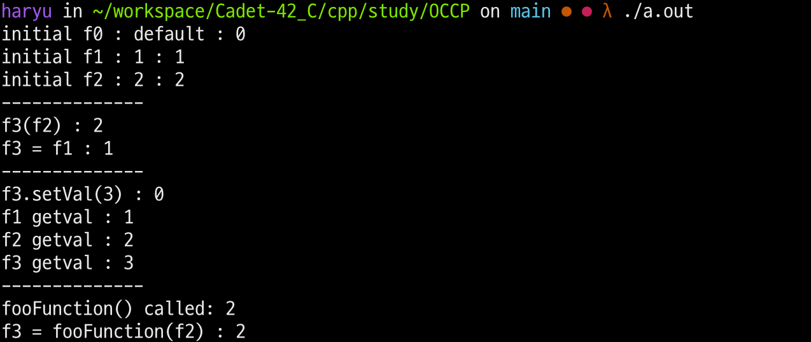

---

# 관련 문서 원문 번역본

본 문서는 Flylib에서 설명하는 [내용](https://flylib.com/books/en/2.937.1.244/1/) 의 번역본입니다.
Orthodox Canonical class form(OCCF)은 적절한 클래스 디자인을 원한다면 사용 가능한 레시피입니다. 네개의 기초 객체 사용 컨텍스트 상에서 적절하게 작동하는 것을 보장해야하는 사용자 정의 데이터 타입을 선언할 때 당신이 구현할 필요가 있는 4가지 기능을 OCCF 는 표현하고 있습니다. 사용자 정의 타입 상에서 OCCF 를 사용함으로써, 객체의 사용에 관련된 상황적 인지도를 상승시킬 수 있습니다. 이러한 수행능력 상에서 OCCF는 객체의 적절한 행동을 위한 레시피일 뿐만 아니라, 근본적인 보다 더 고급 수준의 C++의 특징적인 구조체에 대한 이해도의 초석이 되어 줄 겁니다. OCCF에 대한 직관적인 이해도는 당신의 C++ 클래스 작성 수준을 끌어올려줄 것이며, 복잡함 속에서 어떻게 사용할지, 적절한 형태를 만들어줄 것입니다.

## Four Required Functions(요구되는 4가지 기능들)

4개의 기초적인 사용 Contexts를 지원하기 위해 OCCF는 복잡한 사용자 지정 데이터 타입을 위해 구현해야할 4가지 요구 기능들을 명시합니다. 이는 기본 생성자(default constructor), 복사 생성자(copy constructor), 복사 할당 연산자(copy assignment operator), 그리고 소멸자(destructor)입니다. 복잡한 사용자 지정 타입, Foo 라고 이름지은 것이 각 이렇나 특수한 기능들을 시연하는 것으로 사용될 것입니다. 예제 17.1은 Foo 클래스 선언의 코드를 보여줍니다. Foo 클래스는 그것의 생애주기동안 포인터를 관리하는 복잡한 타입입니다. 그러므로 OCCF 기능들의 목적은 이러한 포인터의 적절한 관리입니다.

```cpp
// example 17.1 foo.h
#ifndef FOO_H
#define FOO_H

class Foo {
	public:
		Foo(int i = 0);
		virtual ~Foo();
		Foo(Foo& rhs);
		Foo& operator=(Foo& rhs);
		int getVal();
		void setVal(int i);
	private:
			int* iptr;
};
#endif
```

### 기본 생성자

생성자의 목적은 적절하게 새로운 객체를 생성하는 것입니다. 기본 생성자는 인자 없이 호출이 가능한 것입니다. 기본 생성자는 인자를 선언할 수 있지만, 각 생성자 패러미터들은 반드시 기본 값을 갖고 있어야 하며, 그래서 생성자는 인자 없이도 호출 될 수 있어야 합니다.
클래스 Foo 를 위한 기본 생성자는 `Foo(int i = 0)`이 부분을 의미합니다. 0을 초기 값으로 가지는 정수 하나를 인자로 선언합니다.

### 소멸자

소멸자는 더 이상 필요로되지 않을 때, 객체의 생애 주기 동안 객체가 사용하기 위해 예약된 어떤 리소스든지 이를 해제할 때 적절하게 객체를 해체하는 목적을 위한 존재입니다.
Foo의 소멸자는 예시는 `virtual ~Foo();` 항목입니다. 상속 계층 지원을 위해 가상으로 선언되었습니다.

### 복사 생성자

복사 생성자의 목적은 이미 존재하는 객체에서 새로운 객체를 만들기 위함입니다. 복사 생성자는 복사 생성자가 속한 참조 타입인 최소 하나의 인자를 선언합니다.
Foo 클래스에서의 복사 생성자는 `Foo(Foo& rhs);` 부분이며, rhs(right hand side\_오른편이란 의미의 축약어) 라는 이름의 하나의 인자를 선언합니다. 이는 Foo 객체에 대한 참조입니다. (즉, Foo&)

### 복사 할당 연산자

복사 할당 연산자의 목적은 존재하는 객체를 또 다른 존재 객체에 의해 제공되는 값들로 초기화 하는 역할을 합니다.
Foo 복사 할당 연산자는 `Foo& operator=(Foo& rhs)`로 선언되어 있습니다. Foo 객체에서 참조하는 하나의 인자를 선언합니다.

## Implementing Foo Class OCCF Functions

```cpp
// 17.2 foo.cpp
#include "foo.h"

Foo::Foo(int i){ iptr = new int(i); }

Foo::~Foo() { delete iptr; }

Foo::Foo(Foo& rhs) {
	iptr = new int(*(rhs.iptr);
}

Foo&Foo::operator=(Foo& rhs){
	*iptr = *(rhs.iptr);
	return *this;
}

int Foo::getVal(){ return *iptr; }

void Foo::setVal(int i){ *iptr = i; }
```

### 이후에 요구될 행동 고려할 것

클래스 Foo 선언된 4개의 특별한 함수들은 기본적인 OCCF 레시피를 실행합니다. 이 말의 의미는 Foo 객체는 객체 생성, 복사, 할당이나 소멸까지 행동을 할 때 예상대로 행동을 할 것이라는 것을 의미합니다. 이러한 4개의 기초 행동은 Foo 객체가 함수에 인자로써 자신있게 전달하며, 함수에서 반환되는 것을 허락합니다. 그러나 만약 Foo 객체들이 다른 프로그래밍 컨택스트에서 사용할 것이라면, 다른 함수들 그리고 연산자들을 반드시 지원해야 할 것입니다.
Foo 클래스는 두 가지 추가적인 기능을 제공합니다. : getVal()그리고 setVal()이며, 이는 정수 값을 얻거나 설정하는 역할을 합니다.

```cpp
// 17.3 main.cpp
#include <iostream>
#include "foo.h"
#include "f.h"

using namespace std;

int main(){

	Foo f0, f1(1), f2(2);
	cout << "initial f0 : default : " << f0.getVal() << endl;
	cout << "initial f1 : 1 : " << f1.getVal() << endl;
	cout << "initial f2 : 2 : "  << f2.getVal() << endl;
	cout << "--------------" << endl;

	Foo f3(f2);
	cout << "f3(f2) : "  <<f3.getVal() << endl;
	f3 = f1;
	cout << "f3 = f1 : " << f3.getVal() << endl;
	cout << "--------------" << endl;

	f3.setVal(3);
	cout << "f3.setVal(3) : " << f0.getVal() << endl;
	cout << "f1 getval : " << f1.getVal() << endl;
	cout << "f2 getval : " << f2.getVal() << endl;
	cout << "f3 getval : " << f3.getVal() << endl;
	cout << "--------------" << endl;

	f3 = fooFunction(f2);
	cout << "f3 = fooFunction(f2) : " << f3.getVal() << endl;
	return (0);
}
```

```cpp
// 17.4 f.h
#ifndef F_H
#define F_H
	class Foo;

	Foo&fooFunction(Foo foo);

#endif
```

```cpp
// 17.5 f.cpp
#include "f.h"
#include "foo.h"
#include <iostream>
using namespace std;

Foo& fooFunction(Foo foo){
	cout << "fooFunction() called: " << foo.getVal() << endl;
	return foo;
}
```

17.3 예시는 Foo 객체가 만들어지고, 사용되며, 파기 되는 것을 보여주는 메인 함수를 보여주고 있습니다. 헤더 파일 f.h 는 fooFunction() 이라는 함수를 위한 선언을 포함하고 있습니다. 해당 함수는 Foo 객체를 값으로 함수에 전달합니다.



---

# 핵심 정리 내용

## 개념

- OCCF(Orthodox Canonical Class Form) : 4개의 기초 객체 사용을 위한 context 레시피. 사용자 지정 클래스 및 데이터 타입을 제작한다고 할 때, 기본적으로 제공해주는 틀의 형태로, 이를 따라서 제작하는 것은 클래스의 사용에 있어서 어떤 식으로 동작하며, 동시에 클래스의 생성, 갱신, 삭제 등의 작업을 어떻게 작동하는지를 알게 되는 효과를 가집니다.
- 요구되는 4가지 기능함수
  - 기본 생성지 : 새로운 객체를 만드는 용. 인자없이 호출이 가능하도록 되어 있어야 합니다.
  - 소멸자 : 더이상 필요로 하지 않는 객체에 대해 없애는 용도의 함수입니다. #가상함수 #virtual_function
  - 복사 생성자 : 이미 존재하는 객체에서 새로운 객체를 만들기 위함에 만들어진 생성자입니다.
  - 복사 할당 연산자 : 존재하는 객체를 또다른 객체에 제공되는 값으로 초기화하여 반환하는 역할을 합니다.

```toc

```
