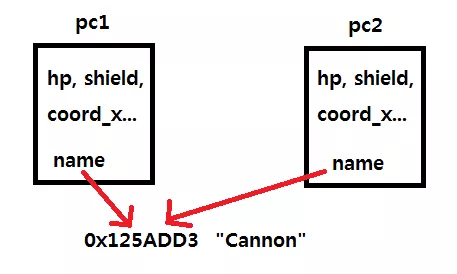
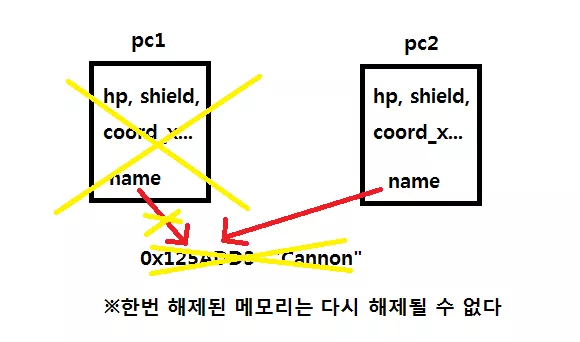

- 이번 내용에서는 생성자에 대해 배웠고, 변수를 초기화 하지 않아서 생기는 C의 다양한 오류들을 효과적이고, 효율적으로 없앨 수 있었다. 
- 더불어 함수 오버로딩의 정책 덕분에 C언어에서 함수들의 이름을 제대로 사용하지 않으면 안되었지만, 더욱 편리한 사용이 가능해졌다. 

# 스타크래프트 만들기

```cpp
#include <iostream>

class Marine {
	private:
		int hp;
		int coord_x, coord_y;
		int damage;
		bool is_dead;
	public:
		Marine();
		Marine(int x, int y);

		int attack();
		void be_attacked(int damage_earn);
		void move(int x, int y);

		void show_status();
};
Marine::Marine() {
	hp = 50;
	coord_x = coord_y = 0;
	damage = 5;
	is_dead = false;
}
Marine::Marine(int x, int y) {
	coord_x = x;
	coord_y = y;
	hp = 50;
	damage = 5;
	is_dead = false;
}
void Marine::move(int x, int y) {
	coord_x = x;
	coord_y = y;
}
int Marine::attack() { return damage; }
void Marine::be_attacked(int damage_earn) {
	hp -= damage_earn;
	if (hp <= 0)
		is_dead = true;
}
void Marine::show_status() {
	std::cout << " *** Marine *** " << std::endl;
	std::cout << " Location : ( " << coord_x << " , " << coord_y << " ) " << std::endl;
	std::cout << " HP : " << hp << std::endl;
}
int main(void){
	Marine marine1(2, 3);
	Marine marine2(3, 5);

	marine1.show_status();
	marine2.show_status();

	std::cout << std::endl << "마린1이 마린2를 공격!" << std::endl;
	marine2.be_attacked(marine1.attack());

	marine1.show_status();
	marine2.show_status();
}
```

- 위 코드에서 실제 게임 처럼 수십마리 호출 및 싸우게 만들 수 없음. 이를 위해선 아래처럼 만들수 있다. 

```cpp
int main() {
	Marine* marines[100];

	marines[0] = new Marine(2, 3); // 동적 메모리 할당
	marines[1] = new Marine(3, 5);

	marines[0]->show_status();
	marines[1]->show_status();

	std::cout << std::endl << "마린 1이 마린 2를 공격! " << std::endl;

	marines[0]->be_attacked(marine[1]->attack());

	marines[0]->show_status();
	marines[1]->show_status();

	delete marines[0]; // 동적 메모리 할당 해제
	delete marines[1];
}
```

# 소멸자(Destructor)
```cpp
// 마린의 이름 만들기
#include <string.h>
#include <iostream>

class Marine {
  int hp;                // 마린 체력
  int coord_x, coord_y;  // 마린 위치
  int damage;            // 공격력
  bool is_dead;
  char* name;  // 마린 이름

 public:
  Marine();                                       // 기본 생성자
  Marine(int x, int y, const char* marine_name);  // 이름까지 지정
  Marine(int x, int y);  // x, y 좌표에 마린 생성

  int attack();                       // 데미지를 리턴한다.
  void be_attacked(int damage_earn);  // 입는 데미지
  void move(int x, int y);            // 새로운 위치

  void show_status();  // 상태를 보여준다.
};
Marine::Marine() {
  hp = 50;
  coord_x = coord_y = 0;
  damage = 5;
  is_dead = false;
  name = NULL;
}
Marine::Marine(int x, int y, const char* marine_name) {
  name = new char[strlen(marine_name) + 1]; // 이름 넣어줌! 🚩
  strcpy(name, marine_name);

  coord_x = x;
  coord_y = y;
  hp = 50;
  damage = 5;
  is_dead = false;
}
Marine::Marine(int x, int y) {
  coord_x = x;
  coord_y = y;
  hp = 50;
  damage = 5;
  is_dead = false;
  name = NULL;
}
void Marine::move(int x, int y) {
  coord_x = x;
  coord_y = y;
}
int Marine::attack() { return damage; }
void Marine::be_attacked(int damage_earn) {
  hp -= damage_earn;
  if (hp <= 0) is_dead = true;
}
void Marine::show_status() {
  std::cout << " *** Marine : " << name << " ***" << std::endl;
  std::cout << " Location : ( " << coord_x << " , " << coord_y << " ) "
            << std::endl;
  std::cout << " HP : " << hp << std::endl;
}

int main() {
  Marine* marines[100];

  marines[0] = new Marine(2, 3, "Marine 2");
  marines[1] = new Marine(1, 5, "Marine 1");

  marines[0]->show_status();
  marines[1]->show_status();

  std::cout << std::endl << "마린 1 이 마린 2 를 공격! " << std::endl;

  marines[0]->be_attacked(marines[1]->attack());

  marines[0]->show_status();
  marines[1]->show_status();

  delete marines[0];
  delete marines[1];
}
```

- 지금까지 만든 마린 클래스에 이름을 지정할수도 있습니다. `name`이라는 인스턴스 변수를 추가함으로써 동적으로 할당하여 이름 스트링을 넣어줍니다. 

```shell
*** Marine : Marine 2 ***
 Location : ( 2 , 3 ) 
 HP : 50
 *** Marine : Marine 1 ***
 Location : ( 1 , 5 ) 
 HP : 50

마린 1 이 마린 2 를 공격! 
 *** Marine : Marine 2 ***
 Location : ( 2 , 3 ) 
 HP : 45
 *** Marine : Marine 1 ***
 Location : ( 1 , 5 ) 
 HP : 50
```

- 정상적으로 컴파일 하면, 다음과 같은 메시지를 볼 수 있다. 
- 위 코드에서는 이름 외에도 문제가 발생하게 되는데, 이는 이름을 넣어줄 때, `name`영역을 동적으로 생성해서 문자열을 복사했고, 이에 따라 동적으로 할당된 `char`배열을 `delete`해 주어야 한다. 
- 그러나 `delete`를 명확하게 지정하지 않으면, 기본적으로 `delete`가 되는 경우는 없다. 즉, 이에 대해 처리하지 않으면 `메모리 누수`<sup>Memory Leaks</sup> 가 발생한다. 
- 즉, 우리가 생성했던 객체가 소멸될 때, 자동으로 호출되는 함수이며, 객체가 소멸시 자동으로 정리해주는 것이 존재하고 이를 `소멸자`<sup>Destructor</sup> 라고 한다. 

```cpp
#include <string.h>
#include <iostream>

class Marine {
  int hp;                // 마린 체력
  int coord_x, coord_y;  // 마린 위치
  int damage;            // 공격력
  bool is_dead;
  char* name;  // 마린 이름

 public:
  Marine();                                       // 기본 생성자
  Marine(int x, int y, const char* marine_name);  // 이름까지 지정
  Marine(int x, int y);  // x, y 좌표에 마린 생성
  ~Marine();

  int attack();                       // 데미지를 리턴한다.
  void be_attacked(int damage_earn);  // 입는 데미지
  void move(int x, int y);            // 새로운 위치

  void show_status();  // 상태를 보여준다.
};
Marine::Marine() {
  hp = 50;
  coord_x = coord_y = 0;
  damage = 5;
  is_dead = false;
  name = NULL;
}
Marine::Marine(int x, int y, const char* marine_name) {
  name = new char[strlen(marine_name) + 1];
  strcpy(name, marine_name);

  coord_x = x;
  coord_y = y;
  hp = 50;
  damage = 5;
  is_dead = false;
}
Marine::Marine(int x, int y) {
  coord_x = x;
  coord_y = y;
  hp = 50;
  damage = 5;
  is_dead = false;
  name = NULL;
}
void Marine::move(int x, int y) {
  coord_x = x;
  coord_y = y;
}
int Marine::attack() { return damage; }
void Marine::be_attacked(int damage_earn) {
  hp -= damage_earn;
  if (hp <= 0) is_dead = true;
}
void Marine::show_status() {
  std::cout << " *** Marine : " << name << " ***" << std::endl;
  std::cout << " Location : ( " << coord_x << " , " << coord_y << " ) "
            << std::endl;
  std::cout << " HP : " << hp << std::endl;
}
Marine::~Marine() { // 소멸자 부분 🚩
  std::cout << name << " 의 소멸자 호출 ! " << std::endl;
  if (name != NULL) {
    delete[] name;
  }
}
int main() {
  Marine* marines[100];

  marines[0] = new Marine(2, 3, "Marine 2");
  marines[1] = new Marine(1, 5, "Marine 1");

  marines[0]->show_status();
  marines[1]->show_status();

  std::cout << std::endl << "마린 1 이 마린 2 를 공격! " << std::endl;

  marines[0]->be_attacked(marines[1]->attack());

  marines[0]->show_status();
  marines[1]->show_status();

  delete marines[0];
  delete marines[1];
}
```

- delete[] name 의 형태가 되어야 한다면 반드시 써주고 정리해주어야 한다. 
- 더불어 객체가 소멸 될 때 소멸자가 호출하도록 했는데, 굳이 객체가 파괴 될 때 자동으로 작동하기 때문에 편리합니다. 또한 이때, 내부에서 사용하는 생성자는, 해당 함수가 끝남과 동시에 소멸자가 호출되므로, 소멸자의 실행 순서적 차이가 있음을 알 수 있습니다. 
- 이때 특이사항으로 일반적인 변수의 경우 자동적으로 소멸자가 호출 되지만, 배열 형태는 명시적으로 부르지 않으면 자동으로 소멸자가 호출되진 않다.

```cpp
// 소멸자 호출 확인하기
#include <string.h>
#include <iostream>

class Test {
  char c;

 public:
  Test(char _c) {
    c = _c;
    std::cout << "생성자 호출 " << c << std::endl;
  }
  ~Test() { std::cout << "소멸자 호출 " << c << std::endl; }
};
void simple_function() { Test b('b'); }
int main() {
  Test a('a');
  simple_function();
}
```

```shell
생성자 호출 a
생성자 호출 b
소멸자 호출 b
소멸자 호출 a
```

# 복사 생성자
- 특정 인스턴스를 복사 생성할 수도 있다. 

```cpp
// 포토캐논 
#include <string.h>
#include <iostream>

class Photon_Cannon {
	private:
		int hp, shield;
		int coord_x, coord_y;
		int damage;
	public:
		Photon_Cannon(int x, int y);
		Photon_Cannon(const Photon_Cannon& pc);

		void show_status();
};
Photon_Cannon::Photon_Cannon(const Photon_Cannon& pc){
	std::cout << "복사 생성자 호출!" << std::endl;
	hp = pc.hp;
	shield = pc.shield;
	coord_x = pc.coord_x;
	coord_y = pc.coord_y;
	damage = pc.damage;
}
Photon_Cannon::Photon_Cannon(int x, int y) {
	std::cout << "생성자 호출 !" << std::endl;
	hp = shield = 100;
	coord_x = x;
	coord_y = y;
	damage = 20;
}
void Photon_Cannon::show_status() {
	std::cout << "Photon Cannon " << std::endl;
	std::cout << " Location : ( " << coord_x << " , " << coord_y << " ) " << std::endl;
	std::cout << "HP : " << hp << std::endl;
}
int main(void){
	Photon_Cannon pc1(3, 3);
	Photon_Cannon pc2(pc1);
	Photon_Cannon pc3 = pc2;

	pc1.show_status();
	pc2.show_status();
}
```

- 복사 생성자의 표준적 정의는 다음과 같다 : `T(const T& a)`
- 복사 생성자의 정의대로, 다른 T의 객체 a를 상수 레퍼런스로 받는 다. 따라서 이는 복사 생성자 내부에서 a의 데이터를 변경하지 않으며, 새롭게 초기화 되는 인스턴스 변수들에게 복사만 가능하게 제한된다. 
- 예시 코드들을 해석하면 다음과 같다. 
	- pc1은 기본 생성자로 오버로딩 되었고, pc2의 경우는 pc1을 넘겼으므로 오버로딩으로 복사 생성자가 호출된다. 
	- `pc3 = pc2;` 이 코드는 C++ 컴파일러에서 복사생성자 호출과 동일하게 작동합니다. 
		- 한 가지 추가적으로 고려하면, 다음 두가지는 명백히 다르게 해석된다. 
			- `Photon_Cannon pc3 = pc2;`
			- `Photon_Cannon pc3; pc3 = pc2;`
			- 위의 것은 복사 생성자가 1번 호출 된 것이며, 아래 것은 생성자가 1번 호출 되고, 이후에 `pc3 = pc2`라는 연산자가 작동한 것 뿐이다. 
			- 따라서 반드시, 복사 생성자는 오직 `생성` 호출 된다는 것을 명심해라. 

# 디폴트 복사 생성자의 한계 
- 이렇게 만들면 런타임 에러(abort)가 발생한다. 

```cpp
// 디폴트 복사 생성자의 한계
#include <string.h>
#include <iostream>

class Photon_Cannon {
  int hp, shield;
  int coord_x, coord_y;
  int damage;

  char *name;

 public:
  Photon_Cannon(int x, int y);
  Photon_Cannon(int x, int y, const char *cannon_name);
  ~Photon_Cannon();

  void show_status();
};

Photon_Cannon::Photon_Cannon(int x, int y) {
  hp = shield = 100;
  coord_x = x;
  coord_y = y;
  damage = 20;

  name = NULL;
}
Photon_Cannon::Photon_Cannon(int x, int y, const char *cannon_name) {
  hp = shield = 100;
  coord_x = x;
  coord_y = y;
  damage = 20;

  name = new char[strlen(cannon_name) + 1];
  strcpy(name, cannon_name);
}
Photon_Cannon::~Photon_Cannon() {
  // 0 이 아닌 값은 if 문에서 true 로 처리되므로
  // 0 인가 아닌가를 비교할 때 그냥 if(name) 하면
  // if(name != 0) 과 동일한 의미를 가질 수 있다.

  // 참고로 if 문 다음에 문장이 1 개만 온다면
  // 중괄호를 생략 가능하다.

  if (name) delete[] name;
}
void Photon_Cannon::show_status() {
  std::cout << "Photon Cannon :: " << name << std::endl;
  std::cout << " Location : ( " << coord_x << " , " << coord_y << " ) "
            << std::endl;
  std::cout << " HP : " << hp << std::endl;
}
int main() {
  Photon_Cannon pc1(3, 3, "Cannon");
  Photon_Cannon pc2 = pc1;

  pc1.show_status();
  pc2.show_status();
}
```

- 대입 연산자를 통해, 디폴트 복사 생성자를 사용했다. 그럼에도 abort가 발생했다. 컴파일러는 분명 1대 1로 복사해주는 것을 아래와 같이 만들어주었다. 

```cpp
Photon_Cannon::Photon_Cannon(const Photon_Cannon& pc) {
  hp = pc.hp;
  shield = pc.shield;
  coord_x = pc.coord_x;
  coord_y = pc.coord_y;
  damage = pc.damage;
  name = pc.name;
}
```

- 그렇다면 위 복사 생성자를 호출한 뒤에 `pc1` 과 `pc2`가 어떻게 되는지를 볼 수 있다. 



- 디폴트 복사 생성자를 사용하게 되면, 클래스 내부의 모든 값이 같은 값을 갖게 된다. 이때 `name`은 값 - 즉 두개의 포인터가 같은 값을 가진다는 것은 같은 주소 값을 가리킨다는 말이 된다. 
- 이 상태 자체는 문제가 되지 않는다. 그러나 문제는 `main`함수가 종료 되고, 직전에 생성된 객체들이 파괴 되면서 소멸자 호출이 되고, 이때 `pc1`이 파괴되면, `pc2`도 파괴 되어야 하는데 되지 못하면서 문제가 발생하게 된다. 



- `delete[] name` 문장이 실행되면서, 해제된 메모리에 `pc2`가 접근하고 런타임 오류가 발생한다. 
- 따라서 이를 해결 하기 위해선 복사 생성자에서 `name` 인스턴스 변수를 복사하지 말고, 다른 메모리에 동적 할당을 하고, 그 내용만 복사하면 된다. 이러한 복사를 `깊은 복사`<sup>deep copy</sup> 라고 부른다. 
- 반대로, 에러가 발생한 케이스의 경우 `얕은 복사`<sup>shallow copy</sup> 라고 부른다. 
- 여기서 알수 있는 점은 컴파일러가 생성하는 디폴트 복사 생성자의 경우 `얕은 복사` 밖에 할 수 없어서, 깊은 복사를 해야 하는 경우엔 반드시 직접 선언을 해주어야 한다. 

```toc

```
