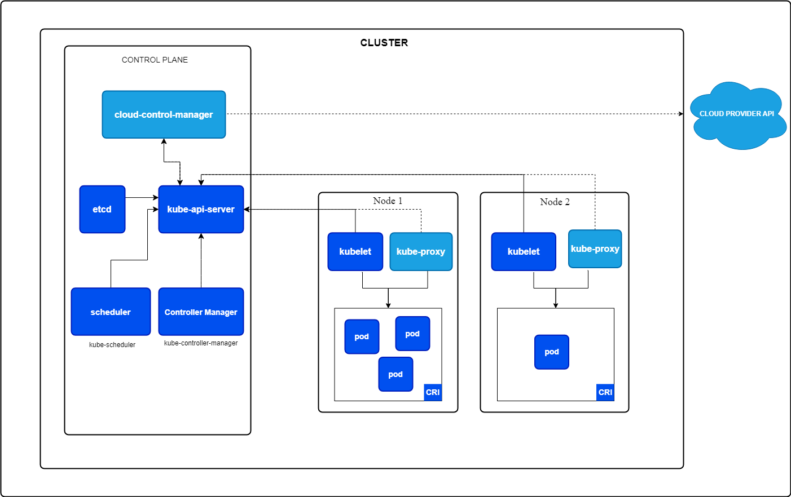

# kubernetes 가 정확히 무엇인가?
- 쿠버네티스는 기존 강의에서 언급한 수동으로 배포 및 웹 프로바이더들에 제약이 되는 등의 문제를 개선하는, 어떤 웹 클라우드 서비스에서도 독립적으로 구축이 가능한 오픈소스 시스템이다. 
- 컨테이너 배포 관리, 컨테이너 오케스트레이션 가능, 자동 배포, 스케일링, 로드 밸런싱, 배포나 관리 등을 전반적으로 도와준다. 
- 특히, 컨테이너를 모니터링하다, 다운이 되면 자동으로 교체하는 등에서 도움이 된다. 
- kubernetes configuration 만 작성하면 쉽게 구성이 가능하다. 더불어 특정 도구로 클라우드나 어떤 머신이든 해당 속성으로 자동으로 배포 및 설정을 가능케 해준다.(즉 표준일 뿐 아니라 도커-컴포즈에서 좀더 확장되어 서버 전체를 설정, 관리 정책을 담은 일종의 통합 도구인 셈이다.)
	- 여기에 더 나아가서 혹여 특수한 클라우드 프로바이더들 사이에 옵션을 추가하면, 해당 클라우드 프로바이더에 특화도 가능하며, 반대로 다른 클라우드에서 사용시 해당 내용만 지우거나, 바꾸면 된다는 소리다. (전체 구성을 다시 할 필요 없음)
- 즉 개념적으로 정리하면, 어떤 웹 프로바이더에서든 사용이 가능한 오픈소스 프로젝트이자, 관리 도구이다. 이를 통해 특정 클라우드 프로바이더에게 국한되지 않도록 만드는 개념 및 도구의 모음이다. 

# kubernetes 아키텍쳐 & 핵심 개념

- **클러스터(Cluster)**
	- 포드, 노드, 네트워크로 구성된 전체 시스템.
	- **마스터 노드(Master Node)**
	    - 클러스터를 관리하고 제어하는 중앙 제어 노드. 고가용성을 위해 다수의 마스터 노드로 설정도 가능하며, 마스터노드는 실질적인 서비스를 위한 서버는 아님. 그러한 노드들을 관리하는 용 
	    - **컨트롤 플레인(Control Plane)**
	        - 마스터 노드에서 실행되는 쿠버네티스의 관리 및 제어 서비스 모음. 
	- **워커 노드(Worker Node)**
	    - 포드를 실행하는 물리적 또는 가상의 머신. 실질적인 서비스들이 담긴 개념
	    - **프록시(Proxy)**
	        - 워커 노드의 포드 네트워크 트래픽을 제어하는 도구.
	    - **포드(Pod)**
	        - 쿠버네티스에서 가장 작은 배포 단위로, 하나 이상의 컨테이너를 포함할 수 있음.
	        - **컨테이너**
	            - 배포하고자 하는 애플리케이션을 담고 있는 기본 단위.
# kubernetes는 인프라를 관리하지 않습니다! 
1. **쿠버네티스 사용 전 준비사항**
   - **특정 환경 제공**: 쿠버네티스가 실행될 수 있는 환경을 준비해야 함.
   - **클러스터와 노드 설정**: 
     - **클러스터 생성**: 쿠버네티스가 사용할 클러스터를 준비.
     - **워커 노드 설정**: 애플리케이션 컨테이너를 실행할 워커 노드 준비.
     - **마스터 노드 설정**: 클러스터를 관리하고 쿠버네티스 작업을 수행할 마스터 노드 준비.
   - **쿠버네티스 소프트웨어 설치**: 클러스터의 일부인 머신에 쿠버네티스 관련 소프트웨어 설치.
   - **부가 리소스 설정**: 필요한 경우 로드 밸런서나 파일 시스템 서비스 등 추가 리소스 설정.
2. **쿠버네티스의 역할**
   - **리소스 사용**: 쿠버네티스는 준비된 리소스를 사용하여 작동함.
   - **포드 관리**: 컨테이너가 포함된 포드 생성, 배포, 모니터링 및 재시작 등을 관리.
   - **배포 관리**: 실행 중인 배포를 관리하고, 워크로드를 고르게 분배하여 작동 상태 유지.
   - **컨테이너 시작**: 사용자를 위해 컨테이너 시작 및 관리.
3. **쿠버네티스와 Docker Compose의 차별점**
   - **배포 범위**: Docker Compose는 주로 로컬 개발 환경에 초점을 맞추며, 쿠버네티스는 더 광범위한 환경에서 복잡한 애플리케이션을 배포하기 위해 설계됨.
   - **환경 설정**: 쿠버네티스 사용을 위해서는 클러스터와 노드의 사전 설정이 필요하며, Docker와 달리 로컬 컴퓨터 설정에 관여하지 않음.
   - **리소스 관리**: 쿠버네티스는 설정된 리소스를 기반으로 포드와 컨테이너를 관리하며, Docker Compose는 로컬 컨테이너 관리에 초점을 맞춤.
# 워커 노드 자세히 살펴보기
1. **워커 노드(Worker Node)**
   - **정의**: 물리적 또는 가상의 컴퓨터, 예를 들어 EC2 인스턴스.
   - **역할**: 쿠버네티스 클러스터 내에서 애플리케이션 컨테이너를 실행하는 노드.
   - **관리**: 마스터 노드에 의해 관리됨.
2. **포드(Pod)**
   - **정의**: 하나 이상의 애플리케이션 컨테이너와 관련 리소스를 호스팅하는 쿠버네티스의 최소 단위. 가상 머신의 부분으로써 다양한 관계로 구조화될 수 있다.
   - **리소스**: 컨테이너 구성, 볼륨(데이터 저장 공간) 등.
   - **관리**: 쿠버네티스(마스터 노드)에 의해 생성, 삭제 등이 관리됨.
3. **워커 노드의 구성 요소** : pod가 동작하기 위한 구성요소
   - **도커(Docker)**: 컨테이너를 생성하고 실행하는 소프트웨어.
   - **kubelet**: 워커 노드와 마스터 노드 간의 통신을 담당하는 에이전트.
   - **kube-proxy**: 워커 노드의 포드로 들어오고 나가는 트래픽을 관리.
4. **워커 노드의 기능**
   - **다중 포드 실행**: 하나의 워커 노드에서 여러 포드 실행이 가능. 스케일링을 위해 동일한 컨테이너의 여러 인스턴스를 포함할 수 있음.
   - **다양한 컨테이너 실행**: 다른 작업을 수행하는 다양한 컨테이너를 포드 내에서 실행할 수 있음.
5. **클라우드 프로바이더의 역할**
   - 클라우드 서비스(예: AWS)는 쿠버네티스 클러스터를 자동으로 설정하고 필요한 소프트웨어를 설치하는 서비스를 제공할 수 있음.
   - 개발자는 클라우드 프로바이더가 제공하는 서비스를 통해 워커 노드를 관리할 필요가 없음. 단지 클러스터의 구성과 작동 방식을 이해하는 것이 중요.

# 마스터 노드 자세히 살펴보기 
1. **마스터 노드의 역할**
   - 클러스터의 관리와 제어를 담당.
   - 워커 노드와 포드의 생성, 관리 및 감시를 중앙에서 수행.
2. **마스터 노드에서 실행되는 주요 소프트웨어**
   - **API 서버**: 워커 노드의 kubelet과 통신하는 중앙 허브. 클라이언트의 요청을 받아 쿠버네티스 클러스터에 명령을 전달.
   - **스케줄러**: 새로운 포드의 생성을 담당하며, 이 포드를 실행할 적합한 워커 노드를 선택.
   - **큐브 컨트롤러 매니저 (Kube-Controller-Manager)**: 포드, 노드 상태를 감시하고, 클러스터 상태를 원하는 상태로 유지하기 위한 작업을 조정.
   - **클라우드 컨트롤러 매니저**: 클라우드 특정 로직과 상호 작용하는 컴포넌트로, 클라우드 서비스(예: AWS, Azure)와 쿠버네티스 클러스터 간의 연동을 관리.
3. **클라우드 프로바이더와의 연동**
   - 클라우드 컨트롤러 매니저를 통해 클라우드 프로바이더에게 필요한 작업을 전달, 클라우드 리소스와의 상호 작용을 담당.
4. **클라우드 서비스 사용의 이점**
   - 대형 클라우드 프로바이더(예: AWS, Azure)는 쿠버네티스 클러스터를 쉽게 구성하고 관리할 수 있는 서비스를 제공, 사용자는 쿠버네티스 구성만 제공하면 됨.

# 중요 용어 & 개념 

1. **클러스터(Cluster)**
   - 노드 머신(마스터 및 워커 노드)과 배포를 포함하는 모든 것의 집합. 클러스터는 쿠버네티스가 관리하는 애플리케이션을 실행하는 환경을 제공.
2. **노드(Node)**
   - 하나 또는 여러 개의 포드를 호스팅하는 물리적 또는 가상 머신. 클러스터 내에서 통신할 수 있음.
   - **마스터 노드(Master Node)**: 클러스터의 관리와 제어를 담당하는 노드.
   - **워커 노드(Worker Node)**: 실제 애플리케이션 컨테이너와 필요한 리소스를 실행하는 노드.
3. **포드(Pod)**
   - 하나 이상의 애플리케이션 컨테이너와 그 리소스가 결합된 단위. 포드는 쿠버네티스의 기본 배포 단위로, 컨테이너의 실행 및 관리를 담당한다.
4. **컨테이너(Container)**
   - 애플리케이션과 그 종속성이 패키지된, 격리된 환경. 도커 컨테이너를 의미한다. 
5. **서비스(Service)**
   - 한 개 이상의 포드에 대한 지속적인 접근을 제공하는 추상화 레이어. 서비스를 통해 포드를 외부 IP 주소 또는 도메인으로 노출하고 접근할 수 있다.


```toc

```
