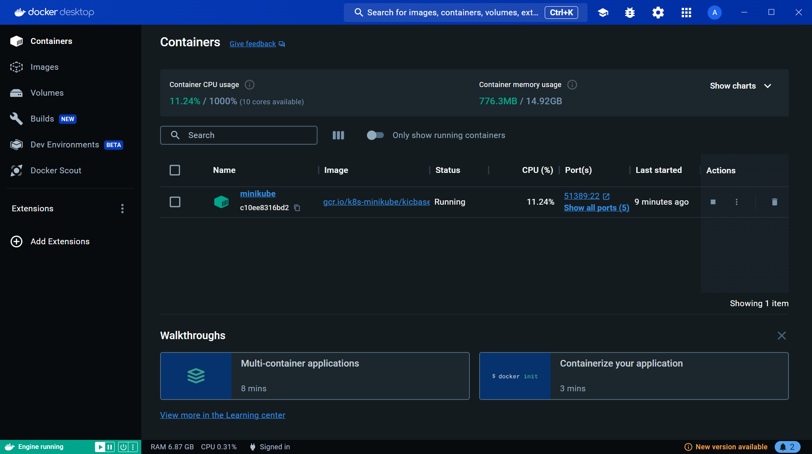
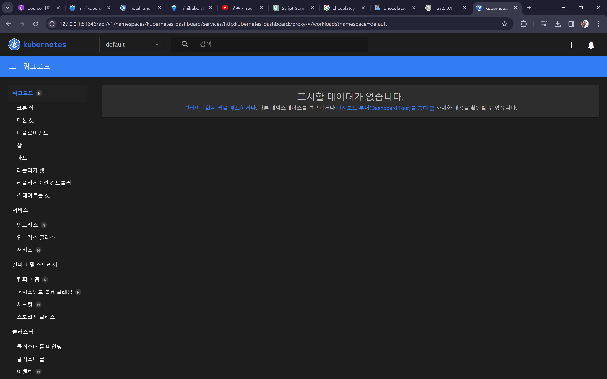
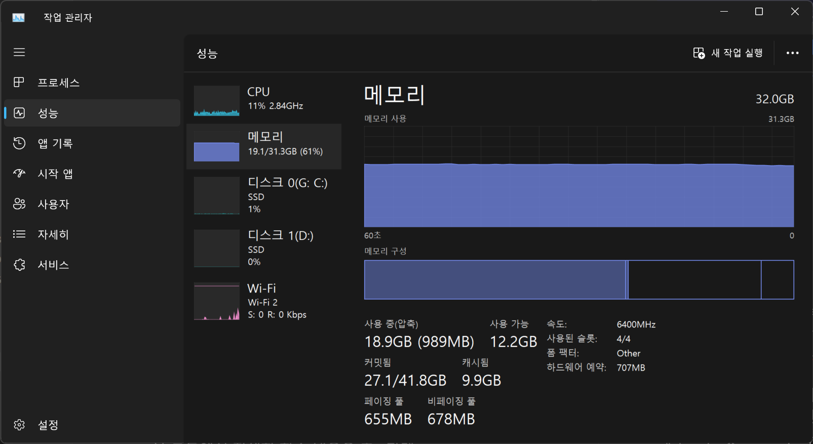

# 색션 12. 실전 Kubernetes - 핵심 개념 자세히 알아보기
## 183. Kuberntes: 요구 설정 & 설치 단계 
로컬 머신에서 쿠버네티스를 다루기 위해 설치해야 할 구성요소는 다음과 같다:

1. **클러스터**: 쿠버네티스 클러스터는 마스터 노드와 하나 이상의 워커 노드로 구성되며, 이 클러스터는 실제 머신이나 가상 인스턴스에 분산되어 운영될 수 있다.
2. **마스터 노드 소프트웨어**: 마스터 노드에는 쿠버네티스의 핵심 구성 요소인 API 서버, 스케줄러 등이 설치되어야 한다.
3. **워커 노드 소프트웨어**: 워커 노드에는 Docker와 같은 컨테이너 런타임과 kubelet이 설치되어야 한다.
4. **kubectl**: 쿠버네티스 클러스터와 통신하기 위한 커맨드 라인 인터페이스 도구로, 개발자와 관리자는 이를 사용하여 클러스터에 명령을 보낼 수 있다.

로컬에서 쿠버네티스를 실험하기 위해서는 다음 도구도 필요하다:

- **minikube**: 로컬 머신에서 쿠버네티스 클러스터를 쉽게 생성하고 관리할 수 있는 도구로, 가상 머신 내에서 단일 노드 쿠버네티스 클러스터를 설정한다. minikube는 개발 및 테스트 목적으로 쿠버네티스를 사용할 수 있게 해준다.

이 도구들은 쿠버네티스를 로컬에서 시작하고 테스트하는 데 필수적이다. 설치 및 설정 과정은 Linux, macOS, 및 Windows 운영 체제에서 가능하며, 각 운영 체제에 맞는 설치 지침을 따르는 것이 중요하다.
## 184. macOS  설정
## 185. Windows 설정 
이 강의에서는 Windows 환경에 minikube와 kubectl을 설치하는 과정을 다룬다. Windows 사용자가 아니라면, 이 부분을 건너뛸 수 있다. 로컬 개발 클러스터를 생성하기 위해 minikube를 설치하고자 한다면, 공식 설치 지침을 따라야 한다. 이 강의에는 필요한 모든 설치 지침의 링크가 첨부되어 있다.

### minikube 설치 과정 요약:
1. **가상화 지원 확인**: 시스템이 가상화를 지원하며 Hypervisor가 설정되어 있는지 확인해야 한다. 설정이 되어 있지 않다면, Hypervisor를 설치해야 한다. VirtualBox를 사용할 계획이라면, 내장 Hypervisor 대신 VirtualBox를 사용할 수 있다. VirtualBox는 Windows 10 Home을 포함한 모든 시스템에서 작동한다.

2. **kubectl 설치**: minikube와는 별개로 항상 필요한 도구로, 클러스터와 통신하는 데 사용된다. Chocolatey를 통해 Windows에 쉽게 설치할 수 있다.

3. **minikube 설치**: minikube는 로컬 머신에 쿠버네티스 클러스터를 생성하는 도구다. Chocolatey를 통해 설치할 수 있으며, VirtualBox 또는 내장 Hypervisor를 사용해 가상 머신을 생성한다.

4. **클러스터 설정 및 테스트**: 설치가 완료되면, minikube로 클러스터를 시작하고, `minikube status`와 `minikube dashboard` 명령을 사용해 설치와 설정이 올바르게 이루어졌는지 확인한다.

### 중요 포인트:
- VirtualBox는 모든 Windows 시스템에서 작동하며, 특히 내장 Hypervisor가 없는 Windows 10 Home에서 유용하다.
- kubectl은 클러스터 관리를 위해 필수적인 도구로, 클러스터에 명령을 보내는 데 사용된다.
- minikube는 로컬 개발 및 테스트 목적으로 쿠버네티스 클러스터를 쉽게 생성하고 관리할 수 있게 해준다.
- 설치 과정은 VirtualBox나 내장 Hypervisor를 사용해 가상 머신을 생성하는 단계를 포함한다. 선택한 도구에 따라 설치 단계가 달라질 수 있다.

이 과정을 통해 사용자는 Windows 환경에서 쿠버네티스를 시작하고, 로컬 개발 클러스터를 통해 쿠버네티스 작업을 시작할 준비를 마칠 수 있다.

---
본 강의가 찍힌 시점이 2020년 인지라 변경된 내용도 존재한다. 
현재는 docker 가 기본적으로 윈도우에서 제공하는 wsl2기반으로 동작하게 바뀌었고, 해당 세팅을 하기만 하면 나머지 설정은 거의 필요가 없어졌다. 

Hyperv 지원 여부등도 굳이 볼 필요가 없으며 그냥 순서대로 적용하면 된다. 

1) wsl 2 버전 사용을 default로 하여 가상화 설정을 마친다
2) docker desktop을 깔면서 내부에 docker 엔진등의 설정을 마무리 지은다. 
3) kubectl 을 설치한다(curl 혹은 cholotey 활용)
4) minikube를 설치한다 -> minikube start : 자동으로 쿠버네티스 설정이 마무리 되고 container의 형태로 minikube가 설정된다. 
5) 성공적으로 설치가 마무리 되면 `minikube dashboard` 명령어를 치면 해당 대시보드를 웹 상에서 볼수 있다. 



한 가지 기억할 것은 확실히 쿠버네티스를 활용하거나 연습을 하려면 해당 컨테이너를 비롯해서 쿠버네티스 구성요소들을 모두 올려야 하므로 하드웨어 리소스를 상당히 잡아 먹는다는 점이다.

램 32기가로 아무것도 배포를 하지 않은 미니큐브 상태에서도 대략 18~19GB 를 먹는걸 보면, 만약 정상 서비스를 올린다? 램 64는 우습게 필요할 것으로 보인다... 


## 186. Kuberntes 객체(리소스)

쿠버네티스를 사용하여 클러스터와 상호 작용하기 위해서는 쿠버네티스의 핵심 개념과 객체에 대한 이해가 필수적이다. 쿠버네티스는 다양한 객체를 통해 작업을 수행하며, 이 객체들은 쿠버네티스 클러스터 내에서 작동하는 방식을 정의한다. 주요 쿠버네티스 객체로는 Pods, Deployments, Services, Volumes 등이 있다.

### 쿠버네티스 객체 이해의 중요성:
- **Pods**: 쿠버네티스에서 가장 기본이 되는 단위로, 하나 이상의 컨테이너를 포함할 수 있다. 대부분의 경우, 하나의 Pod는 하나의 컨테이너만 포함한다. Pod는 클러스터 내에서 컨테이너들이 어떻게 배치되고 관리되는지를 정의한다.
- **Deployments & Services**: Pods를 생성하고 관리하는 데 사용되는 객체. 이 객체들은 쿠버네티스가 어떻게 애플리케이션을 배포하고, 접근 가능하게 할지를 정의한다.
- **Volumes**: 컨테이너 내 데이터를 저장하는데 사용되며, Pod의 임시성에도 불구하고 데이터를 지속적으로 유지할 수 있는 방법을 제공한다.

### 쿠버네티스 객체 생성 방식:
- **명령적 방식**: 사용자가 직접 명령을 통해 쿠버네티스에게 객체를 생성하도록 지시하는 방식.
- **선언적 방식**: 사용자가 객체의 상태를 정의한 구성 파일을 쿠버네티스에 제공하고, 쿠버네티스가 해당 상태를 달성하도록 하는 방식.

### Pod의 특징과 중요성:
- **임시성**: Pod는 임시적이며, 이는 Pod가 제거되거나 교체될 때 그 안의 모든 데이터가 손실될 수 있음을 의미한다. 이러한 특성은 컨테이너의 핵심 개념과 일치한다.
- **네트워킹**: Pod는 클러스터 내부 IP 주소를 가지며, 이를 통해 클러스터 내외부와 통신할 수 있다.
- **컨테이너의 집합**: Pod는 하나 또는 여러 개의 컨테이너를 실행할 수 있으며, 이 컨테이너들은 서로 localhost를 통해 통신할 수 있다.
- **자원을 공유**: 볼륨 등을 모든 Pod 컨테이너들이 공유할 수 있다. 

쿠버네티스의 객체들을 이해하고 활용하는 것은 쿠버네티스 클러스터를 효과적으로 관리하고 운영하기 위한 핵심적인 부분이다. 이를 통해 개발자는 클러스터 내에서 애플리케이션을 쉽게 배포하고, 관리하며, 스케일링할 수 있다.
## 187. "Deployment" 객체(리소스)

Deployment 객체는 쿠버네티스에서 애플리케이션을 배포하고 관리하는 데 사용되는 핵심 개념 중 하나입니다. Deployment를 사용하면 원하는 애플리케이션의 상태를 선언할 수 있고, 쿠버네티스는 그 상태를 유지하기 위해 자동으로 필요한 조치를 취합니다. 이 과정에서 Pod 생성과 관리, 업데이트 롤아웃 및 롤백, 자동 스케일링 등의 기능을 활용할 수 있습니다.

### Deployment의 주요 이점:
- **자동화된 롤아웃 및 롤백**: 새로운 버전의 애플리케이션을 배포할 때 안정적으로 업데이트하고, 필요한 경우 이전 버전으로 쉽게 롤백할 수 있습니다.
- **원하는 상태 관리**: Deployment를 통해 원하는 애플리케이션 상태를 정의하고, 쿠버네티스가 이 상태를 유지하도록 합니다. 이는 애플리케이션의 복제본 수, 사용할 컨테이너 이미지 등을 포함할 수 있습니다.
- **자동 스케일링**: 트래픽이 증가하면 자동으로 Pod의 수를 늘려서 부하를 처리하고, 트래픽이 줄어들면 Pod의 수를 줄여 리소스를 절약할 수 있습니다.
- **자원의 효율적 배치**: 쿠버네티스가 클러스터의 자원 상황을 고려하여 Pod를 적절한 워커 노드에 배치합니다.

### Deployment 생성 및 관리:
Deployment 생성은 대체로 선언적 방식을 사용하여 YAML 또는 JSON 파일로 정의된 원하는 상태를 쿠버네티스 API에 전달함으로써 이루어집니다. 이 파일은 원하는 애플리케이션 상태를 정의하며, `kubectl apply` 명령을 사용하여 클러스터에 적용됩니다.

### 실제 사용 시나리오:
- **애플리케이션 업데이트**: 새로운 컨테이너 이미지로 업데이트하려는 경우, Deployment의 이미지를 업데이트하고 쿠버네티스가 변경사항을 클러스터에 롤아웃합니다.
- **스케일링**: 특정 시간 동안 더 많은 사용자가 애플리케이션을 사용하게 되면, Deployment를 통해 자동 또는 수동으로 Pod의 수를 조정할 수 있습니다.
- **자동 복구**: Pod가 실패하거나 실행 중인 노드에 문제가 발생한 경우, 쿠버네티스는 Deployment의 원하는 상태를 유지하기 위해 자동으로 해당 Pod를 다시 생성하고 배치합니다.

쿠버네티스의 Deployment를 사용하면 복잡한 애플리케이션도 쉽게 관리하고, 지속적인 업데이트와 스케일링을 자동으로 처리할 수 있어 개발 및 운영 효율성이 크게 향상됩니다.
## 188. 첫 번째 Deployment - 명령적 접근 방식 사용
## 189. kubectl: 작동 배경 
## 190. "Service" 객체(리소스)
## 191. Service 로 Deployment  노출하기
## 192. 컨테이너 재 시작
## 193. 실제 스케일링
## 194. Deployment 업데이트 하기
## 195. Deployment 롤백 & 히스토리
## 196. 명령적 접근 방식 vs 선언적 접근 방식
## 197. 배포 구성 파일 생성하기(선언적 접근 방식)
## 198. Pod  와 컨테이너 사양(Specs) 추가
## 199. Label 및 Selector로 작업하기 
## 200. 선언적으로 Service 만들기

```toc

```
