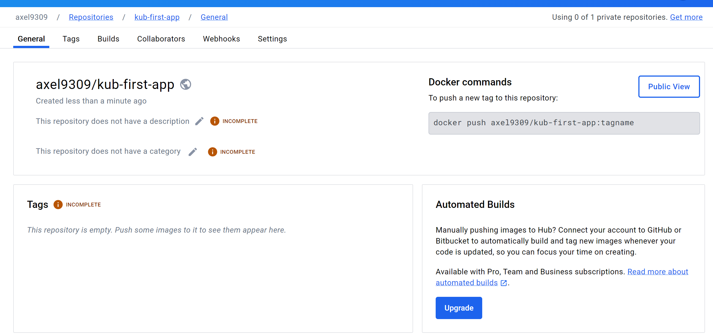
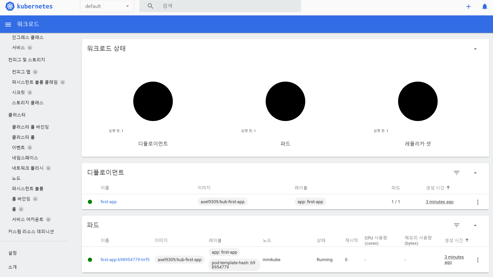
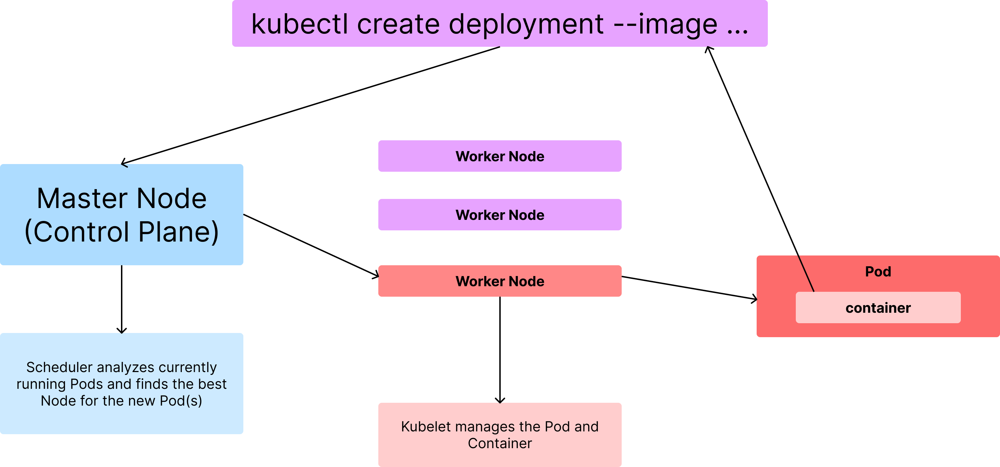
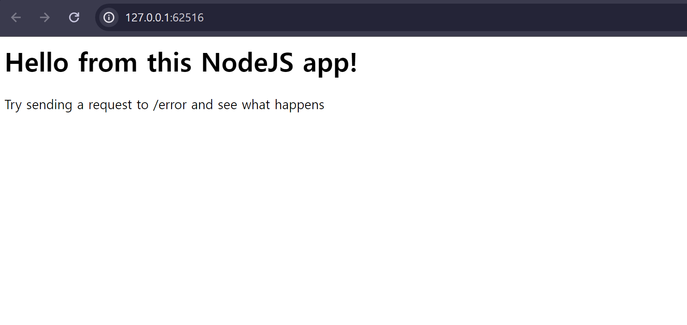

# 색션 12. 실전 Kubernetes - 핵심 개념 자세히 알아보기
## 188. 첫 번째 Deployment - 명령적 접근 방식 사용
- 쿠버네티스를 배우면서 생기는 가장 기본적인 망각 중에 하나가, 바로 도커를 결국 사용은 한다는 점이다. 
- 반대로 도커를 자체적으로 컨테이너를 실행하지 않는 다는 것이다. 
- 필요한 프로그램, 도커 파일이 준비되어 있다면 docker 이미지를 준비한다. 
```shell
docker build -t kub-first-app .
```
- 이미지가 빌드 되고 나면 이미지를 이제 쿠버네티스 클러스터로 보내면 된다. (Pod) Pod 가 이를 실행하고 관리할 것이다
### deployment 
- 올릴 쿠버네티스에 상태를 파악해야 하므로 minikube status 로 상태를 파악한다. 
```shell
> minikube status
W0416 20:46:56.511965   10756 main.go:291] Unable to resolve the current Docker CLI context "default": context "default": context not found: open C:\Users\ryuax\.docker\contexts\meta\37a8eec1ce19687d132fe29051dca629d164e2c4958ba141d5f4133a33f0688f\meta.json: The system cannot find the path specified.
E0416 20:46:57.200613   10756 status.go:415] kubeconfig endpoint: got: 127.0.0.1:51393, want: 127.0.0.1:60221
minikube
type: Control Plane
host: Running
kubelet: Stopped
apiserver: Stopped
kubeconfig: Misconfigured


WARNING: Your kubectl is pointing to stale minikube-vm.     
To fix the kubectl context, run `minikube update-context` 
```
- 이때 동작하는 minikube가 정상이 아니라면, 다시 minikube를 재시작 하면 된다. 
```shell
> minikube status
W0416 20:49:04.280476   54608 main.go:291] Unable to resolve the current Docker CLI context "default": context "default": context not found: open C:\Users\ryuax\.docker\contexts\meta\37a8eec1ce19687d132fe29051dca629d164e2c4958ba141d5f4133a33f0688f\meta.json: The system cannot find the path specified.
minikube
type: Control Plane
host: Running
kubelet: Running
apiserver: Running
kubeconfig: Configured
```
- kubectl 을 기억하자. : 지난 시간에 이 툴을 설치했음. 해당 툴은 항상 로컬 기준으로 존재하고, 로컬 시스템에서 실행하는 명령이다. 마스터 노드와 해당 클러스터의 컨트롤러라고 생각하자. 
- deployment : 아래의 명령어를 통해 쿠버네티스에 배포할 것을 만든다. 이러한 방식은 '명령적' 방식이며, 이후 선언적 방식도 배워볼 예정이다. 
```shell
> kubectl create deployment first-app --image=kub-first-app
deployment.apps/first-app created
```
-  이제 실행 되었는지를 아래와 같이 알 수 있다. 
	- 결과를 보면 준비된 것이 전체 1개 중 0개로 실패했다고 나올 것이다. 그렇다면 pod를 확인하여서 어떤 상태인지를 보자. 
```shell
> kubectl get deployments
NAME        READY   UP-TO-DATE   AVAILABLE   AGE
first-app   0/1     1            0           47s
```

```shell
> kubectl get pods
NAME                         READY   STATUS             RESTARTS   AGE
first-app-6897769c85-bvjvv   0/1     ImagePullBackOff   0          7m2s
```
- 현재 가장 큰 문제는 create deployment 명령으로 배포를 생성할 때, 여기에서 지정한 이미지가 로컬 머신에서 가상머신으로 전달되지 않은채 명령어가 전송되었고, 클러스터가 이 이미지를 찾지 못했기 때문에 이런 문제가 발생한 것이다. 따라서 도커 허브와 같은 이미지 레지스트리 등으로 올려주고, 지정해줘야한다. 
- 기존 내용을 삭제하자. 
```shell
> kubectl delete deployment first-app
deployment.apps "first-app" deleted
```
- 이제 pod 을 다시 확인해보면 내용이 나오지 않을 것이다. 
```shell
> kubectl get pods
No resources found in default namespace.
```
- 따라서 우선 docker hub에 해당 이미지를 올려보자.

- docker tag 를 다시 지정한다. 
```shell
> docker tag kub-first-app axel9309/kub-first-app
> docker push axel9309/kub-first-app
Using default tag: latest
The push refers to repository [docker.io/axel9309/kub-first-app]
013870e91364: Pushed
c08ef7d37754: Pushed
7b3875b08cff: Pushed
4ac4527bf0a5: Pushed
31f710dc178f: Mounted from library/node
a599bf3e59b8: Mounted from library/node
e67e8085abae: Mounted from library/node
f1417ff83b31: Mounted from library/node
latest: digest: sha256:adf08c0b7aa76bf25389acb1b1bb6168f8271654a6e3e4acb31b8ac1aee7c609 size: 1989
```
- 이번에 다시 create deployment 를 진행하는데, 허브의 리모트 이미지를 따라가도록 하여 실행한다.
```shell
> kubectl create deployment first-app --image=axel9309/kub-first-app
deployment.apps/first-app created
> kubectl get deployments
NAME        READY   UP-TO-DATE   AVAILABLE   AGE
first-app   1/1     1            1           25s
```
- 성공적으로 kubectl 을 통해 쿠버네티스 환경으로 이미지가 들어간 것이 보이고, 성공적으로 1이 뜬 것이 보일 것이다. 
- 이제 성공적으로 동작하는지를 보기위해 대쉬보드로 들어갑니다. `minikube dashboard`

## 189. kubectl: 작동 배경 
- 내부에서 어떻게 동작하는지를 정확하게 이해하고 넘어갑시다. 
- `kubectl create deployment --image ...` 라는 명령어를 치는 순간 `Master Node`, 즉 컨트롤 플레인으로 `deployment 객체` 를 만들어 전송한다. 
	- Master Node는 클러스터에 필요한 모든 것을 생성하게 되는데, 이때 스케쥴러가 실제 동작 중인 Pod 를 분석하여, 새로 생성된 Pod에 적합한 Node를 찾아 deployment를 기반으로 생성한다. 
	- 이때 생성된 `Pod`는 내부의 자체적인 기준 아래에, 적절한 `Worker Node`로 전달된다. 
	- 워커노드는 kubelet 서비스를 얻게 되면서, pod를 관리하고, 내 컨테이너를 동작 시키며, 모니터링을 진행한다. 

## 190. "Service" 객체(리소스)
- 기본적으로 pod 와 pod 내부의 실행되는 컨테이너들에 접근하기 위해선 service 객체가 필요하다.
- service 객체는 pod 들을 클러스터로 노출시키거나, 외부에서 연결하기 위해 매우 중요하다. 
- pod 에는 내부적으로 디폴트 내부 IP가 존재한다.
	- 그러나 pod는 외부에서 접속하는데 사용이 불가능한, 내부 통신용 IP라는 점
	- pod가 교체 될 때마다 새롭게 IP 가 부여된다는 점, 스케일링 등을 활용한다면 더더욱 말이다. 
- 결론적으로 IP는 pod와의 통신에서 훌륭한 도구는 아니며, 내부 IP 기반으로 동작하는 것은 제약이 있다. 
- 이에 비해 service는 여러 pod를 묶어서 공유 IP 로 외부와의 연결의 입구로서 관리가 가능하다. (단, 기본적으론 내부 연결만 지원하도록 설정되어 있다.)
## 191. Service 로 Deployment  노출하기
- `kubectl create` 로 service 객체를 생성할 수 있다. 
- 하지만 외부로 pod 를 외부로 노출한다면 `kubectl expose`가 훨씬 편리하다. 
- 이때 두 가지 옵션을 넣어줘야 한다. 
	- `--port` : 당연히 노출할 포트 값이다 
	- `--type` : expose 할 유형을 지정해주는 것이며 몇 가지 타입이 존재한다. 
		- `ClusterIP` : 디폴트 유형, 기본적으로 클러스터 내부에서만 동작하도록 만드는 경우에 사용한다. 
		- `NodePort` : deployment 가 실행 중인 워커노드의 IP 주소를 통해 노출되는 형태이다. 
		- `LoadBalancer` : 이 타입은 클러스터가 실행되는 인프라에 존재할 LoadBalancer 를 활용한 타입이다. 고유 주소를 갖고, 들어오는 트래픽을 service가 pod에게 고르게 분산한다. 스케일링이 필요해지면, 당연히 이 타입이 필요하다, **단 클러스터와 클러스터가 실행되는 인프라가 이를 지원해야 한다.**
```shell
> kubectl expose deployment first-app --type=LoadBalancer --port=8080
service/first-app exposed
```
- 이제 실행된 서비스를 확인할 수 있다. 
```shell
> kubectl get services
NAME         TYPE           CLUSTER-IP     EXTERNAL-IP   PORT(S)          AGE       
first-app    LoadBalancer   10.104.83.75   <pending>     8080:31941/TCP   13s       
kubernetes   ClusterIP      10.96.0.1      <none>        443/TCP          22d      
```
- kubernetes ClusterIP로 할당된 서비스는 자동으로 생성되는 default 서비스 이다. 
- 내부 구성을 보면, 이름, 타입, 내부망 IP, 외부 IP가 존재하는데 minikube 를 통한 경우 external IP는 pending 으로 나타나게 되나, 로컬에선 정상 동작한다. 
- 또한 클라우드 프로바이더에서 서비스를 만든다면, 외부 주소가 있어 바로 접속 되지만 minikube는 어렵기에 minikube service 라는 명령어를 통해 접근을 테스트 해볼 수 있다. 
```shell
> minikube service first-app
W0416 21:56:12.768863   86632 main.go:291] Unable to resolve the current Docker CLI context "default": context "default": context not found: open C:\Users\ryuax\.docker\contexts\meta\37a8eec1ce19687d132fe29051dca629d164e2c4958ba141d5f4133a33f0688f\meta.json: The system cannot find the path specified.
|-----------|-----------|-------------|---------------------------|
| NAMESPACE |   NAME    | TARGET PORT |            URL            |
|-----------|-----------|-------------|---------------------------|
| default   | first-app |        8080 | http://192.168.49.2:31941 |
|-----------|-----------|-------------|---------------------------|
🏃  first-app 서비스의 터널을 시작하는 중
|-----------|-----------|-------------|------------------------|
| NAMESPACE |   NAME    | TARGET PORT |          URL           |
|-----------|-----------|-------------|------------------------|
| default   | first-app |             | http://127.0.0.1:62516 |
|-----------|-----------|-------------|------------------------|
🎉  Opening service default/first-app in default browser...
❗  Because you are using a Docker driver on windows, the terminal needs to be open to run it.
```

## 192. 컨테이너 재 시작
## 193. 실제 스케일링
## 194. Deployment 업데이트 하기
## 195. Deployment 롤백 & 히스토리
## 196. 명령적 접근 방식 vs 선언적 접근 방식
## 197. 배포 구성 파일 생성하기(선언적 접근 방식)
## 198. Pod  와 컨테이너 사양(Specs) 추가
## 199. Label 및 Selector로 작업하기 
## 200. 선언적으로 Service 만들기

```toc

```
