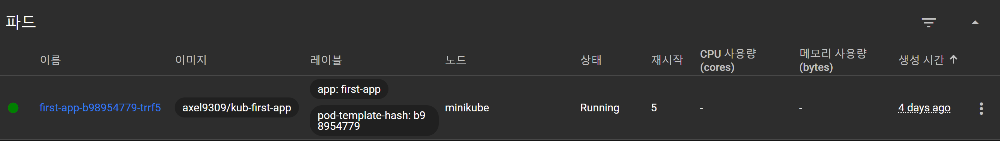
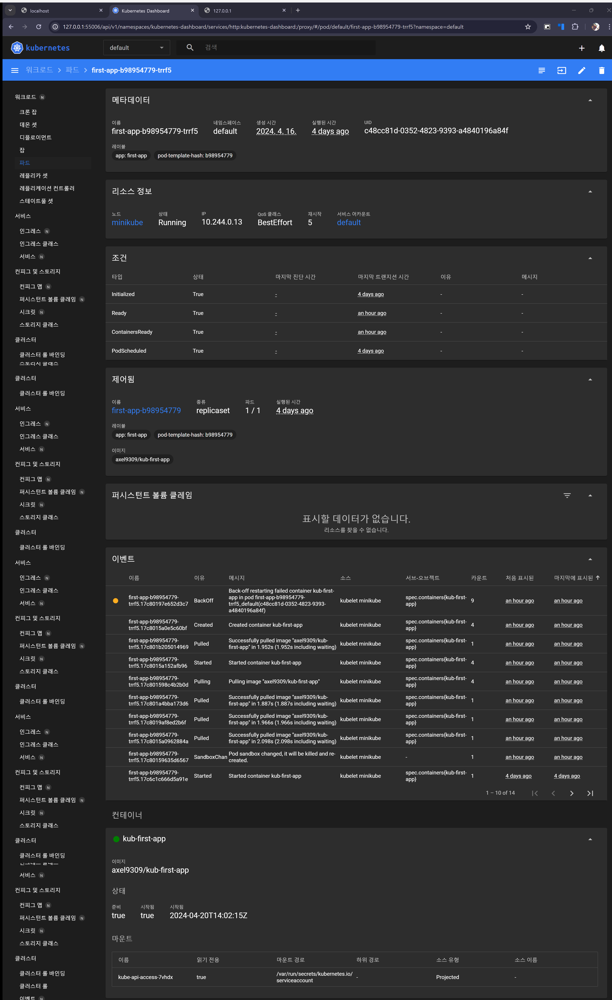
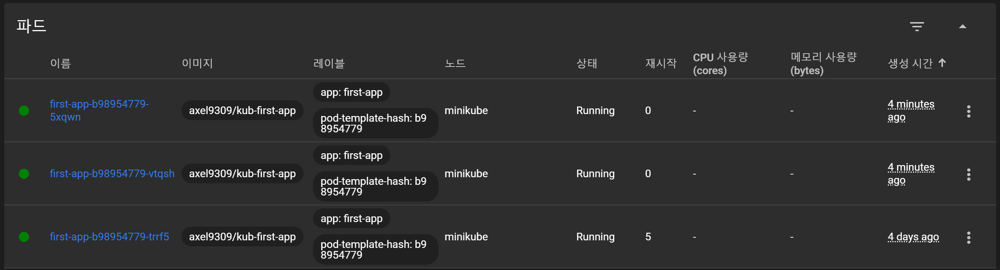
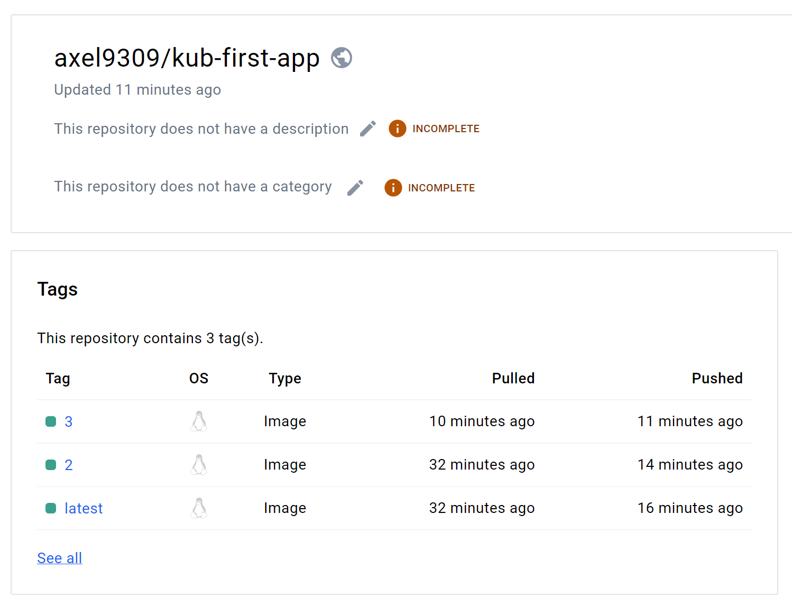

# 색션 12. 실전 Kubernetes - 핵심 개념 자세히 알아보기
## 192. 컨테이너 재 시작
- 실습에서 /error 이라는 라우팅과 함께 Node 예제를 종료 시키는 코드를 갖고 있었다.  
```js
const express = require('express');

const app = express();

app.get('/', (req, res) => {
  res.send(`
    <h1>Hello from this NodeJS app!</h1>
    <p>Try sending a request to /error and see what happens</p>
  `);
});

app.get('/error', (req, res) => {
  process.exit(1);
});

app.listen(8080);
```
- 해당 URL 에 접근하게 되면, process 가 종료하게 되면서 에러가 발생하게 된다 .
- 이때 이렇게 되는 것은 pod와 pod의 컨테이너 상태를 모니터링 되고 있고, 모닌터링 과정에서 실패가 발생하면 다른 걸로 교체가 되거나 하는게 아닌, 일단은 해당 pod와 pod 내의 컨테이너를 다시 시작한다. 또한 이 내용은 kubernetes dashboard에서도 볼 수 있는 것이다. 
- 또한 해당 pod로 들어가면 세부적으로 그러한 행동이 나타났다는 로그 등도 함께 확인이 가능하다. 


## 193. 실제 스케일링
- 재시작과 관련한 유용한 명령이 하나 더 있다. 오토 스케일링 기능이 없다고 생각하면 kubectl 은 자동으로 pod의 숫자를 늘리거나 줄이지 않는다.
- 이럴 때 트래픽이 더 많이 유입될 것이라고 예상이 된다면 특정 기능의 서비스를 위한 pod와 그것의 컨테이너를 한번 실행 하는게 아닌 세번이라고 가정하면, 이를 scale 명령어를 통해 구현이 가능하다. 
```shell
> kubectl scale deployment/first-app --replicas=3
deployment.apps/first-app scaled
```
- 위 처럼 입력하여 설정 한 뒤 pod 상태를 보면
```shell
> kubectl get pods
NAME                        READY   STATUS    RESTARTS      AGE
first-app-b98954779-5xqwn   1/1     Running   0             6s
first-app-b98954779-trrf5   1/1     Running   5 (85m ago)   4d3h
first-app-b98954779-vtqsh   1/1     Running   0             6s
```



- 이제 보면 동일한 컨테이너의 pod가 세 개가 생겨 났고 이렇게 되면 트래픽은 이 세 개의 컨테이너에 고르게 분산되게 된다. 
- 뿐만 아니라 service를 켜서 실제로 접속을 한 뒤, /error url로 접속하게 되면 당연히 pod의 컨테이너가 exit이 되게 되는데, <mark style="background: #FFB8EBA6;">이때도 하나의 파드는 재 실행되고 있고, 그 동안 다시 접속을 하면 다른 pod로 자동으로 리다이렉션이 들어가게 된다.</mark>
- 이렇듯 오토 스케일링 기능이 아니더라도, 수동으로 pod들을 scaling 설정할 수 있고, 트래픽에 대한 대응, 에러에 대한 대응 등이 가능하다는 것을 알 수 있다.
- 스케일링의 값을 줄이게 되면, 이에 맞춰 pod가 terminated 되며, 종국에는 아예 삭제된다. 
## 194. Deployment 업데이트 하기
- deployment 를 업데이트 하는 방법을 알아본다. 
- 우선, 어플리케이션의 데이터가 변했다고 생각하자. 이렇게 된다면 우리는 docker image를 새롭게 만들 필요가 있다. 
- 더불어 뒤에서 수동으로 pod의 이미지를 설정해줄 때도 사용이 필요하니 tag 를 지정해주면서 빌드를 해줘야 한다. 
```shell
> docker build -t axel9309/kub-first-app:3 .
[+] Building 0.9s (10/10) FINISHED                                                                                                       docker:default
 => [internal] load build definition from Dockerfile               0.0s
 => => transferring dockerfile: 157B                               0.0s 
 => [internal] load .dockerignore                                  0.0s 
 => => transferring context: 63B                                   0.0s 
 => [internal] load metadata for docker.io/library/node:14-alpine  0.8s 
 => [1/5] FROM docker.io/library/node:14-alpine@sha256:434215b487a329c9e867202ff89e704d3a75e554822e07f3e0c0f9e606121b33   0.0s
 => [internal] load build context                                  0.0s 
 => => transferring context: 440B                                  0.0s 
 => CACHED [2/5] WORKDIR /app                                      0.0s 
 => CACHED [3/5] COPY package.json .                               0.0s 
 => CACHED [4/5] RUN npm install                                   0.0s 
 => [5/5] COPY . .                                                 0.0s 
 => exporting to image                                             0.0s 
 => => exporting layers                                            0.0s 
 => => writing image sha256:275e8ac449f1f7fb14104e4fbadf02a840e199667dda80b168be33624588ba03         0.0s 
 => => naming to docker.io/axel9309/kub-first-app:3
 View a summary of image vulnerabilities and recommendations → docker scout quickview
```

- 그 뒤 이미지는 docker hub로 올리면 된다. 
```shell
> docker push axel9309/kub-first-app:3
# 중략...
3: digest: sha256:1f123c54f5d2d4a9be24ecd7635727de4c05cd234734dc4da22cb534e4b75d1f size: 1989
```


- 이렇게 이미지는 이제 도커 허브에 올라간 상태가 되었으니, 이제는 deployment에게 최신의 소스코드 이미지를 가져가 업데이트를 하라고 명령해보자. 이때 필요한 것이 바로 이미지를 무엇으로 pod를 실행시킬지에 대해 알려주는 명령어 `kubectl set image` 이다. 
```shell
> kubectl set image deployment/first-app kub-first-app=axel9309/kub-first-app:3
```
- 위의 명령어는 3개의 부분으로 나뉜다. 
	- `kubectl set image` : 이미지를 설정하는 명령어 본체
	- `deployment/first-app` : 현재 관리되는 것 중 어떤 pod 를 위한 deployment를 지정할 것인가. 즉, 이미지를 설정할 대상을 선정한다. 
	- `kub-first-app=axel9309/kub-first-app:3` : pod, 대상이 어떤 이미지를 쓸 것이고, 해당 이미지가 docker hub에서 어떤 이미지이며, 어떤 태그를 쓰는지를 지정하는 역할을 한다. 

- 이렇게 하기만 하면 끝나는 것은 아니다. 이제 다른 태그가 들어왔음을 알기에 이미지 자체는 kubernetes 내부로 다운로드가 되며 이미지가 업데이트 된다.
- 이때, `kubectl rollout` 이라는 명령어를 통해, 자원을 관리하고 pod 상태를 볼 수있다. 
```shell
> kubectl rollout status deployment/first-app
deployment "first-app" successfully rolled out
```
- 위와 같은 상태가 뜨면 성공적인 것으로, 이제 서비스를 통해 접속해보면 업데이트가 성공적으로 된 것을 볼 수 있다. 


```toc

```
