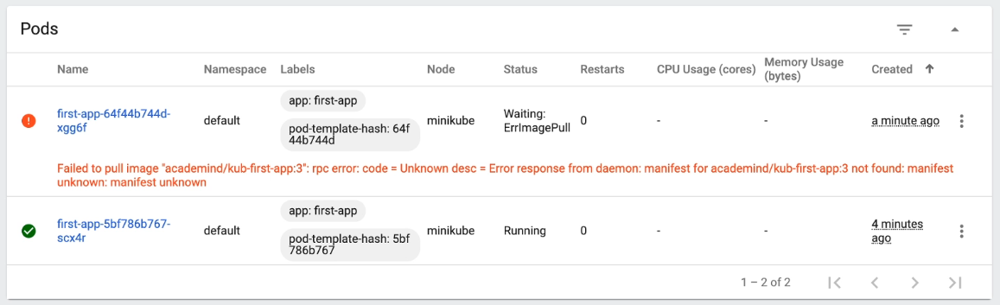

# 색션 12. 실전 Kubernetes - 핵심 개념 자세히 알아보기
## 195. Deployment 롤백 & 히스토리
### rollout undo 
- image를 잘못 설정 하는 등의 문제가 발생할 수 있다. 
- 이렇게 된 상태에서 상태를 보기 위해서는 rollout 커맨드를 활용할 수 있다. 
```shell
> kubectl set image deployment/first-app kub-first-app=axel9309/kub-first-app:10
# 잘못된 버전 명 
deployment.apps/first-app image updated
```
- 이렇게 되면 문제가 발생하고 이때 상태를 보고자 rollout 커맨드를 활용하면 대화용 세션으로 들어가게 된다. 
```shell
> kubectl rollout status deployment/first-app
Waiting for deployment "first-app" rollout to finish: 1 old replicas are pending termination...
```
- 실제로 이렇게 되면 대시보드에서도 pod에 문제가 발생하게 된다. 오래된 복제본이 종료가 발생하지 않으며, 신규 pod은 계속 pending 상태를 유지하는 것이다. 

- 이렇게 되는 이유는 kubernetes에서는 정책상 신규 pod 가 정상 실행 전 까지는 이전 이미지를 담은 구버전 pod 가 종료되지 않으며, 이를 통해 서비스가 계속 유지 되도록 만드는 것이다. 
- 이러한 에러가 발생해서 다시 정상적인 버전으로 이미지를 돌려야 한다. 
```shell
> kubectl rollout undo deployment/first-app
deployment.apps/first-app rolled back
```
- 이렇게 하고 나니 pod 의 문제가 해결되고 기존 버전으로 돌아오게 된다. 

### rollout history 
- 이제 deployment 의 히스토리를 보고 싶을 수 있고, undo 를 하더라도 특정 버전을 알고 하고 싶을 수 있다. 이럴 때 history 커맨드를 사용하면 된다. 
```shell
> kubectl rollout history deployment/first-app
deployment.apps/first-app 
REVISION  CHANGE-CAUSE
3         <none>
4         <none>
```
- 여기서 좀더 디테일하게 내용을 알고 싶다면 아래와 같은 옵션을 추가하면 된다. 
```shell
> kubectl rollout history deployment/first-app --revision=4
deployment.apps/first-app with revision #4
Pod Template:
  Labels:       app=first-app
        pod-template-hash=7bffc6b859
  Containers:
   kub-first-app:
    Image:      axel9309/kub-first-app:4
    Port:       <none>
    Host Port:  <none>
    Environment:        <none>
    Mounts:     <none>
    Volumes:      <none>
```
- 또한 이렇게 revision을 알면 undo 에서도 넣어서 직접 특정 리비전 버전으로 돌아 가는 게 가능하다. 
```shell
> kubectl rollout undo deployment/first-app --to-revision=3
deployment.apps/first-app rolled back
```

### delete
- 지금까지 명령적 접근 방식을 통해 구현되는 서비스와 디플로이먼트를 해보았고, 다음 강좌부터는 선언적 방식에 대해 배울 것이다. 
- 그 전에 우선 올라간 리소스들을 깔끔하게 지우는게 좋다. 다음과 같이 명령어를 입력하자. 
```shell
> kubectl delete service first-app
service "first-app" deleted
```

```shell
> kubectl delete deployment first-app
deployment.apps "first-app" deleted
```
- 이로써 명령적 접근 방식으로 pod를 만들고 deployment, service를 생성하고 삭제하는 것까지를 마무리 지었다. 

> 좀더 명확하게 만들기 위해서 개념 재 정리 :  deloyment, service?
> 
> **Deployment** 
> - kubernetes 에서 애플리케이션의 배포를 관리하는 리소스다. 
> - deployment는 Pod의 세트를 생성하고 관리하며, 애플리케이션의 인스턴스를 실행한다. Pod 는 하나 이상의 컨테이너로 구성되고, 동일한 Deployment 안에 있는 Pod들은 동일한 설정을 공유한다. 
> - 롤링 업데이트 및 롤백 과 같은 배포 전략을 지원하고, 애플리케이션의 업데이트를 관리한다. 새로운 버전을 배포할 때 이전 버전을 자동으로 스케일 다운하거나 롤백 할 수 있다. 
> **Service**
> - Service는 Kubernetes 클러스터 내부 및 외부의 다른 리소스와 통신할 수 있는 방법을 제공해주는 추상화된 리소스다. 
> - Service는 동일한 라벨을 가진 Pod 그룹에 대한 단일 진입점 (entry point)를 제공하며 클러스터 내부에서는 서비스의 DNS 이름을 통해 해당 서비스로의 엑세스를 제공한다. 
> - Service는 다양한 유형으로, 내부 서비스, 외부 로드 밸런서, NodePort 등으로 생성될 수 있으며, 각 유형은 다른 네트워킹 요구사항을 충족해준다. 
> - 서비스는 Pod의 IP 주소와 라벨 셀렉터를 기반으로 동작하며, 클라이언트가 서비스에 요청을 보내면 서비스는 해당 라벨 셀렉터에 맞는 Pod로 트래픽을 전달한다. 
## 196. 명령적 접근 방식 vs 선언적 접근 방식
## 197. 배포 구성 파일 생성하기(선언적 접근 방식)
## 198. Pod  와 컨테이너 사양(Specs) 추가
## 199. Label 및 Selector로 작업하기 
## 200. 선언적으로 Service 만들기


```toc

```
