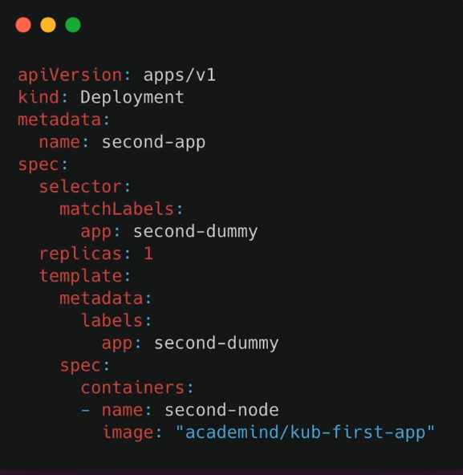
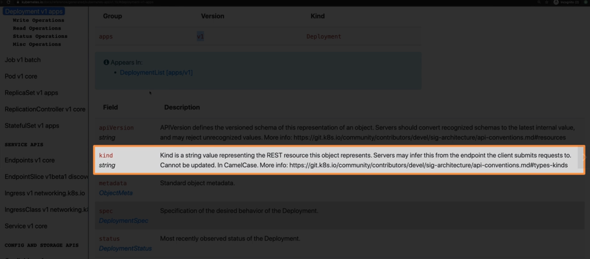

# 색션 12. 실전 Kubernetes - 핵심 개념 자세히 알아보기
## 196. 명령적 접근방식 vs 선언적 접근방식 
### 명령적 접근방식에서 선언적인 방식으로
- 여러가지 명령어를 통해 쿠버네티스를 구동하는 것을 배웠다. 그러나 이러한 방식의 단점은?
	- 어렵진 않으나 명령어를 외워야 한다. 
	- 매번 작업에 적용해야 한다. 
- 이러한 점들은 docker 때와 비슷하게 불편할 수 있고, docker compose를 배운 뒤 훨씬 편해졌고, 이러한 내용이 kubectl에도 적용될 수 있다. 

### A Resource Definition
- 위에서 언급한 것처럼 파일 내의 구성을 기반으로 deployment 를 생성할 수 있고, 이를 쿠버네티스는 지원한다. 
- YAML 파일 형태를 지원한다. 

> 예시파일 

### 비교

| **명령적 접근방식**                   | **선언적 수행방식**                   |
| ------------------------------ | ------------------------------ |
| `kubectl create deployment...` | `kubectl apply -f config.yaml` |
| 개별 명령어를 쳐서 접근하고 실행시킨다          | 파일 기반으로 상태가 적용되고 수정된다.         |
| docker run과 유사                 | docker compose 와 유사            |

## 197. 배포 구성 파일 생성하기(선언적 접근방식)
### 2nd 애플리케이션 
1. deployment 가 현재 켜져 있는지 확인한다. 
   ```shell
   > kubectl get deployments
   No resources found in default namespace.
	```
2. 마찬가지로 서비스도 현재 실행중인지 확인하고, 혹여나 기존 것은 `kubectl delete deployment`와 같은 형태로 삭제한다. 
   (서비스는 쿠버네티스를 위한 기본 서비스가 존재할 것이다.)
   ```shell
   > kubectl get services   
	NAME         TYPE        CLUSTER-IP   EXTERNAL-IP   PORT(S)   AGE
	kubernetes   ClusterIP   10.96.0.1    <none>        443/TCP   19d
	```
3. 쿠버네티스를 위한 deployment 구성용 파일을 구현할 것이니, 이에 맞춰 `deployment.yaml` 로 파일을 생성한다. 
4. 최초 파일에 작성해줘야 하는 것은 `apiVersion`으로 공식 문서 등을 참고하여 작성하면 된다. 
   ```yaml
   apiVersion: apps/v1
	```
5. 파일 이름으로 생성할 대상이 뭔지를 알 수 없기 때문에, 다음에 적어야 할 내용은 쿠버네티스가 생성할 것이 무엇인지를 적는 것이다.
   ```yaml
   apiVersion: apps/v1
   kind: Deployment # Service, Job 등 특정 단어만 지원 
	``` 
	특히나 api와 관련된 레퍼런스, 설정 등을 모두 공식 문서에서 볼 수 있다. 
	
6. 그 다음 작성할 내용은 메타데이터로, 생성하는 것의 관련한 정보를 제공한다.  추가적으로 작성 가능한 메타데이터에 대해서는 api reference 문서를 참조하면 된다. 
   ```yaml
   apiVersion: apps/v1
   kind: Deployment
   metadata:
     name: second-app-deployment # deployment 이름 
	```
7. deployment 의 사양(specification)을 지정하는 spec 을 추가한다. (은 다음 시간에) 
   ```yaml
   apiVersion: apps/v1
   kind: Deployment
   metadata:
     name: second-app-deployment 
   spec: 
	```

```toc

```
