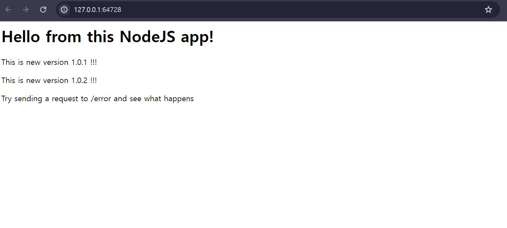

# 색션 12. 실전 Kubernetes - 핵심 개념 자세히 알아보기
## 200. 선언적으로  service 만들기 
### service.yaml 
```yaml 
apiVersion: v1
kind: Service
metadata:
  name: backend
spec:
  selector: 
    app: second-app # matchLabel 이 존재하지 않는다. 
    # tier: backend 
    # tier를 지정하지 않고, 오로지 app 이름만을 보고, 관리도 가능하다. 
    # 즉, 다른 리소스의 app도 제어가 가능하다는 것이다(tier 를 정하지 않으면)
  ports:
    - protocol: 'TCP'
      port: 80
      targetPort: 8080
    # - protocol: 'TCP'
    #   port: 443
    #   targetPort: 443
  type: LoadBalancer
  # ClusterIP - 기본 값으로 내부에서 노출되는 IP
  # NodePort - 클러스터 내부에서만 액세스 할 수 있음 
  # LoadBalancer - 외부 세계와의 연결용. 들어오는 트래픽을 pod 기준으로 균등하게 분배해주는 것을 자동으로 지원
```
- 이렇게 구동한 다음 서비스에 접근하게 되면 어플리케이션에 접근이 가능해진다. 
```shell
> kubectl apply -f serviceMine.yaml
service/backend created

> minikube service backend
W0426 18:29:44.631631   15872 main.go:291] Unable to resolve the current Docker CLI context "default": context "default": context not found: open C:\Users\paul\.docker\contexts\meta\37a8eec1ce19687d132fe29051dca629d164e2c4958ba141d5f4133a33f0688f\meta.json: The system cannot find the path specified.
|-----------|---------|-------------|---------------------------|
| NAMESPACE |  NAME   | TARGET PORT |            URL            |
|-----------|---------|-------------|---------------------------|
| default   | backend |          80 | http://192.168.49.2:31204 |
|-----------|---------|-------------|---------------------------|
🏃  Starting tunnel for service backend.
|-----------|---------|-------------|------------------------|
| NAMESPACE |  NAME   | TARGET PORT |          URL           |
|-----------|---------|-------------|------------------------|
| default   | backend |             | http://127.0.0.1:64728 |
|-----------|---------|-------------|------------------------|
🎉  Opening service default/backend in default browser...
❗  Because you are using a Docker driver on windows, the terminal needs to be open to run it.
```

- 여기까지를 통해 어플리케이션을 선언적 방식을 통해 띄우는 것 까지 가능했다. 이를 통해 우리는 에러, 명령적으로 매번 쳐줘야할 번거로움을 해결했다. 

## 201. 리소스 업데이트 & 삭제 
### 어떻게 바꾸면 되는가?
- YAML 파일에 변경할 내용을 수정한 뒤 간단하게 apply 를 하면 된다.
- 즉, YAML 에서 설정 가능한 부분은 수정하고 적용하면 쉽게 구성을 바꿀 수 있는 것이다. 

### 어떻게 삭제하면 되는가?
- 기존에 `kuebctl delete` 방식으로 명령어를 통해 하는 것도 가능하다. 
- 하지만 -f 옵션과 함께 해당 config 파일을 지목해주면, 이 역시 동일하게 지정한 것들을 삭제하는 것이 가능해진다. 
```shell
> kubectl delete -f deploymentMine.yaml -f serviceMine.yaml 
deployment.apps "second-app-deployment" deleted
service "backend" deleted
```

## 202. 다중 vs 단일 config 파일
### master-deployment.yaml 
- 개발자가 원하면 yaml 파일을 분할하는 것이 아니라 하나의 파일 안에 필요한 기능들을 전부 설정해줄 수 도 있다. 

```yaml 
apiVersion: v1
kind: Service
metadata:
  name: backend
spec:
  selector: 
    app: second-app
  ports:
    - protocol: 'TCP'
      port: 80
      targetPort: 8080
    # - protocol: 'TCP'
    #   port: 443
    #   targetPort: 443
  type: LoadBalancer
---
apiVersion: apps/v1
kind: Deployment
metadata:
  name: second-app-deployment
spec:
  replicas: 1
  selector:
    matchLabels:
      app: second-app
      tier: backend
  template:
    metadata: 
      labels:
        app: second-app
        tier: backend
    spec: 
      containers:
        - name: second-node
          image: axel9309/kub-first-app:4
        # - name: ...
        #   image: ...
```
- 하나의 config를 구현하는데 알아둬야 할 것은 `---` 하이픈 세개 뿐이다. 
- 각 설정할 것들 사이에 구분자를 넣어주기만 하면 된다.(반드시 3개로 해야하며, 이렇게 해야 각각을 객체로 인식한다)
- 리소스는 위에서 아래로 생성이 되며, 가능하면 service를 먼저 생성하는게 좋다. 이는 Selector와 관련이 있고 모니터링의 객체가 Service이기 때문이다. 

> 왜 서비스 객체가 디플로이먼트 객체보다 먼저 설정 되어야 하는가?
> 
> **1. 안정적인 서비스 주소 제공** 
> 
> 서비스 객체를 통해 디플로이먼트에서 생성된 Pod 들을 가리키는 주소가 먼저 정해지므로, Pod 들이 배포될 때 이미 서비스가 존재하므로 외부, 다른 Pod 들이 바로 접근이 가능해진다. 이는 네트워크 트래픽을 관리하는데 중요하며, 새로 생성되거나 업데이트 되는 Pod가 바로 서비스에 의해 라우팅이 가능하게 만든다. 
> 
>**2. 서비스 디스커버리 용이성** 
> 
> 쿠버네티스는 서비스 디스커버리를 자동으로 처리한다. 서비스 객체가 생성되면 해당 서비스에 연결되는 Pod가 생성, 변경 자동으로 업데이트 되어 서비스에 연결된다. 그렇기에 먼저 서비스가 설정이 되면 Pod의 생성 등의 과정에서 바로 서비스의 엔드 포인트에 즉각적으로 포함되어 지연 없이 트래픽을 처리할 수 있다. 
> 
> **3. 준비 상태 보장** 
> 
> 서비스가 먼저 생성되면, 이후 생성되는 Pod가 네트워크 트래픽을 받기 시작하는 시점을 보다 잘 제어할 수 있다. Pod가 준비 상태가 되기 전에 서비스에 연결되면 해당 Pod 로의 트래픽 전달을 서비스가 늦출 수 있고, 이는 전체 애플리케이션의 가용성, 안전성 향사에 도움을 준다고 볼 수 있다. 


```toc

```
