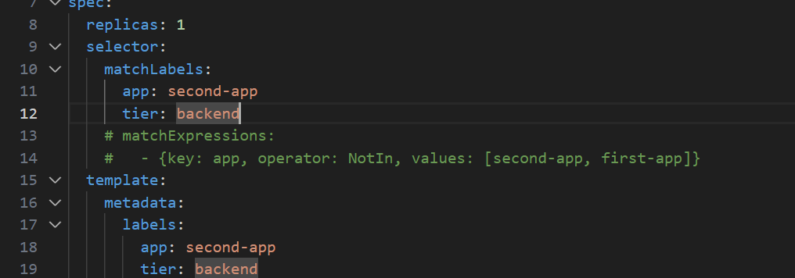
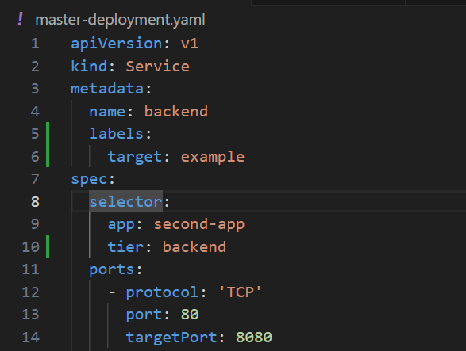
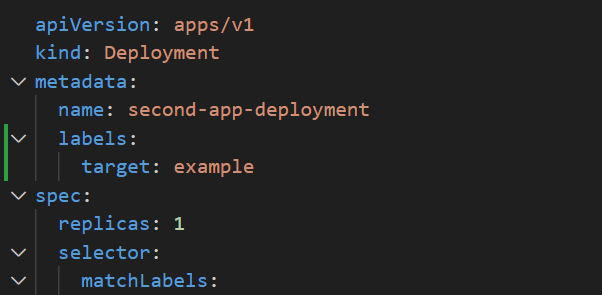
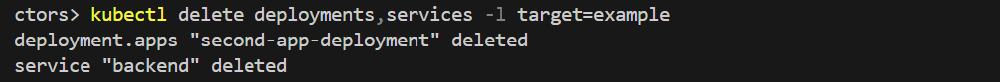
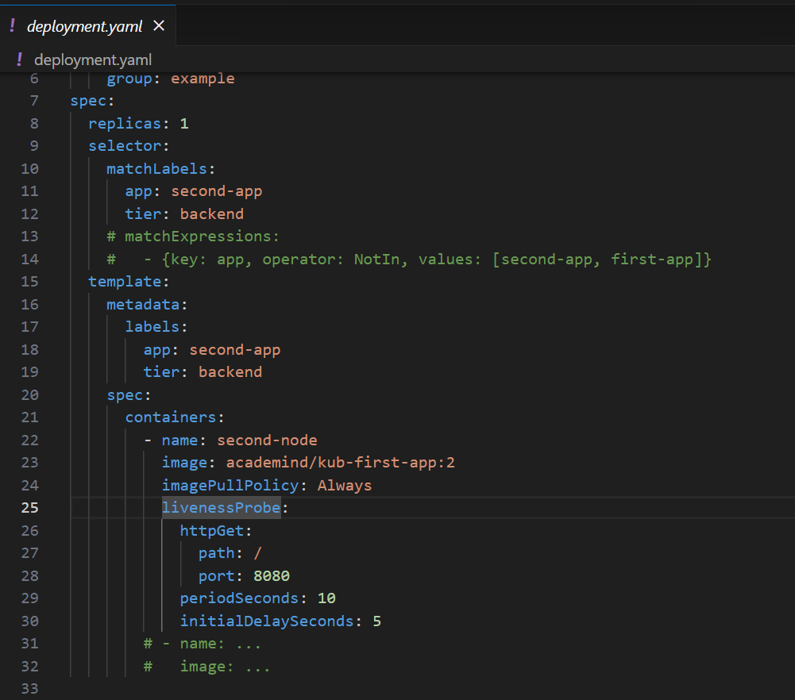
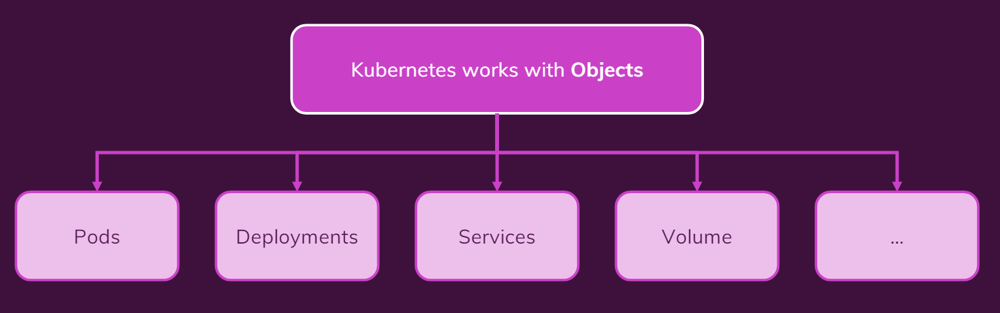

# 색션 12. 실전 Kubernetes - 핵심 개념 자세히 알아보기
## 203. Label & Selector
- selector 에 대해 다시 이야기를 해보고자 한다. 이는 다른 리소스를 리소스에 연결하는데 사용하는 용도라는 중요한 기능을 가지고 있기 때문이다. 
- selector 는 기본적으로 서비스나, deployment를 모니터링하고 연결시키는 역할을 한다. 
- 최근의 현대적 selector는 `matchLabel`이라는 것이 있고, 
- 거기서 더 나아가서 `matchExpression`이라는 개념을 사용한다. 이는 좀더 다양한 기능들을 지원한다. 
	
	-  기본적으로 -(하이픈)을 통해 구성이 되며, 중괄호 내의 키와 값으로 구성되어 있다.
	- 추가로 Operator 가 들어갈 수 있다는 점이 차이점이다. In이란 값을 가지면, 각 키의 값들에 포함되면 감지가 되는 구조라고 보면 된다. 
	- 더 많은 자원 제어와, 유연성이 필요하면 `matchExpressions`가 적절하다 
	- 그러나 기본적인 경우에는 어지간하면 쓰지 않아도 충분하다. 
- 더불어 하나 알아둘 것이 metadata는 키값=쌍의 구조이며, 이를 임의로 지정해주고, delete 등을 할 때 해당 `-l` 옵션과 함께 키=값을 같이 입력해서 일종의 확장 보안 메커니즘으로 쓸 수 있다. 
	
	
	
	> 놀랍게도 어떤 key의 어떤 값이라도 들어가면 된다. 
- <mark style="background: #FF5582A6;">결론적으로 name이라는 값이 아니라, metadata에 정의된 레이블로도 선택과 삭제 등이 가능하다는 사실을 정확하게 이해하는 게 중요하다. </mark>
## 204. 활성 프로브(Liveness Probes)
- 쿠버네티스의 Pod와 컨테이너가 정상 여부를 판단하는 방법에 대한 개념이 있다. 
- `livenessProbe` 라는 속성이 있으며, 이를 spec에 정의가 가능하다. 

- `periodSeconds` : 얼마의 주기로 상태를 체크하는 지에 대한 내용
- `initialDelaySeconds` : 최초 구동 시 몇 초 이후부터 상태를 체크할지 
- 이렇게 구성한 내용으로 구동을 하고, 강제로 종료를 시켜보면 순식간에 다시 구동되어있음을 알 수 있는데, 이것이 `livenessProbe` 가 감지를 하고 있으면서 다시 Pod가 정상화 된 것이다. 
- 그리고 이전에 이러한 내용을 정의하지 않아도, Pod가 살아나던 것은 기본적으로 해당 기능이 디폴트값으로 작동하기 때문이다. 
## 205.구성 옵션 자세히 살펴보기
- 공식 참조를 살펴보면, 여러가지 구성 시 넣을 수 있는 다양한 명령이 있다는 사실을 알 수 있다. 
- `imagePullPolicy` : Always 설정시 태그 지정 없이도, 항상 최신 이미지를 요청할 때마다 받아서 작동시킨다. 이 밖에도 Never  등의 옵션도 존재 한다. 
- 이 밖에도 다양한 옵션들이 있고, 가능하면 공식문서를 깊게 파서 확인하고 적용해보면 된다. 
## 206. 요약
### 쿠버네티스의 역할과 개발자의 역할 
1. 쿠버네티스의 역할 
	- 개발자의 객체들을 생성하고 관리한다. 
	- Pod 들을 감시하고, Pod들을 재생성하거나, 스케일링 한다. 
	- 당신의 설정이나 목표를 위하여 제공된 자원을 사용한다. 
2. 개발자의 역할
	- 클러스터를 생성하고, Node 인스턴스를 생성한다. 
	- API 서버를 설정하고 kubelet이나 다른 쿠버네티스 서비스(소프트웨어) 를 Node들 위에 설치한다. 
	- 필요시 자원의 제공자를 생성한다. 
### 설치 
minikube의 도움으로 로컬 개발환경을 구성했다. 
kubectl 이라는 도구를 활용해 클러스터를 구성한다. 이는, 로컬 뿐 아니라 쿠버네티스 클러스터에 명령을 전달하는 통신장치다. 
### 쿠버네티스 객체에 대한 이해
- 우리에게 제공되는 모든 쿠버네티스의 작업과 관련된 것은 '객체'로 구성되어 있다고 보면된다. 

### 명령적 vs 선언적 
- CLI를 활용하고 명령을 통해 생성 뿐 아니라 이미지 삭제, 설정, 현재 실행중인 deployment 에 대한 갱신도 할 수 있었다. 
- 하지만 좀더 편리한 형태가 선언적 접근 방법이며, yaml 파일을 구성하고, 이를 통해 kubectl apply 로 적용하는 형태가 가능했다. 
- 이때 각 필요한 기능들을 따로따로 구현할 수도 있고, 하나의 파일에 통으로 기록하여 단일한 파일로 구성하는 것도 가능하다. 
- 또한 선언적 접근의 이점은 변경사항을 yaml파일에 기록 후 적용을 하면 쿠버네티스가 알아서 자동으로 변경점을 수정해준다는 점이다. 
- 특히나 label, selector라는 개념을 통해 다른 리소스들 끼리는 연결, 서로 모니터링 되기도 하며, 이를 활용하면 name이 아니더라도 필요한 영역을 구분하여 체크할 수 있다는 특징이 있다. 
- 뿐만 아니라 상태를 확인하는 방법, 이미지를 가져올 때 제어하는 다양한 옵션등이 공식문서를 통해 배웠고, 필요한 내용이 있을 경우 더더욱 공식문서를 찾아보면 유용하다. 

```toc

```
