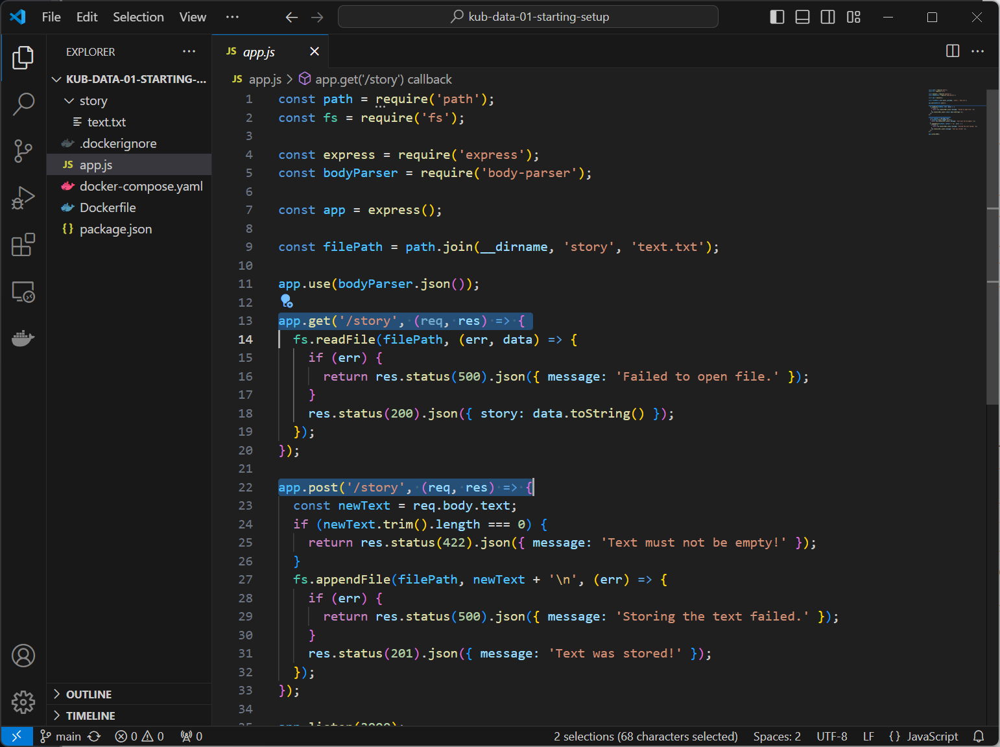

# 색션 13. Kubernetes로 데이터 & 볼륨 관리하기
## 208. 모듈 소개
- 우리는 쿠버네티스를 활용하여 컨테이너를 배포하는 기능들을 실습했고, 이를 minikube 위에서 진행했다. 
- minikube 는 하나의 호스트 머신이자 로컬 호스트의 가상 머신이기도 하다. 하지만 이것으로 끝이 아니라 쿠버네티스는 궁극적으로 애플리케이션을 다중 시스템, 다중 노드 클러스터에 배포한다는 목표까지 나아가야 한다. 
- 이러한 점에서 우리는 도커를 배울 때와 비슷한 문제를 직면하게 되는데, 즉, 데이터를 저장하고 관리하는 방법에 대한 명확한 길이 제시 되어야한다. 
- 왜냐하면, 컨테이너가 종료되거나, 쿠버네티스가  관리 과정에서 Pod의 제거, 확장, 노드 간의 이동 등으로 데이터를 적절하게 유지되도록 보장하게 만들 수 있는가가 매우 중요하기 때문이다. 
- 따라서 이번 챕터는 볼륨에 대해 도커에서의 개념을 다시 한 번 살펴보고, 쿠버네티스의 볼륨의 작동, 유지 방법에 대해 알아볼 것이다. 
- 일반볼륨, 영구 볼륨과 영구 볼륨 클레임(`claims`)이라는 것도 살펴볼 것이다. 후반부 섹션에선 환경변수 작업에 대해서도 알아볼 예정이다. 
## 209. 프로젝트 시작하기 & 우리가 이미 알고 있는 것
- 본 예제에선 NodeJS API 애플리케이션을 활용할 것이다. 
- app.js 는 노드 서버를 만들게 되는데 3000번 포트를 통해 두개의 엔드포인트 요청이 있다. 
	- GET /story 요청을 처리할 수 있다. 
	- POST /story 요청을 처리할 수 있다. 

- POST 요청의 경우 요청으롷 들어온 텍스트 바디를 추출하고, 비어있지 않으면, 파일 경로에 있는 파일에 이를 추가하고 story 폴더 내의 text.txt 파일에 담는다. 
- GET 요청의 경우 이렇게 저장된 데이터가 있을 경우 이 내용을 다시 포워딩해주는 간단한 애플리케이션이다. 
- docker run -v 옵션으로 볼륨을 설정해줄 수도 있으나, docker-compose.yml 파일을 활용해 이를 간소화 한다. 
- docker-compose up -d --build 명령어를 실행하면 이미지가 빌드될 것이고, 이를 통해 올라간 컨테이너는 우리가 예상한대로 동작하고, API의 역할을 수행할 것이다. 그리고 컨테이너가 설령 종료 되더라도(docker-compose down & docker container prune)데이터는 그대로 남게 된다. 이는 도커에서도 데이트를 관리하는 볼륨의 기능이 컨테이너의 재시작 및 제거 전반에 걸쳐 데이터를 별도로 처리할 수 있도록 분리 했기 때문이다. 
## 210. Kubernetes & 볼륨 - Docker 볼륨 이상의 것
### 'state' 에 대한 이해
- 상태란 잃어서는 안되는 데이터의 특정 상태를 의미 한다. 
	- 사용자에 의해 생성되는 데이터
	- 애플리케이션에 의해 조절되는 중간 결과물 등 
- 핵심은 이 데이터가 컨테이너가 사라지든 변하든 그대로 존재해야 하고, 그것을 가능케 하는 것이 볼륨인 것이다. 
- 볼륨은 알고 있지만, 일단 지금은 쿠버네티스를 사용하는 것이지 docker run도 docker compose up 도 아니다. 쿠버네티스를 통해 볼륨을 컨테이너에 추가하도록 명령 내리는 법을 배우는게 본 장의 역할이라고 보면 된다. 
## 211. Kubernetes 볼륨 : 이론 & Docker 와의 비교
## 212. 새 Deployment & Service 만들기
## 213. Kubernetes 볼륨 시작하기
## 214. 첫 번째 볼륨: "emptyDir" 유형
## 215. 두 번째 볼륨: "hostPath" 유형
## 216. "CSI" 볼륨 유형 이해하기
## 217. 볼륨에서 영구(Persistent) 볼륨으로
## 218. 영구 볼륨 정의하기
## 219. 영구 볼륨 클레임 생성하기 
## 220. Pod 에서 클레임 사용하기
## 221. 볼륨 vs 영구 볼륨 
## 222. 환경 변수 사용하기
## 223. 환경 변수 & ConfigMaps
## 224. 모듈 요약 
## 225. 모듈 리소스


```toc

```
