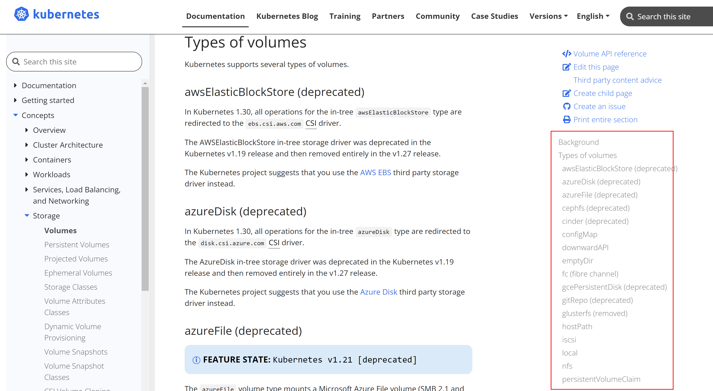
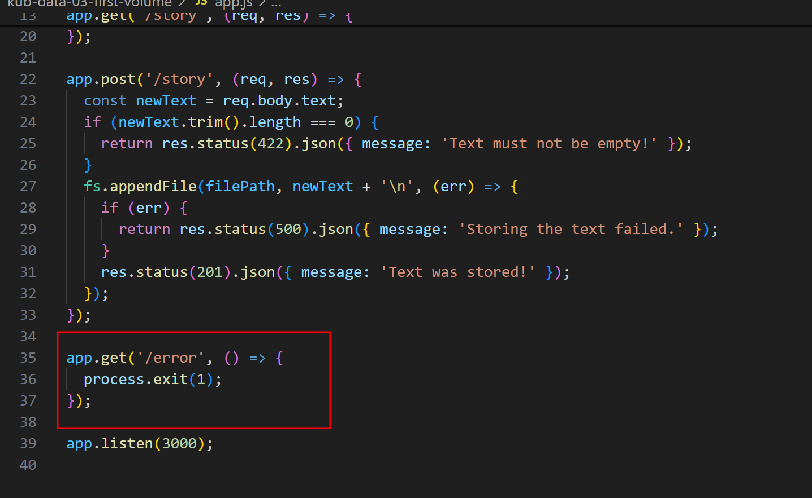
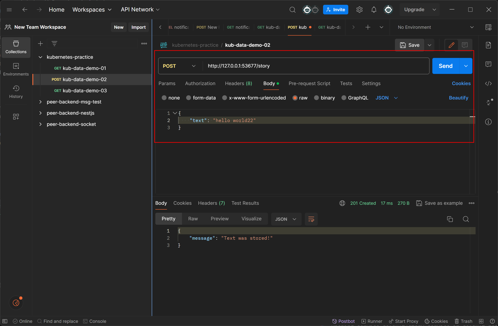
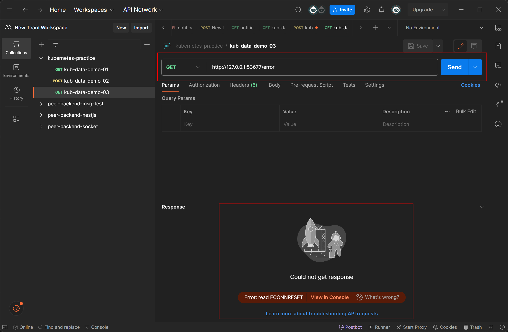
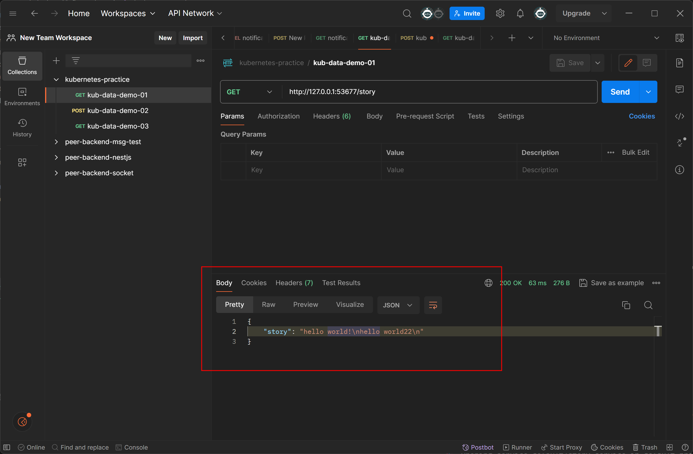
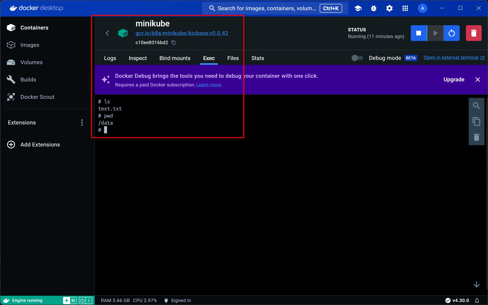

# 색션 13. Kubernetes로 데이터 & 볼륨 관리하기
## 213. Kubernetes 볼륨 시작하기
- 데이터를 저장하고 불러오는 기능을 포함하는 서비스를 쿠버네티스를 통해 올리는 순간 문제에 봉착하게 된다. 
- 이는 바로 어떤 이유에서든지 재 시작되었을 때의 문제이다. 일전 강의를 위하여  준비된 프로젝트는 재시작의 확실한 방법이 없는 상태인데, 이러한 일들이 발생할 수 있다는 점은 어떤 시나리오에서든지 예상을 해야한다. 
- 그리고 이런 상황에서 쿠버네티스가 다시 시작 될 때 볼륨을 사용하지 않았기 때문에 지금의 상황으로는 모든 데이터가 손실되고 만다. 
- 당연하게도 이를 해결하는 것이 바로 볼륨이며, 공식문서를 보면 엄청나게 많고 다양한 종류의 볼륨이 등장한다. 이를 보면 압도당할 수는 있다. 하지만, 필요한 순간에 찾으면 되는 것이고, 다양한 유형의 볼륨 및 드라이버는 그때그때 보고 익히면 될 문제다. 

> 상당히 많은 종류가 존재하며, deprecated 된 것도 존재한다. 
- 본 강의에서는 CSI 유형을 중점으로 두고, emptyDir, hostPath 유형 등을 볼 것이고 그 최초로 emptyDir 유형의 볼륨을 공부할 것이다. 

## 214. 첫 번째 볼륨: "emptyDir" 유형
- 우선, 의도적으로 서비스가 종료될 수 있는 API 요청과 이에 대한 서버가 에러로 종료되도록 처리한다. 
- 이렇게 한 경우 요청을 보내면, Pod는 문제가 없지만, Pod 내부의 컨테이너가 고장이나고, 이를 Pod 는 인식하고 자동으로 다시 컨테이너를 구동 시키게 만든다. 
- 하지만 당연히 볼륨이 지정되어 있지 않으니, 내부의 데이터는 사라지게 된다. 
- 이때 볼륨을 적용시키면 된다. 
### 볼륨 적용 방법 
-  볼륨이 필요한 리소스에, spec의 하위 지정할 볼륨 항목을 기재해준다.
```yaml
# 전략 . . .
  template:
    metadata:
      labels:
        app: story
    spec:
      containers:
        - name: story
          image: academind/kub-data-demo:1
          volumeMounts:
            - mountPath: /app/story
              name: story-volume
      volumes:
        - name: story-volume
          emptyDir: {}

```
- 기본적으로 이름을 지정하고, 지금 배울 emptyDir 타입명과 함께 아무것도 적지 않으면 볼륨 설정은 끝난다. 
- 이제, 이를 Container에 연결시키는 것이 필요한데, 위에서 보면 `volumeMounts` 라는 항목을 지정하고, 연결시켜주는데, 이때 핵심은 `mountPath`를 사용할 공간에 제대로 연결시켜 마운트 시키는 것이 중요하다는 점이다. 
- 경로를 지정해주고, 사용하는 볼륨의 이름을 지정해주면, 이것 만으로도 이미 볼륨은 구성되게 된다. 
### emptyDir
- 해당 방식의 볼륨은 말 그대로 Pod 가 시작될 때마다 단순히 새로운 빈 디렉토리를 생성하는 방식이다. 
- 즉, Pod가 살아있는 한 지속적으로 해당 볼륨을 유지하며, 이러한 특징 때문에 Pod의 종료에는 함께 소멸되지만, 컨테이너가 종료되는 것에는 따로 반응하지 않는다. 
- 바인딩만 하면 되며, 빈 디렉토리가 발생하게 된다. 
- `mountPath` 는 컨테이너 내부로 연결되는 위치를 지정해주는 역할을 한다. 이는 dockerfile 의 `workdir` 을 참조하고, 볼륨이 필요한 서비스의 위치에 맞춰 저장하면 된다. 

- 이렇게 설정을 마치고 나면 emptyDir 로 설정된 볼륨의 형태를 볼 수 있게 된다. 

> node 서버 프로그램의 에러를 의도적으로 발생시키는 API를 우선 만들어둔다.

```yaml
apiVersion: apps/v1
kind: Deployment
metadata:
  name: story-deployment
spec: 
  replicas: 1
  selector:
    matchLabels:
      app: story
  template:
    metadata:
      labels:
        app: story
    spec:
      containers:
        - name: story
          image: axel9309/kub-data-demo:2
          volumeMounts:
            - mountPath: /app/story
              name: story-volume
      volumes:
        - name: story-volume
          emptyDir: {}
```
> 필요한 볼륨을 설정한다. 당연한 이야기지만 이는 Pod 와 관련이 있으므로 서비스는 그대로다
```shell
docker build -t axel9309/kub-data-demo:2 .
docker push axel9309/kub-data-demo:2

kubectl apply -f="service.yaml" -f="deployments.yaml"
```
> 위의 순서로 이미지를 올리고, 이에 따라 적용만 하면 이제 Node 서버는 정상적으로 올라가고, 볼륨까지도 모두 설정이 마무리 된다.


> 이후 Postman을 통해 문장을 저장하고 


> 의도적으로 에러를 발생시켜 컨테이너를 종료 시켜도


> 데이터는 보존된다. 

## 215. 두 번째 볼륨: "hostPath" 유형
### emptyDir 의 단점 
- 이전 학습에서 배운 볼륨의 타입으로 구성하는 것은 개발 당시라면 매우 편리하고 효과적일 수 있다. 
- 하지만 여기서 문제는 Pod 의 복제본이 여러개인 경우에 적용시키면 어떻게 되는가? 에 대한 문제가 발생한다. 
- replica를 두 개로 만들어서 테스트해보면, 우선은 잘 구동되는 것을 볼 수 있다. 
- 하지만 의도적으로 오류 요청을 보냈을 때, 잠시 지난 후에 다시 구동이 잘 된다. 
- 하지만 Pod 와 볼륨은 밀접하게 연결 되어 있고, 두번째로 포워딩이 되면서, 순간적으로 정상적으로 데이터가 보이지 않게 될 수 있다. 
- 뿐만 아니라 emptyDir은 각 Pod와 함께 하는 만큼, 서로 다른 데이터가 누적되어 버린다면, 데이터는 일관성을 유지하지 못하게 된다는  점도 문제가 될 수 있다. 
- 이를 해결하기 위한 여러 방법이 존재하겠지만, 여기서는 'hostPath' 를 통해 해결하는 방법을 알아보고자 한다. 
### hostPath 볼륨 유형
- 이 유형의 볼륨은 호스트 시스템에 마운트하여 Pod의 삭제에도 호스트 상에 데이터를 남김으로, 문제없이 사용이 가능하도록 만든다고 볼 수 있다. 
- 이러한 볼륨의 유형은 다음의 특징을 가진다. 
	1. 고정된 경로 : 호스트의 파일 시스템의 특정 경로를 지정하여 마운트 한다. 따라서 파드가 다른 노드로 스케줄링이 되는 경우 해당 경로를 사용하지 못하는, 여전히 Pod에 묶여있는 제약을 가지긴 한다. 
	2. 데이터 유지 : 하지만 Pod 의 삭제에도 호스트 상의 파일시스템에 기록되므로, 데이터를 영구적으로 보존이 용이하다는 특징이 있다. 
	3. 퍼포먼스 : 이러한 방식은 통상적으로 네트워크 스토리지보다 빠른 로컬 디스크 접근을 제공하여, 높은 IO 성능이 필요할 때 유리하다.. 라고 하지만, 실질적으로 호스트 OS 의 파일 시스템에 따라 다를 수 있다. 예를 들어 전형적으로 윈도우 기반의 시스템에서 쿠버네티스를 활용하게 되고 리눅스 배포판을 사용하게 된다면, 파일 시스템 사이의 오고가는 오버헤드로 오히려 성능이 떨어질 수 있다. 대신, 리눅스 기반 호스트 시스템이 기반이라면 3번의 특성은 그대로 유지 될 수 있다. 
	4. 보안 및 격리 문제 : 아무래도 호스트 시스템에 직접 영향을 줄 수 있게 되는 만큼, 보안의 취약점이 될 수 있다. 
	5. 호스트 종속성 : 호스트에 종속적이기에 노드가 다른 Pod로 바뀌는 경우, 호스트가 바뀐 만큼 그 안의 기존의 데이터가 있을 수 없고, 조치를 취해줘야 만 하다. 
- 그럼에도 우선 데이터 자체를 보관할 수 있으며, 같은 노드 상에서 Pod 들이 아무리 복제되도 동일한 디렉토리를 공유하고, 저장할 수 있다는 점에서 emptyDir 의 한계를 해석할 수 있다고 볼 수 있다. 
### 설정 방법 
```yaml
apiVersion: apps/v1
kind: Deployment
metadata:
  name: story-deployment
spec: 
  replicas: 2 // 복제본이 두개라면?
  selector:
    matchLabels:
      app: story
  template:
    metadata:
      labels:
        app: story
    spec:
      containers:
        - name: story
          image: axel9309/kub-data-demo:2
          volumeMounts:
            - mountPath: /app/story
              name: story-volume
      volumes:
        - name: story-volume
          hostPath: // 바뀐 포인트 
            path: /data
            type: DirectoryOrCreate
```
- 우선 볼륨의 종류를 바꾸면 되는데, 이때 emptyDir 과 는 달리 `path`, `type` 라는 두 가지 값을 넣어줘야한다. 
- path 는 호스트의 경로를 작성하면되며, 리눅스, 맥의 경우 별 문제 없이 작성하면 된다. 하지만 윈도우의 경우 파일 시스템 차이로 지정에 차이가 있을 수 있다. 
- type 은 특정 형태를 지정하는 용도이다. 다음과 같은 경우가 존재한다. 
	- `""` : 이전에 연결된 호스트패스 볼륨에 마운트를 하며, 검사 과정을 따로 하지 않는 설정
	- `DirectoryOrCreate` : 만약 경로가 존재하지 않으면 폴더를 생성하며, 권한이 755 로 설정된다. 
	- `Directory` : 제공되는 경로가 반드시 존재해야만 한다. 
	- `FileOrCreate` : 제공되는 경로가 존재하지 않으면, 644의 권한을 가진 빈 파일이 생성된다. 
	- `File` : 제공되는 경로의 파일이 반드시 존재 해야 하는 경우다
	- `Socket` : UNIX 소켓이 반드세 제공되는 경로에 존재 해야 한다. 
	- `CharDevice` : (리눅스 노드 한정) 문자열 장치라고 하는 장치가 경로상에 반드시 존재 해야 한다.
	- `BlockDevice` : (리눅스 노드 한정) 블록 디바이스(하드디스크등)가 제공되는 경로상에 반드시 존재 해야 한다. 
- 다행이 path 의 경우 우리는 minikube 컨테이너 내부에서 동작하는 구조이기 때문에, 리눅스식으로 작성하면 알아서 잘 동작한다. 

## 216. "CSI" 볼륨 유형 이해하기
## 217. 볼륨에서 영구(Persistent) 볼륨으로
## 218. 영구 볼륨 정의하기
## 219. 영구 볼륨 클레임 생성하기 
## 220. Pod 에서 클레임 사용하기
## 221. 볼륨 vs 영구 볼륨 
## 222. 환경 변수 사용하기
## 223. 환경 변수 & ConfigMaps
## 224. 모듈 요약 
## 225. 모듈 리소스

본문

```toc

```
