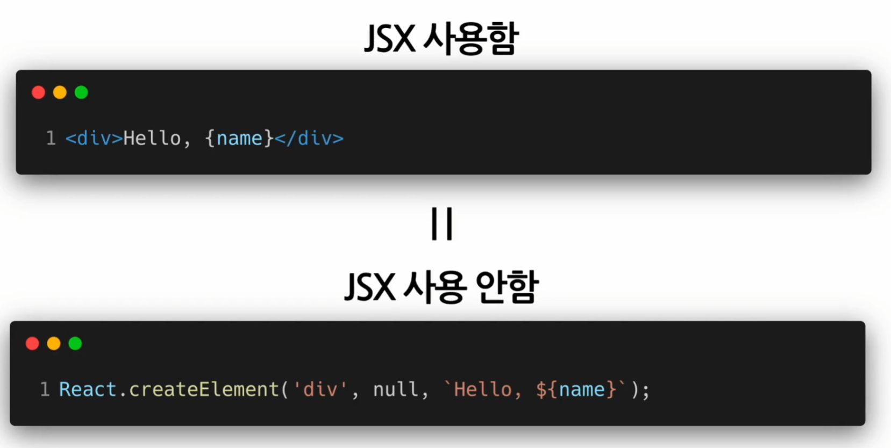
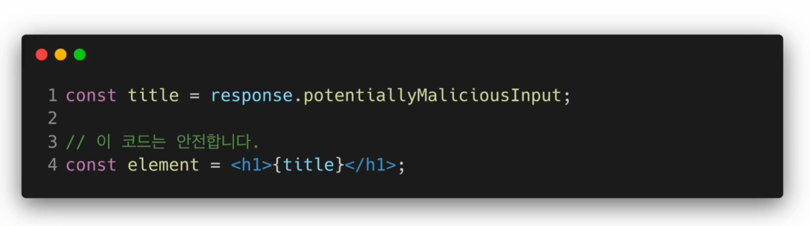
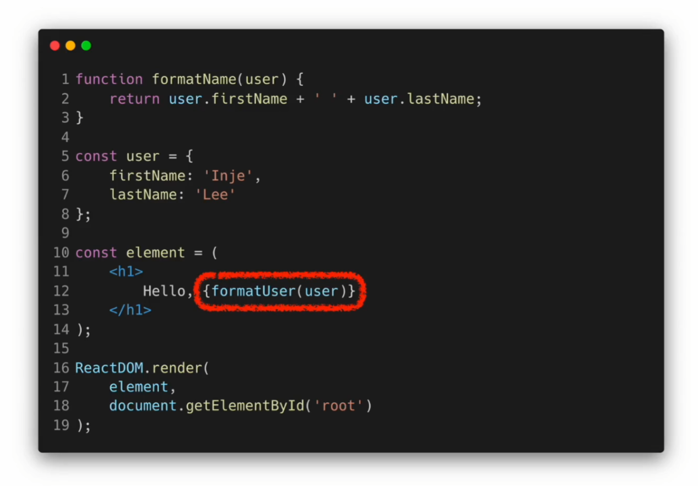
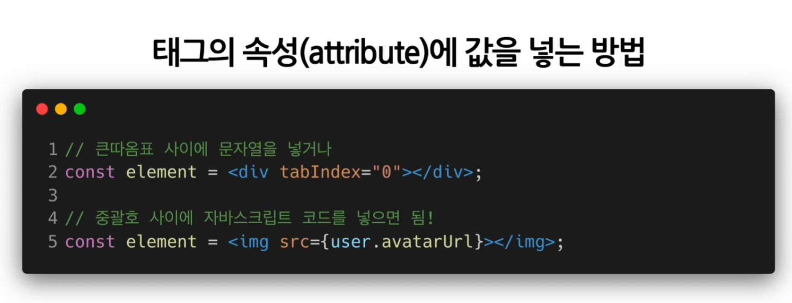
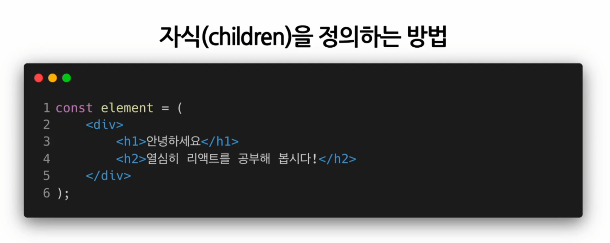
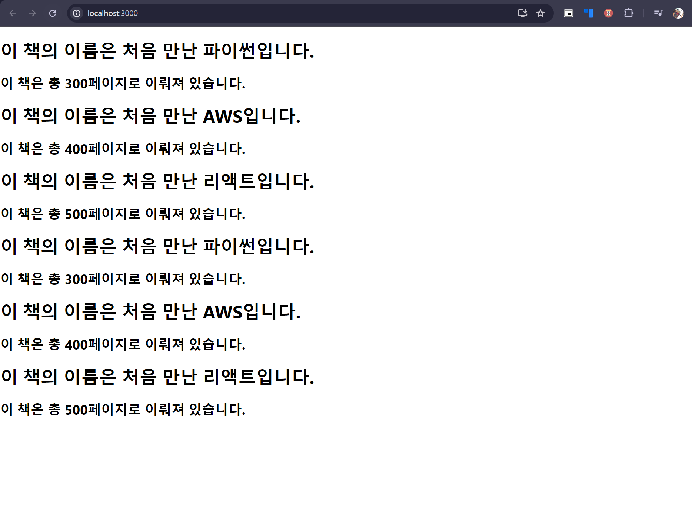

# 색션 3 JSX
## JSX의 정의와 역할 
### JSX 란?
- JavaScript = JS 
- JSX = A Syntax Extension to Java Script = 자바 스크립트 문법의 확장 = Java Script + XML/HTML 
- JSX 코드 = JS + XML/HTML 의 구조를 보여준다. 
```jsx
const element = <h1>Hello, world!</h1>;
```
### JSX의 역할 
- 내부적으롷 XML, HTML 코드를 JS 코드로 변환해주는 역할을 한다. 이러한 역할을 하는 것이 React.createElement 코드이다. 
```jsx
// 안에 들어가는 것들이 페러미터들이다. 
React.createElement(
	type,
	[propse],
	[...children]
)
```
- JSX를 사용한 코드 
```jsx
class Hello extends React.component {
	render() {
		return <div>Hello {this.props.thWhat}</div>;
	}
}

ReactDOM.render(
	<Hello toWhat="World" />
	document.getElementById('root')
);
```
- JSX 를 사용하지 않은 코드 
```js
class Hello extends React.component {
	render() {
		return React.createElement('div', null, `Hello ${this.props.toWhat}`);
	}
}

ReactDOM.render(
	React.createElement(Hello, {toWhat: 'World'}, null)
	document.getElementById('root')
);
```
- 두  코드를 비교하면 JSX를 사용하면 모두 createElement 코드부분이 변화되어 XML, HTML 형식이라는 걸 알 수 있다 
```js
// JSX를 사용한 코드
const element = (
	<h1 className="greeting">
		Hello, World!
	</h1>
)

// JSX를 사용하지 않은 코드
const element = (
	'h1',
	{ className: 'greeting' },
	'Hello, World'
)
```
> 위의 코드는 React.createElement 의 결과로 아래와 같은 객체가 생성되게 된다. 
```js
const element = {
	type: 'h1',
	props: {
		className: 'greeting',
		children: 'Hello, world!'
	}
}
```
- 지금까지의 내용을 볼 때, JSX를 사용하냐 안하냐는 필수 불가결 하지는 않다. 하지만...
	- 가독성 : JSX에서는 HTML 과 유사한 구문을 사용하니, 개발자가 컴포넌트 구조를 더 쉽게 이해할 수 있고, 시각화 가능하고, 이는 코드의 가독성, 디버깅 용이성 등을 제공한다. 
	- 편의성 : JSX는 JS 내에서 UI로직을 표현식으로 쉽게 작성할 수 있다. 이는 데이터 상태와  UI 동기화를 직관적으로 할 수 있게 하고, 복잡한 DOM 구조를 생성하거나 업데이트 하는 JS 코드를 작성할 필요를 없게 만든다. 
	- 컴퐇넌트 기반 개발 : JSX를 사용함은 React 컴포넌트 구조와 궁합이 잘 만드는 구성으로, 각 컴포넌트의 레이아웃을 명확하게 설명할 수 있다. 컴포넌트의 재사용성을 올리고,  UI의 모듈화하고 관리가 용이하다. 
## JSX의 장점 및 사용법 
### JSX의 장점 
1. 간결한 코드 
	
2. 가독성 향상 -> 버그를 쉽게 발견 가능, 
3. Injection Attacks 방어가 가능하여 보안이 용이해진다.  XSS 공격 방어가 가능, 보안적 이점이 크다. 
	
### JSX 사용방법 
```plain
...XML / HTML
{JAvaScript}
XML / HTML...
```
중괄호를 감싸면 JS 코드를 내부에 입력이 가능하다..! 



## [실습] JSX 코드 작성해보기
1. Book 컴포넌트 작성하기 
```jsx
import React from "react";

function Book(props) {
    return (
        <div>
            <h1>{`이 책의 이름은 ${props.name}입니다.`}</h1>
            <h2>{`이 책은 총 ${props.numOfPage}페이지로 이뤄져 있습니다.`}</h2>
        </div> 
    );
}

export default Book
```
2. Library 컴포넌트 작성하기
```JSX
import React from "react";
import Book from "./Book";

function Library(props) {
    return (
        <div>
            <div>
                <Book name="처음 만난 파이썬" numOfPage={300} />
                <Book name="처음 만난 AWS" numOfPage={400} />
                <Book name="처음 만난 리액트" numOfPage={500} />
            </div>
            <div>
                <Book name="처음 만난 파이썬" numOfPage={300} />
                <Book name="처음 만난 AWS" numOfPage={400} />
                <Book name="처음 만난 리액트" numOfPage={500} />
            </div>
        </div>
    );
}

export default Library
```
3. index.js 수정하기 
```jsx
import React from 'react';
import ReactDOM from 'react-dom/client';
import './index.css';
import App from './App';
import reportWebVitals from './reportWebVitals';

import Library from './chapter_03/Library'

const root = ReactDOM.createRoot(document.getElementById('root'));
root.render(
  <React.StrictMode>
    <Library />
  </React.StrictMode>
);

// If you want to start measuring performance in your app, pass a function
// to log results (for example: reportWebVitals(console.log))
// or send to an analytics endpoint. Learn more: https://bit.ly/CRA-vitals
reportWebVitals();
```
4. npm install 된 상태에서, npm start 를 누르면 다음과 같이 적용된 창이 뜨게 된다. 


```toc

```
