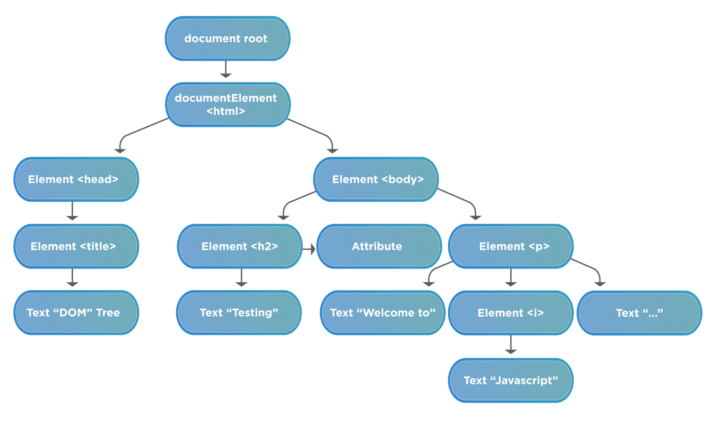
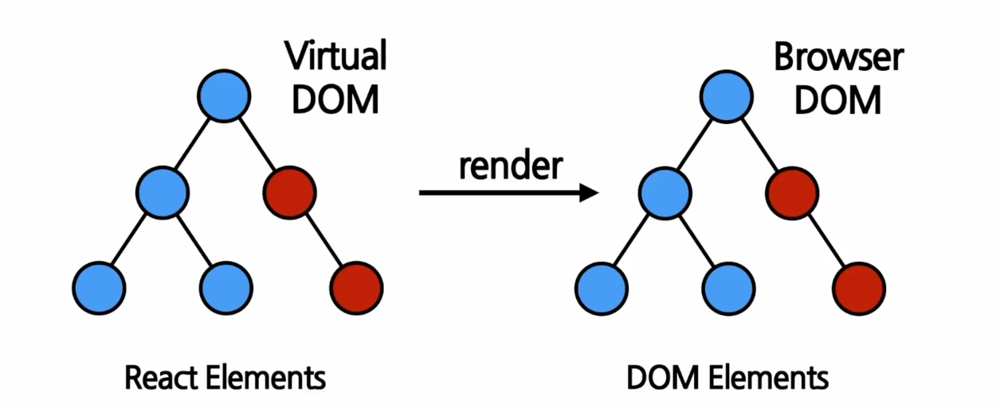
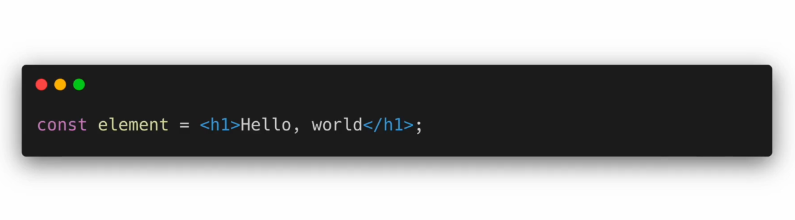
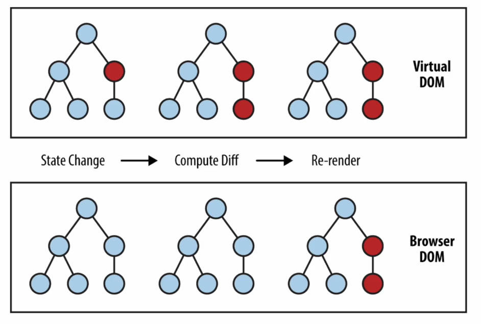
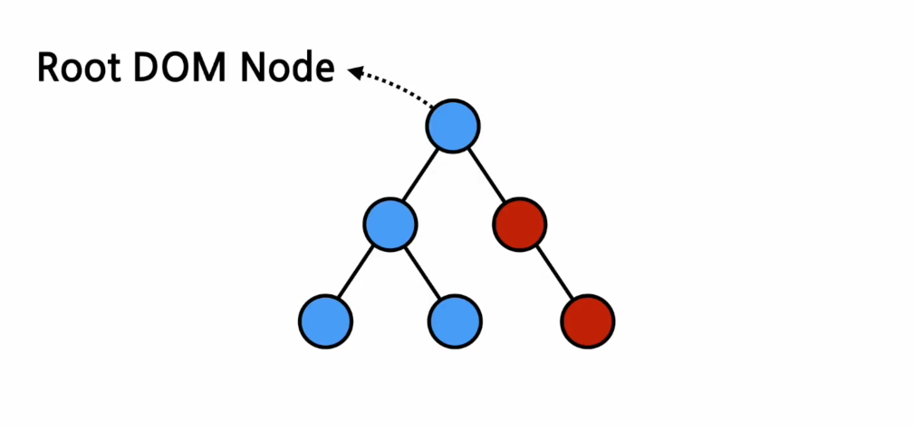
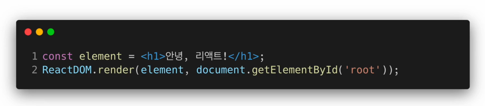

# 색션 4 Rendering Elements
## Elements의 정의와 생김새
### Elements란?
- `Elements are the smallest building blocks of React apps`
- 리액트 앱을 구성하는 가장 작은 블록들

> 본 이미지는 DOM Elements들을 의미하며, 기본적으로 태그 형태의 노드들로 구성되어 있다.
### 일반적인 DOM Elements와 React Elements 
- DOM elements : 화면에 나타나는 내용을 기술하는 자바스크립트 객체. Descriptor 라는 명칭이었으나, 이후 바뀌어 지금의 구조로 바뀌었다. 

- React Elements : Virtual DOM에 존재하는 Elements들을 일컫는 말이라고 보면 된다. 즉, DOM Elements의 가상 표현이 React Elements 라고 볼 수 있다. 또한 Render라는 작업 전의 데이터를 모두 가지고 있는 만큼 React Elements는 렌더 후의 그것보다 상대적으로 무겁다.
- 결론적으로 React Elements가 화면에 표시될 것들을 기술하는 것이라고 보면된다. 

### Elements의 생김새
- React Elements = JS Object 
- 한번 생성 되면 변하지 않는 불변의 특성을 갖고 있다. 
- 예시 
	```javascript
	{
		type: 'button',
		props: {
			className: 'bg-green',
			children: {
				type: 'b',
				props: {
					children: 'Hello, element!'
				}
			}
		}
	}
	```

- 위의 예시가 render가 되면 다음 DOM Element로 변환된다. 
	```HTML
	<button class='bg-green'>
		<b>
			Hello, elememt!
		</b>
	</button>
	```

- 추가 예시
```js
{
	type: Button,
	props: {
		color: 'green',
		children: 'Hello. ele,'
	}
}
```

- 일전에 배웠던 createElements가 요소를 만든다고 했다. 이제 다시 보면 비밀이 어느정도 풀리게 된다. 
```js
React.createElement(
	type,
	[props],
	[...children]
)
```
### 버튼 예시
```js
function Button(props) {
	return (
		<button className={`bg-${props.color}}>
			<b>
				{props.children}
			</b>
		</button>
	)
}

function ConfirmDialog(props){
	return (
		<div>
			<p>내용을 확인하셨으면 확인버튼을 눌러세요.</p>
			<Button color= 'green'>확인</button>
		</div>
	)
}
```
## Elements의 특징 및 렌더링 하기
### Elements의 속성 
1. 불변성 : 한 번 생성 후에는 children, attributes 를 바꿀 수 없다. 즉, 생성 전에는 다양한 모습이지만, 생성이 된 이후에 수정이 불가능한 형태인 것이다.
	- 그렇다면 새로운 화면, 변화하는 것은 어떻게? -> 기존 Element가 아닌 새로운 Element를 생성하고 바꿔치기 하면 된다. 
	- 이러한 특징 때문에 프론트의 성능은 React Element를 얼마나 많이, 얼마나 자주 새롭게 렌더링 하냐에 달려있다.



### 렌더링 된 Elements를 업데이트 하기
```js
function tick() {
	const element = (
		<div>
			<h1>안녕, 리액트!</h1>
			<h2>현재 시간: {new Date().toLocaleTimeString()}</h2>
		</div>
	);
	React.DOMR(rendlement, document.getElementById('root'));
}

set Interval(tick, 1000);
```
## (실습) 시계 만들기
```js
%% index.js %%
import React from 'react';  
import ReactDOM from 'react-dom';  
import './index.css';  
import reportWebVitals from './reportWebVitals';  
import Clock from "./chapter_04/Clock";  
  
setInterval(() => {  
    ReactDOM.render(  
        <React.StrictMode>  
            <Clock />        </React.StrictMode>,  
        document.getElementById('root')  
    );  
}, 1000);  
  
reportWebVitals();
```

```js
%% clock.js%%
import React from "react";  
  
function Clock() {  
    return (  
        <div>  
            <h1>Hello React!</h1>  
            <h2>Current Time : {new Date().toLocaleTimeString()}</h2>  
        </div>    );  
}  
  
export default Clock;
```

```toc

```
