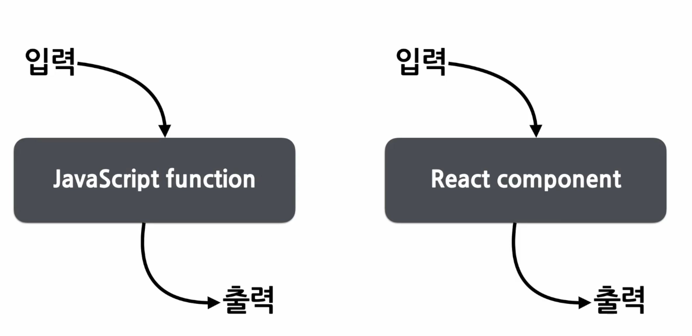
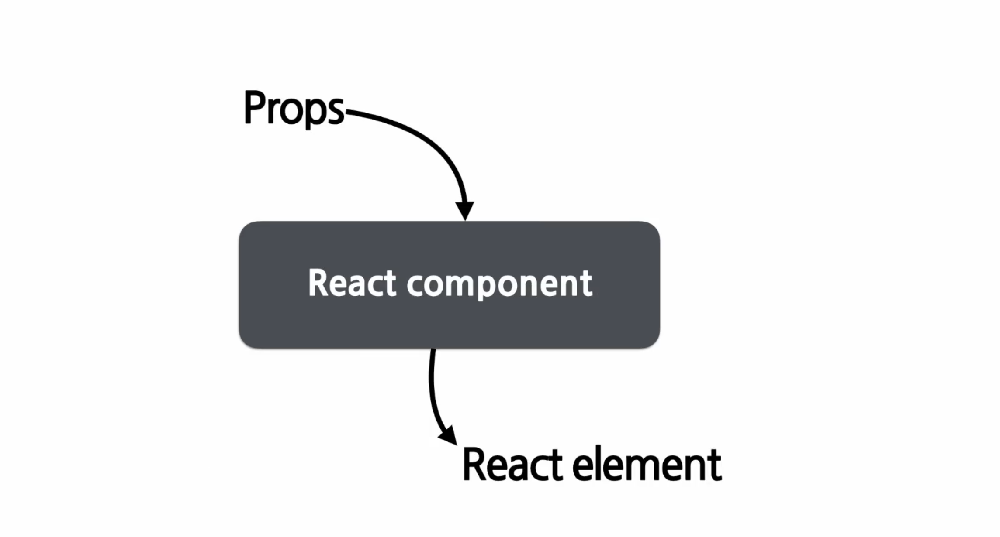
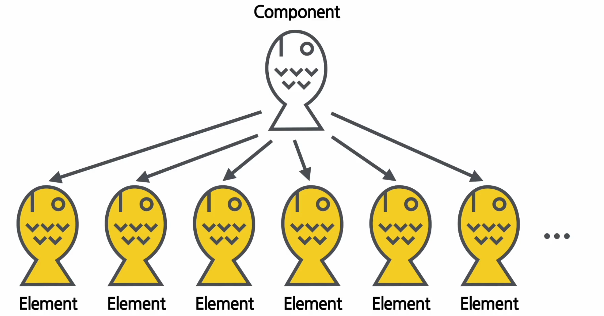
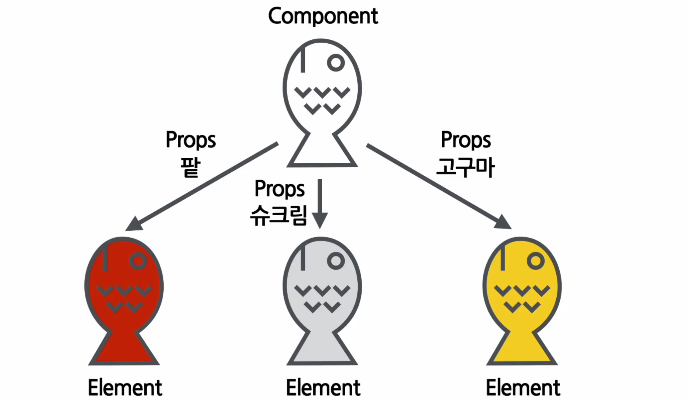
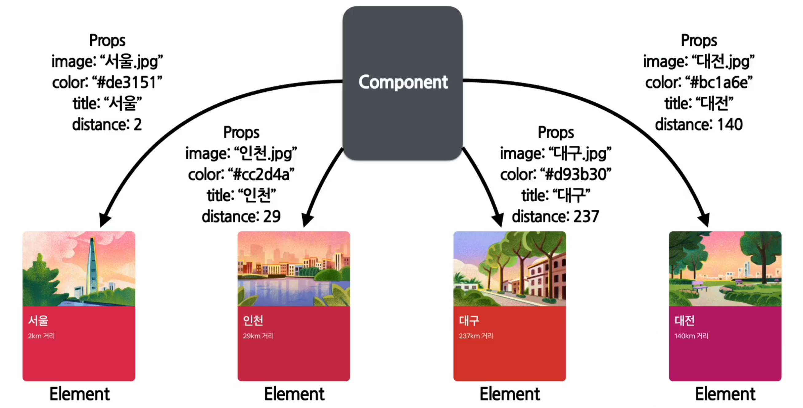
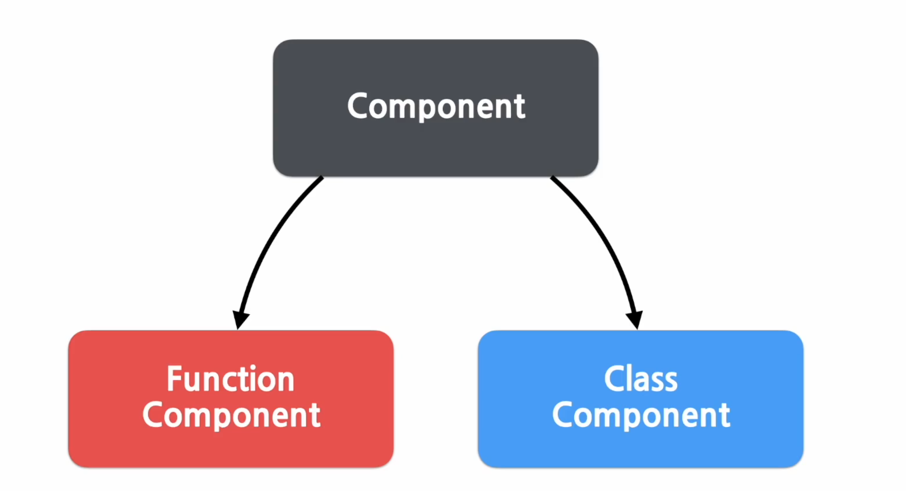
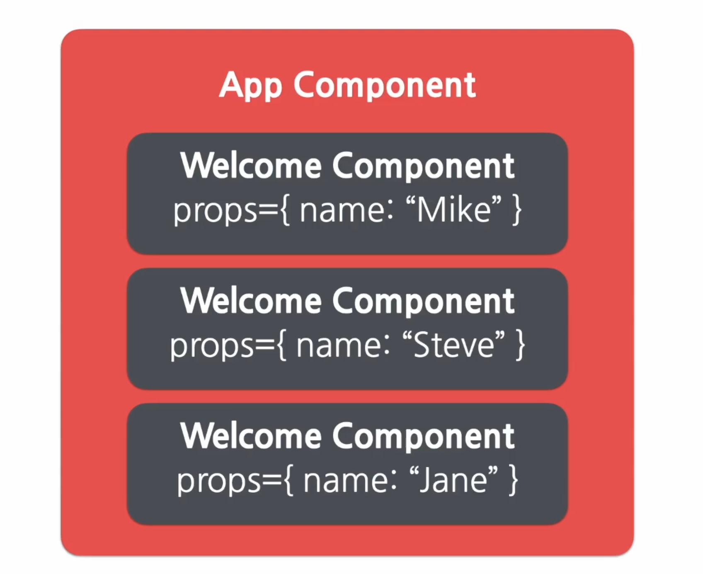
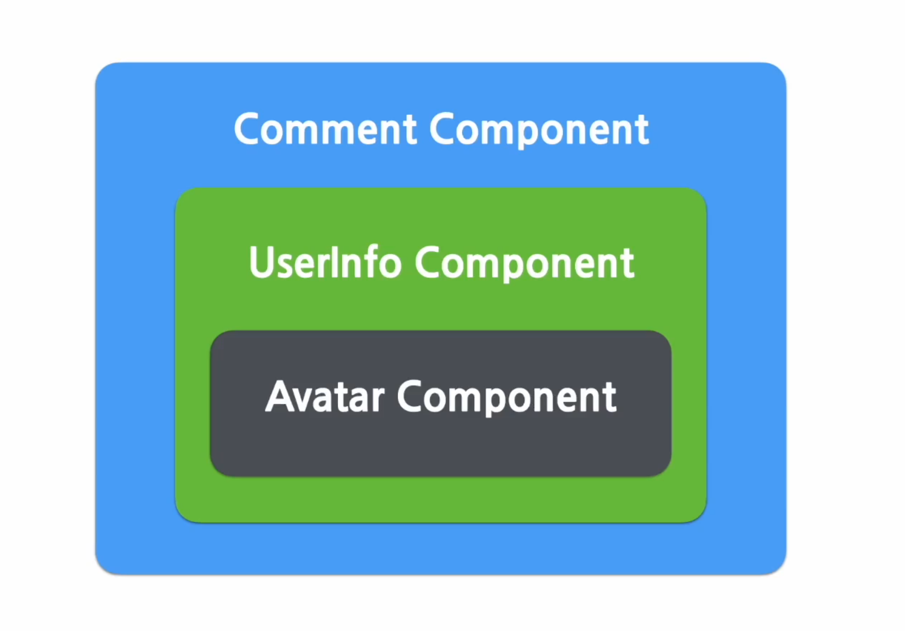
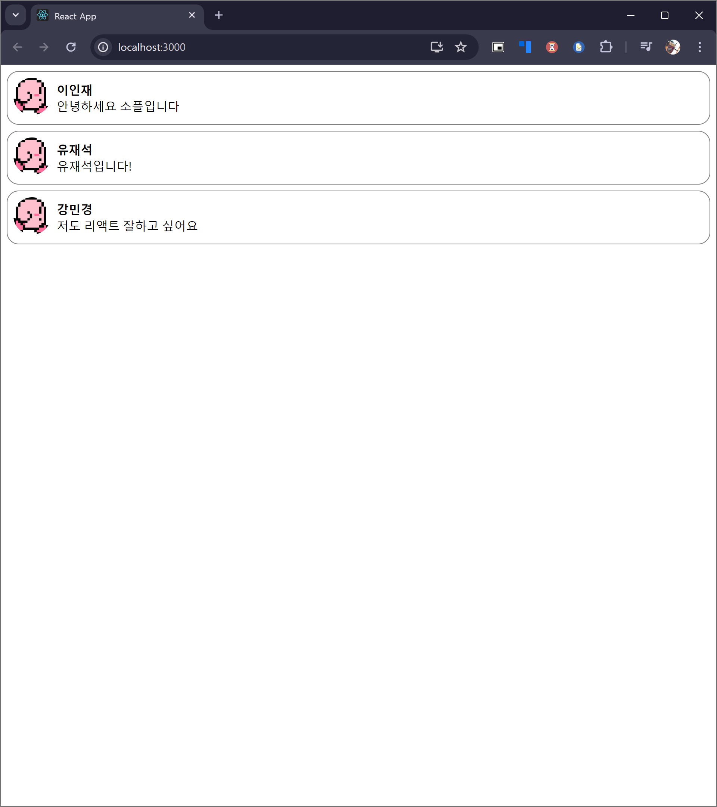

# 섹션 5 Components and Props

## Components 와 Props의 정의 ⭐
- 반드시 완벽하게 이해해야 한다. 
### Components
- Component-Based : 여러 컴포넌트들이 하나의 부품들이 되고, 그 부품들의 모음의 구조로 짜여지는 코드의 형식이 리엑트의 큰 구조라고 할 수 있다. 

> 에어 비앤비 페이지의 컴포넌트들
- 기본적으로 작은 컴포넌트들이 모여 큰 컴포넌트로, 큰 컴포넌트들이 모여 페이지 전체를 구성하게 된다. 

- 그렇기에 개념적으로 보면 자바스크립트의 함수와 유사하다고 볼 수 있으나, React 컴포넌트들의 입력과 출력은 다소 다르다고 할 수 있다. 

- React Component의 입력과 출력을 보면, 위의 사진처럼 되어 있어 JS의 함수와는 차별이 된다.
- Props(속성)을 넣으면, 이를 화면에 맞추어 표현해주는 것이 React Component인 것이다. 

- 이러한 구조는 객체지향의 클래스-인스턴스의 관계와 닮아 있게 생성되는데, Component들을 만들고, 이를 활용해 props를 넣고 실제 렌더링된 것들이 React Element가 되며, 이것이 리엑트로 페이지를 구성하는 방법인 것이다. 
### Props
- Property - 속성이라는 말의 줄임말이 Prop이다. 여기에 복수형 + s가 붙은게 `Props`다. 
- Props = Component의 속성, 리엑트 컴포넌트들의 속성값을 가진 것이 바로 Props다. 

- 여기서 아주 중요한 인사이트가 하나 발생하는데, 틀이 동일해도 Props가 달라지면, 그 구조는 비슷한 Element지만 속성이 다른, 즉 다른 성질을 가진 채로도 찍혀저 나올 수 있는 것이다. 


- 그렇기에 실제 위에서 보여준 예시 이미지를 보면 Props가 어떻게 차이가 나면 같은 Component 틀에, 어떤 부분의 차이만으로 구성을 해냈는지가 보인다.
- Props 는 그렇기에, 컴포넌트에 전달할 다양한 정보를 담고 있는 자바스크립트 객체 라고도 할 수 있다. 
## Props의 특징 및 사용법
### Read-Only
- Props의 값은 Element를 생성하나, 이 생성에 들어가는 값들은 읽기 전용이라는 점을 명심해야 한다.
- 즉, 이미 완성된 Element의 Props를 변경하는 것은 불가능하고, 따라서 새로운 값을 컴포넌트에 전달하여 새로운 Element를 생성해야 한다. -> 이 과정이 바로 렌더링이라고 볼 수 있다. 
### JavaScript 함수의 속성
- 기본적으로 입력을 변경하지 않으며, 같은 입력값에 대해 항상 같은 출력값(output)을 리턴하는 함수들은 pure 속성을 갖고 있다고 부른다. 
```js
function sum(a, b) {
	return a + b 
}
```
- 그런데 입력값을 변경하는 함수처럼 위의 pure 함을 지키지 못하는 함수들은 `Impure` 라고 말한다. 
```js
function withdraw(account, amount) {
	account.total -= amount;
}
```
### Props의 정의 
- 위의 내용을 설명한 이유는, 공식 문서에서 React Component에 대해 다음과 같이 기재하고 있기 때문이다. 
> "모든 리액트 컴포넌트는 그들의 Props에 관해서는 Pure함수 같은 역할을 해야 한다."
- 라고 말하고,이 말인 즉슨 모든 리액트 컴포넌트는 Props를 직접 바꾸기가 안되고, 같은 Props는 항상 같은 결과를 보여줘야 한다.
### Props 사용법
```js
function App(Props) {
	return (
		<profile
			name="하류"
			introruction="안녕하세요 하류입니다.
			viewCount={1500}
		/>
	);
}
```
- 정수, 변수, 객체 등이 들어가는 경우 중괄호를 써야 한다. (사실, 문자열도 중괄호로 감싸도 된다.)
```js
{
	name: "하류",
	introduction: "안녕하세요 하류입니다.",
	viewCount: 1500
}
```
- 위의 JSX 파일의 형태가 JS 객체 형태로 변환되게 된다. 
- 또한 값 안에 값을 넣는 것도 가능하다. 
```js
function App(props) {
	return (
		<Layout
			width={2560}
			height={1440}
			header={
				<Header title="하류의 블로그이다." />
			}
			footer={
				<Footer />
			}
		/>
	);
}
```
- 만약 JSX를 쓰지 않는다면? CreateElement를 사용하는 형태이며, 그 안에 JS 객체를 집어 넣으면 된다. 
```js
React.createElement(
	Profile,
	{
		name: "하류",
		introduction: "안녕하세요 하류입니다.",
		viewCount: 1500
	},
	null %% children 위치다. %%
);
```
## Component 만들기 및 렌더링
### Component 만들기 

- 최초 컴포넌트 만드는 방식은 클래스 컴포넌트 방식이었다. 
- 하지만 해당 방식의 어려움으로 인해 함수형 컴포넌트가 주력이 되었다고 보면 된다. 현재는 훅이라는 것과 함께 연동되어 사용한다고 보면 된다. 
- 함수, 클래스 컴포넌트를 그렇다고 다 넘길 순 없다. 이는 기본적인 개념과 생명주기를 이해하는 것이다.
### Function Component 
- pure 역할을 하는 것이 JS  함수의 특징이고, Component 역시 그러한 성질을 따라간다.
```js
function Welcome(props){
	return (<h1>안녕, {props.name}</h1>);
}
```
- 위의 형태가 함수 컴포넌트의 전형적인 형태라고 보면 된다. 또한 이러한 심플한 형태이니 만큼, 사용하기 편하고 가독성 면에서 양호하다고 볼 수 있다. 
### Class Component 
- JS ES6의 클래스를 활용해 만드는 형태이다. 해당 방식은 함수형 컴포넌트 대비 몇 가지 추가적 기능을 포함하고 있다.
- 위에서 사용한 함수형 컴포넌트와 동일한 형태가 동작하는 것이 하단의 예시이다. 
```js
class Welcome extends React.Component {
	render() {
		return (<h1>안녕, {this.props.name}</h1>)
	}
}
```
- 우선, 클래스의 구조를 따르기 때문에 React.Component 를 상속 받는 형태로 구현된다. 
- 개인적으로는 이쪽도 나름 나쁘지 않다고 생각이든다. 
### Component의 이름
- Component의 이름은 항상 `대문자`로 시작해야한다. 
- <mark style="background: #FF5582A6;">이렇게 해야하는 이유는 소문자로 시작하는 컴포넌트는 DOM 태그로 인식할 수 있기 때문이다.</mark> 
- 기본적으로 div, span과 같이 소문자로 시작하는 경우는 dom 태그로 이미 예약어처럼 쓰이기 때문이다. 
#### HTML div 태그로 인식하는 경우
```js
const element = <div />;
```
#### Welcome이라는 리액트 Component 로 인식
```js
const element = <Welcome name="인제" />;
```
### Component의 렌더링
- 렌더링은 컴포넌트를 앞에 불러오는 게 아니라, 컴포넌트란 틀에서 찍힌 Elment를 나타나게 만드는 것이다. 
#### DOM 태그를 사용한 element
```js
const element = <div />;
```
#### 사용자가 정의한 Component 를 사용한 element
```js
const element = <Welcome name="인제" />;
```
- 위의 예시를 그대로 가져온 것이다. 이렇게 가져오게 된  element는 다음과 같은 방식으로 렌더링 된다. 
```js
function Welcome(props) {
	return <h1>안녕, {props.name}</h1>;
}

const element = <Welcome name="인제"/>;
ReactDOM.render(
	element,
	document.getElementById('root')
)
```
## Component 합성과 추출
### Component 합성
- React 는 컴포넌트 안에 또 다른 컴포넌트를 쓸 수 있다. 
	- 즉, 복잡환 화면을 여러 개의 컴포넌트로 나누어서 구현하는 것이 가능하다. 
```js
function Welcome(props) {
	return <h1>안녕, {props.name}</h1>;
}

function App(props) {
	return (
		<div>
			<Welcome name="Mike"/>
			<Welcome name="Steve"/>
			<Welcome name="Jane"/>
		</div>
	);
}

ReactDOM.render(
	<App />
	document.getElementById('root')
);
```

- 이러한 형태로 컴포넌트를 다른 컴포넌트들을 모아서 만든 것을 `컴포넌트 합성` 이라고 부른다. 
### Component 추출 
- 반대로 복잡한 컴포넌트를 여러 개로 나누어내는 것도 가능하다. 이를 `컴포넌트 추출`이라고 부른다.
- 이러한 기능을 사용하는 이유는, 재사용성을 끌어올리기 때문이다. 컴포넌트가 명확해지고, 단순해지면 그만큼 기능적으로 튼튼하게 된다. 또한 이러한 특징은 개발 속도를 높이는데도 도움이 된다. 
```js
function Component(props) {
	return (
		<div className="comment">
			<div className="user-info">
				
				<div className="user-info-name">
					{props.author.name}
				</div>
			</div>

			<div className="comment-text">
				{props.text}
			</div>
			<div className="comment-date">
				{formatDate(props.date)}
			</div>
		</div>
	);
}
```
- 위의 통으로 만들어진 내용을 추출 분할 해보겠다. 
```js
function Avatar(props){
	return (
		
	);
}
```
- 전체 중 일부를 떼어낸 형태.
- 재사용성을 고려하여 보편적인 단어로 props 객체 내부의 단어를 설정하였다. 
- 이러한 형태를 반영하면 전체 컴포넌트는 다음과 같이 구성이 되게 된다. 

```js
function Component(props) {
	return (
		<div className="comment">
			<div className="user-info">
				<Avatar user={props.author} /> %% 아바타 적용  %%
				<div className="user-info-name">
					{props.author.name}
				</div>
			</div>

			<div className="comment-text">
				{props.text}
			</div>
			<div className="comment-date">
				{formatDate(props.date)}
			</div>
		</div>
	);
}
```

#### 이번에는 UserInfo 추출하기
```js
function UserInfo(props) {
	return (
		<div className="user-ifo">
			<Avatar user={props.user} />
			<div className="user-info-name">
				{props.user.name}
			</div>
		</div>
	);
}
```
```js
function Component(props) {
	return (
		<div className="comment">
			<UserInfo user={props.author} />
			<div className="comment-text">
				{props.text}
			</div>
			<div className="comment-date">
				{formatDate(props.date)}
			</div>
		</div>
	);
}
```
- 지금까지의 진행상황은 다음과 같은 그림으로 볼 수 있다.

## (실습) 댓글 컴포넌트 만들기

```js
// index.js
import React from 'react';  
import ReactDOM from 'react-dom';  
import './index.css';  
import reportWebVitals from './reportWebVitals';  
import CommentList from "./chapter_05/CommentList";  
import {createRoot} from "react-dom/client";  
  
// ReactDOM.render(  
//     <React.StrictMode>  
//         <CommentList />  
//     </React.StrictMode>,  
//     document.getElementById('root')  
// );  
  
// const root = document.getElementById('root');  
const root = createRoot(document.getElementById('root'));  
root.render(  
    <React.StrictMode>  
        <CommentList />    </React.StrictMode>)  
  
reportWebVitals();
```

```jsx
//Comment.jsx
import React from 'react';  
  
const styles={  
    wrapper: {  
        margin: 8,  
        padding: 8,  
        display: "flex",  
        flexDirection: "row",  
        border: "1px solid grey",  
        borderRadius: 16  
    },  
    imageContainer: {},  
    image: {  
        width: 50,  
        height: 50,  
        borderRadius: 25,  
    },  
    contentContainer: {  
        marginLeft: 8,  
        display: "flex",  
        flexDirection: "column",  
        justifyContent: "center",  
    },  
    nameText: {  
        color: "black",  
        fontSize: 16,  
        fontWeight: "bold",  
    },  
    commentText: {  
        color: "black",  
        fontSize: 16,  
    }  
};  
  
function Comment(props) {  
    return (  
        <div style={styles.wrapper}>  
            <div style={styles.imageContainer}>  
                  
            </div>  
            <div style={styles.contentContainer}>  
                <span style={styles.nameText}>{props.name}</span>  
                <span style={styles.commentText}>{props.comment}</span>  
            </div>        </div>    );  
}  
  
export default Comment;
```

```jsx
// CommentList.jsx
import React from 'react';  
import Comment from './Comment';  
  
const comments = [  
    {  
        name: "이인재",  
        comment: "안녕하세요 소플입니다",  
    },  
    {  
        name: "유재석",  
        comment: "유재석입니다!",  
    },  
    {  
        name: "강민경",  
        comment: "저도 리액트 잘하고 싶어요",  
    },  
];  
  
function CommentList(props) {  
    return (  
        <div>  
            {comments.map((component) => {  
                return <Comment name={component.name} comment={component.comment} />  
            })}  
        </div>  
    );  
}  
  
export default CommentList;
```

완성된 모습


```toc

```
