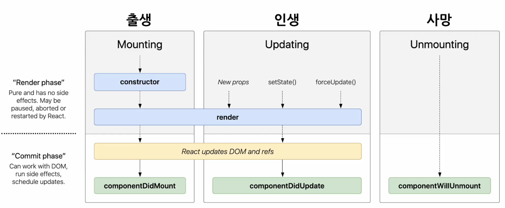
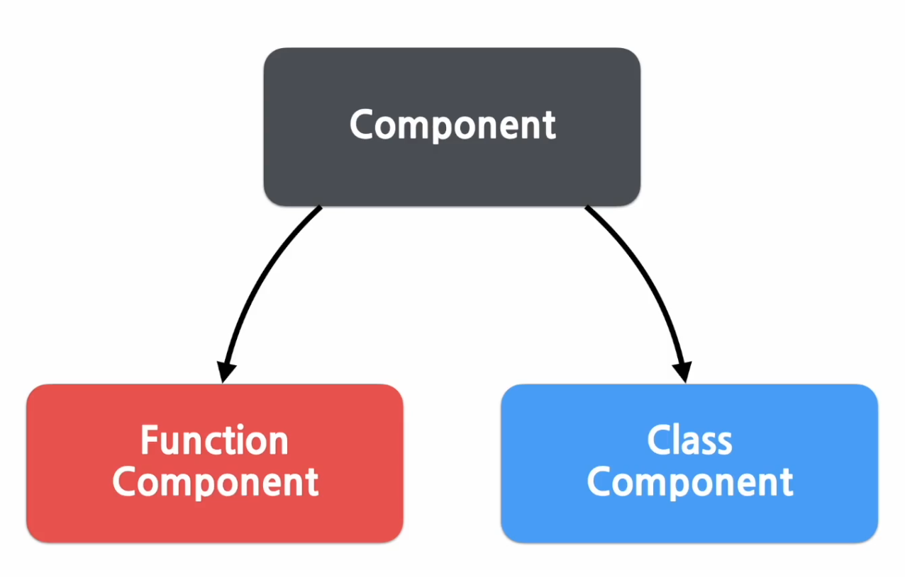
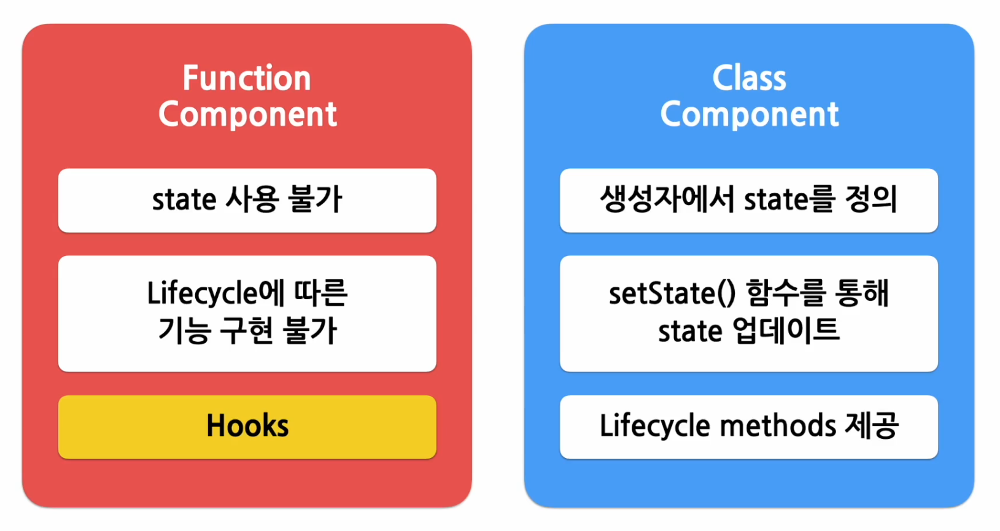
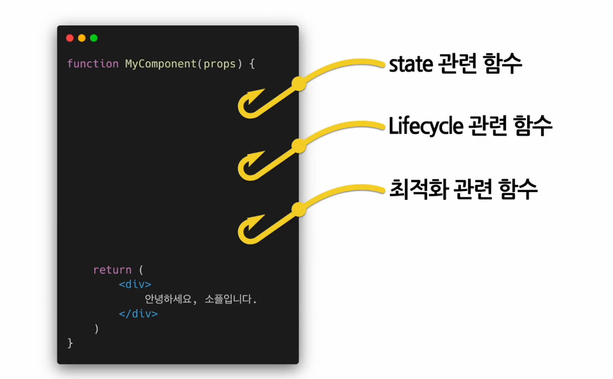

# 섹션 6 State and Lifecycle  
## State 와 Lifecycle의 정리⭐
### state
- state 란 리액트 Componenet의 상태를 의미한다. 여기서 상태란 정상 / 비정상의 의미 보다는 데이터라는 쪽에 가까운 의미를 내포하고 있다. 
- 즉, state 는 리엑트 컴포넌트에서 변경 가능한 데이터를 의미한다. 
- 여기서 state를 사용하는 가는 각 개발자의 정의에 따라 움직인다고 보면된다. 
- 렌더링이나 데이터 흐름에 사용되는 값만 state 에 포함시켜야 한다. 
	- 왜냐하면 결국 state란 데이터의 변경과 함께 렌더링이 발생하기 때문에 불필요한 데이터를 등록했다간, 
- 리엑트의 state는 JavaScript 객체라고 봐도 무방하다. 
```jsx
class LikjeButton extends React.Component {
	constructor(props){
		super(props)
		
		this.state = {   // state 를 정의함 (클래스 컴포넌트는 이방식, 함수 컴포넌트는 훅을 사용함)
			liked: false
		};
	}

	...
}
```
- state 는 직접 수정할 순 없다. (하면 안된다) 왜냐하면 렌더링과 연관된 값들이기 때문에 개발자의 의도한 렌더링과는 다르게 나오게 만들 수도 있기 때문이다. 
```jsx
// state를 직접 수정(잘못된 방법)
this.state = {
	name: 'Inje'
};

// state를 setState함수를 사용한 수정(정상적인 사용법)
this.setState({
	name: 'Inje'
});
```
### Lifecycle
- 생명주기 
- 리엑트 컴포넌트가 생성되는 시점, 사라지는 시점이 정해져 있다. 

- mount : 컴포넌트 생성단계
- update : 새로운 props를 받거나, 적절하게 수정되거나, 강제로 수정하거나 
- unmount : 상위 컴포넌트에서 해당하는 컴포넌트를 더 이상 표시 하지 않을 때, 모든 과정을 거쳐 컴포넌트는 사용되지 않게된다. 
- 위의 update되는 state와 관련된 함수는 3가지만 배우게 되었지만, 이 밖에도 다양한 방식으로 가능은 하나 배우진 않음. 
- 핵심은 컴포넌트가 시간의 흐름에 따라 생성과 갱신, 이후 사망하여 종결되는 그러한 구조를 갖고 있다는 것을 명확히 인지하는 것이다. 
## (실습) state 사용하기

# 섹션 7 Hooks
## Hooks 의 개념과  useState, useEffect


- 기본적으로 앞전에 배운 클래스 컴포넌트는 state를 자유 자재로 다루기 쉽도록 메서드를 제공한다. 
- 이에 반해 함수형 컴포넌트는 그렇지 못하고, 이에 따라 라이프사이클, state 사용이 가능케 하는 역할을 Hooks가 대신해준다. 
- Hook 이란 영어 단어 갈고리 처럼 어떤 특정 영역, 순간에 컴포넌트의 생명주기가 시작하여 끝나거나 갱신될 수 있도록 하는  것을 의미한다. 그리하여 이때 실행되는 함수가 Hook 이라고 설정한 것이다. 

- 이러한 훅은 기본적으로 접미사가 use로 시작한다. 커스텀 훅은 이름을 마음대로 작성이 가능하나, 이 역시 기본적인 법칙을 지켜주는게 당연히 유지보수에 효과적이다. 
### useState() Hook
- state 를 사용하기 위한 Hook 이다. 
- 함수 컴포넌트는 기본적으로 class 컴포넌트와는 달리 state를 따로 작성하거나 하여 사용이 안된다고 한다.
```jsx
import React, { useState } from "react";

function Counter(props) {
	var count = 0;

	return (
		<div>
			<p>총 {count}번 클릭했습니다.</p>
			<button onClick={() => count++}>
				클릭
			</ button>
		</ div>
	);
}
```
- 위의 예시처럼 만들게 되면, Count 값을 증가 시키는 것은 가능하다. 재 랜더링은 일어나지 않아 카운트 값이 화면에 나타나지는 않게 된다. => 이런 경우에 따라 재 랜더링을 useState 훅을 사용하면 된다. 
```jsx
//useState 사용방법
const [변수명, set함수명] = useState(초기값);
```

```jsx
import React, { useState } from "react";

function Counter(props) {
	const [count, setCount] = useState(0);

	return (
		<div>
			<p>총 {count}번 클릭했습니다.</p>
			<button onClick={() => setCount(count + 1)}>
				클릭
			</ button>
		</ div>
	);
}
```
- useState 구문을 사용하고, 카운트 값이 변경되면 setCount와 함께 재 랜더링 과정을 보여준다. 
- 클래스 컴포넌트에서 하던 setState를 실행하거나 마찬가지이다. 
- 그러나 특이사항은 useState 의 경우 변수 각각에 대해 set 함수가 따로 존재하게 만들어야 한다는 점에서 차이가 발생한다. 
### useEffect()
- side Effect 를 수행하기 위한 Hook 이다. 
- side effect 란? 부정적인 의미는 없고, 효과, 혹은 영향이라는 단어로 쓰인 것이며 서버에서나 돔에서 수동으로 데이터를 받아오는 경우 같은 것들이 포함된다. 
- 여기에 effect 라는 이름이 붙는 이유는, 다른 컴포넌트에 영향을 미칠 수 있으며, 렌더링 중에는 작업이 완료될 수 없기 때문이다. 
- 즉, 이러한 상황에서 리액트의 함수 컴포넌트에서 side에서 effect 가 발생한다는 이름에서 side Effect 라는 개념이 생긴 것이며, 이를 실행할 수 있게 해주는 Hook 을 의미한다. 
- 클래스 컴포넌트가 사용될 때의 생명주기 함수의 mount, update, unmount를 하나로 묶어둔 효과를 지닌다. 
### useEffect() 사용법
```jsx
useEffect(이펙트 함수, 의존성 배열);
```
- 의존성 배열 : 해당 이팩트가 의존성을 갖고 있는 배열이다. 배열 안에 값들이 변경이 발생하면 이펙트 함수가 실행된다.
- 본 함수는 처음 컴포넌트가 렌더링 된 이후나, 업데이트 이후 재 랜더링 된 이후에 실행된다. 
	- mount, unmount 단 한 번 씩만 실행되게 하고 싶다면 의존성 배열을 빈 배열을 넣어주면 되다. 
	- 의존성 배열을 아예 생략하면 컴포넌트가 업데이트 될 때 호출이 된다. 
```jsx
improt React, { useState, useEffect } from react;

function Counter(props) {
	const [count, setCount] = useState(0);

	// componentDidMount, componentDidUpdate 와 비슷하게 동작한다. 
	useEffect(() => {
		// 브라우저 API를 사용해서 document 의 타이틀 업데이틀 한다. 
		// 실행 자체가 컴포넌트 안에서 접근하기 때문에, 함수 컴포넌트 내부의 state, props에도 접근이 가능해진다. 
		document.title = `You clicked ${count} times`;
	});

	return (
		<div>
			<p>총 {count}번 클릭했습니다.</p>
			<button onClick={() => setCount(count + 1)}>
				클릭
			</ button>
		</ div>
	);
}
```

```jsx
// componentDidUnmount와 동일한 기능을 사용하는 예시 
improt React, { useState, useEffect } from react;

function UserStatus(props) {
	const [isOnline, setIsOnline] = useState(null);

	function handleStatusChange(status) {
		setIsOnline(status.isOnline);
	}

	useEffect(() => {
		ServerAPI.subscribeUserStatus(props.user.id, handleStatusChange);
		// 컴포넌트가 언마운트 될때 하는 행동을 동일하게 return 하면서 진행함 
		return () => {
		
			ServerAPI.unsubscribeUserStatus(props.user.id, handleSatatusChange);
		};
	});

	if (isOneline == null) {
		return '대기중...';	
	}
	return  isOnline ? '온라인'; '오프라인';
}
```

```jsx
// useEffect 훅을 여러개 사용하는 예시 코드 
function UserStatusWithCounter(props) {
	const [count, setCount] = useStatus(0);

	useEffet(() => {
		document.title = `총 ${count}번 클릭했습니다.`;
	});

	const [isOnline, setIsOnline] = useState(null);
	useEffect(() => {
		ServerAPI.subscribeUserStatus(props.user.id, handleStatusChange);
		// 컴포넌트가 언마운트 될때 하는 행동을 동일하게 return 하면서 진행함 
		return () => {
			ServerAPI.unsubscribeUserStatus(props.user.id, handleSatatusChange);
		};
	});

	function handleStatusChange(status) {
		setIsOnline(status.isOnline);
	}
	// . . .
}
```

### useEffect 사용법 정리 
```jsx
useEffect (() => {
	// 컴포넌트가 마운트 된 이후,
	// 의존성 배열에 있는 변수들 중 하나라도 값이 변경되었을 때 실행됨
	// 의존성 배열에 빈 배열([])을 넣으면 마운트와 언마운트 시 단 한 번 씩만 실행됨
	// 의존성 배열 생략 시 컴포넌트 업데이트 시마다 실행됨
	
	return () => {
		// 컴포넌트가 언마운트 되기 전에 실행됨
	}
}, [의존성 변수1, 변수2, 변수3, ... ]);
```
## useMemo, useCallback, useRef
### useMemo
- Memoized value 를 리턴하는 Hook 이다. 
#### Memoization
- 최적화를 위한 일종의 방식으로, 연산량이 높은 연산 결과 등이 존재 할 경우, 해당 상황을 저장해두고 같은 연산이 필요할 경우 재사용하는 방식을 의미한다. 
- 자원의 불필요한 사용, 재연산 등을 막을 수 있음.
#### useMemo 사용 방법 
```jsx
const memoizedValue = useMemo(
	() => {
		// 연산량이 높은 작업을 수행하여 결과를 반환
		return computeExpensiveValue(의존성 변수1, 의존성 변수2);
	},
	[의존성 변수1, 의존성 변수2]
);
```
- 연산량이 높은 렌더링의 반복을 대응할 수 있다. 
- 알아둬야 할 점은 useMemo에 연결되는 함수는 렌더링 도중에 일어난다는 점이다. 
	- 이 말은 useMemo를 사용할 수 없다. 대표적인 경우가 side effect 를 위한 useEffect 같은 것이 그러하고, 이런 경우 useEffect 훅을 사용해야 한다.
- 의존성 배열을 넣지 않음 = 매 렌더링마다 함수가 실행됨. 이러면 다른 useState와 아무런 차이가 없다. 
```jsx
const memoizedValue = useMemo(
	() => {
	return computeExpensiveValue(a, b)
	}
);
```
- 의존성 배열이 빈 배열일 경우, 컴포넌트 마운트 시에만 호출됨
```jsx
const memoizedValue = useMemo(
	() => { 
		return computeExpensiveValue(a, b)
	}, []
);
```

### useCallback() Hook 
- useMemo() 와 유사하지만 값이 아닌 함수를 반환해준다. 
- 의존성 배열이 바뀌면 함수를 리턴해서 무언갈 동작하게 만드는 것이다. 
### useCallback() 사용법 
```jsx
const memoizedCallback = useCallback(
	() => {
		doSomething(의존성 변수1, 의존성 변수2);
	},
	[의존성 변수1, 의존성 변수2]
);
```
- useMemo() 처럼 의존성변수의 변화에 따라 움직이며, 메모훅과 동일한 해동 패턴을 보여준다. 

### 동일한 역할을 하는 두 줄의 코드 
```jsx
useCallback(함수, 의존성 배열);
useMemo(() => 함수, 의존성 배열);
```

### useRef()
- Reference를 사용하기 위한 훅을 의미한다. 
#### Reference
- 특정 컴포넌트에 접근할수 있는 객체를 의미한다. 
- 즉, useRef() 훅은 Reference를 반환하는 것으로 볼 수 있다.
- refObject.current = 현재 참조하고 있는 Element 를 의미한다. 
### useRef() 훅 사용법
```jsx
const refContainer = useRef(초깃값);
// 이렇게 reference 값으로 감싸지게 되면, 
// 해당 값은 라이프타임 전체에 걸쳐 유지되게 된다.
// 컴포넌트를 언마운트 전까진 계속 유지되도록 만드는 것이라고 볼 수 있다. 
```

```jsx
function TextInputWithFocusButton(props) {
	const inputElem = useRef(null);

	const onButtonClick = () => {
		// `current` 는 마운트된 input element 를 카리킴
		inputElem.current.focus();
	};

	return (
		<>
			<input ref={inputElem} type="text" />
			<button onClick={onButtonClick }>
			Focus the input
			</button>
		</ >
	)
}
```
- useRef 훅의 특징은, 렌더링 될 때마다 매번 같은 reference를 반환한다는 점이다. 
- useRef() 훅은 내부의 데이터가 변경되었을 때 별도로 알리지 않는다. 따라서 어떤 변화를 인지하고 행동을 발생시키고 싶다면 `Callback Ref`를 사용해야 한다. 
### Callback ref 
- 리엑트는 ref가 다른 노드에 연결 될 때마다 callback 을 호출한다. 
```jsx
function MeasureExample(props) {
	const [height, setHeight] = useState(0);
	const measuredRef = useCallback(node => {
		if (node !== null) {
			setHeight(node.getBoundingClientRect().height)'
		}
	}, []);

	return (
		<>
			<h1 ref={measuredRef}>안녕, 리액트</h1>
			<h2>위 헤더의 높이는 {Math.rount(height)}px 입니다.</h2>
		</>
	);
}
```

---
## 여기까지 하고 나서 얻은 느낌
일단 기본 무료 강의는 아주 핵심을 요약해서 사용 가능할 정도로 만들고 싶어하는 것은 알겠지만, use의 개념을 온전히 다 이해하지 못할 정도로 빠르고 예시만으로 이해가 되지 않는다. 동작하는 형태, 내부 구조 등의 설명이 너무 많이 스킵이 되서(...) 그렇기에 가능하면 교재를 보면서 좀더 이해도를 높이고 와야 할 것으로 보인다. 

---
## Hook의 규칙과 Custom Hook 만들기 
## (실습) Hooks 사용해보기

```toc

```
